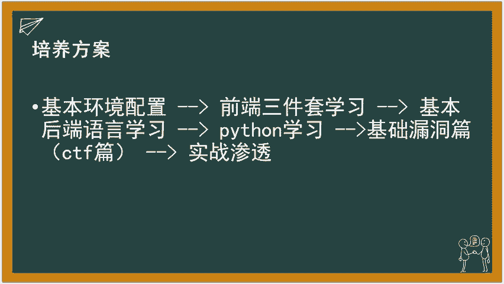
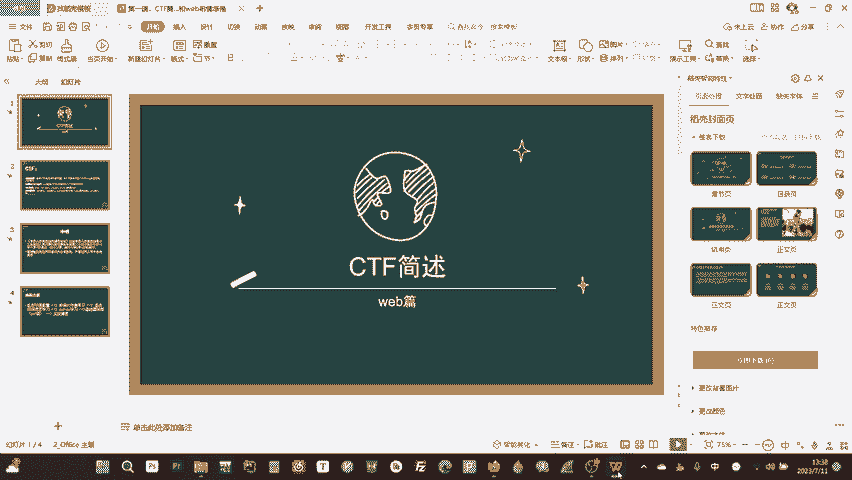

# 零基础WEB安全教学：P1：CTF简介与注意事项 🚫

在本节课中，我们将要学习CTF（夺旗赛）的基本概念、主要方向以及学习网络安全必须遵守的法律法规。这是整个系列课程的起点，旨在为你勾勒出清晰的学习路径。

## 什么是CTF？

CTF全称是“Capture The Flag”，即夺旗比赛。在比赛中，通常会给你一个目标（例如一个网站），你的任务是发现并利用其安全漏洞。最终目标是获取一串特定的字符串，这串字符串被称为 **`flag`**。将 **`flag`** 提交到比赛平台即可得分。

## CTF的主要方向

CTF比赛通常包含以下几个主要方向：

*   **Web（网络安全）**：这是本系列课程的核心方向。主要研究网站、Web应用的安全漏洞。
*   **Pwn（二进制漏洞利用）**：主要研究软件、操作系统内核层面的漏洞，需要逆向工程和底层知识。
*   **Reverse（逆向工程）**：俗称“做外挂”或“破解软件”，主要分析程序的执行逻辑与结构。
*   **Crypto（密码学）**：主要研究各种加密算法、协议及其破解方法，对数学要求较高。例如研究 **`AES`** 等现代加密算法或国密算法。
*   **Misc（杂项）**：包含其他无法归类到上述方向的内容，通常不作为主要学习方向。

## 我们将学习的Web漏洞

在后续的CTF实战阶段，我们将带领大家学习Web方向常见的漏洞类型，例如：
*   **SQL注入**
*   **XSS（跨站脚本攻击）**
*   **文件上传漏洞**

这些内容都会在课程中逐一详细讲解。

## ⚠️ 至关重要的法律声明

上一节我们介绍了CTF的有趣之处，本节中我们必须强调其严肃的另一面。**中华人民共和国网络安全法**已于2017年6月1日起施行。

**本课程所讲授的任何技术知识与内容，仅用于教育分享与合法范围内的安全研究目的。严禁任何人将其用于任何非法途径。** 学习安全技术的初衷应是保护系统，而非破坏。

## 📚 课程学习路线与培养方案

了解完基础概念与注意事项后，我们来看看整个系列课程的学习路线。以下是我们的培养方案：

1.  **环境配置**：我们将从最基本的环境配置开始。如果说找不到开机键，建议咨询GPT。具体的环境配置会融合在后续各语言的学习中，不单独成课。
2.  **前端三件套学习**：我们将用大约一两节课的时间，学习HTML、CSS和JavaScript。目标是能完成一个网页，甚至制作出动态、美观的页面。掌握得好，甚至可以尝试开发小程序。
3.  **后端语言学习**：我们的后端重点将学习 **`SQL`** 语句、**`MySQL`** 数据库以及 **`PHP`** 语言。你可能会问，为什么是PHP而不是市场占有率更高的Java、C#或Go？主要是因为PHP入门更便捷，且后端编程思想是相通的。掌握PHP中如何处理请求、接收参数后，过渡到其他语言会很容易。同时，很多CTF代码审计题目和真实网站（例如Steam市场的交易界面）都使用PHP。
4.  **Python学习**：我们将花一两节课学习Python，重点是教会大家如何编写自动化攻击脚本，以辅助CTF解题。
5.  **CTF实战与漏洞学习**：
    *   **基础漏洞篇**：带领大家攻打一些在线靶场，例如 **`BUUOJ`** 或我们自建的靶场。
    *   **实战渗透篇**：分析一些真实网站的渗透案例。
6.  **资源分享**：课程中途我会为大家分享课件。**整个课程完全免费**，大家可以安心学习。录制本系列视频的主要目的，是希望让更多人了解安全、学习安全，从而让更少的人遭受诸如QQ号被盗之类的侵害。

---

本节课中，我们一起学习了CTF的基本概念、主要方向、必须遵守的法律红线以及整个系列课程的学习路线。我们从“夺旗”的游戏形式出发，明确了以Web安全为核心的学习路径，并强调了技术必须用于正途。从下一节课开始，我们将正式踏上实践之旅，首先从配置你的学习环境开始。