# 0基础WEB安全教学：P3：前端篇（下）JavaScript：动起来，很有精神！🚀

在本节课中，我们将学习JavaScript的基础知识。JavaScript是让网页“动起来”的核心语言，它能够操作HTML元素、响应用户交互，并实现动态效果。我们将从基本概念讲起，并通过实践来理解如何用JavaScript优化和美化网页。

## 概述

上一节我们介绍了HTML和CSS，它们构成了网页的骨架和外观。本节中，我们来看看JavaScript，它是赋予网页生命和交互能力的关键。我们将学习JavaScript的基本语法、如何操作网页元素（DOM）、以及如何响应用户事件。

---

## JavaScript简介

JavaScript与Java没有任何关系。它的原名是LiveScript。在Java语言流行后，为了蹭热度才改名为JavaScript。它们的关系就像“雷峰塔”和“雷锋”——没有任何关系。

JavaScript通常简称为JS。它有很多框架，例如Vue。框架是指通过底层语言预先写好的一系列函数或功能库，它能简化开发过程，让你更快地开发出功能多样化的应用。Vue是一个由中国人开发的前端框架，目前非常流行，许多前沿项目和小程序都使用Vue进行开发。

如果想深入学习前端，学习Vue是必要的。Node.js是一个允许用JavaScript编写后端程序的运行时环境。下载Node.js后，你就可以用JavaScript处理数据包等后端任务。只要有后端，就可能存在漏洞，后续在CTF篇我们会专门讲解Node.js框架。学完本节的JavaScript后，再看Node.js就会很简单。

JavaScript是为HTML元素添加动态功能的语言。如果说HTML搭建了框架，CSS添加了血肉，那么JavaScript就是让骨骼动起来的灵魂。JS是前端的精髓，是前端开发者必须掌握的内容。我们不需要精通，但需要会使用。

JavaScript代码写在 `<script>` 标签内，就像CSS写在 `<style>` 标签里一样。`<script>` 标签可以放在 `<head>` 或 `<body>` 中，区别在于加载顺序，但都可以正常使用。

---

## 学习前提

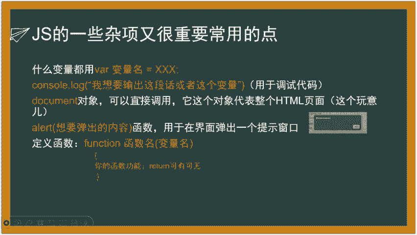

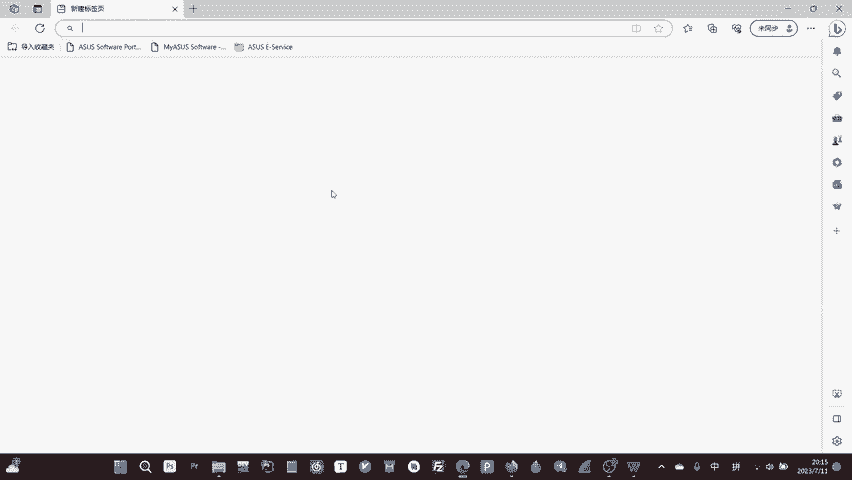

观看本课程，建议你至少了解一门编程语言，例如C语言或Python。你需要知道变量和函数是什么，同时了解if判断、while循环、for循环等基本概念。后续课程会简单提及，但不会深入讲解。如果你对这些概念感到吃力，建议先通过菜鸟教程等平台学习C语言或Python的基础知识。学习安全必须先会开发，这是无法绕过的坎。

---

## JavaScript基础

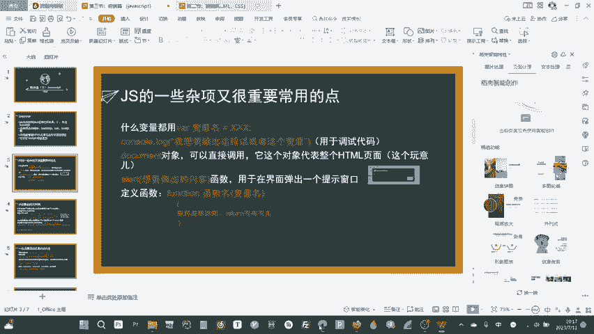

### 变量声明

在C语言中，声明变量需要指定类型，例如用 `char` 存字符，用 `int` 存整数。但JavaScript不需要声明类型，它使用 `var` 关键字来声明通用类型的变量。

**公式/代码：**
```javascript
var variableName = value;
```
`var` 是一个通用类型，可以存储字符、数字、字符串、布尔值（true/false，即0和1）等任何类型的数据。

### 控制台输出

`console.log()` 用于在浏览器控制台中打印信息。控制台是浏览器提供的开发者工具，按F12键即可打开。在控制台中，你可以看到网页的报错、提醒和警告信息，也可以直接输入并执行JavaScript代码。

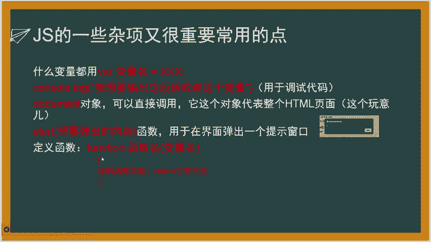

**公式/代码：**
```javascript
console.log("要打印的内容");
```
例如，`console.log(123)` 会在控制台输出数字123。这个方法主要用于调试代码，查看变量状态或程序运行流程。

### 弹窗提示

`alert()` 函数会弹出一个包含指定内容的警告窗口。

**公式/代码：**
```javascript
alert("弹出的内容");
```
它常用于调试或向用户显示提示信息。

### 函数定义

在JavaScript中，使用 `function` 关键字来定义函数。与C语言不同，它不需要声明返回值类型，因为JavaScript是弱类型语言。

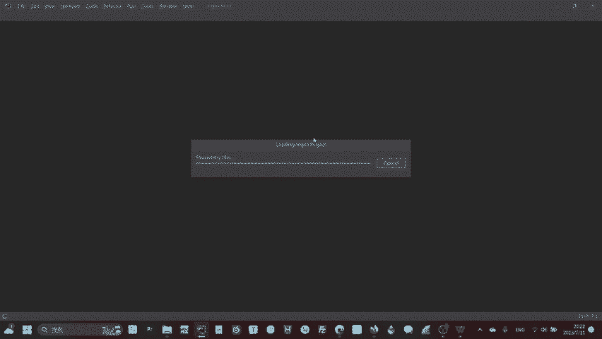

**公式/代码：**
```javascript
function functionName(parameter1, parameter2) {
    // 函数体
    var a = 1;
    var b = 2;
    console.log(a + b);
}
```
定义一个名为 `functionName` 的函数，它可以接收参数 `parameter1` 和 `parameter2`。函数体内可以执行各种操作，例如计算并打印结果。调用函数时，直接使用函数名加括号即可，例如 `functionName()`。

---

## 文档对象模型（DOM）

DOM是JavaScript操作HTML元素的核心概念。它代表了整个HTML文档，你可以通过DOM找到并操作页面上的任何元素。

### 获取元素

要操作一个HTML元素，首先需要获取它。通常我们通过元素的ID或类名来获取。

以下是获取元素的几种常用方法：

*   **通过ID获取**：`document.getElementById("idName")`
*   **通过类名获取**：`document.getElementsByClassName("className")` （返回一个集合）
*   **通过标签名获取**：`document.getElementsByTagName("tagName")` （返回一个集合）
*   **通过选择器获取**：`document.querySelector("cssSelector")` （获取第一个匹配元素）

最常用的是通过ID获取，因为ID通常是唯一的。

**公式/代码：**
```javascript
var element = document.getElementById("myId");
```
这行代码将ID为 `myId` 的HTML元素赋值给变量 `element`。

### 修改元素属性

获取元素后，可以通过 `元素.属性名` 的方式来修改其属性。

**公式/代码：**
```javascript
element.src = "new_image.png"; // 修改图片源
element.href = "https://newlink.com"; // 修改链接地址
element.className = "newClass"; // 修改类名
```
例如，可以将一个图片元素的 `src` 属性从 `old.png` 改为 `new.png`，从而实现图片切换。

### 修改元素内容与HTML

`innerHTML` 属性用于获取或设置元素的HTML内容。它不仅可以改变文本，还可以向元素内添加新的HTML标签。

**公式/代码：**
```javascript
element.innerHTML = "新的文本内容";
element.innerHTML = "<strong>加粗文本</strong> <a href='#'>链接</a>";
```
这可以实现动态更新页面内容，例如点击按钮后显示一段新的文字或广告。

### 修改元素样式

JavaScript也可以直接修改元素的CSS样式，实现动态视觉效果。

**公式/代码：**
```javascript
element.style.property = "value";
```
例如：
```javascript
element.style.top = "20px"; // 修改距离顶部的距离
element.style.backgroundColor = "red"; // 修改背景颜色
element.style.display = "none"; // 隐藏元素
```
通过这种方式，可以让元素移动、变色或显示/隐藏。

---

## 事件处理

事件是用户或浏览器与网页交互时发生的动作，例如点击、鼠标移动、输入内容等。JavaScript可以监听这些事件，并执行相应的函数。

### 常见事件

以下是一些常用的事件类型：

*   **onclick**：当元素被点击时触发。
*   **onchange**：当元素内容改变时触发（常用于输入框）。
*   **onmouseover**：当鼠标移到元素上时触发。
*   **onmouseout**：当鼠标移出元素时触发。
*   **onload**：当页面加载完成时触发。

### 绑定事件

可以通过将函数赋值给元素的事件属性来绑定事件处理程序。

**公式/代码：**
```javascript
element.onclick = function() {
    // 点击后要执行的代码
    alert("你点击了我！");
};
```
也可以先定义函数，再将函数名赋值给事件属性：
```javascript
function myClickFunction() {
    alert("你点击了我！");
}
element.onclick = myClickFunction;
```
最常用的事件是 `onclick`（点击）和 `onchange`（内容改变），它们已经能满足大多数交互需求。

---

## JSON数据格式

JSON是一种轻量级的数据交换格式，易于人阅读和编写，也易于机器解析和生成。它在Web开发和安全领域都非常常用。

一个典型的JSON字符串如下：
```json
{
    "sites": [
        { "name":"菜鸟教程", "url":"www.runoob.com" },
        { "name":"Google", "url":"www.google.com" }
    ]
}
```

### 解析与使用JSON


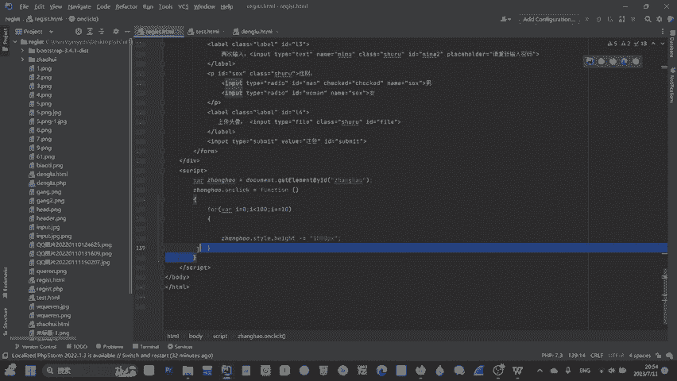

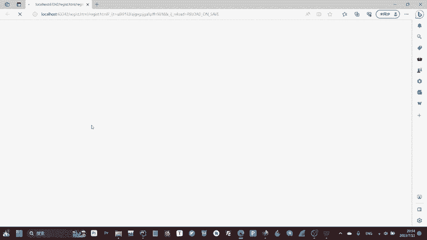

在JavaScript中，可以使用 `JSON.parse()` 方法将JSON字符串转换为JavaScript对象，方便程序使用。

**公式/代码：**
```javascript
// 假设从网络或其它地方获取到一个JSON字符串
var jsonText = '{"sites":[{"name":"菜鸟教程","url":"www.runoob.com"}]}';

// 将JSON字符串解析为JavaScript对象
var obj = JSON.parse(jsonText);

// 使用解析后的对象
console.log(obj.sites[0].name); // 输出：菜鸟教程
console.log(obj.sites[0].url);  // 输出：www.runoob.com
```
`JSON.stringify()` 方法则可以将JavaScript对象转换为JSON字符串，用于传输或存储。

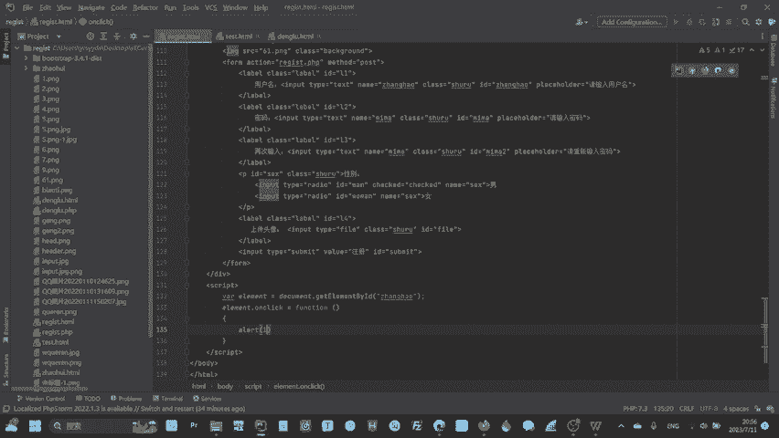

---

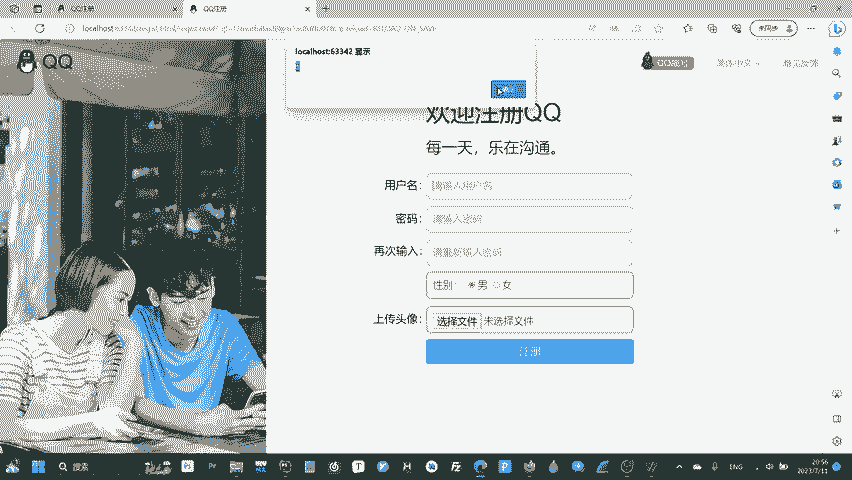

## 实践示例

让我们通过一个简单的例子，将以上知识结合起来。假设我们有一个输入框，希望实现：点击它时弹出提示，并且其位置逐渐上移。

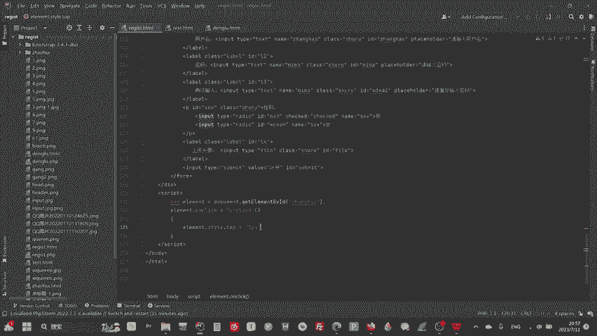

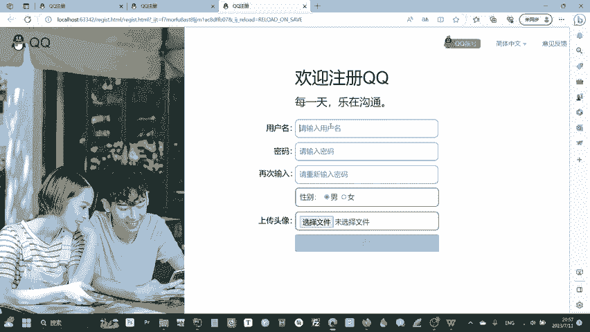

**HTML部分:**
```html
<input type="text" id="myInput" value="点击我" style="position: relative; top: 10px;">
```

**JavaScript部分:**
```javascript
// 1. 获取元素
var myElement = document.getElementById("myInput");

// 2. 绑定点击事件
myElement.onclick = function() {
    // 2.1 点击时弹出提示
    alert("输入框被点击了！");

    // 2.2 使用循环让输入框逐渐上移（动态效果）
    for (var i = 0; i < 100; i++) {
        // 注意：这里使用了setTimeout来模拟渐进效果，直接循环会瞬间完成。
        // 更佳实践是使用CSS动画或requestAnimationFrame，此处为演示原理。
        setTimeout(function(j) {
            return function() {
                myElement.style.top = (10 - j) + "px";
            };
        }(i), i * 10); // 每10毫秒移动一次
    }
};
```
这个例子演示了如何获取元素、绑定事件、在事件处理函数中执行操作（弹窗和修改样式）。对于更流畅的动画，建议学习CSS3动画或使用 `requestAnimationFrame` 方法。

---

## 总结

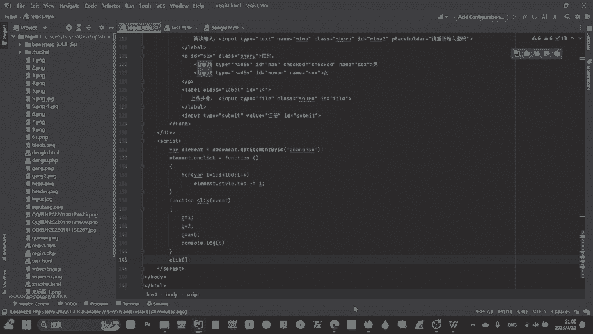

本节课中，我们一起学习了JavaScript的核心知识：

1.  **JavaScript基础**：了解了变量声明（`var`）、控制台输出（`console.log`）、弹窗（`alert`）和函数定义（`function`）。
2.  **DOM操作**：学习了如何获取HTML元素、修改元素属性、内容以及CSS样式，这是实现动态网页的基石。
3.  **事件处理**：掌握了如何监听和响应用户的交互事件，如点击、输入等。
4.  **JSON数据格式**：认识了JSON这种重要的数据交换格式，并学会了如何解析和使用它。

对于安全研究员而言，学习前端和JavaScript的核心目的是“能读懂”。在审计网站或应用时，能够快速理解前端代码的逻辑，找出可能的交互漏洞（如逻辑缺陷、未经验证的操作等），远比做出华丽的页面更重要。当然，掌握了这些知识，你也完全有能力去实现和优化自己的网页。

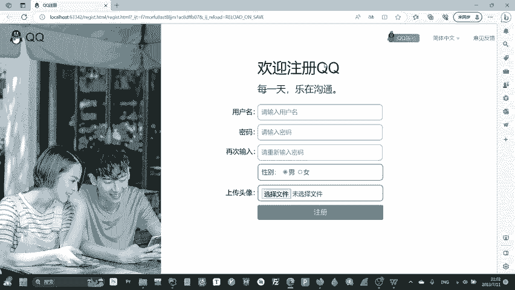

如果你想更快地构建美观的页面，可以学习使用Bootstrap这类前端框架。下一步，我们将进入后端的世界，探索服务器端的技术。