# 0基础WEB安全教学：P4：后端篇（上）SQL与MySQL：励志存下全世界的小猫咪 🐱

在本节课中，我们将要学习数据库的基础知识，特别是SQL语言和MySQL数据库的使用。这是理解后端工作原理和后续学习SQL注入漏洞的关键第一步。

## 概述

数据库是存储和管理数据的核心软件。SQL是一种用于与数据库通信的标准语言。本节课我们将学习如何安装MySQL环境，使用SQL语言进行基本的数据库操作，包括创建数据库、表，以及数据的增删改查。

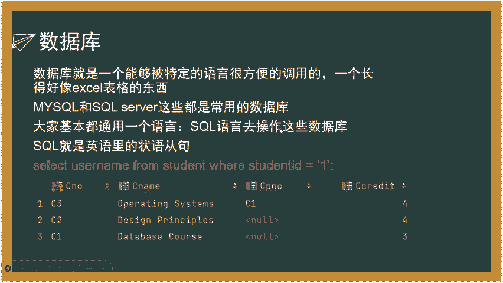

---

## 数据库与SQL简介

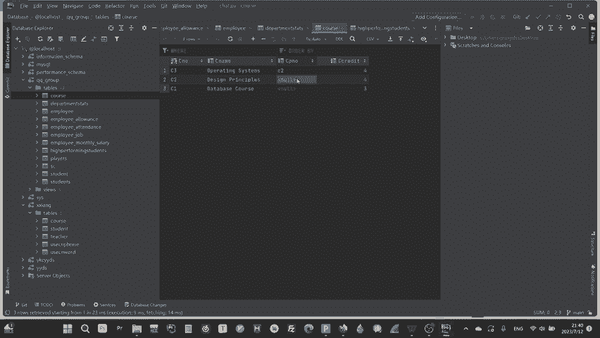

数据库是一个能够被特定语言（如SQL）方便调用的软件，用于存储大量数据。例如，MySQL数据库安装后，可以使用SQL语言创建多个数据库，每个数据库包含多张表。

每张表的结构类似于Excel表格，包含行和列。程序可以通过代码将用户输入的数据存入数据库，或在需要时从数据库中查询数据，这比用记事本存储数据高效得多。

SQL语言看起来像英语句子，易于理解。例如：
```sql
SELECT username FROM student WHERE student_id = 1;
```
这条语句的意思是：从`student`表中，挑选出`student_id`等于1的学生的`username`。

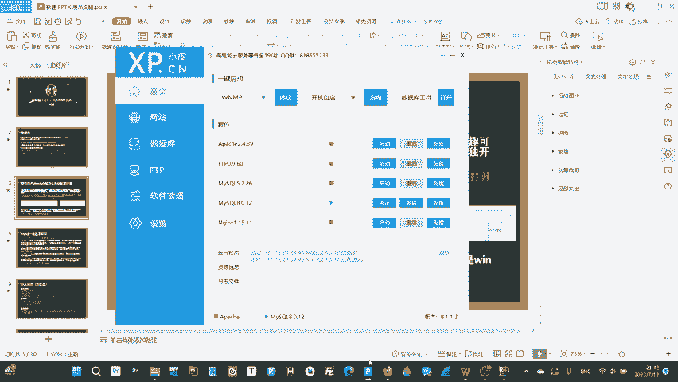

---

## 环境搭建：使用PHPStudy

对于初学者，手动配置MySQL环境变量和配置文件可能很麻烦。推荐使用**PHPStudy**这款软件，它能一键安装并配置好MySQL、PHP等环境，极大简化了初始设置。

安装并启动PHPStudy后，其管理界面会显示MySQL等服务状态。点击“启动”按钮（显示为三角标志）即可运行MySQL服务。

---

## 使用命令行操作MySQL

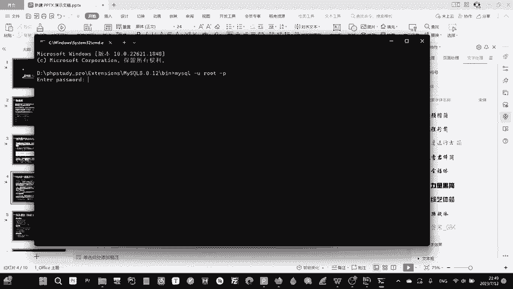

虽然有许多图形化数据库管理工具，但为了深入学习SQL语句，我们选择使用命令行进行操作。所有数据库操作都将通过SQL命令完成。

### 打开命令行并登录MySQL

首先，需要找到MySQL的可执行文件路径。通常位于PHPStudy安装目录下的`/extensions/mysql*/bin/`文件夹中。在此文件夹的地址栏输入`cmd`并按回车，即可在此路径下打开命令行窗口。

**命令行界面（CLI）** 是一种给计算机指令并接收反馈的交互界面。在安全领域，获取服务器权限常意味着获得了向服务器命令行发送指令的能力。

在打开的命令行中，使用以下命令登录MySQL：
```bash
mysql -u root -p
```
*   `-u` 参数后接用户名，例如 `root`。
*   `-p` 参数表示接下来需要输入密码。
输入密码后，即可进入MySQL的交互界面。

**关于root用户**：`root`是系统最高权限用户，类似于安卓手机的“Root权限”或Windows的“Administrator”。拥有它即可完全控制系统，因此需要妥善保管其密码。

**关于端口**：端口是网络通信的虚拟通道。MySQL数据库默认使用**3306**端口。在网络安全中，扫描到目标开放3306端口，通常意味着其运行了MySQL服务。

**SQL大小写问题**：SQL语言本身不强制区分大小写，但在Linux系统上，数据库名、表名、列名是区分大小写的。为保证兼容性，建议养成规范使用大小写的习惯。

---

## SQL核心概念与语法

### 基本规范
*   SQL语句必须以分号 `;` 结尾。
*   建议对关键字使用大写，对数据库、表、列名等使用小写，并注意大小写一致性。

### 数据库结构
数据库系统采用层级结构：
*   一个MySQL服务下可创建**多个数据库**。
*   一个数据库包含**多张表**。
*   一张表包含**多个列**。
*   每个列包含具体的**数据单元格**。

### 数据库操作语句
1.  **创建数据库**：`CREATE DATABASE 数据库名;`
2.  **删除数据库**：`DROP DATABASE 数据库名;`
3.  **使用数据库**：`USE 数据库名;` （在执行表操作前，必须先用此命令选定数据库）

### 数据类型
创建表时，需要为每一列指定数据类型，常见的有：
*   `INT`： 整数。
*   `FLOAT`： 浮点数（小数）。
*   `DOUBLE`： 双精度浮点数（更精确的小数）。
*   `CHAR`： 定长字符串。
*   `VARCHAR`： 变长字符串。

### 列的特征（约束）
创建表时，可以给列添加约束：
*   `PRIMARY KEY`： **主键**。唯一标识每行数据，值不能重复且不能为空。每张表只能有一个主键。
*   `UNIQUE`： **唯一约束**。值必须唯一，但可以为空。
*   `NOT NULL`： **非空约束**。值不能为空。
*   `AUTO_INCREMENT`： **自增**。常用于主键，插入新数据时其值自动增加。

### 特殊符号
*   `*` （星号）： 代表“所有列”。例如 `SELECT *` 表示选择所有列。
*   `%` （百分号）： 在 `LIKE` 子句中用作通配符，代表任意长度的任意字符。
*   `‘ ‘` （单引号）： 用于表示字符串值。

---

## SQL四大核心操作：增删改查

对数据的操作可归纳为以下四种，掌握它们即可应对大部分场景：

1.  **查（SELECT）**： 查询数据。
    ```sql
    SELECT 列名 FROM 表名 WHERE 条件;
    ```
    *示例*：从`student`表中查找名字为‘看名校’的学生的学号。
    ```sql
    SELECT student_id FROM student WHERE name = ‘看名校’;
    ```

2.  **增（INSERT）**： 插入新数据。
    ```sql
    INSERT INTO 表名 (列1, 列2) VALUES (值1, 值2);
    ```
    *示例*：向`student`表插入一条学号和年龄记录。
    ```sql
    INSERT INTO student (student_id, age) VALUES (123, 20);
    ```

3.  **改（UPDATE）**： 更新已有数据。
    ```sql
    UPDATE 表名 SET 列名 = 新值 WHERE 条件;
    ```
    *示例*：将`student`表中名字为‘看名校’的年龄改为18。
    ```sql
    UPDATE student SET age = 18 WHERE name = ‘看名校’;
    ```

4.  **删（DELETE）**： 删除数据。
    ```sql
    DELETE FROM 表名 WHERE 条件;
    ```
    *示例*：从`student`表中删除学号为123的记录。
    ```sql
    DELETE FROM student WHERE student_id = 123;
    ```

---

## 进阶查询与子句

上一节我们介绍了四大核心操作的基本形式，本节中我们来看看一些常用的进阶子句。

以下是其他有用的SQL子句和操作：

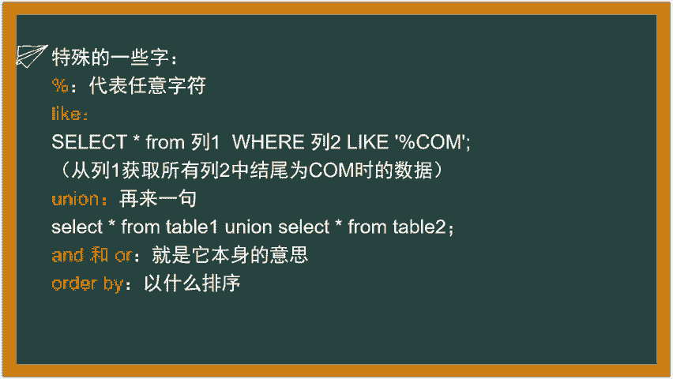

*   **LIKE 与通配符**： 用于模糊查询。
    ```sql
    SELECT * FROM 表名 WHERE 列名 LIKE ‘刘%’;
    ```
    此查询会找出所有该列值以“刘”开头的数据。`%`代表任意字符。

*   **UNION**： 合并多个SELECT语句的结果集。
    ```sql
    SELECT 列 FROM 表1 UNION SELECT 列 FROM 表2;
    ```

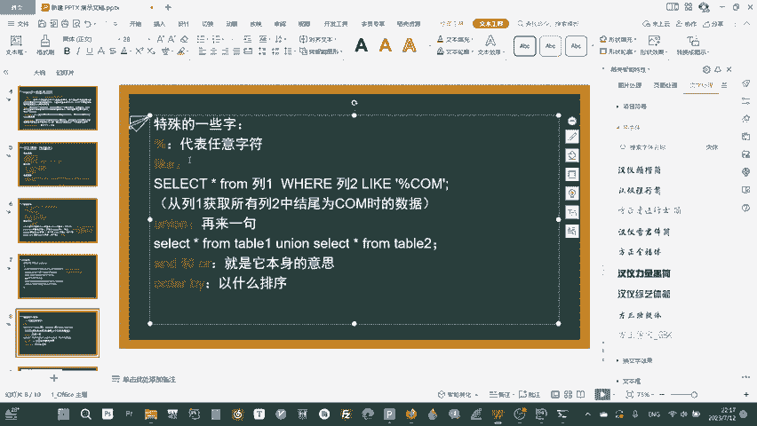

*   **AND / OR**： 在WHERE子句中组合多个条件。
    ```sql
    SELECT * FROM student WHERE student_id = 1 AND age > 18;
    SELECT * FROM student WHERE student_id = 1 OR age > 18;
    ```

*   **ORDER BY**： 对结果进行排序。
    ```sql
    SELECT * FROM 表名 ORDER BY 列名 ASC; -- 升序 (默认)
    SELECT * FROM 表名 ORDER BY 列名 DESC; -- 降序
    ```

---

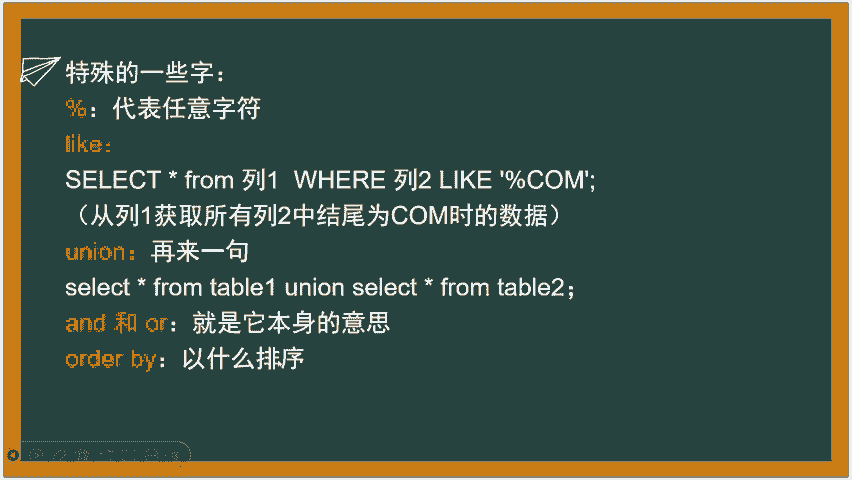

## 实战演示：从零操作数据库

现在，让我们在命令行中完整演练一遍数据库操作流程。

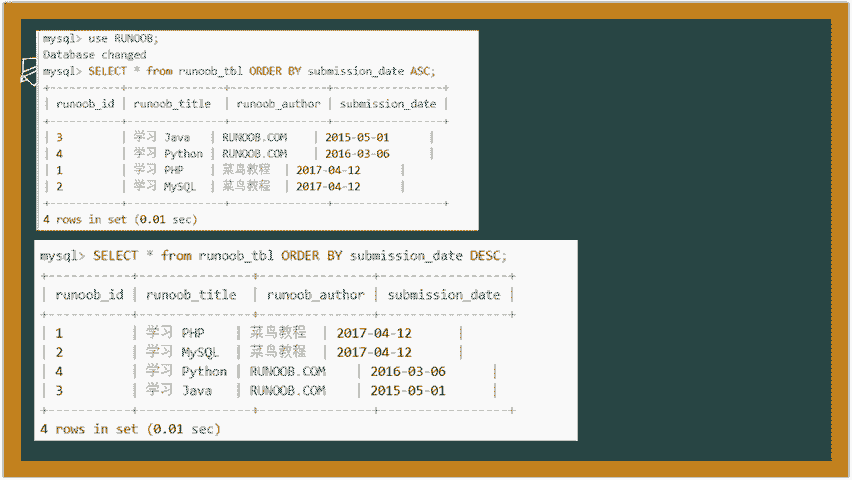

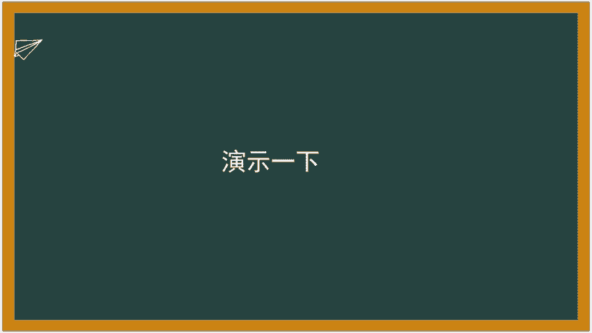

1.  **登录MySQL**：
    ```bash
    mysql -u root -p
    ```
    输入密码后进入MySQL命令行。

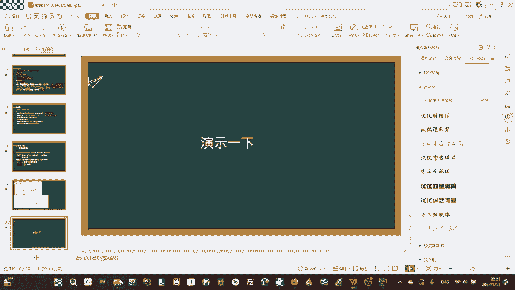

2.  **创建数据库**：
    ```sql
    CREATE DATABASE KMXYYDS;
    SHOW DATABASES; -- 查看所有数据库，确认创建成功
    ```

3.  **使用数据库**：
    ```sql
    USE KMXYYDS;
    ```

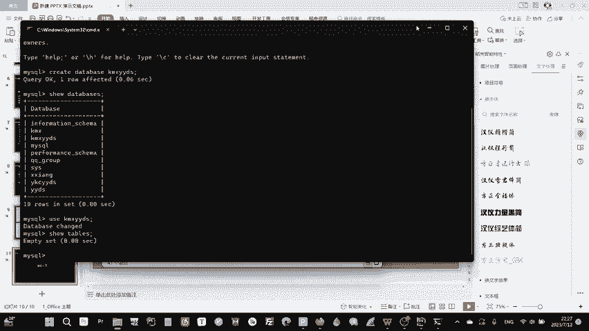

4.  **创建表**：
    ```sql
    CREATE TABLE student (
        id INT PRIMARY KEY AUTO_INCREMENT,
        student_id INT UNIQUE NOT NULL,
        name VARCHAR(50) NOT NULL,
        age INT,
        email VARCHAR(100),
        address VARCHAR(100)
    );
    SHOW TABLES; -- 查看当前数据库中的所有表
    ```

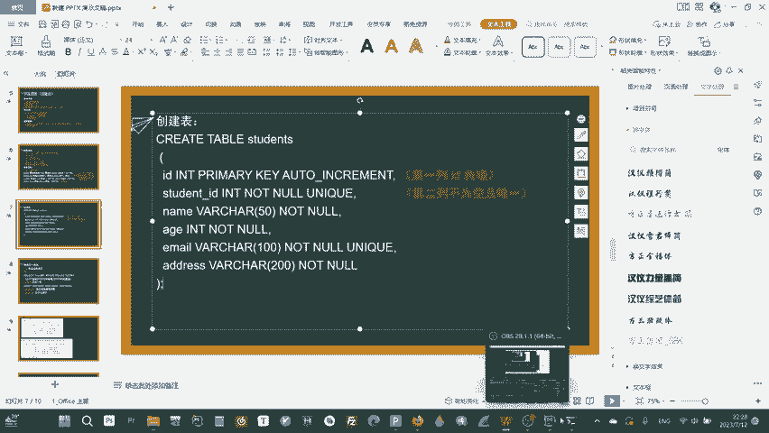

5.  **插入数据**：
    ```sql
    INSERT INTO student (student_id, name, age, email, address)
    VALUES (123, ‘看名校’, 20, ‘test@example.com’, ‘ABC’);
    ```

6.  **查询数据**：
    ```sql
    SELECT * FROM student; -- 查询所有数据
    SELECT student_id FROM student WHERE name = ‘看名校’; -- 条件查询
    ```

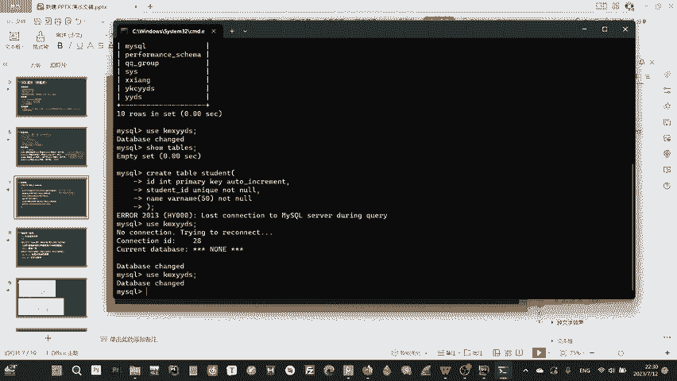

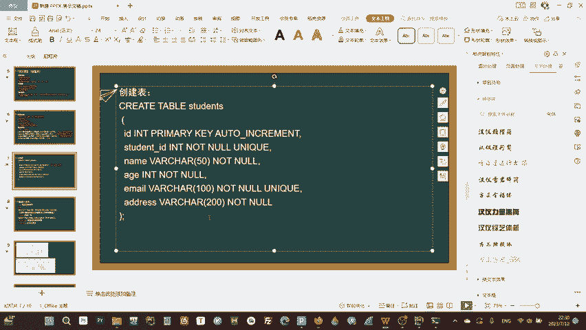

7.  **更新与删除**（可选练习）：
    ```sql
    UPDATE student SET age = 18 WHERE name = ‘看名校’;
    DELETE FROM student WHERE student_id = 123;
    ```

按照以上步骤，你就能完成一个完整的数据库操作循环。多尝试修改语句中的值，熟悉整个过程。

---

## 总结

本节课中我们一起学习了后端基础的重要组成部分——数据库。我们从数据库的概念讲起，介绍了SQL语言，并详细讲解了如何使用MySQL。核心内容包括：

1.  使用PHPStudy快速搭建MySQL环境。
2.  通过命令行登录和操作MySQL。
3.  理解数据库、表、列的结构关系。
4.  掌握SQL的四大核心操作：**增（INSERT）、删（DELETE）、改（UPDATE）、查（SELECT）**及其基本语法。
5.  了解了主键、约束、数据类型等关键概念。
6.  完成了从创建数据库、表到插入、查询数据的完整实战演练。

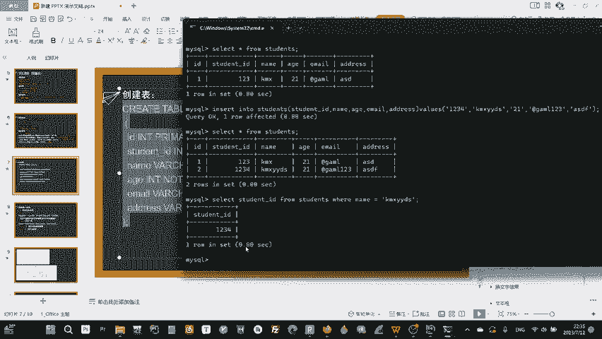

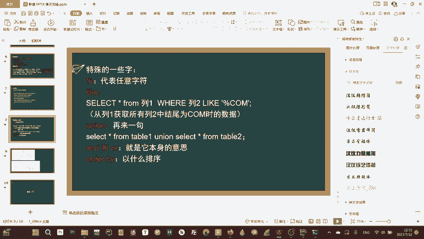

这些知识是理解Web应用如何存储、处理数据的基础，也是后续学习**SQL注入**等安全漏洞的必备前提。下节课，我们将学习PHP语言的基础，将前端、数据库连接起来，构建动态网页。