# 0基础WEB安全教学，从开机到拿奖：P6：第六节 脚本篇（上）python：‘皮松’真有意思 🐍


在本节课中，我们将要学习一门非常强大且应用广泛的编程语言——Python。我们将从Python的基础语法讲起，了解其核心特性，并最终学习如何使用Python的`requests`库进行网络请求，为后续的Web安全学习和实践打下基础。

Python是一门解释型语言，类似于我们之前介绍过的JavaScript和PHP。你需要从官网下载Python解释器（一个`.exe`文件），用它来运行你写好的Python代码。Python代码文件通常以`.py`结尾。

Python最大的特色之一是其拥有极其丰富的第三方库。你可以通过内置的`pip`工具方便地安装这些库，然后使用`import`语句导入，直接使用别人封装好的功能。这使得Python几乎可以应用于计算机应用的任何领域，这也是它如此流行的原因。

学会Python，意味着你真正开始将计算机作为个性化工具来使用。无论是算法开发、人工智能还是网络安全，Python都是核心工具。许多安全工具（如sqlmap）也是用Python编写的。

---

## Python语法基础

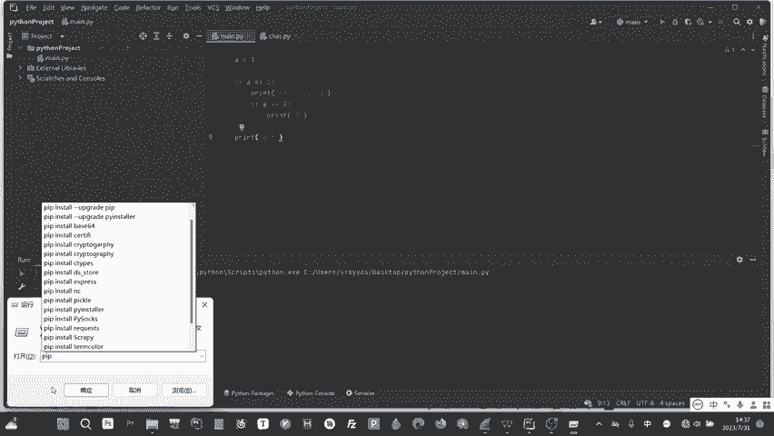

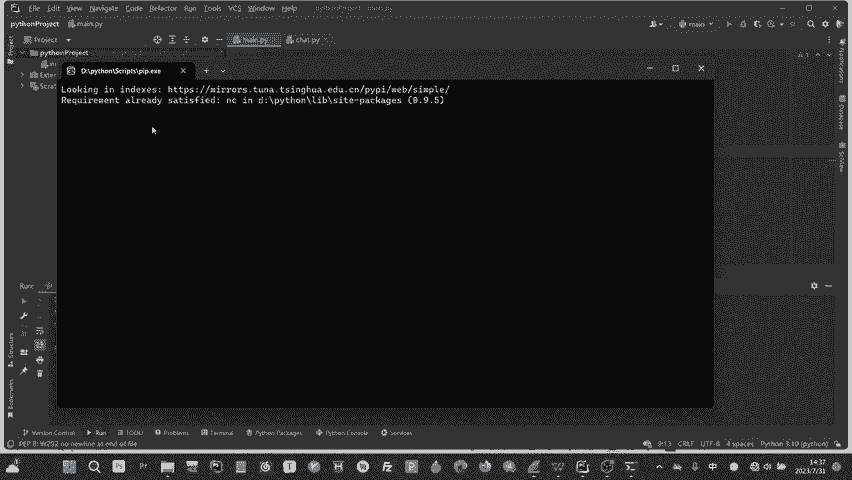

上一节我们概述了Python的强大之处，本节中我们来看看Python一些独特的基础语法。

### 代码块与缩进

Python的第一个显著特点是它不使用大括号`{}`来定义代码块（如`if`语句、循环等）。取而代之的是使用**缩进**。

在Python中，你按下键盘左上角的`Tab`键，就会输入一个缩进字符（本质上是制表符`\t`）。连续的缩进级别定义了代码的从属关系。

**示例：**
```python
A = 1
if A == 1:
    print(“hello world”) # 这是一个缩进，属于if代码块
    if A == 3: # 这仍然是第一个if的代码块
        print(“3”) # 这是两个缩进，属于内层if代码块
print(“out”) # 没有缩进，不属于任何if，总会执行
```
这种方式使得代码结构清晰直观，是Python设计上的巧妙之处。

### 导入库

要使用安装好的第三方库，需要使用`import`语句。

**操作步骤：**
1.  使用`pip install 库名`命令安装库（例如：`pip install requests`）。
2.  在代码中使用`import 库名`导入。
3.  然后就可以使用`库名.函数名()`的方式调用库中的功能。

这类似于C语言中的`#include`，目的是引入别人写好的函数和类。

### 程序的执行入口

Python没有像C或Java那样强制要求的`main`函数。Python解释器会**从上到下顺序执行**脚本中的代码。

当然，为了项目规范和模块化，我们也可以自定义一个`main`函数，并手动调用它。更常见的做法是使用以下结构，这能确保当该文件作为主程序运行时，才执行特定代码，而作为模块被导入时则不执行。
```python
if __name__ == ‘__main__’:
    # 这里写主程序代码
    print(“程序开始运行”)
```
变量`__name__`是一个内置变量，代表当前模块的名字。当模块被直接运行时，`__name__`等于`’__main__’`。

### 循环结构：for 与 while

Python对`for`循环进行了重新设计，使其主要用于**遍历序列**（如列表、字符串等），而`while`循环则用于基于条件的循环。

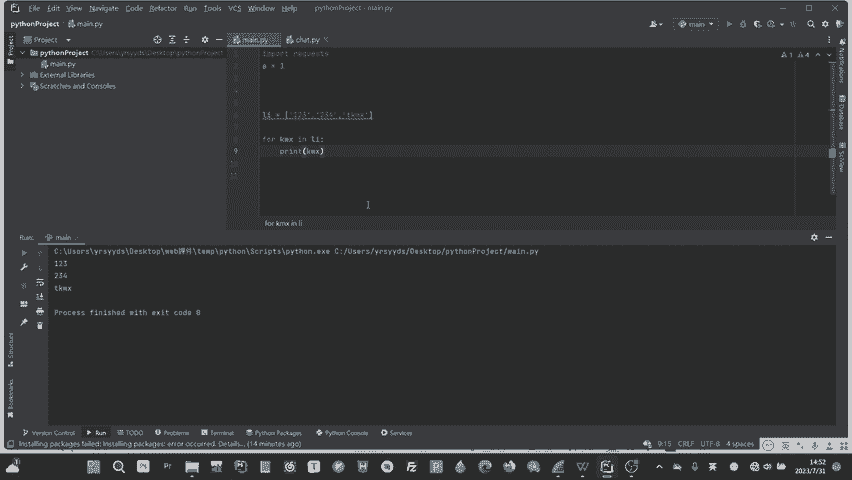

以下是`for`循环遍历列表的用法：
```python
my_list = [123, 234, “KMX”]
for item in my_list:
    print(item)
# 输出：
# 123
# 234
# KMX
```
`for item in my_list:` 会让`item`变量依次等于`my_list`中的每一个元素，并执行循环体内的代码。这种方式比C语言中通过索引遍历数组更加简洁。

---

## Python变量类型

理解了程序结构，我们来看看Python中可以用来存储数据的基本类型。

Python有几种常用的内置数据类型：

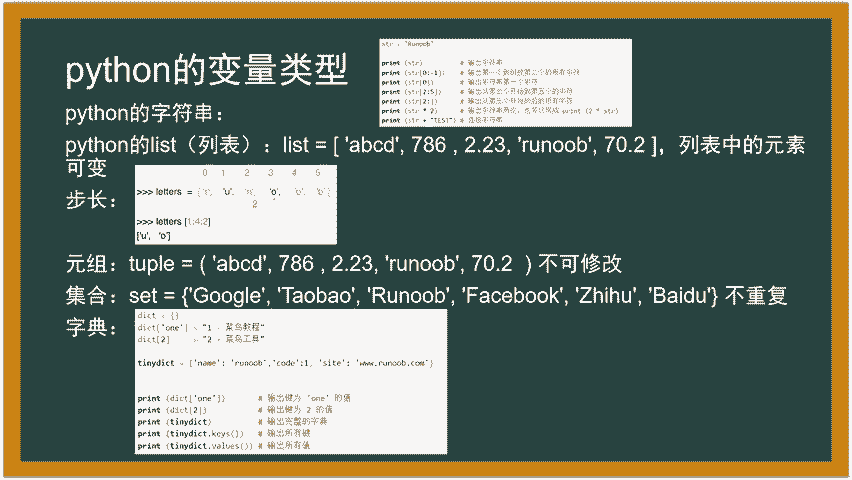

### 字符串 (String)
用单引号或双引号括起来的文本。
```python
str = “RUNOOB”
```

### 列表 (List)
用方括号`[]`表示，可以存放任意类型的数据，且**内容可以修改**。
```python
list = [‘abcd’, 786, 2.23, ‘runoob’, 70.2]
list[0] = ‘ABCD’ # 可以修改第一个元素
```

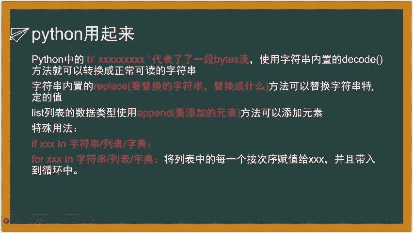

### 元组 (Tuple)
用圆括号`()`表示，类似于列表，但**内容不可修改**。用于存储不希望被改变的数据。
```python
tuple = (‘abcd’, 786, 2.23, ‘runoob’, 70.2)
```

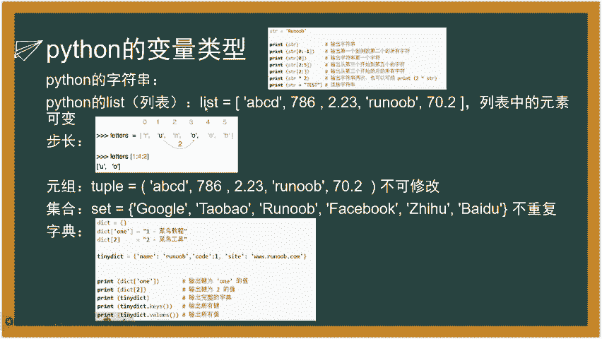

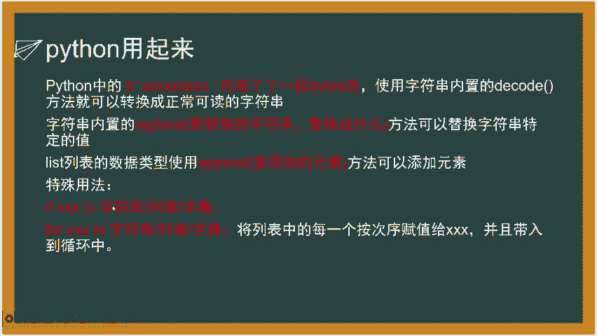

### 字典 (Dictionary)
用花括号`{}`表示，存储**键值对**。通过键来访问对应的值，键通常是字符串或数字。
```python
dict = {‘name’: ‘runoob’, ‘code’: 1, ‘site’: ‘www.runoob.com’}
print(dict[‘name’]) # 输出：runoob
dict[‘code’] = 200 # 可以修改键对应的值
```

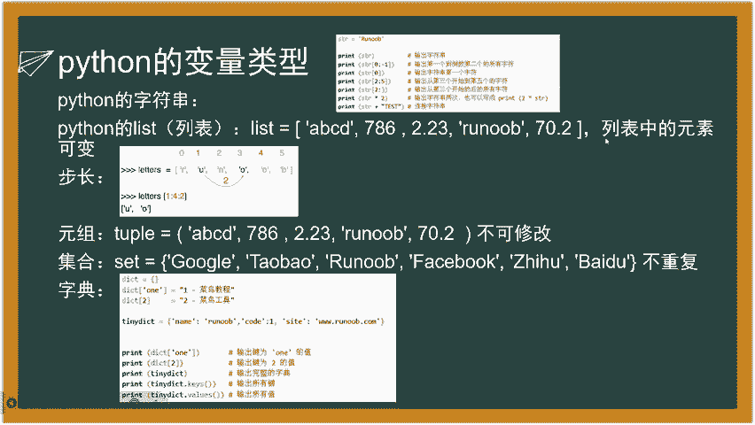

### 索引与切片
字符串和列表等序列类型支持索引和切片操作。
*   `变量名[索引]`：获取单个元素（索引从0开始）。
*   `变量名[起始索引:结束索引]`：切片，获取从起始到结束（不包含结束索引）的子序列。
*   `变量名[起始索引:结束索引:步长]`：按指定步长切片。

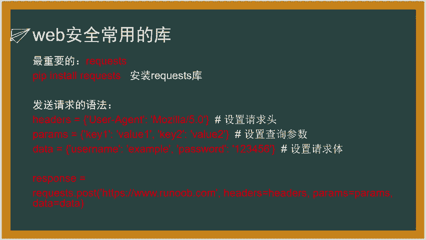

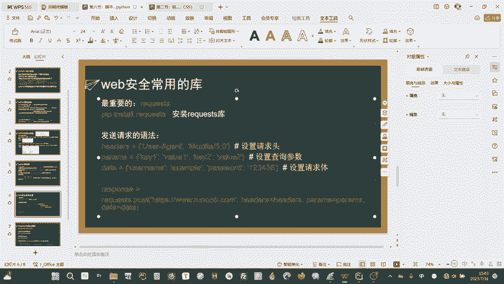

**示例：**
```python
str = “RUNOOB”
print(str[1]) # 输出 ‘U’
print(str[1:4]) # 输出 ‘UNO’ (索引1到3)
print(str[1:4:2]) # 输出 ‘UO’ (从索引1到3，每隔一个取一个)
```

---

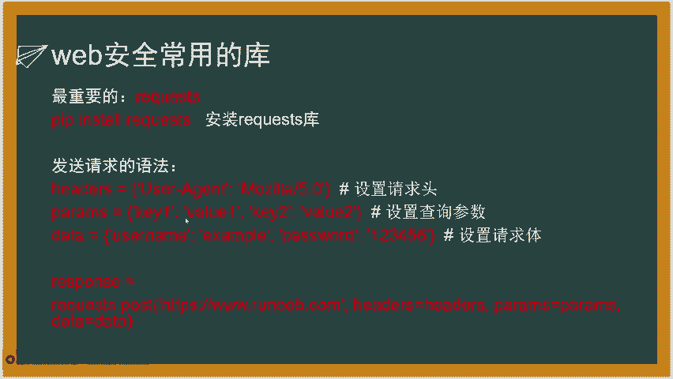

## Python实用技巧与Web安全入门

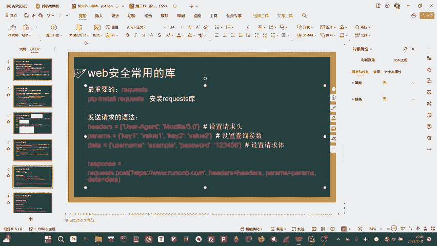

掌握了基本语法和类型后，我们来看看如何将Python用起来，特别是它在Web安全领域的应用。

### 字符串与列表的常用方法
*   **字符串替换**：`字符串.replace(‘旧内容’, ‘新内容’)`
*   **列表添加元素**：`列表.append(新元素)`
*   **成员检查**：使用`in`关键字可以快速检查元素是否存在于字符串、列表或字典的键中。
    ```python
    if ‘ABC’ in ‘ABCDEFG’:
        print(“存在”)
    if ‘abc’ in [‘abc’, ‘def’]:
        print(“存在”)
    ```

### 核心库：requests
对于Web安全来说，`requests`库至关重要。无论是测试SQL注入、XSS，还是编写爬虫，都需要用它来发送HTTP请求。

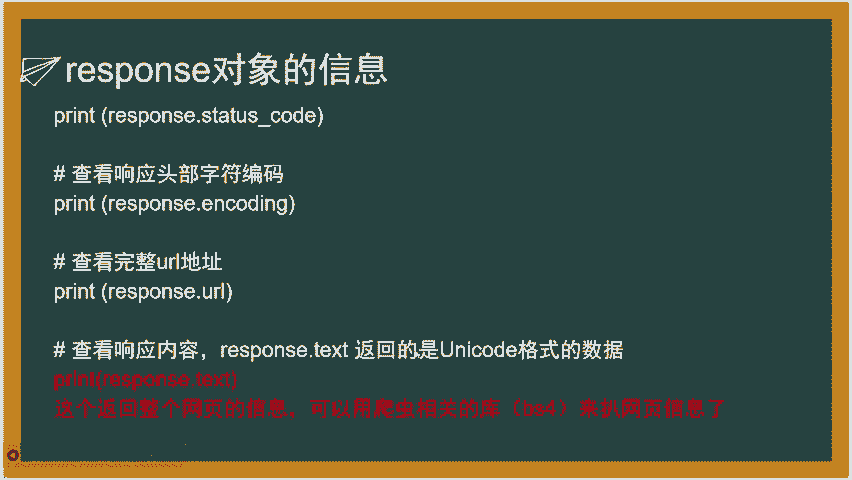

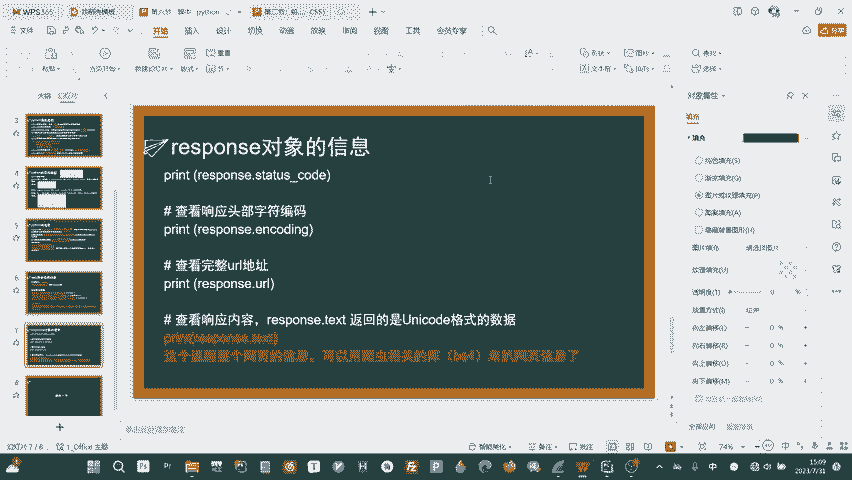

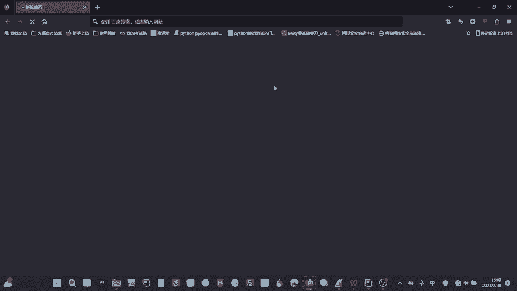

**安装：** `pip install requests`

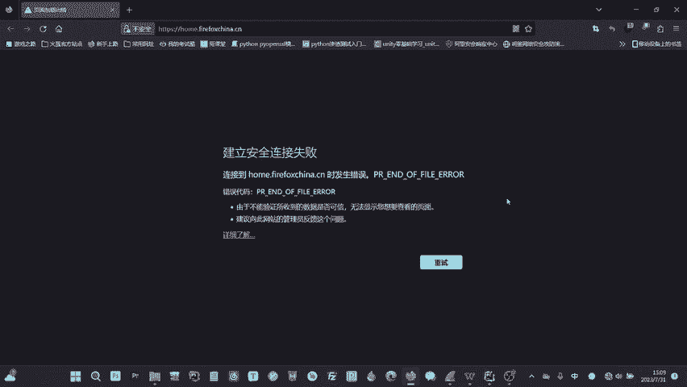

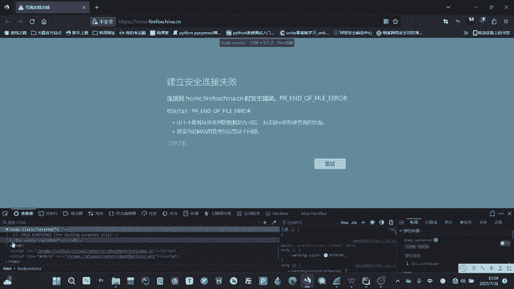

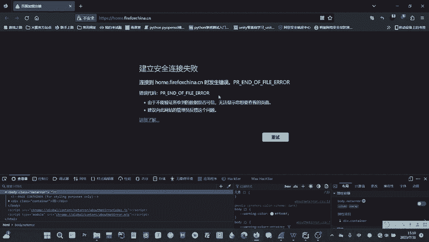

**发送请求的基本格式：**
一个HTTP请求包含请求头（Headers）、请求方法（GET/POST）、参数（Params/Data）等部分。
```python
import requests

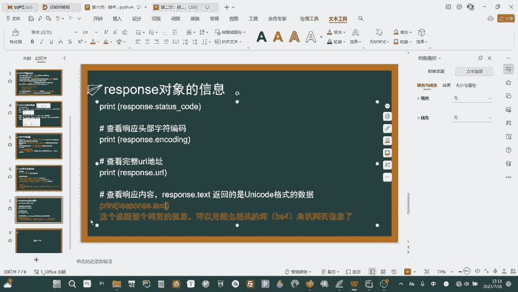

url = “http://example.com/login”
# 定义请求头，例如模拟浏览器访问
headers = {
    ‘User-Agent’: ‘Mozilla/5.0 (Windows NT 10.0; Win64; x64) AppleWebKit/537.36’
}
# 定义POST请求要提交的数据
data = {
    ‘username’: ‘admin’,
    ‘password’: ‘123456’
}
# 发送POST请求
response = requests.post(url, headers=headers, data=data)
```
*   **GET请求**的参数通常通过URL传递（`url?key1=value1&key2=value2`），在requests中使用`params`参数。
*   **POST请求**的数据放在请求体中，在requests中使用`data`参数。

**处理响应：**
`requests`发送请求后会返回一个`response`对象，其中包含了服务器的响应信息。
```python
print(response.status_code) # 打印状态码（200表示成功，404表示未找到等）
print(response.text) # 打印响应内容的文本形式（通常是HTML源码）
```
获取到的`response.text`（网页源代码）是后续分析的基础。你可以从中查找表单、链接、特定文本，以进行漏洞检测或信息爬取。

### 实战示例：简易维基百科查询脚本
下面是一个结合`requests`和HTML解析库`beautifulsoup4`的简单爬虫示例，用于获取维基百科词条的摘要。

**思路：**
1.  构造目标词条的URL。
2.  使用`requests.get()`获取该页面HTML源码。
3.  使用`beautifulsoup4`解析HTML，提取出所有段落（`<p>`标签）文本。
4.  将前几个段落拼接并返回。

**代码框架：**
```python
import requests
from bs4 import BeautifulSoup

def get_wiki_content(title):
    url = f“https://en.wikipedia.org/wiki/{title}”
    response = requests.get(url)
    html_content = response.text

    soup = BeautifulSoup(html_content, ‘html.parser’)
    # 查找所有段落
    paragraphs = soup.find_all(‘p’)

    result_text = “”
    count = 0
    for p in paragraphs:
        if count >= 6: # 只取前6个段落
            break
        text = p.get_text().replace(‘\n’, ‘ ‘) # 获取文本并替换换行符
        result_text += text
        count += 1
    return result_text

# 使用函数
if __name__ == ‘__main__’:
    content = get_wiki_content(“Python_(programming_language)”)
    print(content)
```
这个例子展示了如何自动从网页中提取结构化信息，爬虫和安全测试工具的原理与此类似。

---

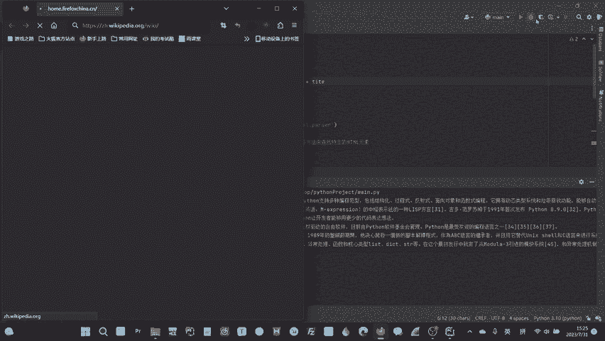

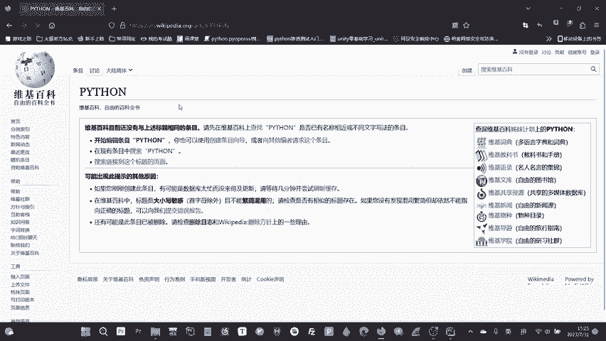

本节课中我们一起学习了Python的基础知识，包括其独特的语法、基本数据类型以及如何通过`requests`库进行网络请求。Python以其简洁的语法和强大的库生态，成为了安全研究、自动化测试和脚本编写的利器。下一节，我们将继续深入Python在Web安全中的实战应用。

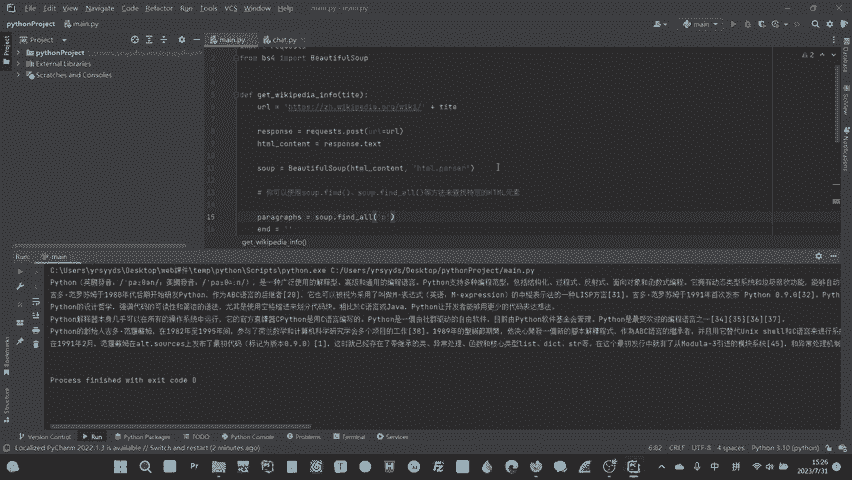

> 注：本教程内容整理自公开教学视频，示例代码仅供参考，实际使用时请遵守相关网站的服务条款和法律法规。