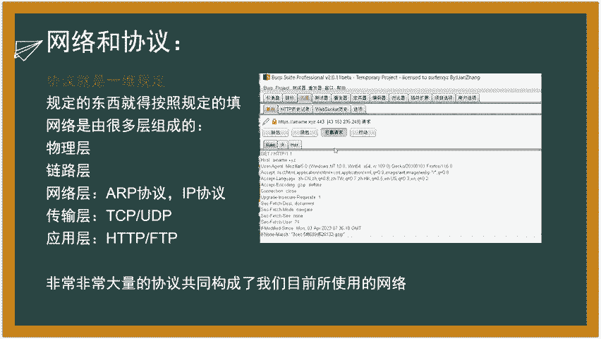
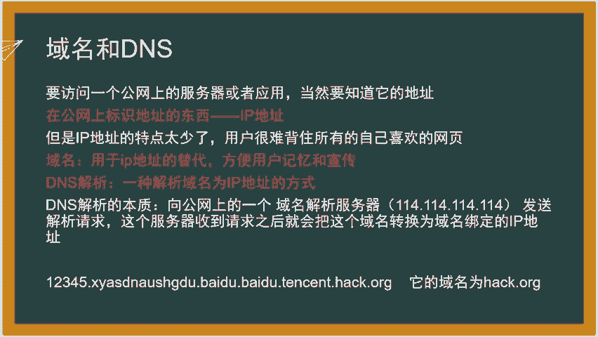
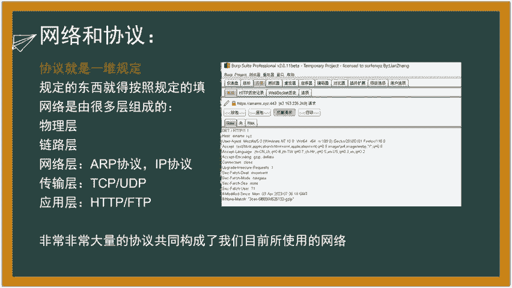
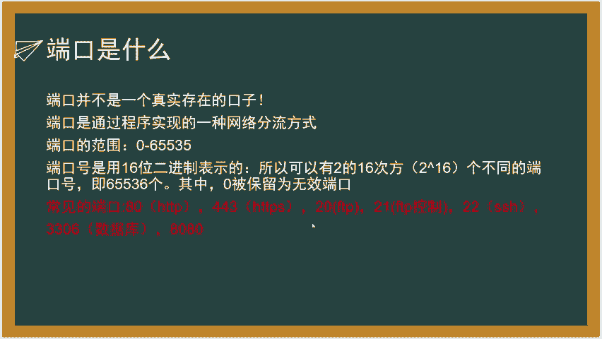
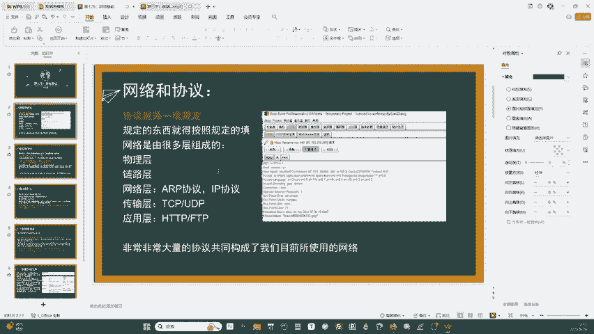
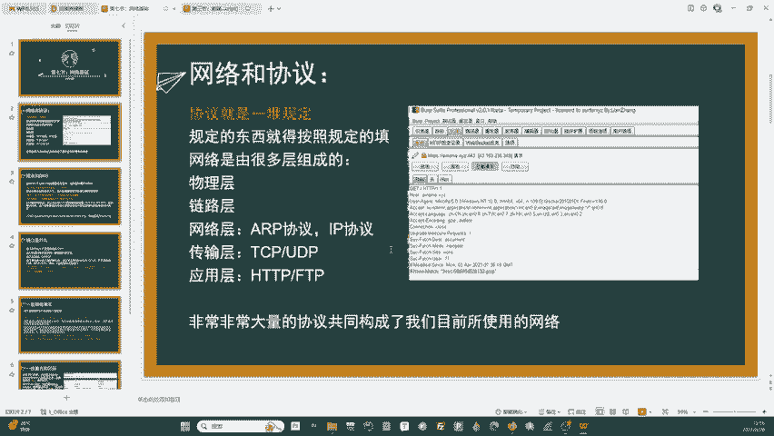
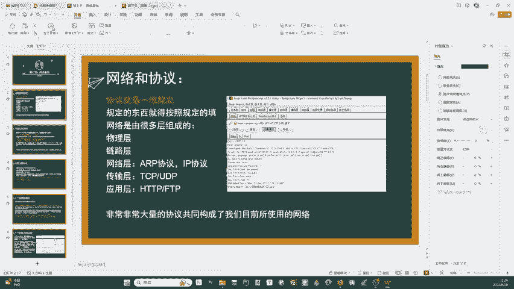
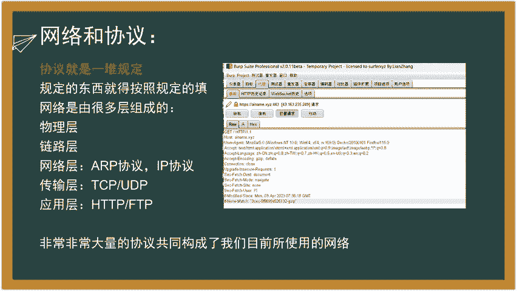
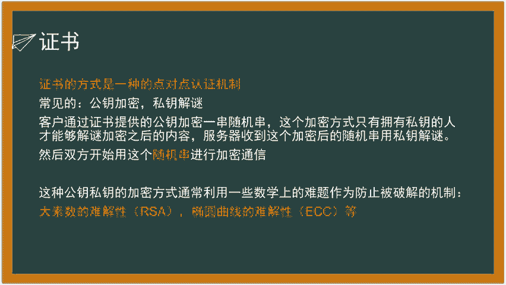
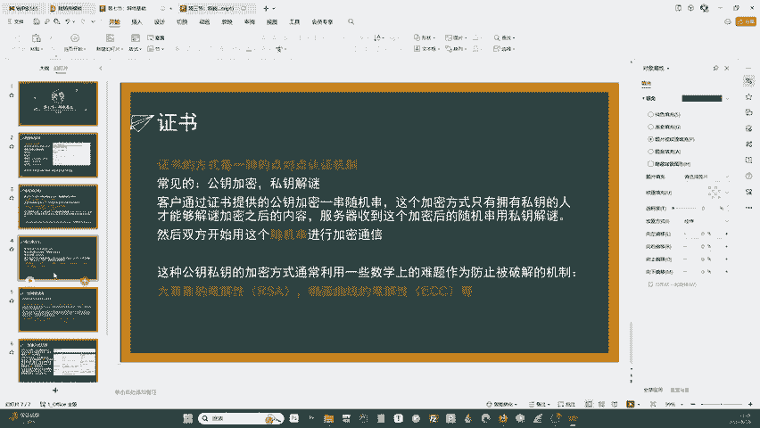

# 0基础WEB安全教学：P7：网络基础与HTTPS加密原理 🔐

在本节课中，我们将学习网络通信的基础知识，包括网络协议、域名解析、端口概念以及HTTP请求类型。最后，我们会深入探讨HTTPS如何通过公钥和私钥的加密机制来保障数据传输安全。

## 网络与协议 📡

上一节我们介绍了编程基础，本节中我们来看看网络是如何工作的。网络通信依赖于“协议”。协议就像一份合同，它规定了数据包必须包含哪些固定字段以及如何组织这些信息，以确保发送方和接收方能正确理解彼此。

例如，一个HTTP请求数据包必须包含像 `Host`、`Accept` 这样的固定请求头。这些字段的名称和格式都是协议规定好的，不能随意更改。

网络通信是分层的，最常被提及的是五层模型，从下到上依次是：
*   **物理层**：负责实际的物理设备连接，如网线、光纤。
*   **链路层**：负责在直接相连的设备间传输“帧”。
*   **网络层**：负责在不同网络间寻址和路由，核心协议是 **IP协议**。其目标是找到目标主机，可以表示为：`数据包 + IP地址 -> 路由 -> 目标主机`。
*   **传输层**：负责端到端的通信，主要协议是 **TCP** 和 **UDP**。例如，建立TCP连接的过程是：`SYN -> SYN-ACK -> ACK`。
*   **应用层**：包含我们日常使用的具体服务协议，如 **HTTP**、**FTP**、**SMTP**。

协议的本质是规则。发送方按照协议格式封装数据，接收方按照同一协议解析数据，从而实现有效通信。

## 域名与DNS 🌐

上一部分我们了解了IP地址是网络上的唯一标识。但IP地址（如 `192.168.1.1`）难以记忆，且服务器可能会因负载均衡等原因更换IP。因此，引入了“域名”这一字符串标识符，例如 `baidu.com`。

域名需要通过 **DNS** 解析为IP地址。当你在浏览器输入 `baidu.com` 时，你的计算机会向DNS服务器（如 `114.114.114.114`）发起查询。DNS服务器在其庞大的数据库中查找该域名对应的IP地址并返回给你的电脑，随后你的电脑才能通过IP地址访问目标服务器。

识别网站真实身份时，关键在于域名的**最后一部分**（主域名）。例如，在 `login.xxx.baidu.com` 中，`baidu.com` 才是核心，前面的 `login.xxx` 可能是子域名，需警惕用于钓鱼的仿冒域名。

## 端口 ⚓️

端口不是物理接口，而是操作系统提供的网络连接“逻辑通道”，用于将网络流量分流到不同的应用程序。

端口号范围是 **1 到 65535**。这是因为端口号用一个16位的二进制数表示，其最大数量为 `2^16 = 65536` 个，减去保留的0端口，即为65535个。计算公式为：`端口号范围：1 ~ (2^16 - 1)`。

以下是一些常见端口及其对应服务：
*   **80**：HTTP（网页服务）
*   **443**：HTTPS（加密的网页服务）
*   **21**：FTP（文件传输协议-控制）
*   **22**：SSH（安全外壳协议，用于远程管理）
*   **3306**：MySQL数据库
*   **8080**：常用于Web代理或应用管理界面

在进行安全扫描时，这些常见端口是需要重点检查的对象。

## HTTP请求：GET vs. POST 🔄

HTTP协议中最常用的两种请求方法是GET和POST，它们在数据传输方式上有根本区别。

**GET请求**的参数通过URL传递，格式如下：
`http://example.com/page?name=value&key=anotherValue`
由于参数直接暴露在地址栏，**安全性较低**，且长度受URL限制（约1024字符）。

**POST请求**的参数包含在“请求体”中，不会显示在URL里。这使得它**更适合传输敏感信息或大量数据**（如图片、文件）。POST请求体理论上无严格长度限制，但通常服务器会设置上限（如2MB）。

以下是两者的核心区别总结：
*   **参数位置**：GET在URL中；POST在请求体中。
*   **安全性**：POST相对更安全（非明文可见）。
*   **数据长度**：GET有长度限制；POST支持更大数据量。
*   **浏览器回退**：GET回退无害；POST回退可能重新提交数据。
*   **编码**：GET参数进行URL编码；POST支持更多编码类型。

值得注意的是，一个POST请求的URL中也可以附带GET参数，兼具两种方式的特性。

## HTTPS与加密证书 🔒

前面提到POST请求的数据在传输中仍可能被截获。HTTPS（HTTP Secure）通过加密解决了这个问题，其核心是**数字证书**和**非对称加密**。

HTTPS连接建立过程简述如下：
1.  客户端向服务器发起HTTPS请求。
2.  服务器返回其数字证书，证书中包含**公钥**。
3.  客户端验证证书有效性。
4.  客户端生成一个随机的“对称加密密钥”，并用服务器的**公钥**加密它，然后发送给服务器。
5.  服务器用自己的**私钥**解密，得到这个对称密钥。
6.  此后双方通信都使用这个对称密钥进行加密解密。

这里的精妙之处在于**非对称加密**：用公钥加密的数据，只能用对应的私钥解密。即使攻击者截获了用公钥加密的数据，没有私钥也无法破解。而后续通信使用的对称密钥，正是通过此方式安全交换的。

当前的非对称加密算法（如RSA、ECC）基于复杂的数学难题（如大数质因数分解、椭圆曲线离散对数），使得传统计算机在可接受时间内无法破解。

这也引出了对**量子计算机**的担忧。如果量子计算机实用化，其巨大的算力可能快速破解现有加密算法，从而威胁整个互联网安全体系，这将是未来网络安全面临的重大挑战。

## 总结 📝

本节课我们一起学习了网络通信的基石。我们了解了网络协议如同通信合同，域名通过DNS解析为IP地址，端口将流量导向不同应用。我们重点分析了GET与POST请求的区别，明白了POST在传输敏感数据时的优势。最后，我们探讨了HTTPS如何利用公钥加密、私钥解密的非对称加密机制，以及数字证书的验证过程，来确保数据传输的机密性与完整性，并知晓了当前加密体系未来可能面临的量子计算挑战。理解这些基础知识，是步入Web安全领域的关键第一步。