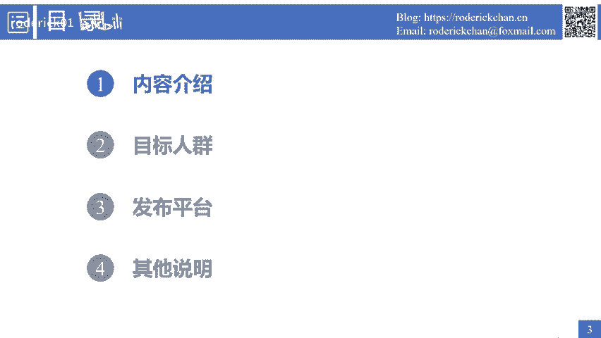
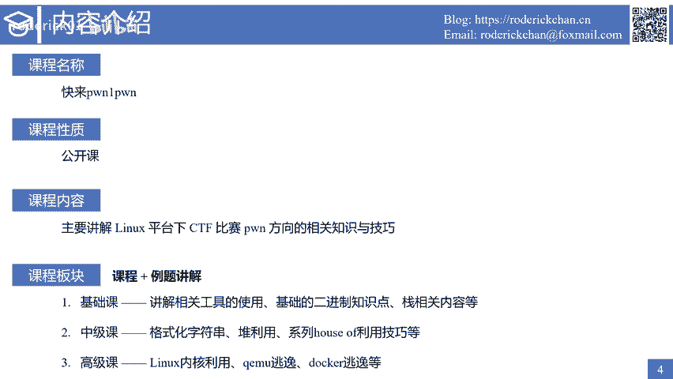
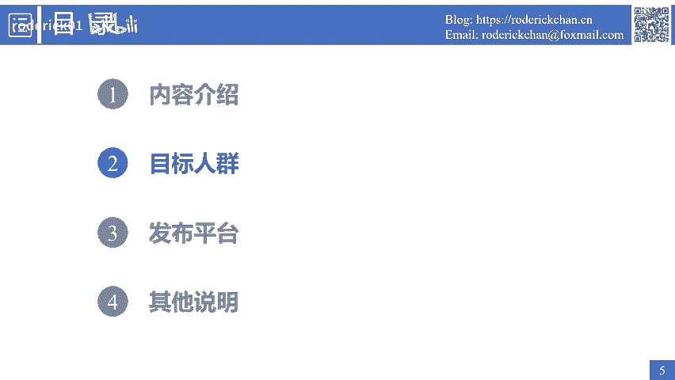
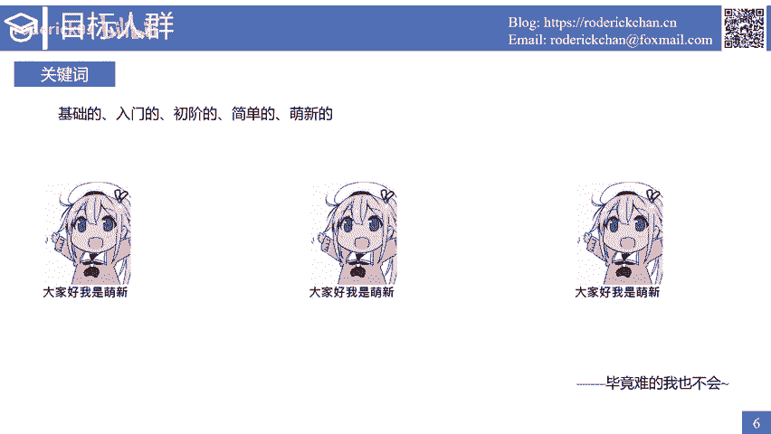
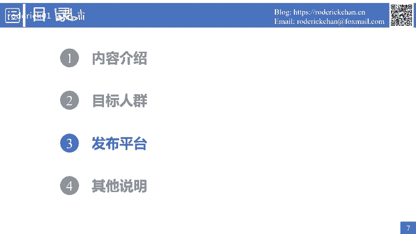
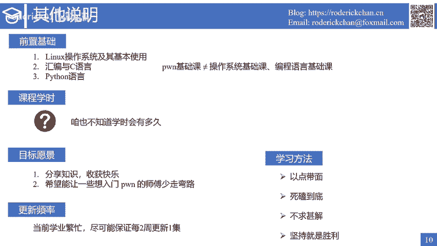

# Pwn入门系列公开课：1：课程介绍 🎯

在本节课中，我们将对《快来碰一碰》Pwn入门系列公开课进行整体介绍，了解课程内容、目标人群、发布平台以及学习方法。

## 课程内容概述 📚

课程名称是《快来碰一碰》。这是一门完全公开免费的系列公开课。课程主要讲解与分享Linux平台下CTF比赛中Pwn方向的相关知识与技巧。

课程板块分为两个部分：课程授课和例题讲解。

在课程授课部分，本次公开课分为三个子课程：
*   **基础课**：讲解Pwn解题相关工具的使用、基础的二进制知识点以及最基本的栈利用技巧。
*   **中级课**：进阶到格式化字符串的利用、堆利用以及综合性很强的ROP利用技巧。
*   **高级课**：讲解Linux内核利用、容器逃逸等知识点与技巧。

需要说明的是，以上只是大致的课程安排，实际上会根据课程进度进行动态调整。

## 目标受众 🧑‍🎓

这门公开课的关键词是：基础的、入门的、初阶的、简单的、面向新手的。这是一门面向新手录制的Pwn系列公开课，是一款入门级教程。

课程会尽可能从一个初学者的角度讲授学习Pwn过程中所需要的知识点与技巧。当然，受限于本人的知识水平，课程内容会维持在入门级别。

## 发布平台与资源 🌐

课程的系列视频会上传到YouTube频道和哔哩哔哩账号。推荐大家在这两个平台观看。

有关课程的课件信息会发布在个人博客网站上。课程的最新视频会同步推送到个人微信公众号。

除开这些平台，目前不会使用其他平台发布本系列公开课视频。

## 预备知识与其他说明 ℹ️

这是一门Pwn基础课，但Pwn基础课不等同于操作系统基础课，也不是一门编程语言基础课。

在学习Pwn之前，你需要掌握以下知识：
*   基础的Linux操作系统知识，熟悉常用的Linux命令行。
*   掌握汇编与C语言的使用。
*   能够较为流畅地编写Python语言脚本。

在课程学时方面，无法预估视频的录制时长，因此不能给出具体的学时时长。可以保证的是，没有特别原因，不会停止更新本系列公开课。

## 课程目标与学习方法 🎯

录制这门课程的目标主要有两点：
1.  分享自己所学的知识。
2.  帮助想入门Pwn的学习者少走一些弯路。

在课程更新频率方面，会尽可能保证每两周更新一次。

以下是关于如何学习Pwn的方法介绍。CTF比赛中的Pwn是一个对个人综合能力要求较高的方向，且前期的学习曲线非常陡峭。

学习方法主要有以下四条：
1.  **以点带面**：Pwn相关知识非常多。推荐的方法是，学习某个知识点时，对于其他关联知识点无需立即深究。先按照当前理解接受它，像集邮一样不断收集知识点。当收集的知识点达到一定数量后，再将它们串联成线、拓展成面，很多疑惑会自然解开，后续学习将更高效。
2.  **死磕到底**：对于一些必要的核心知识点，如果没有弄清楚，需要反复观看、揣摩、学习和训练，直到彻底弄清楚为止。
3.  **不求甚解（详略得当）**：对于一些知识需要死磕到底，而其他一些知识只需要理解大意即可，没有必要钻牛角尖。
4.  **坚持**：坚持就是胜利。只要坚持下去，就一定可以跨过任何高山。

## 总结与预告 📝

本节课我们一起学习了《快来碰一碰》Pwn入门系列公开课的课程内容、适合人群、发布平台、学习要求以及高效的学习方法。

在下一节课中，将讲述与Pwn有关的基本环境与工具搭建。如果在观看视频过程中有任何建议，欢迎在评论区交流。最后祝愿大家学习顺利。