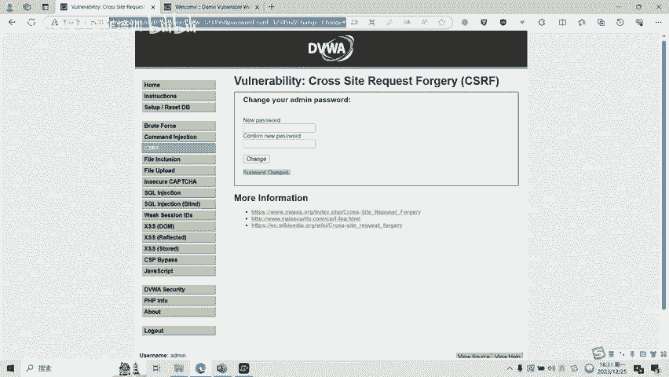

# CTF网络安全培训：Web篇：CSRF漏洞 - P1


## 📚 课程概述
在本节课中，我们将要学习CTF比赛中一种常见的Web安全漏洞——CSRF（跨站请求伪造）。我们将了解其基本原理、常见的攻击类型，并通过一个简单的实操演示来加深理解。

---

## 🔍 CSRF漏洞基本原理
跨站请求伪造（CSRF）是一种挟制终端用户在当前已登录的Web应用程序上执行非本意操作的攻击方法。攻击者借助少许社会工程学手段，例如通过电子邮件或聊天软件发送链接，一旦受害者点击该链接，攻击者就能迫使受害者的浏览器向已登录的网站发送恶意请求。

上一节我们介绍了CSRF的基本概念，本节中我们来看看它的攻击流程。以下是CSRF攻击的基本步骤流程图解析：

1.  用户打开浏览器，访问受信任的网站A，输入用户名和密码请求登录。
2.  用户信息通过验证后，网站A产生Cookie信息并返回给浏览器。此时用户成功登录网站A。
3.  用户未退出网站A，在同一浏览器中打开新标签页访问了危险网站B。
4.  网站B接收到用户请求后，返回一些攻击性代码，并发出一个请求要求访问第三方站点（即网站A）。
5.  浏览器接收到攻击代码后，在用户不知情的情况下携带Cookie信息，向网站A发出请求。
6.  网站A无法区分该请求是否由用户本意发起，因此会根据用户的Cookie和权限处理该请求，导致来自网站B的恶意代码被执行。

---

## ⚔️ CSRF常见攻击类型
理解了攻击流程后，我们来看看攻击者具体是如何实施攻击的。以下是三种常见的CSRF攻击类型：

### 1. GET类型攻击
GET类型的CSRF漏洞利用非常简单，通常只需要构造一个HTTP GET请求。

例如，以下代码被嵌入在一个恶意页面中：
```html

```
当受害者访问含有此代码的页面时，浏览器会自动向 `http://bank.example` 发送GET请求，将小明账户的1万元转给Hacker账户。

### 2. POST类型攻击
POST类型的CSRF攻击通常利用一个会自动提交的表单来模拟用户操作。

例如，以下是一个隐藏的自动提交表单：
```html
<form action="http://bank.example/transfer" method="POST" id="csrf-form">
  <input type="hidden" name="account" value="XiaoMing"/>
  <input type="hidden" name="amount" value="10000"/>
  <input type="hidden" name="for" value="Hacker"/>
</form>
<script>document.getElementById('csrf-form').submit();</script>
```
当用户访问该页面时，表单会自动提交，模拟用户完成了一次POST操作，实现转账。

### 3. 链接类型攻击
链接类型的CSRF攻击需要用户主动点击链接才会触发，常见于论坛图片链接或诱导性广告。

例如，攻击者可能发送如下链接：
```html
<a href="http://bank.example/transfer?account=XiaoMing&amount=10000&for=Hacker">
  点击领取您的万元大奖！
</a>
```
攻击者使用夸张的词语诱骗用户点击，用户点击后即执行了CSRF攻击。

---

## 🧪 CSRF漏洞实操演示
理论结合实践才能掌握得更牢固。接下来，我们通过一个简单的靶场环境来演示GET类型的CSRF攻击。

1.  我们访问一个存在CSRF漏洞的密码修改页面。
2.  在表单中输入新密码 `123456`，点击“提交”按钮。
3.  页面显示“密码修改成功”。该操作是通过GET请求完成的，参数直接暴露在URL中。
4.  为了验证漏洞，我们构造一个恶意URL，将新密码参数改为 `654321`。
    ```
    http://vulnerable-site.com/change_password?new_pwd=654321&confirm_pwd=654321&submit=1
    ```
5.  诱使已登录目标网站的用户访问此链接。
6.  用户访问后，其密码在不知情的情况下被修改为 `654321`。
7.  使用新密码 `654321` 可以成功登录账户，证实CSRF攻击生效。

这个演示清晰地展示了GET类型CSRF漏洞的利用过程。

---

## 📝 课程总结
本节课中我们一起学习了CSRF漏洞。我们首先了解了CSRF是一种诱骗用户浏览器向已认证网站发送非本意请求的攻击方式。然后，我们分析了其攻击原理和流程。接着，我们详细介绍了GET、POST和链接三种常见的攻击类型及其利用代码。最后，通过一个实操演示，我们直观地看到了GET类型CSRF漏洞的利用效果。



CSRF漏洞还有很多种绕过和利用方式，我们将在后续课程中针对不同类型制作更深入的教学视频。

---
*本课程内容仅用于CTF网络安全教学与培训，请遵守相关法律法规，勿用于非法用途。*