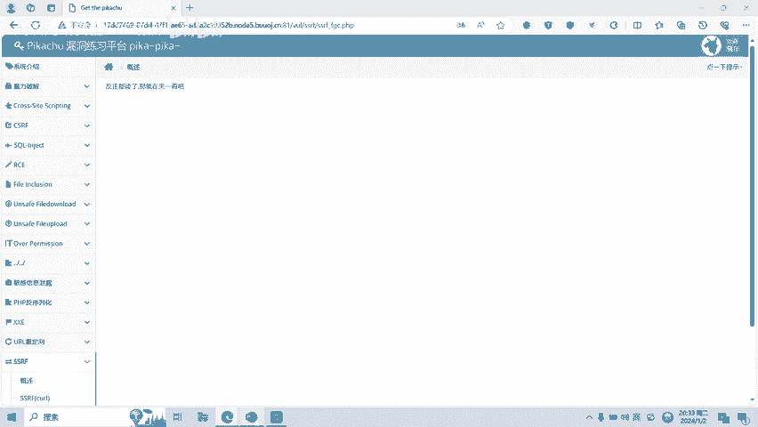

# CTF网络安全培训教程：Web篇：SSRF漏洞 - P1

在本节课中，我们将要学习CTF比赛中一种常见的Web安全漏洞——SSRF（服务器端请求伪造）。我们将了解其基本概念、形成原因、常见场景以及如何通过实操进行验证。

## 概述：什么是SSRF漏洞？

SSRF，全称Server-Side Request Forgery，即服务器端请求伪造。这是一种由攻击者构造恶意请求，并由**服务器端发起**的安全漏洞。

由于请求由服务器发起，攻击者可以利用此漏洞，让服务器作为“跳板”，去访问其自身能够访问但外网无法直接访问的内部系统。

## SSRF漏洞的形成原因

上一节我们介绍了SSRF的基本概念，本节中我们来看看它为何会产生。

SSRF漏洞的形成，大多是因为服务端提供了从其他服务器获取数据的功能，但**没有对用户传入的目标地址进行充分的过滤与限制**。

例如，以下功能都可能引入风险：
*   从指定URL地址获取网页文本内容。
*   加载或下载指定URL的图片、文档。

## 常见的SSRF漏洞场景

了解了成因后，我们可以列举几种在Web应用中，容易引发SSRF漏洞的常见功能。

以下是几种典型场景：

1.  **分享功能**：通过URL地址分享网页内容。为了提供更好的预览体验，应用会获取目标URL网页的`<title>`标签或`<meta>`标签中的文本内容进行显示。若未对目标地址做限制，则存在SSRF漏洞。
2.  **转码服务**：通过URL地址将原网页内容转换为适合手机屏幕浏览的样式。例如百度、搜狗等公司提供的在线转码服务。
3.  **在线翻译**：通过URL地址翻译对应网页的文本内容，例如百度翻译、有道翻译。
4.  **图片加载与下载**：通过指定URL地址加载或下载图片。此功能应用广泛，有时比较隐蔽，例如加载公司内网图片服务器上的图片。
5.  **文章收藏功能**：类似分享功能，从URL中读取原文标题等信息。
6.  **未公开的API**：一些网站通过API获取远程地址的XML文件来加载内容，例如某些网站的评分功能。

## 如何寻找SSRF漏洞

在实战中，我们可以通过观察URL中的参数关键字来初步判断是否存在SSRF漏洞。

以下是一些常见的关键字：
*   `share`
*   `url`
*   `link`
*   `src`
*   `source`
*   `target`
*   `display`
*   `sourceURL`
*   `imageURL`
*   `domain`

利用搜索引擎（如Google）的语法，结合这些关键字进行搜索，有时可以发现存在SSRF漏洞的站点。

## SSRF漏洞实操演示

理论需要结合实践。接下来，我们将通过两个简单的题目进行SSRF漏洞的实操演示。

### 演示一：基础URL参数漏洞

我们访问第一个演示页面，发现一个参数`url`，其内容指向本机的`/info.php`页面。

```
http://target.com/vuln_page.php?url=http://127.0.0.1/info.php
```

首先，我们测试其是否可以访问外网，例如百度：

```
http://target.com/vuln_page.php?url=http://www.baidu.com
```

页面成功显示了百度的内容，证明该功能可以对外发起请求。

接着，我们尝试利用`file://`协议读取服务器本地文件：

```
http://target.com/vuln_page.php?url=file:///etc/passwd
```

成功读取了`/etc/passwd`文件内容。我们再尝试读取可能存在的flag文件：

```
http://target.com/vuln_page.php?url=file:///flag
```

成功获取到了flag。这证实了此处存在一个SSRF漏洞。

### 演示二：`file_get_contents`函数漏洞

我们点击进入第二个演示。此处同样存在一个参数用于接收URL。

我们直接测试`file://`协议：

```
http://target.com/vuln_page2.php?path=file:///etc/passwd
```

成功访问了系统文件。再次尝试读取flag：

```
http://target.com/vuln_page2.php?path=file:///flag
```

flag也被成功获取。这个例子展示了由于服务端使用了类似`file_get_contents()`函数且未加过滤所导致的SSRF漏洞。



## 总结

本节课中我们一起学习了SSRF漏洞。我们首先明确了SSRF是“服务器端请求伪造”漏洞，攻击者可以利用它让服务器访问内部网络。然后，我们分析了漏洞的形成原因主要是服务端未对用户输入的URL进行过滤。接着，我们列举了分享、转码、图片加载等多种常见的漏洞场景，并介绍了通过URL关键字寻找漏洞的方法。最后，通过两个实操演示，我们验证了如何利用SSRF漏洞读取服务器本地文件。


请记住，本课程内容仅用于CTF网络安全教学与培训，旨在提升防御能力，请大家遵守相关法律法规。