# CTF网络安全培训教程：Web篇：目录遍历漏洞


在本节课中，我们将要学习CTF比赛中一种常见的Web安全漏洞——目录遍历漏洞。我们将了解其基本概念、产生原理、与相似漏洞的区别，并通过实操演示来加深理解。

---

## 概述：什么是目录遍历漏洞？

在Web功能设计中，开发者经常将需要访问的文件名定义为变量，从而使前端功能变得更加灵活。当用户发起前端请求时，会将请求的文件名作为参数值传递到后台，后台再执行对应的文件操作。

在这个过程中，如果后台没有对前端传入的值进行严格的安全校验，攻击者就可能通过 `../` 这样的目录穿越手段，让后台打开或执行服务器上其他目录的文件。这导致服务器上非预期的文件被遍历访问，从而形成目录遍历漏洞。

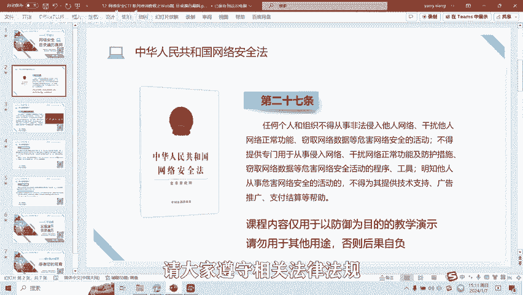

---

## 核心概念与区分

你可能会觉得目录遍历漏洞与不安全的文件下载甚至文件包含漏洞有些相似。确实，它们形成的主要原因是一样的：**在功能设计中将待操作的文件以变量形式传递给后台，且未进行严格的安全过滤**。

它们之间的区别主要在于漏洞出现的位置和展现的现象不同。因此，我们将其单独定义和讲解。

需要特别区分的是：如果你通过一个不带参数的URL（例如 `http://xxx/doc/`）直接列出了 `doc` 文件夹内的所有文件，这种情况我们称为**敏感信息泄露漏洞**，而不归类为目录遍历漏洞。

---

## 漏洞原理详解

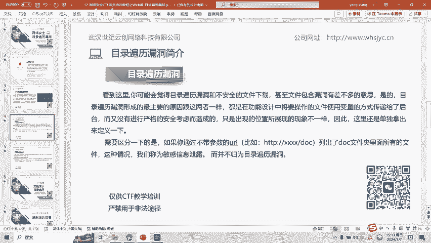

许多Web应用程序具有读取、查看或下载服务器文件的功能。为了提升程序性能，通常通过参数来指定文件名。

例如，一个请求可能如下所示：
```
http://example.com/view?file=image1.jpg
```
当服务器接收到参数 `file` 的值为 `image1.jpg` 后，程序会拼接路径、加载并读取该文件内容，最后返回给浏览器。

如果程序没有对用户输入进行限制，且服务器自身也未设置目录访问权限，攻击者就可以利用目录遍历来访问其他文件。

例如，通过构造如下请求：
```
http://example.com/view?file=../../etc/passwd
```
攻击者就能尝试读取系统敏感的 `/etc/passwd` 文件。

---

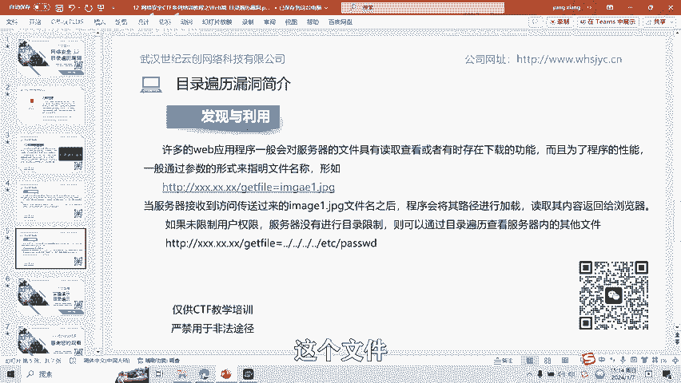

## 实操演示

接下来，我们通过两道题目进行实际操作演示。

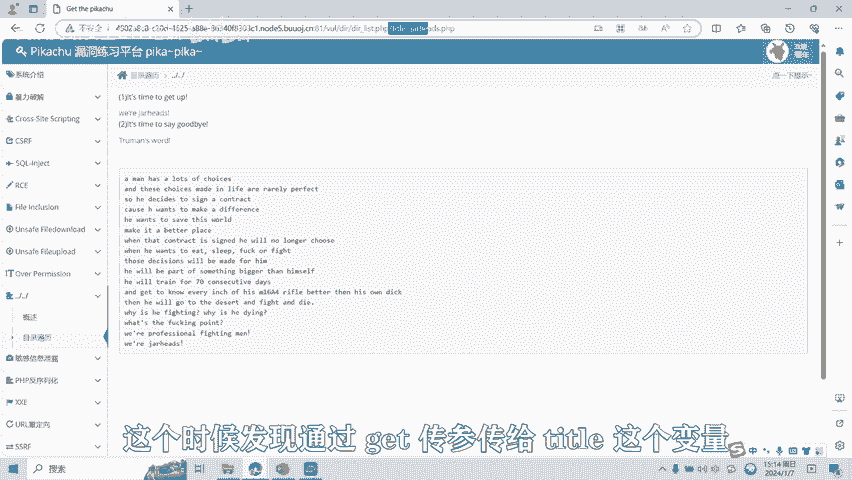

### 演示一

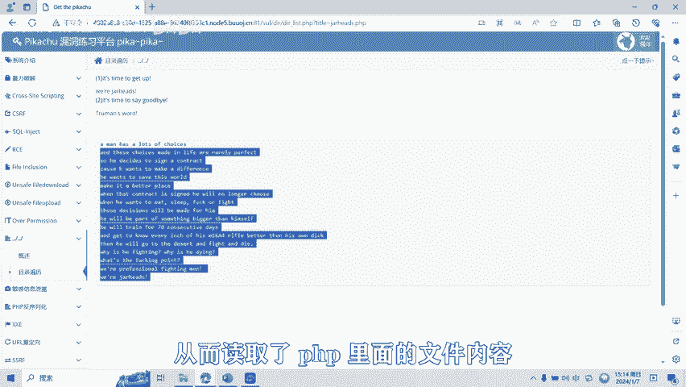

我们访问第一个题目链接。页面通过GET参数 `title` 传递了一个 `.php` 文件名，并读取了该文件的内容。

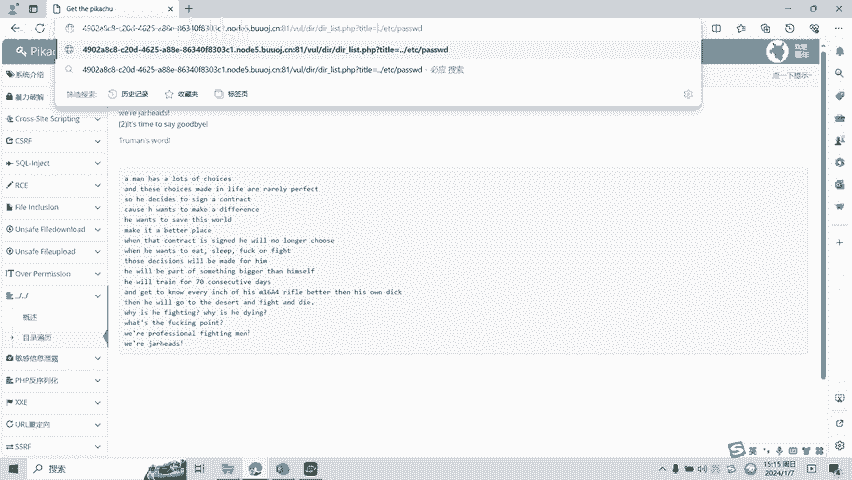

**以下是尝试步骤：**
1.  观察正常请求：`?title=example.php`
2.  尝试使用目录穿越：`?title=../../../../etc/passwd`
3.  通过四次 `../` 回退，成功读取到了系统的 `/etc/passwd` 文件内容。
4.  继续尝试读取flag文件：`?title=../../../../flag`
5.  成功获取到flag值。

### 演示二

我们访问第二道题目。同样是通过GET参数 `title` 来读取指定文件。

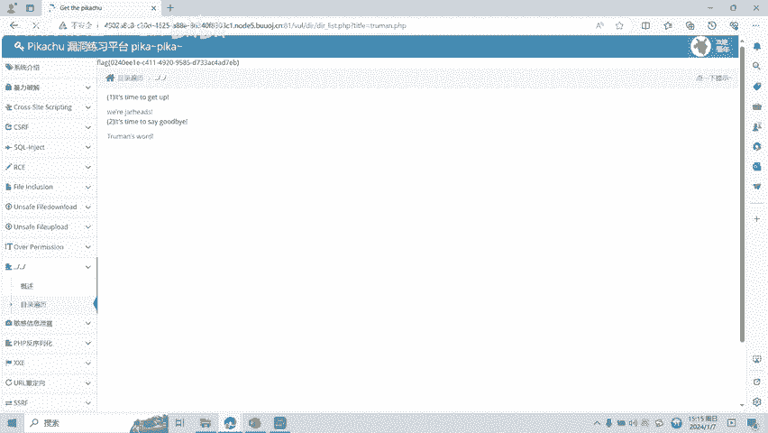

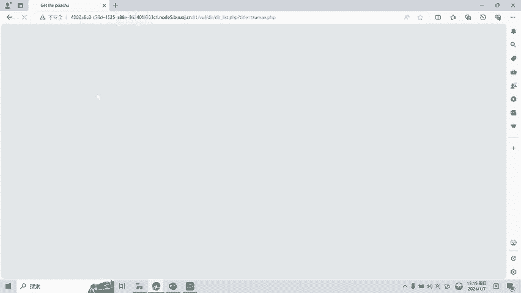

**以下是尝试步骤：**
1.  观察正常请求。
2.  尝试同样的目录穿越手法读取 `/etc/passwd` 文件，成功。
3.  尝试读取flag文件，成功获取flag值。

---

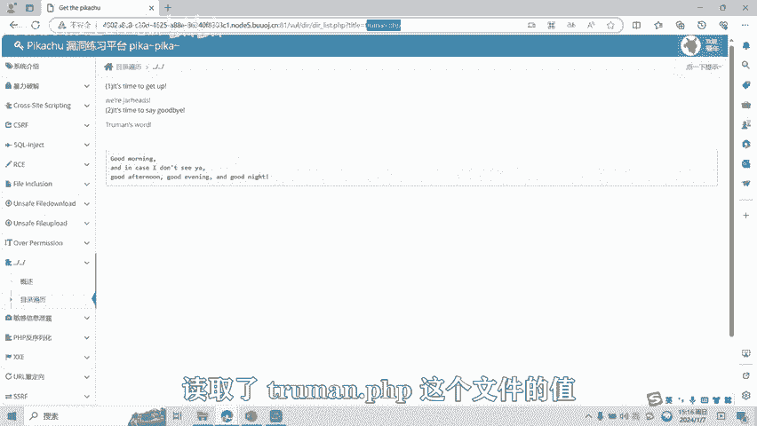

## 总结与后续

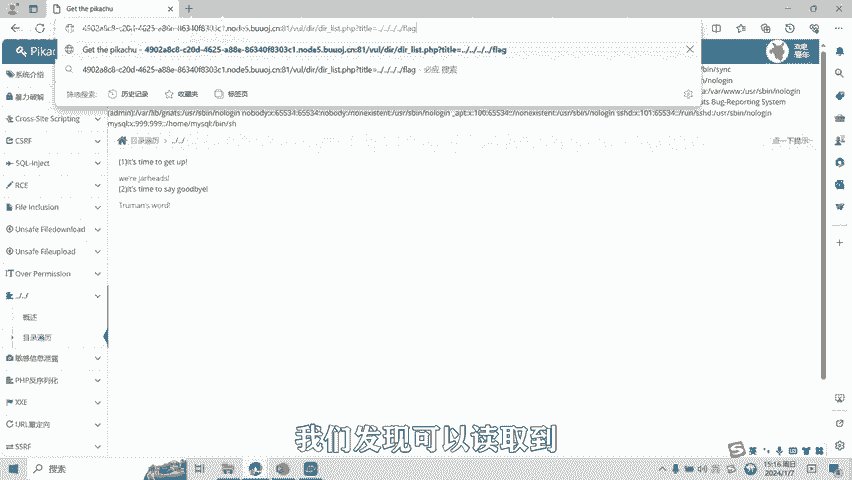

本节课中，我们一起学习了目录遍历漏洞的核心概念、产生原理及基本的利用方法。我们了解到，该漏洞的根源在于程序未对用户控制的文件路径参数进行充分的过滤和校验。

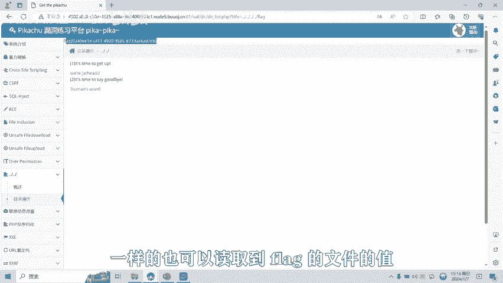

目录遍历漏洞还有很多种过滤绕过和高级利用方式。在后续的课程中，我们将针对各种复杂场景下的目录遍历漏洞制作相应的教学视频。

---

**提示**：本课程内容仅用于CTF网络安全教学与培训，请严格遵守《网络安全法》及相关法律法规，勿将所学技术用于非法用途。