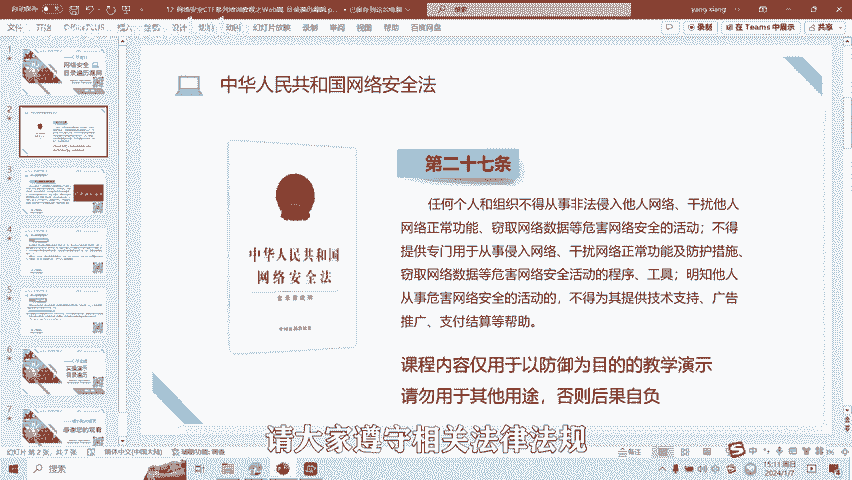
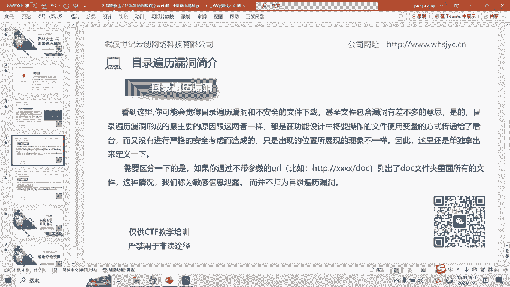
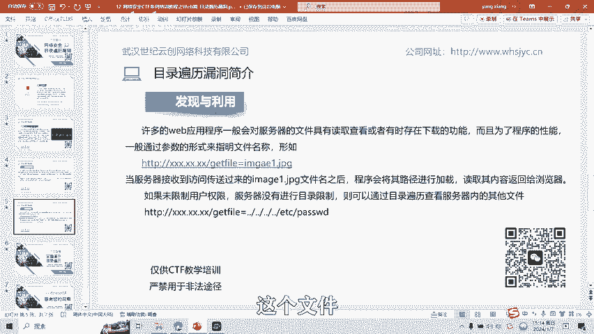
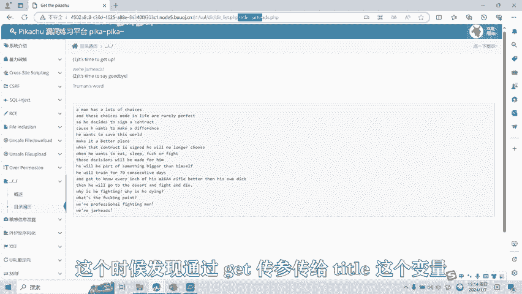
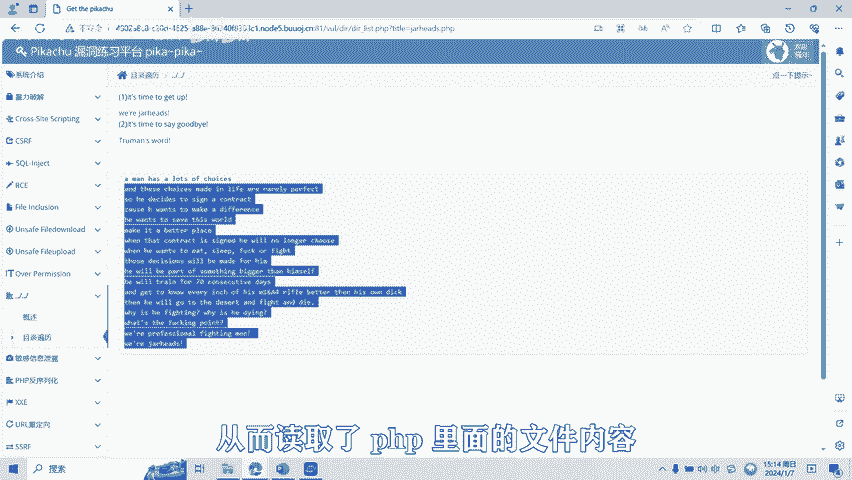
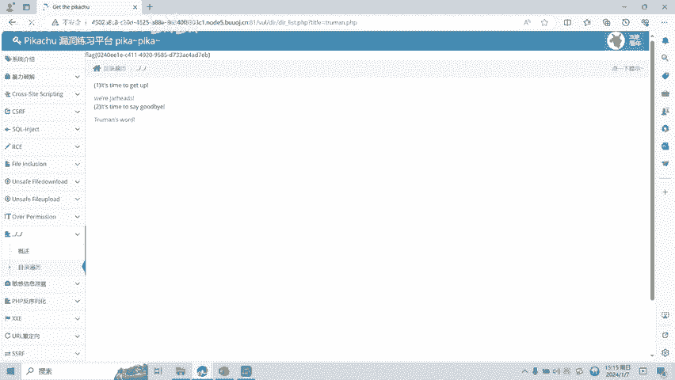
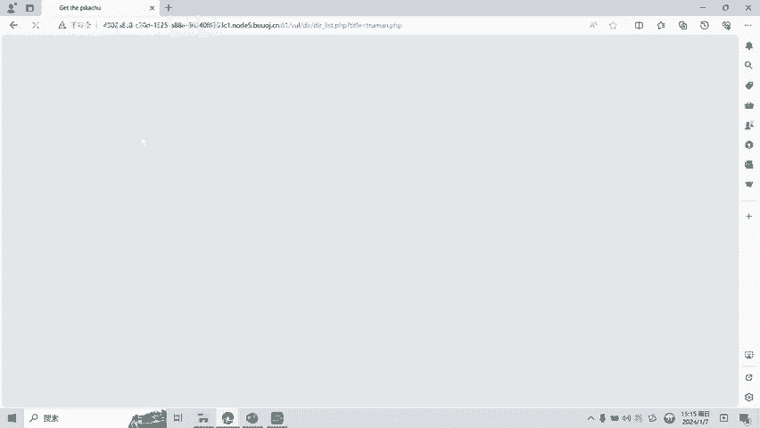
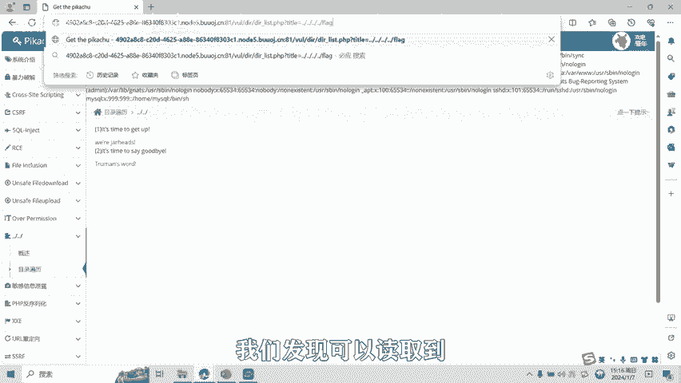
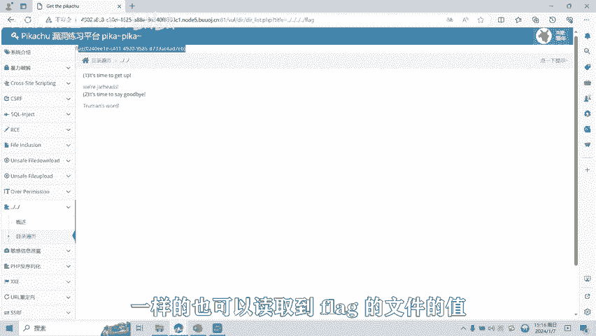

# 12-网络安全CTF系列培训教程之Web篇-目录遍历漏洞 - P1 - 武汉网络安全CTF培训 - BV1HV411X7sY

扫码优先获取更多资料。

大家好，我是武汉世纪云创公司的CTF培训老师。大家可以叫我阿阳。我们制作此视频的目的是希望帮助一些想要学习CTF的同学快速入门，提高CTF竞技水平。本视频为CTF网络安全系列培训教程。

后期将会持续不断的更新。大家如果有兴趣进一步深入学习CTF可访问PPT上面的公司网址进行电话联系，或者扫描视频中的二维码进行报名咨询。我们的教师团队均来自CTF省赛世赛前10名选手。

通过顶尖战队的手把手指导，大家学完之后即可达到省赛世赛的夺奖水平。首先大家一定要遵守网络安全法。本课程内容仅用于CTF网络安全教学培训，请大家遵守相关法律法规，勿用于其他用途。

今天这节课主要是讲CTF比赛中的目录便利漏洞。在外部功能设计中，很多时候我们会将需要访问的文件定义成变量，从而让前端的功能呢变得更加灵活。当用户发起一个前端的请求时，便会将请求的这个文件的值。

比如文件名称传递到后台。后台在执行其对应的文件。在这个过程中，如果后台没有对前端传进来的值进行严格的安全考虑，则攻击者可能会通过点点杠这样的手段让后台打开或者执行一些其他的文件。

从而导致后台服务器上其他目录的文件，结果呢被便利出来，形成了目录便利漏洞。看到这里，你可能会觉得目录便利漏洞和不安全的文件下载，甚至文件包含漏洞有差不多的意思。其实，目录便利漏洞形成的最主要原因呢。

跟这两者一样，都是在功能设计中呢将要操作的文件使用变量的方式传递给了后台。而又没有进行严格的安全考虑造成的，只是呢出现的位置所展现的现象不一样。因此呢这里呢还是单独拿出来定一下。需要区分一下的是。

如果你通过不带参数的URL，比如HTTP杠DOC列出了DOC文件夹里面的所有的文件。这种情况呢，我们称为敏感信息漏洞。

而并不归为目录便利漏洞。许多的外部应用程序呢一般会对服务器的文件具有读取查看，或者呢有时存在下载的功能。而且为了程序的性能，一般通过参数的形式来指明文件的名称。例如HTPge far等于im1点GVG。

当服务器呢接收到访问传送过来的imag点击P7文件名之后呢，程序呢会将其路径进行加载，读取其内容返回给浏览器。如果呢为限制用户的权限，服务器呢也没有进行目录限制。

则可以通过目录便利查看服务器内的其他文件。比如HTPge five等于0点杠EDC杠password呢，就通过目录穿越的方式呢来读取ETCpasword这个文件。

接下来给大家进行目录便利漏洞的实操演示。我们点击第一个链接。这个时候发现通过get传参传了title这个变量1个PP文件值，从而呢读取了PI里面的文件内容。

我们看一下能不能通过点点杠的方式来进行目录穿越。读取系统中的pass word。文件。

通过4次的目录穿越，从而呢读取到了ETC passwordssword文件值。那么我们读取一下里面的flag文件。这个时候，flag的文件的值呢也获取到了。我们再看第二道题目。

第二题目是get传参title这个变量呢读取了圈码PAP这个文件的值。

那么同样的。我们看能不能读取EDC趴座了，一样的也可以读取到。我们再读取flag文件。

也可以读取到flag的文件的值。

目录便利漏洞呢还有很多种绕过和利用的方式。后面呢将会针对各种类型的目录便利漏洞制作相应的教学视频。大家也可以扫描视频中的二维码，领取资料或者报班学习。好了，今天的课程到此结束，感谢大家的观看。

🎼Yeah。