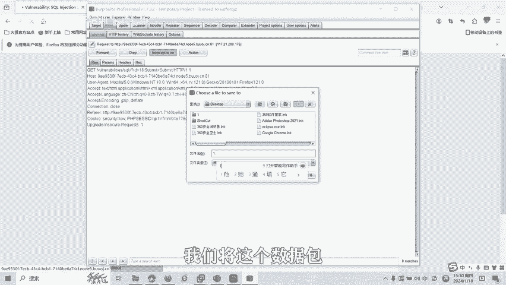
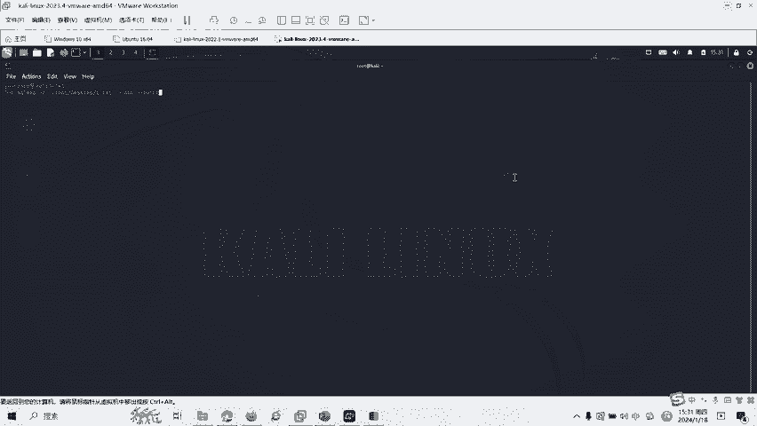

# CTF网络安全培训教程：Web篇：SQL注入漏洞 - P1

在本节课中，我们将要学习CTF比赛中一个非常关键的Web安全漏洞：SQL注入。我们将了解其基本概念、形成原因、危害以及如何初步发现和利用它。

## 概述：什么是SQL注入漏洞？

SQL注入是一种将SQL代码插入或添加到应用程序用户输入参数中的攻击方式。之后，这些参数会被传递给后台的SQL服务器进行解析并执行。

如果外部应用程序未对动态构造的SQL语句所使用的参数进行正确性检查，攻击者就有可能修改后台SQL语句的构造。如果攻击者能够修改SQL语句，就可以对数据库中的数据进行篡改、删除或窃取。

以下是SQL注入攻击的流程图：

1.  攻击者首先修改参数值等数据。
2.  未经检查和过滤，被修改的数据被注入到SQL命令中。
3.  SQL命令的功能被修改。
4.  数据库引擎执行被修改后的SQL命令，并将结果反馈给服务器。
5.  服务器最后将注入的结果返回给客户端。

## SQL注入漏洞的形成条件

SQL注入漏洞的形成一般具有以下两个条件：

1.  程序编写者在处理程序和数据库交互时，使用字符串拼接的方法构造SQL语句。
2.  未对用户可控参数进行足够的过滤，便将参数内容拼接进入SQL语句中。

## SQL注入的分类

SQL注入可以根据不同的维度进行分类：

*   **按照注入点的类型**，可分为**数字型**和**字符型**。
*   **根据注入点的位置**，可分为GET注入、POST注入、Cookie注入、搜索型注入、HTTP头注入等。
*   **根据页面回显**，可分为报错注入、布尔盲注、时间盲注等。

## 如何发现与利用SQL注入漏洞

上一节我们介绍了SQL注入的分类，本节中我们来看看如何初步发现它。以下是发现SQL注入漏洞最经典的方法：

**单引号判断法**：在参数后面加上单引号。例如，对于URL `abc.php?id=1`，我们尝试访问 `abc.php?id=1'`。

如果其SQL语句原型可能为 `SELECT * FROM 表名 WHERE id=1`，添加单引号后，语句变为 `SELECT * FROM 表名 WHERE id=1'`。如果页面返回数据库错误，则很可能存在SQL注入。原因在于，无论是字符型还是整型参数，都会因为单引号个数不匹配而导致语法错误。

如果未报错，并不代表不存在SQL注入，因为页面可能对单引号做了过滤。这时可以使用更复杂的判断语句进行测试。由于这是入门基础课程，我们不做更深入的讲解。

## SQL注入的危害

了解漏洞的发现方法后，我们来看看SQL注入可能造成的严重后果：

1.  **信息泄露**：攻击者利用SQL注入漏洞可以获取数据库中的各种信息，例如后台的管理员账号和密码，从而窃取数据库的全部内容。
2.  **数据篡改**：在特定情况下，攻击者可以对数据库内容进行插入、修改或删除操作。
3.  **权限提升**：如果数据库权限分配存在问题或数据库本身存在缺陷，攻击者可能通过SQL注入漏洞直接获取Web服务器或操作系统的控制权限。

## SQL注入漏洞实操演示

最后，我们通过一道简单的SQL注入题来进行实操演示。假设我们有一个页面，输入 `id=1` 可以查询对应记录的名字，URL为 `http://target.com/page.php?id=1`。

从URL可以看出，这是通过GET方式传递参数 `id=1`。

1.  **抓取数据包**：我们使用Burp Suite (BP) 来抓取这个请求的数据包。
2.  **使用工具注入**：将抓取到的数据包保存为文件，然后使用Kali Linux自带的 `sqlmap` 工具进行自动化注入测试。



以下是使用 `sqlmap` 的基本命令流程：

```bash
# 1. 探测当前数据库名称
sqlmap -r request.txt --dbs



# 执行后，工具可能会发现两个数据库：dvwa 和 information_schema。

# 2. 获取指定数据库（如dvwa）中的所有表名
sqlmap -r request.txt -D dvwa --tables

# 执行后，可能会发现 guestbook 和 users 两个表。

# 3. 获取指定表（如users）中的所有列名
sqlmap -r request.txt -D dvwa -T users --columns

# 执行后，会列出 user_id, first_name, last_name, user, password 等列名。

# 4. 导出指定列（如user和password）中的数据
sqlmap -r request.txt -D dvwa -T users -C user,password --dump
```

通过以上步骤，我们就可以利用 `sqlmap` 这个工具自动获取数据库的结构信息及其存储的敏感数据（如用户名和密码）。

## 总结

本节课中我们一起学习了SQL注入漏洞的基础知识。我们了解了SQL注入的定义、攻击流程、形成条件以及主要分类。我们还学习了如何使用单引号法进行初步判断，认识了SQL注入可能带来的严重危害，并通过 `sqlmap` 工具进行了简单的自动化注入演示。


SQL注入漏洞还有很多种绕过防护和深入利用的方式，包括联合查询注入、报错注入、布尔盲注、时间盲注等。在后续的课程中，我们将会针对各种类型的SQL注入漏洞，制作相应的教学视频。