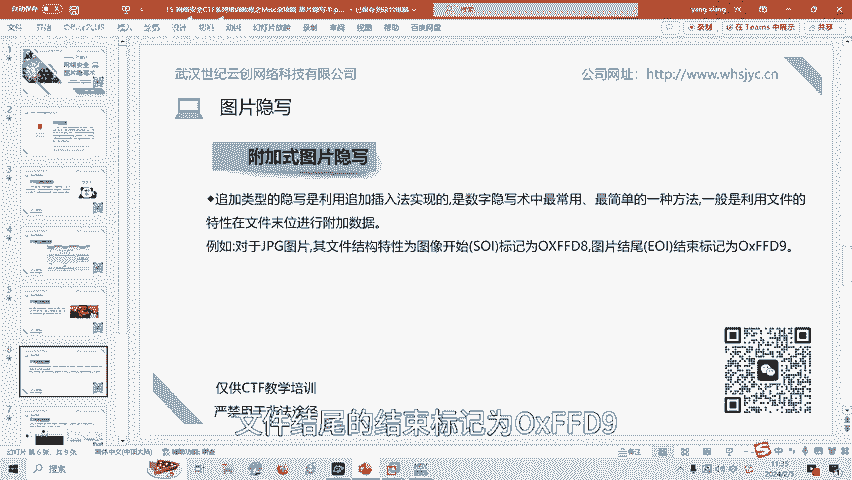
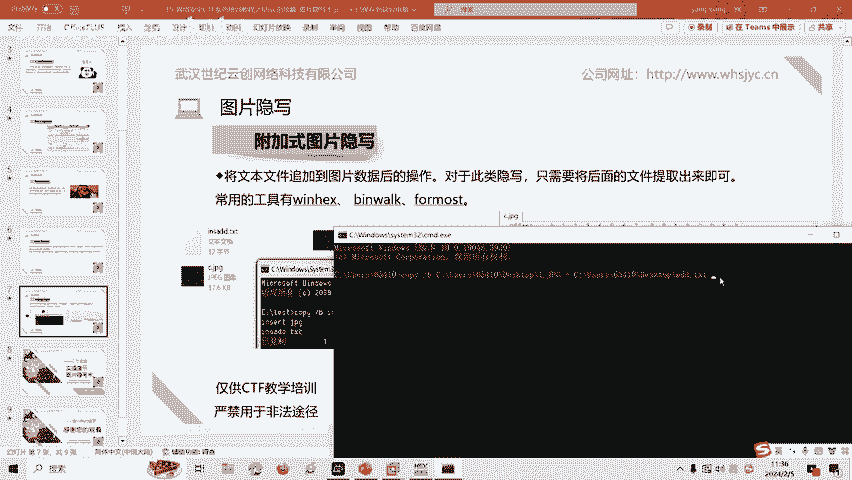
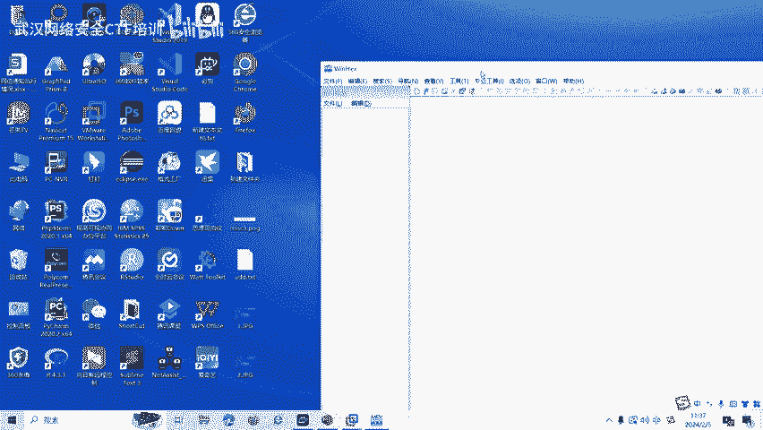
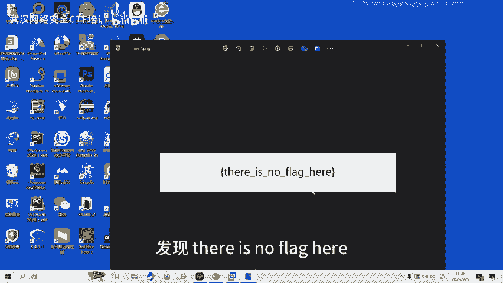
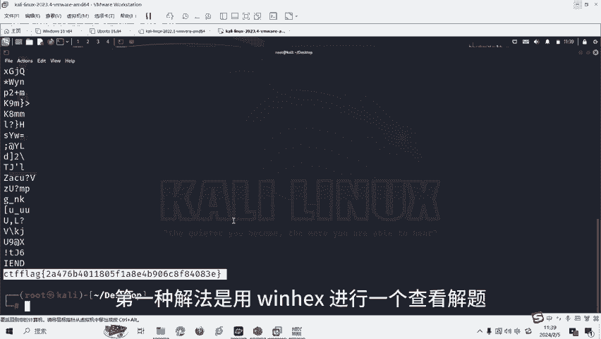

# CTF培训教程：15：图片隐写术入门

在本节课中，我们将要学习CTF比赛中Misc杂项类题目的一种常见类型——图片隐写术。我们将从基础概念讲起，介绍图片文件结构，并重点讲解最基础的附加式图片隐写及其解题方法。

## 概述：什么是图片隐写术？

CTF图片隐写是一种信息隐藏技术，它通过在图片中嵌入秘密信息来实现，以便在不被发现的情况下传输信息。这种秘密信息可以是文字、音频或者其他数据形式，其重点在于信息的隐藏。

## 图片文件基础知识

在学习图片隐写术之前，我们需要先了解图片文件的基础知识。以下这张表记录了各种常见图片格式的文件头和文件尾的16进制标识。这在CTF比赛中经常遇到，需要大家熟练掌握。

以下是常见图片格式的标识：

*   **JPG图片**：文件头是 `FF D8`，文件尾是 `FF D9`。
*   **GIF图片**：文件头是 `47 49 46 38`。
*   **PNG图片**：文件头是 `89 50 4E 47`，文件尾是 `AE 42 60 82`。

## CTF中图片隐写的常见类型

CTF比赛中的图片隐写一般有多种形式，包括附加式图片隐写、基于文件结构的图片隐写、基于LSB原理的图片隐写、基于DCT域的JPG图片隐写和数字水印隐写等。

上一节我们介绍了图片隐写的多种形式，本节中我们来看看CTF比赛中最常见的一种——附加式图片隐写。

## 附加式图片隐写详解

追加类型的图片隐写是利用追加插入法实现的，是数字隐写术中最常用、最简单的一种方法。它一般利用文件的特性，在文件末尾进行附加数据。

例如，对于JPG图片，其文件结构特性为：图像开始标记为 `0xFFD8`，文件结尾的结束标记为 `0xFFD9`。




我们可以利用DOS命令，将要隐藏的文件添加到图片的数据后面。以下是操作步骤：


1.  准备一个JPG图片（例如 `1.jpg`）和一个包含秘密信息的文本文件（例如 `附加式图片.txt`）。
2.  在命令行中使用 `copy` 命令的 `/B`（二进制）参数进行合并。

操作命令如下：
```cmd
copy /B 1.jpg + 附加式图片.txt 2.jpg
```
3.  执行命令后，会生成一个新的图片文件 `2.jpg`。从肉眼上看，`2.jpg` 和 `1.jpg` 没有区别。




但是，数据已经被添加到了 `2.jpg` 中。我们可以用WinHex等工具查看其十六进制内容。





可以看到，`FF D8` 为JPG文件头，`FF D9` 为文件尾。文件尾后面的数据就是我们添加的文本“附加式图片”。

对于这种类型的CTF题目，我们经常使用 `strings` 命令或者工具 `WinHex`、`Binwalk`、`Foremost` 等进行解题。

## 实战解题演示

最后，我们通过一个实操题目来巩固所学知识。假设我们拿到一张图片，打开后显示“there is no flag here”，看不到flag。




我们首先用WinHex查看其十六进制结构。


这是一张PNG图片，文件头是 `89504147`，文件尾是 `A1426082`。在文件尾的后面，我们可以看到附加的数据“CTF{flag}”。因此，这道题目的答案就是文件尾后面的这个字符串。

同样，我们也可以使用第二种方法，用 `strings` 命令查看文件中所有可打印的字符串，来发现添加到文件末尾的flag。

操作命令如下：
```bash
strings 图片文件名 | tail
```
我们使用 `strings` 命令查看该文件，就能在输出结果的尾部发现flag。这就是第二种解法。




## 总结

本节课中我们一起学习了CTF中图片隐写术的基础知识。我们首先了解了图片隐写的概念和常见图片的文件结构标识。然后，我们重点讲解了最基础的附加式图片隐写原理，并通过DOS命令演示了如何实现。最后，我们通过一个实战题目，运用WinHex和strings命令两种方法，成功解出了隐藏在图片末尾的flag。

图片隐写还有很多其他类型和解题方式，包括基于文件结构的图片隐写、基于LSB原理的图片隐写、基于DCT域的JPG图片隐写和数字水印隐写等。在后续的课程中，我们将针对这些类型制作相应的教学视频。