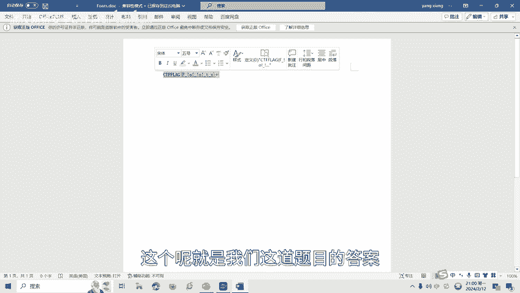

# CTF网络安全培训：16：Misc杂项篇之Word隐写术 - P1

## 概述
在本节课中，我们将要学习CTF比赛中Misc杂项类别的一个重要分支——Word隐写术。我们将了解其基本概念、常见方法，并通过一个简单的实操案例来掌握如何发现Word文档中隐藏的信息。

## 什么是Word隐写术？
Word隐写术是一种利用Word文档进行信息隐藏的技术。它可以通过修改文本格式、插入隐藏文本或者使用不可见的字符等方式来隐藏信息。这种技术通常用于隐蔽传递敏感信息或进行秘密通信。

## 常见文件标志
在学习Word隐写术之前，我们先介绍一个基础知识：常见的文件头标志。这在CTF比赛中经常遇到，需要大家熟练掌握。

以下是一些常见文件的十六进制文件头标识：

*   **DOCX/XLSX/ZIP**：`504B0304`
*   **PNG**：`89504E47`
*   **JPEG**：`FFD8FF`
*   **PDF**：`25504446`

> **核心概念**：从文件头标识可知，DOCX和XLSX文档本质上都是ZIP压缩格式。这为一些隐写方法提供了基础。

## Word隐写的常见方法
上一节我们介绍了Word隐写术的概念，本节中我们来看看几种常见的Word隐写方法。

以下是CTF比赛中Word隐写的一般方法：

1.  **隐藏文本**
    在Word文档中，可以使用隐藏文本功能将信息隐藏起来。这些文本在正常情况下不可见，但可以通过特定的操作显示出来。

2.  **格式化文本隐藏**
    通过在文本中使用特定的格式化来隐藏信息，例如将文字的颜色设置为与背景相同，或者将文字的大小设置为极小。

3.  **使用隐写工具**
    有一些专门的隐写工具可以将信息嵌入到Word文档中。这些工具通过修改文档的结构或利用文档的隐藏通道来隐藏信息。

## Word隐写实操
了解了基本方法后，我们通过一个简单的案例来进行实操演练。我们将学习如何发现一个“空白”Word文档中隐藏的Flag。

我们打开一个看似为空的Word文档。

文档内容显示为空。接下来，我们检查其中是否有隐藏的文字。

操作步骤如下：
1.  点击左上角的 **“文件”** 菜单。
2.  选择底部的 **“选项”**。
3.  在弹出的窗口中，点击左侧的 **“显示”** 选项卡。
4.  在“始终在屏幕上显示这些格式标记”区域，勾选 **“显示所有格式标记”**。
5.  点击 **“确定”**。

完成上述操作后，我们就能看到文档中原本隐藏的文本：`CTF flag{...}`。这个就是我们这道题目的答案。

## 总结
本节课中，我们一起学习了CTF中Word隐写术的基础知识。我们首先了解了什么是Word隐写术，然后认识了常见的文件头标识，特别是DOCX文件与ZIP格式的关系。接着，我们介绍了三种常见的Word隐写方法：隐藏文本、格式化隐藏和使用专用工具。最后，我们通过一个实操案例，掌握了如何通过显示所有格式标记来发现Word文档中的隐藏文本。

Word隐写术还有很多种类型和解题方式。后续课程将会针对各种类型的Word隐写术制作相应的教学视频。

