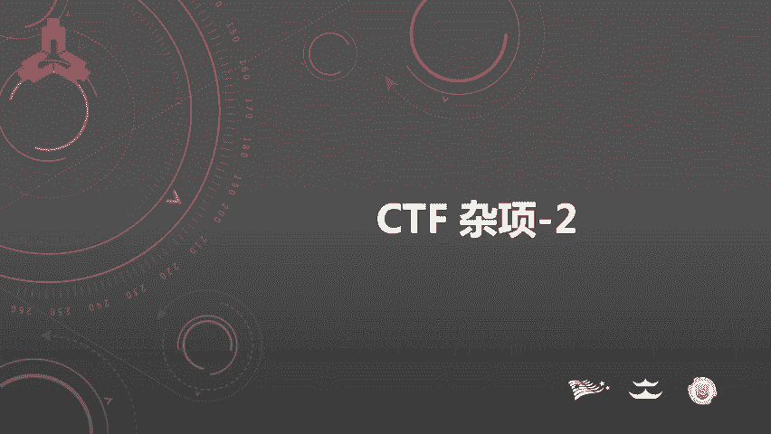
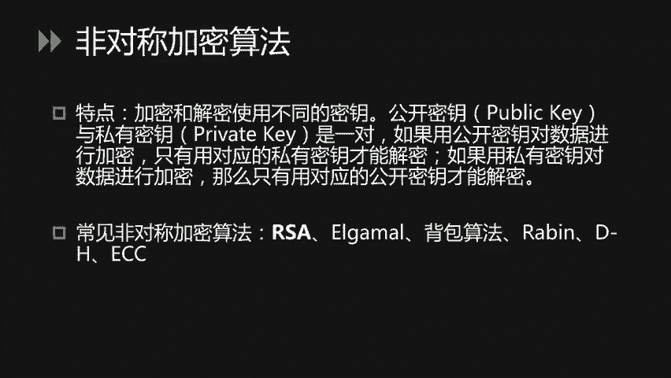
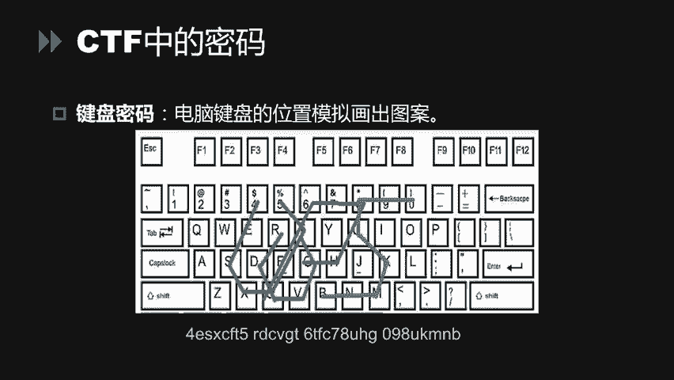
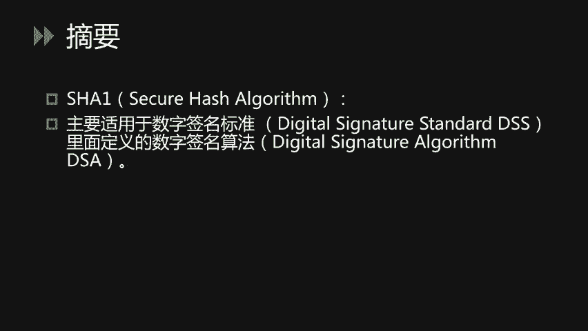
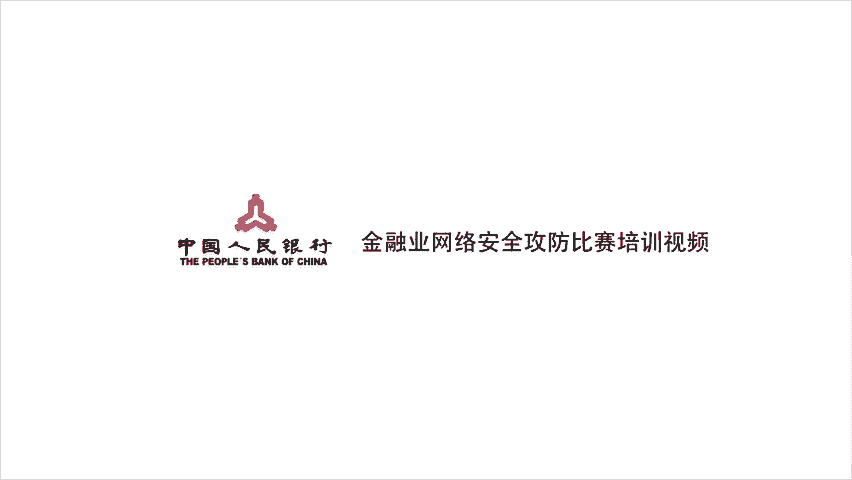

# CTF杂项：2：密码学与编码基础入门



在本节课中，我们将学习CTF比赛中密码学与编码部分的基础知识。课程将涵盖密码、编码和摘要算法的核心概念、常见类型及其在CTF中的典型应用。

## 概述：密码、编码与摘要的区别

首先，我们需要明确密码、编码和摘要三者的区别。

*   **密码**：其核心目的是保证信息传输的安全性。明文通过**加密算法**和**密钥**处理得到密文，密文必须通过对应的**解密算法**和**密钥**才能恢复为原始明文。公式可表示为：`密文 = 加密算法(明文, 密钥)`，`明文 = 解密算法(密文, 密钥)`。
*   **编码**：其核心目的是将数据转换为某种标准格式，以便于在不同系统间传输或存储。编码过程是公开的，任何人都可以通过对应的解码方法恢复原始信息，无需密钥。例如，Base64编码。
*   **摘要**：也称为哈希，其核心目的是验证信息的完整性。原始数据通过**哈希函数**计算得到一个固定长度的哈希值。这个过程是单向的，无法从哈希值反推出原始数据。公式可表示为：`哈希值 = 哈希函数(数据)`。

简单来说，加密可逆（需密钥），编码可逆（无需密钥），摘要不可逆。

---

## 古典密码学 🏛️

上一节我们介绍了基本概念，本节中我们来看看CTF中常见的古典密码学。古典密码主要分为**置换密码**和**替换密码**两类。

### 凯撒密码

凯撒密码是一种典型的替换密码，本质是位移密码。它将字母表顺序移动固定的位数（即密钥K）来进行加密。

**加密过程**：
1.  将26个字母顺序排列。
2.  将每个字母向后移动K位（例如K=3时，A->D, B->E, ..., Z->C）。
3.  对明文中的每个字母执行此替换。

**示例**：
明文 `hello`，密钥K=1，则密文为 `ifmmp`（h->i, e->f, l->m, l->m, o->p）。

**解密方法**：
由于字母只有26个，可以尝试所有可能的K值（0-25），即暴力破解，观察哪个结果是有意义的英文单词。可以使用Python脚本或在线工具。

```python
# 凯撒密码暴力破解示例
ciphertext = "ifmmp"
for k in range(26):
    plaintext = ''.join([chr((ord(c) - ord('a') - k) % 26 + ord('a')) if c.islower() else c for c in ciphertext])
    print(f"K={k}: {plaintext}")
```

### ROT13

ROT13是凯撒密码在K=13时的特例。因其加密和解密过程完全相同（位移26次中的13次），故 `加密(加密(明文)) = 明文`。

### 栅栏密码

栅栏密码是一种置换密码，将明文按一定栏数（分组数）重新排列后读取。

**加密过程（以栏数=2为例）**：
明文：`hello world`
1.  分成两栏：`h l o w r d` 和 `e l o l`
2.  将两栏交错组合：先取第一栏第一个字符`h`，再取第二栏第一个字符`e`，接着第一栏第二个`l`，第二栏第二个`l`...
3.  得到密文：`h e l l o o w o r l d`（实际书写时通常去掉空格：`helloworld`）。

**解密方法**：
知道栏数后，可以逆向操作恢复明文，或使用解密工具。

### 弗吉尼亚密码

弗吉尼亚密码使用一个表格（维吉尼亚表）和密钥进行加密，可以看作是多表替换的凯撒密码。

**加密过程**：
1.  准备一个26x26的字母表，第一行为A-Z，每一行是上一行向左位移一位的结果。
2.  将密钥重复至与明文等长（如明文`hello`，密钥`key`，则扩展为`keyke`）。
3.  在表中，用**明文字母**确定列，用**对应位置的密钥字母**确定行，交叉点的字母即为密文字母。

**示例**：
明文`H`，密钥`G`，在表中找到H列与G行的交点`N`，则`H`被加密为`N`。

**解密方法**：
需要密钥，或使用词频分析等攻击手段。CTF中通常直接提供密钥或使用在线工具解密。

---

## 现代密码学 🔐



古典密码在CTF中题目较少，现代密码学题目也不多，但了解其分类很重要。现代密码学主要分为对称加密和非对称加密。

### 对称加密

对称加密的特点是**加密和解密使用相同的密钥**。

*   **常见算法**：DES, 3DES, AES。
*   **特点**：加解密速度快，适合大量数据加密。
*   **CTF应用**：题目通常提供密文和加密算法，要求找到密钥或暴力破解密钥。一般使用准备好的脚本或工具进行解密。

### 非对称加密

非对称加密的特点是**加密和解密使用不同的密钥**，这两个密钥成对出现，称为公钥和私钥。

*   **核心原理**：
    *   用**公钥**加密的数据，只能用对应的**私钥**解密。
    *   用**私钥**加密（即签名）的数据，可以用对应的**公钥**验证。
*   **常见算法**：RSA, ElGamal。
*   **CTF应用**：相比对称加密更少见，通常需要理解算法原理进行数学推导或利用已知漏洞。



---

## CTF中的特殊密码与编码 🧩

除了标准密码，CTF中还流行一些基于图形或特殊规则的替换密码。

以下是几种常见类型：

*   **猪圈密码**：使用由点和线构成的基本图形来代表字母。解题关键在于识别并对照密码表进行转换。
*   **培根密码**：使用由A和B组成的5位序列来代表字母。通常将A视为0，B视为1，转换为二进制后对应字母序号（A=0, B=1, ...）。
*   **键盘密码**：利用键盘上字母的布局形状来编码。例如，用字母在键盘上连续按键的轨迹形状来表示另一个字母（如`4ESX`在键盘上连起来可能是一个`U`形）。

---

## 常见编码格式 📝

说完了密码，下面来说一下编码。编码在CTF中极为常见，主要用于数据传输和格式化。

以下是几种必须掌握的编码：

*   **ASCII码**：美国信息交换标准代码，用7位二进制数（0-127）表示字符。看到数字（特别是十进制或十六进制）时，可考虑转换为ASCII字符。
*   **Base64**：将二进制数据用64个可打印字符（A-Z, a-z, 0-9, +, /）表示。**特征**是末尾可能有`=`或`==`作为填充。编码过程是将3字节（24位）数据重组成4个6位单元，每个单元转换成一个Base64字符。
*   **URL编码**：在URL中，对非安全字符（如空格、中文、`?`、`&`等）进行编码，格式为`%`后跟两位十六进制数（如空格编码为`%20`）。
*   **HTML实体编码**：在HTML中表示特殊字符，如`<`编码为`&lt;`，`>`编码为`&gt;`。
*   **Unicode编码**：有多种形式，如`\u4e2d`（UTF-16十六进制）表示“中”字。
*   **摩斯电码**：用点（.）和划（-）的组合表示字母和数字，字符间用空格分隔，单词间用`/`分隔。看到长短、AB两种符号交替的序列时应考虑此编码。
*   **二维码**：即QR Code，一种二维矩阵条形码。使用扫码工具或在线解码网站即可读取其中信息。

---

## JavaScript混淆编码 🤯

这类编码常见于Web题目，用于隐藏JavaScript代码逻辑。

*   **JJEncode/AAEncode**：使用少量特殊字符（如`$`、`+`、`!`、`[`、`]`）来编码完整的JS代码。形如`[$]+[$]`等。
*   **JSFuck**：仅使用6个字符`[`、`]`、`(`、`)`、`!`、`+`来编写任何JS代码。
*   **解题方法**：通常直接将编码后的字符串复制到浏览器开发者工具的**Console（控制台）** 中执行，即可得到原始代码或执行结果。

---

## 摘要算法 🔑

最后，我们来看两种常见的摘要算法（哈希算法）。

### MD5

MD5是最常见的哈希算法，生成128位（通常表示为32位十六进制字符串）的哈希值。

**特性**：
1.  **压缩性**：任意长度输入，输出固定长度。
2.  **易计算性**：计算速度快。
3.  **抗修改性**：输入稍有变动，输出哈希值差异巨大。
4.  **弱抗碰撞性**：理论上难以找到两个不同的输入得到相同的哈希值（但已被破解，可构造碰撞）。

**CTF应用**：常用于密码哈希存储、文件完整性校验。题目可能要求破解简单的MD5哈希（通过彩虹表碰撞，如使用`cmd5.com`等网站），或利用哈希扩展等攻击。

### SHA家族

SHA-1、SHA-256等算法比MD5更安全，输出长度更长（如SHA-256输出256位），特性与MD5类似，在CTF中也有广泛应用。

---

## 总结 📚

本节课中我们一起学习了CTF中密码学与编码的基础知识。



1.  **区分了密码（可逆，需密钥）、编码（可逆，无需密钥）和摘要（不可逆）**。
2.  **学习了古典密码**，如凯撒密码（位移）、栅栏密码（置换）、弗吉尼亚密码（多表替换）及其识别与破解方法。
3.  **了解了现代密码**的对称加密（如AES）与非对称加密（如RSA）的基本概念。
4.  **认识了CTF中的特殊密码**，如猪圈密码、培根密码和键盘密码。
5.  **掌握了多种常见编码**，如Base64、URL编码、摩斯电码和二维码的解码思路。
6.  **知道了JavaScript混淆编码**（如JJEncode、JSFuck）的解决方法。
7.  **理解了摘要算法**（如MD5、SHA）的特性及其在CTF中的常见考查形式。



掌握这些基础是解决CTF密码和杂项题目的第一步，接下来需要通过大量练习来熟悉各种工具和灵活运用这些知识。