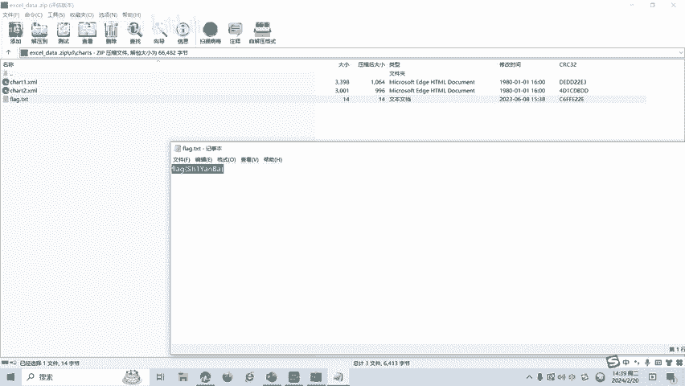

# CTF网络安全培训教程：Misc杂项篇：隐写术之Excel隐写 - P1

在本节课中，我们将要学习CTF比赛中Misc杂项类别的一个重要分支——隐写术，并重点介绍如何利用Excel文件进行信息隐藏与提取。

## 概述：什么是Excel隐写术？

Excel隐写是一种利用Excel文件的隐藏功能来隐藏信息的技术。通过在Excel文件中插入隐藏的文本或图像，可以将信息嵌入到文件中，而不引起怀疑。Excel隐写可以用于隐藏敏感信息或进行秘密通信。

## 基础知识：常见文件标志

在学习Excel隐写术之前，我们先介绍一个重要的基础知识——常见的文件头标志。在CTF比赛中，识别文件真实类型是解题的关键一步。

以下是记录的一些常见文件头的十六进制标志。在CTF比赛中经常遇到，需要大家熟练掌握。

*   **504B0304**：这是ZIP压缩包的文件头标志。同时，它也是Excel文件（.xlsx格式）的文件头，这说明.xlsx文件本质上是一个ZIP格式的压缩包。
*   **FFD8FF**：这是JPEG图像文件的文件头。
*   **89504E47**：这是PNG图像文件的文件头。
*   **25504446**：这是PDF文档的文件头。

掌握这些标志有助于我们快速判断文件真实格式，为后续解题提供方向。

## Excel隐写的常见方法

上一节我们介绍了文件头的基础知识，本节中我们来看看CTF比赛中Excel隐写一般有哪几种方法。

CTF比赛中的Excel隐写一般有以下几种隐写方法。

*   **数据隐藏**：将信息隐藏在Excel文件的数据中，例如在单元格、图表或者公式中。
*   **文件格式利用**：利用Excel文件的特定格式和结构来隐藏信息。例如，在文件头或尾部插入隐藏信息，或者利用其ZIP压缩包的特性在内部文件中隐藏数据。
*   **隐写工具应用**：通过特定的方法和工具来提取隐藏在Excel文件中的信息。例如使用隐写检测工具或者自定义脚本进行分析。

## 实战演练：Excel隐写解题

前面我们介绍了Excel隐写的概念和方法，本节我们将通过一个具体的例子来进行实操。

我们打开题目提供的Excel文档。发现文档中显示“the flag is under”和一个图表，提示信息在图表下面。

我们如何来找到Flag呢？前面讲过，.xlsx文件是一个ZIP格式，我们可以把它改成ZIP压缩包。

具体操作步骤如下。

1.  将文件后缀名从 `.xlsx` 改为 `.zip`。
2.  使用解压软件（如WinRAR, 7-Zip）打开这个ZIP文件。
3.  在解压后的文件夹结构中，导航至 `xl/media` 或 `xl/charts` 等目录下寻找线索。
4.  在本例中，我们在 `xl/charts` 目录下找到了一个包含flag信息的文件。

这道题目的Flag就隐藏在这个内部文件中。

## 总结与展望

本节课中我们一起学习了CTF中Excel隐写术的基础知识。我们首先了解了Excel隐写的定义，然后学习了通过文件头识别文件类型的方法，接着介绍了常见的Excel隐写手段，最后通过一个实战例子，演示了如何利用.xlsx文件的ZIP压缩包特性来发现隐藏的Flag。

Excel隐写还有很多种隐写类型和解题的方式，后面将会针对各种类型的Excel隐写术制作相应的教学视频。

感谢大家的观看。