# CTF杂项与隐写术：3.1：常用工具与操作指南 🛠️

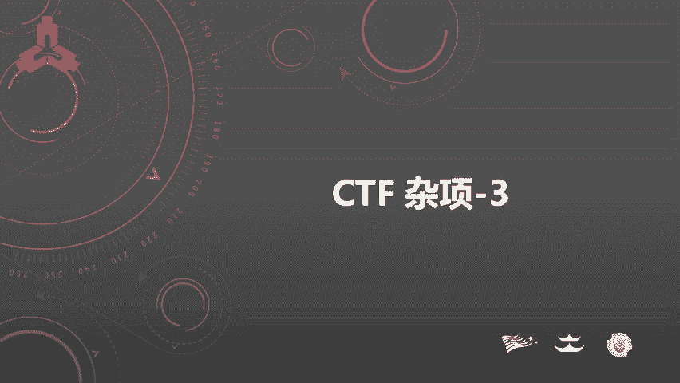

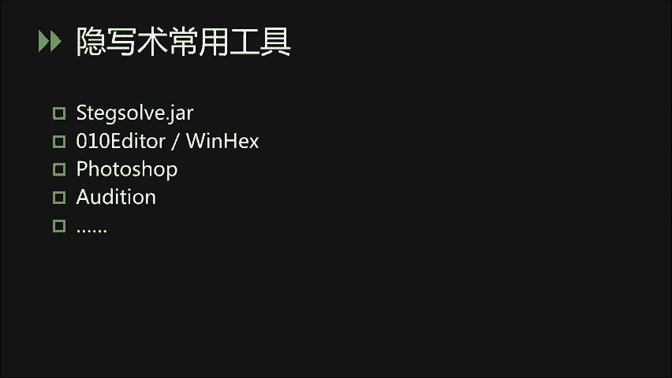

在本节课中，我们将学习CTF比赛中隐写术、密码编码及杂项题目常用的解题工具与基本操作。课程将涵盖图片隐写分析、十六进制编辑、图像拼接、音频处理以及密码编解码等多个方面。

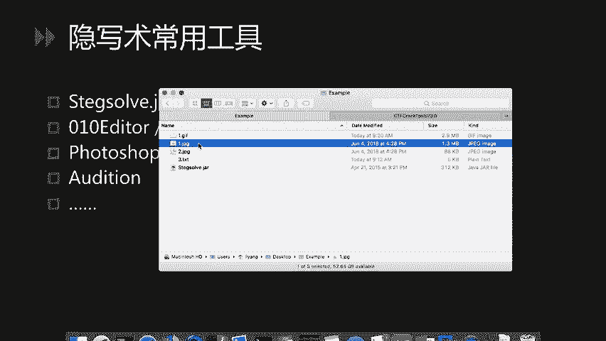

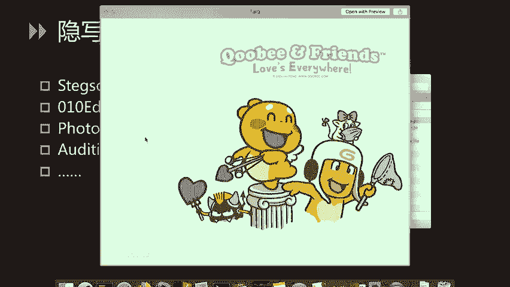

## 图片隐写分析工具：Stegsolve

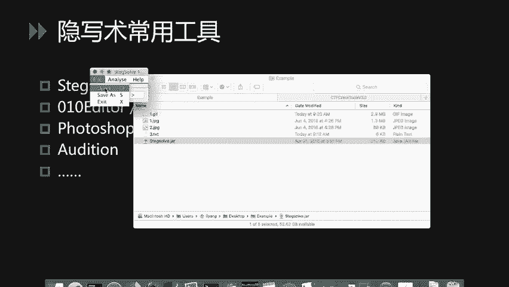

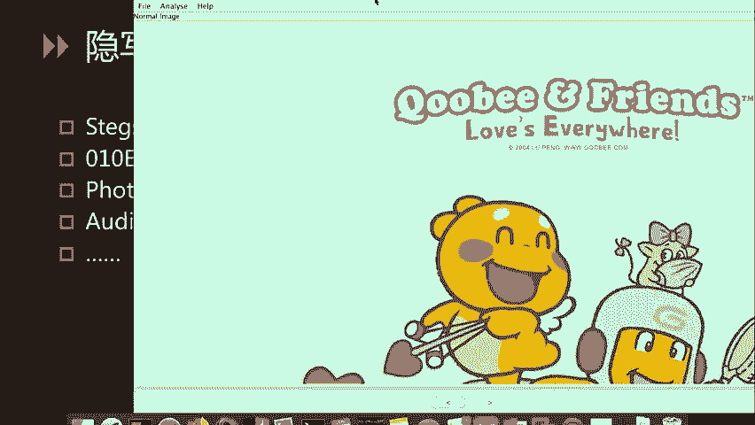

上一节我们介绍了课程概述，本节中我们来看看图片隐写术的常用分析工具。由于图片隐写题目没有固定套路，掌握通用工具至关重要。

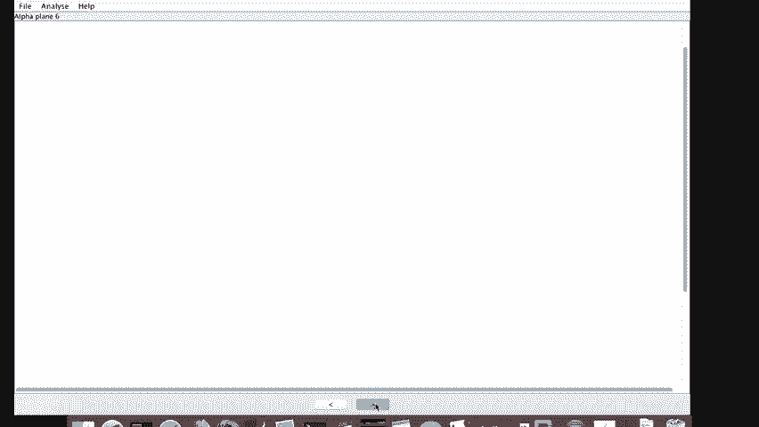

以下是图片隐写术最常用的工具之一：**Stegsolve**。该工具可以解决90%以上的图片隐写题目。

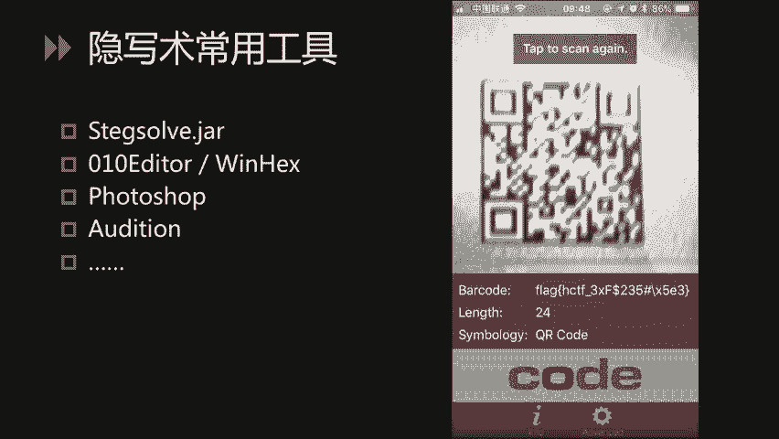

1.  **基本功能**：Stegsolve是一个Java程序，用于分析图片中的隐写信息。它允许用户查看图片在不同颜色通道和不同阈值下的状态。
2.  **操作演示 - 示例一（二维码）**：打开一张看似无异常的图片，通过切换颜色通道和调整阈值，可以发现隐藏的二维码。若二维码因杂色过多难以识别，可尝试使用手机QQ等识别能力更强的扫码工具。
3.  **操作演示 - 示例二（GIF帧分析）**：对于一个快速闪动Flag的GIF图，可使用Stegsolve的“Frame Browser”（帧预览）功能。逐帧浏览，当包含Flag的帧出现时，工具可能自动提取并显示信息。
4.  **其他功能**：Stegsolve还具备分析文件格式、检查文件附加数据等功能，可通过“Analyse”菜单便捷使用。

## 十六进制编辑器：010 Editor

在分析文件结构或处理十六进制数据时，十六进制编辑器是必不可少的工具。

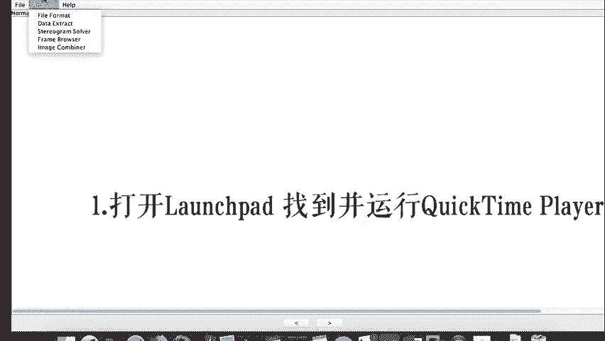

以下是Windows平台上一款功能强大的十六进制编辑器：**010 Editor**。它具备导入十六进制文本的实用功能。

1.  **导入十六进制**：当遇到一串表示十六进制数的文本时，可以使用010 Editor的“Import Hex Text”功能将其导入为二进制文件。
2.  **识别文件头**：导入后，通过观察文件头部签名（如`PK`代表ZIP压缩包），可以判断文件的真实类型。
3.  **实战应用**：将十六进制文本导入并保存为ZIP文件后，解压可获得隐藏的图片等文件，从而继续下一步分析。

## 图像处理工具：Photoshop

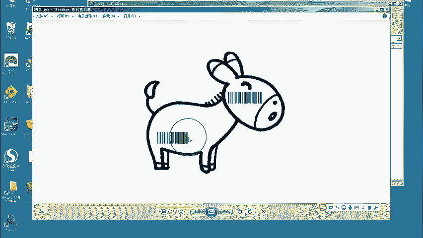

在CTF比赛中，经常需要对残缺的二维码或条形码进行拼接修复。

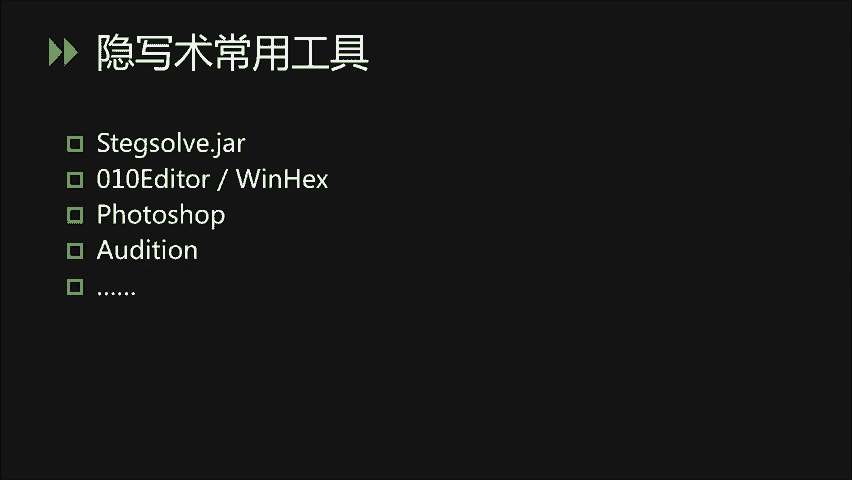

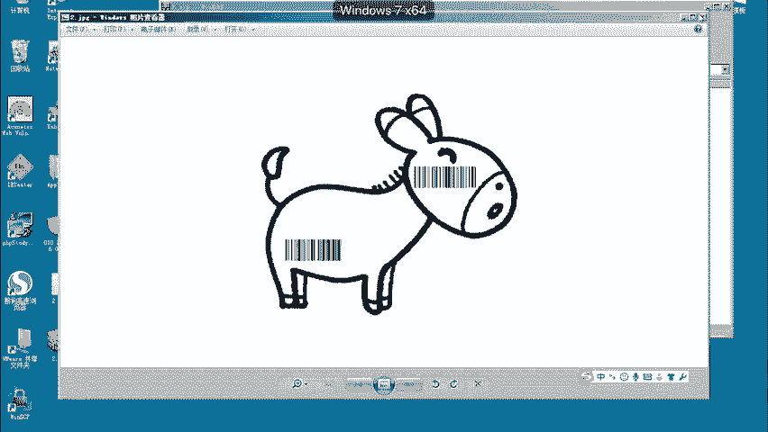

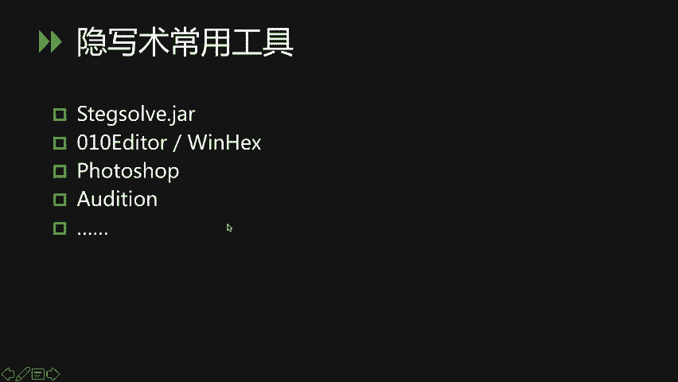

以下是使用**Photoshop**进行基本图像拼接的步骤。

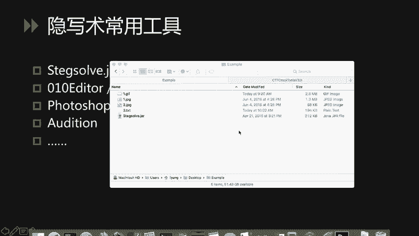

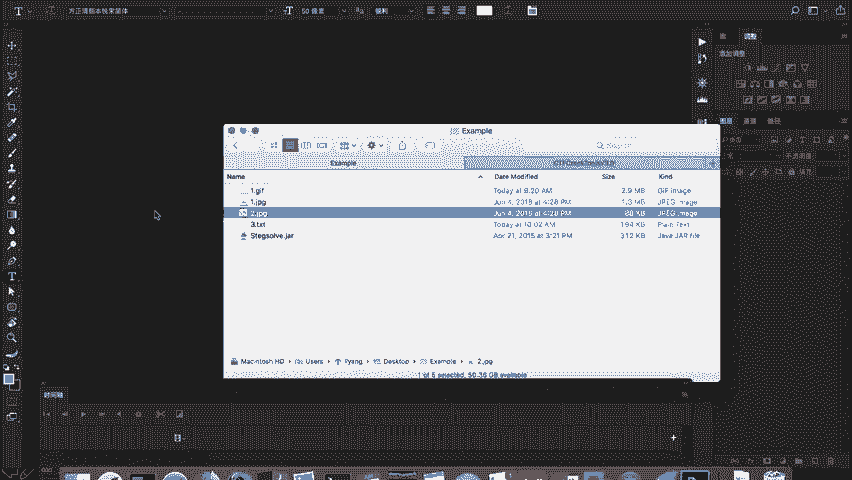

1.  **打开图片**：将需要处理的图片加载到Photoshop中。
2.  **选取与复制**：使用“矩形选框工具”选中有效的条形码部分，按 `Ctrl+C`（Windows）或 `Cmd+C`（Mac）复制。
3.  **新建与粘贴**：新建一个图层，按 `Ctrl+V` 或 `Cmd+V` 将复制的部分粘贴到新图层上。重复此步骤，提取所有有效片段。
4.  **拼接与调整**：使用“移动工具”将各个片段移动到正确位置进行拼接。可以调整图层混合模式（如“变暗”）来更好地融合图像。
5.  **识别结果**：拼接完成后，使用扫码工具识别完整的条形码或二维码，即可获得Flag。

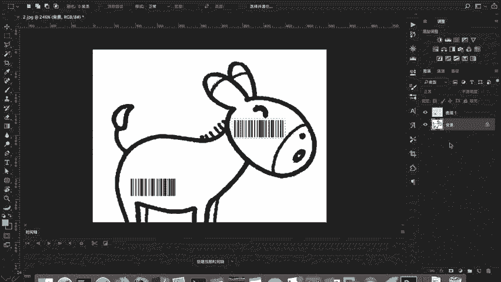

## 音频隐写分析工具：Audition

对于音频隐写题目，我们需要专业的音频处理软件来发现隐藏的信息。

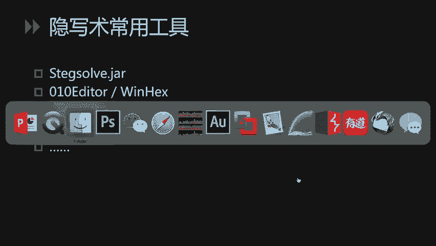

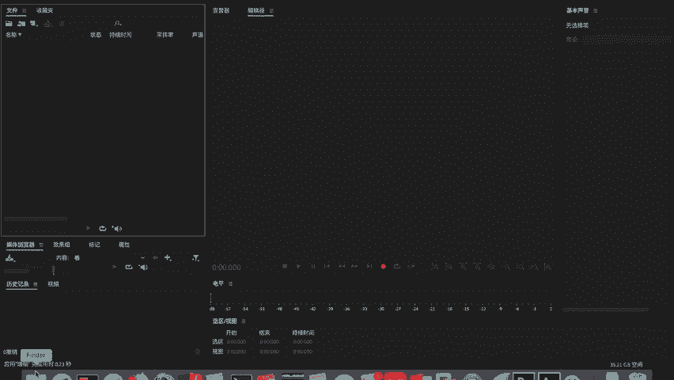

以下是Adobe公司出品的音频处理软件：**Audition**。

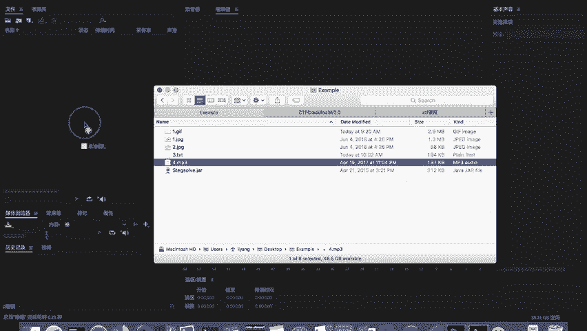

1.  **加载文件**：在Audition中打开CTF的音频题目文件。
2.  **声道分析**：观察左右声道（L和R）的波形图，隐写信息可能只存在于某一个声道中。可以关闭无信息的声道以便集中分析。
3.  **选区与清理**：用光标选中无信息或干扰严重的音频段，直接删除，保留可能包含隐写数据的部分。
4.  **振幅调整**：使用“增幅”效果增大音频振幅，可以使波形图中隐藏的细微变化（如代表摩斯电码的起伏）更加清晰可见。
5.  **高级功能**：某些复杂题目可能需用到“效果”菜单下的频谱分析等高级功能。

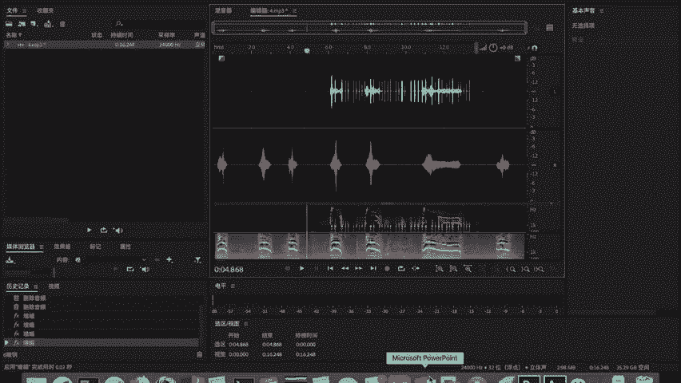

## 密码与编解码工具

处理密码学和各种编码解码题目时，拥有得力的工具能极大提升效率。

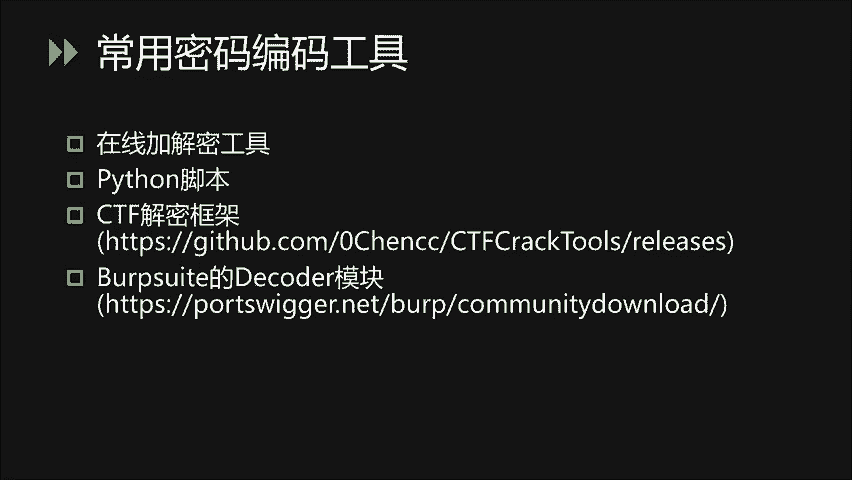

以下是几种常用的密码与编解码工具。

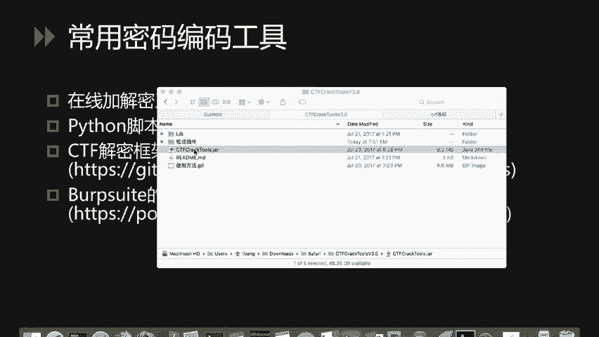

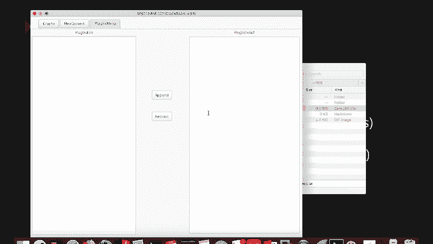

1.  **在线工具网站**：通过搜索引擎可以找到大量提供常见加密、解密及编码、解码功能的在线工具网站。
2.  **Python脚本**：Python因其灵活性和丰富的库，非常适合编写加解密脚本。网上有大量现成的针对不同算法的脚本可供参考和使用。
3.  **CTF集成框架**：推荐一个名为“CTFcrackTools”的国产CTF解密框架。它采用插件架构，可以集成各种Python脚本，方便统一管理和使用。
4.  **Burp Suite Decoder模块**：在渗透测试工具Burp Suite中，内置的“Decoder”模块非常实用。它可以方便地对字符串进行多种编码（如URL、Base64、HTML）的编码和解码操作。

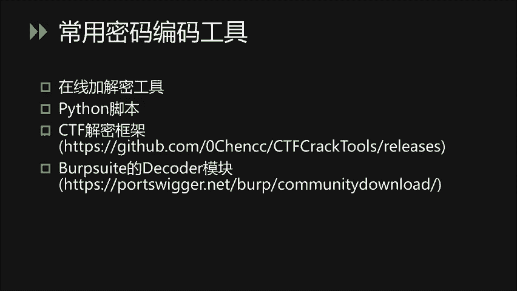

## 课程总结

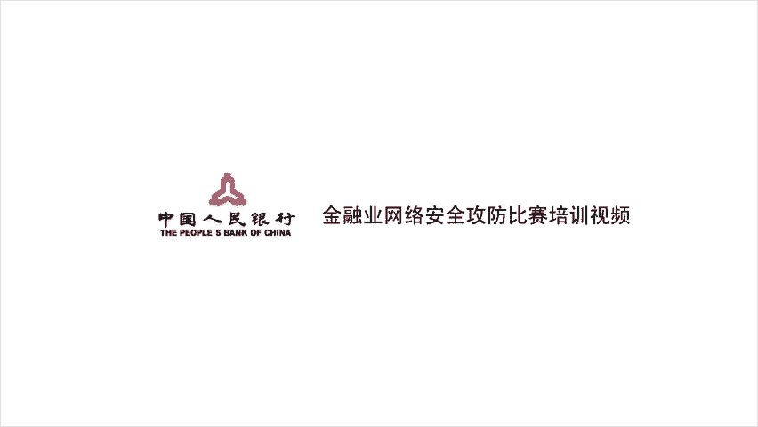

本节课中我们一起学习了CTF杂项与隐写术解题中的一系列核心工具。我们介绍了用于图片分析的Stegsolve，用于二进制文件编辑的010 Editor，用于图像修复的Photoshop，用于音频分析的Audition，以及用于密码编解码的在线工具、Python脚本和Burp Suite。熟练掌握这些工具的基本操作，是解决相关CTF题目的重要基础。