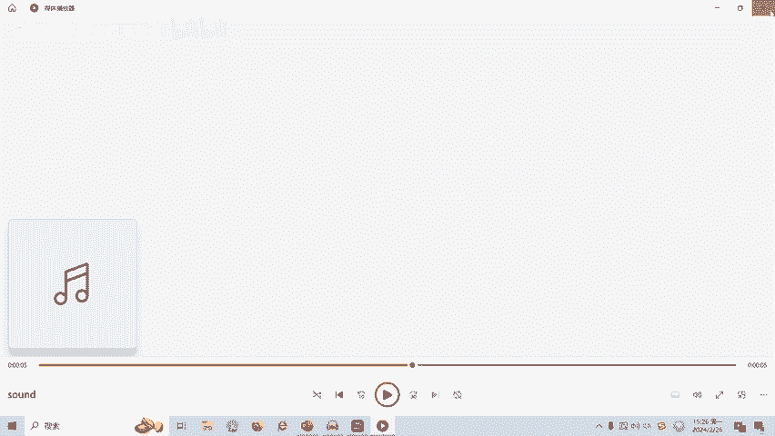
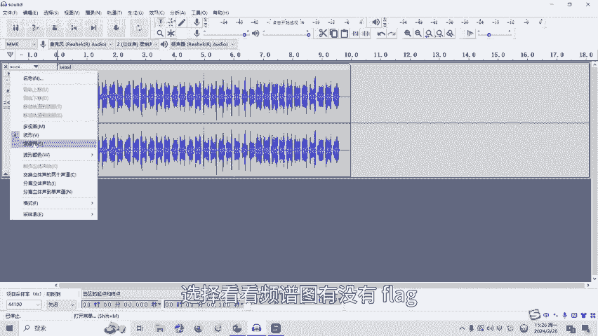
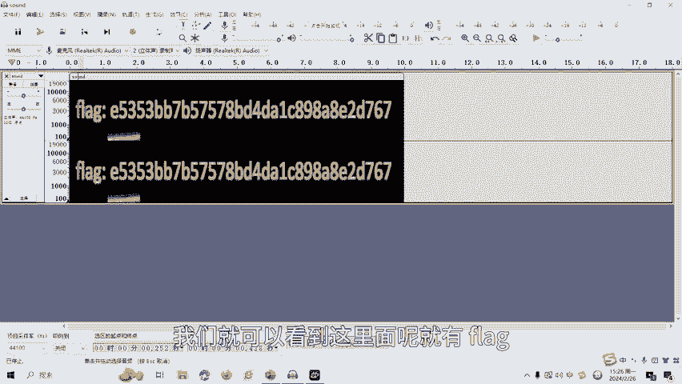
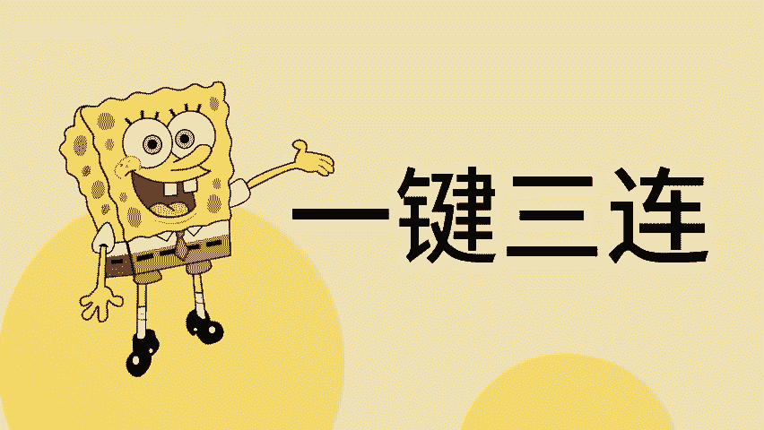

# CTF网络安全培训教程：Misc杂项篇：隐写术之音频隐写 - P1 🎵

## 概述
在本节课中，我们将要学习CTF比赛中一个重要的杂项（Misc）题型——音频隐写术。我们将了解音频隐写的基本概念，认识CTF中常用的音频分析工具，并学习两种基础的音频隐写解题方法。

## 什么是音频隐写术？
在多媒体的研究中，人们已经对以数字图像为载体的数据隐藏技术进行了很多的研究。随着隐写技术的发展，在音频文件中进行数据隐藏，也在安全通讯中得到了很多应用。

## CTF中常见的音频隐写工具
以下是CTF比赛中常见的音频隐写与分析工具：
*   **Audacity**
*   **Sonic Visualiser**
*   **MP3Stego**

我们重点讲解CTF比赛中使用频率较高的一款工具。

## 核心工具：Audacity 🛠️
Audacity是一个跨平台的声音编辑软件。它用于录音和编辑音频，同时存在波形及频谱分析功能，可对音频的频率及波形变化进行处理分析，也可以对声效进行转换。它能够帮助分析音频中可能隐藏的信息。

## 基础解题方法
上一节我们介绍了Audacity工具，本节中我们来看看利用它进行音频隐写分析的具体方法。CTF中常见有以下两种解题思路。

### 方法一：查看波形
这种方法通过观察音频的波形图来寻找规律。按住键盘的`Ctrl`键，同时滚动鼠标滚轮，即可对波形图进行放大或缩小操作。根据波形来查看音频的声音变化，反应波的形状，从而寻找隐写规律。

### 方法二：查看频谱
转换查看频谱图，然后分析频谱的信息。一般在音频的隐藏中，存在将信息隐藏在频谱中的情况。

## 实战演练
最后，我们通过一个实例来讲解音频隐写的实操部分。

这里有一个音频文件，我们点开可以听到一段声音。那么这里面有没有隐藏flag呢？

我们使用Audacity软件打开这个文件。可以看到里面显示的是一个波形图。

我们选择查看它的频谱图。通过频谱图，我们就可以看到里面隐藏的flag信息。这就是这道题目的答案。

## 总结
本节课中，我们一起学习了CTF音频隐写术的基础知识。我们了解了音频隐写的概念，认识了Audacity这一核心工具，并掌握了通过**查看波形**和**分析频谱**两种基础方法来寻找隐藏信息。音频隐写还有很多种类型和解题方式，后续课程将会针对各种类型制作相应的教学视频。

---

