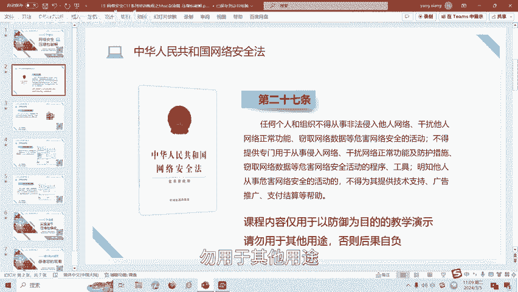
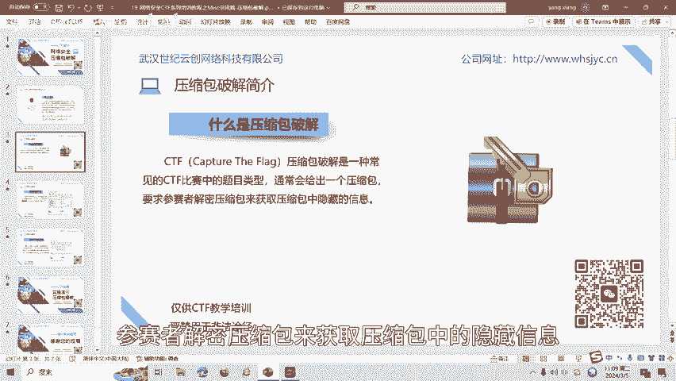
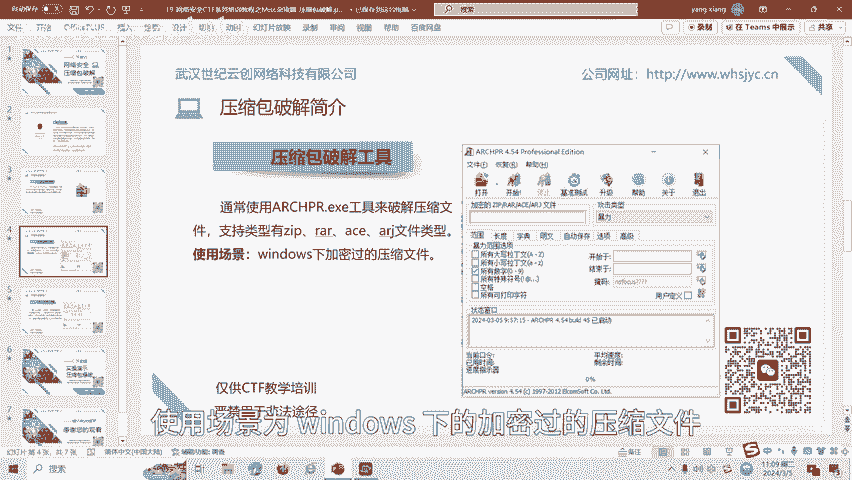
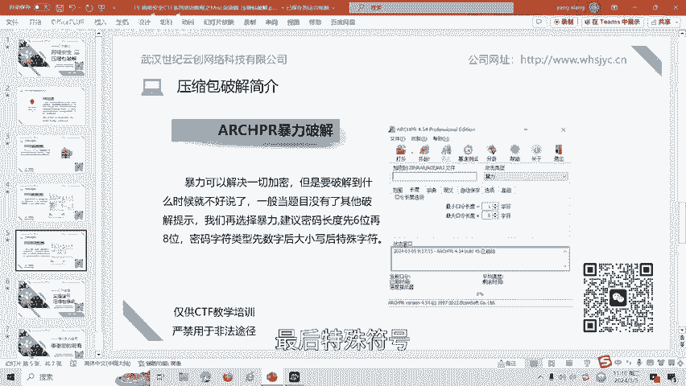
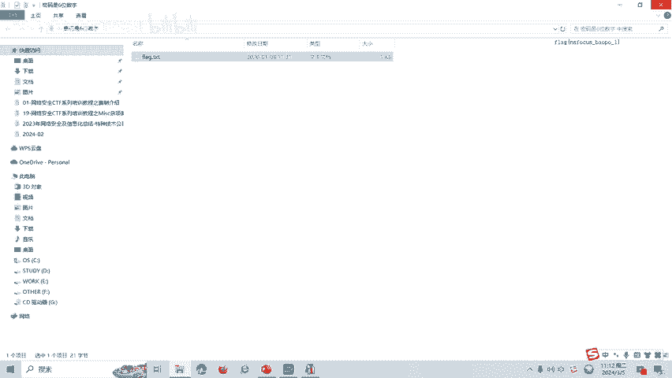

# CTF网络安全培训教程：19：Misc杂项篇 - 压缩包破解

在本节课中，我们将要学习CTF比赛中一个常见的题型——压缩包破解。我们将了解其基本概念、常用工具，并通过一个简单的实例来演示暴力破解的基本流程。

## 概述：什么是压缩包破解？🔐

上一节我们介绍了本系列教程的目标。本节中，我们来看看压缩包破解的具体含义。

CTF压缩包破解是CTF比赛中的一种常见题目类型。题目通常会给出一个加密的压缩包，参赛者需要解密该压缩包以获取其中隐藏的旗帜（Flag）信息。



## 常用工具介绍 🛠️

了解了压缩包破解的目标后，我们需要借助工具来实现。以下是CTF比赛中常用的一款压缩包破解工具。

我们使用 **ARCHPR** 工具来破解加密的压缩文件。该工具支持 ZIP、RAR、ACE、ARJ 等多种文件类型。其主要使用场景是破解在Windows系统下加密过的压缩文件。



## 核心方法：暴力破解 💥

工具为我们提供了多种攻击方式。当题目没有给出其他破解提示时，我们通常会选择暴力破解方法。



暴力破解理论上可以解决所有加密，但其耗时取决于密码复杂度。一般策略是建立密码长度时先尝试6位，再尝试8位。字符集选择顺序是先数字，后大小写字母，最后考虑特殊符号。

其核心过程可以用以下伪代码描述：
```
for 密码长度 in [6, 8]:
    for 字符集 in [纯数字, 数字+小写字母, 数字+大小写字母, 全字符集]:
        生成并测试所有可能的密码组合
        如果成功则退出
```

## 实战演练：暴力破解实例 🧪



理论需要结合实践。接下来，我们通过一个具体例子来演示暴力破解的操作流程。

假设我们有一个加密压缩包，题目提示密码为6位数字。
1.  打开ARCHPR工具。
2.  将加密压缩包文件拖入工具界面。
3.  在“攻击类型”中选择“暴力破解”。
4.  在“暴力破解范围选项”中，将密码长度设置为6。
5.  在“暴力破解范围选项”中，勾选“所有数字”字符集。
6.  点击“开始”按钮进行破解。

破解成功后，工具会显示密码（例如：`123456`）。使用此密码解压文件，即可得到包含Flag的文件。

## 总结与拓展 📚



本节课中，我们一起学习了CTF中压缩包破解的基础知识。我们介绍了压缩包破解的概念、常用工具ARCHPR，并重点讲解了暴力破解的方法与实战步骤。

压缩包破解还包括字典攻击、掩码攻击、伪加密、明文攻击等多种方式。我们将在后续课程中针对这些类型制作相应的教学视频。

---
**版权与声明：**
本课程内容仅用于CTF网络安全教学与培训，请严格遵守《网络安全法》及相关法律法规，勿将所学技术用于非法用途。