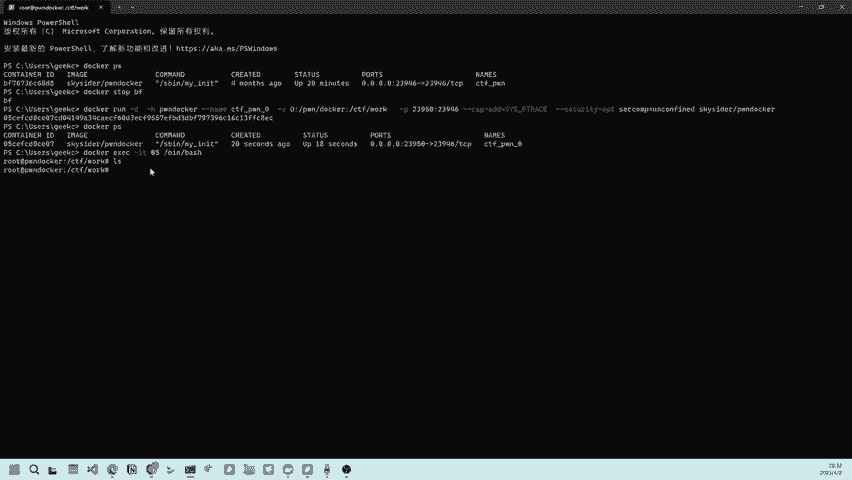
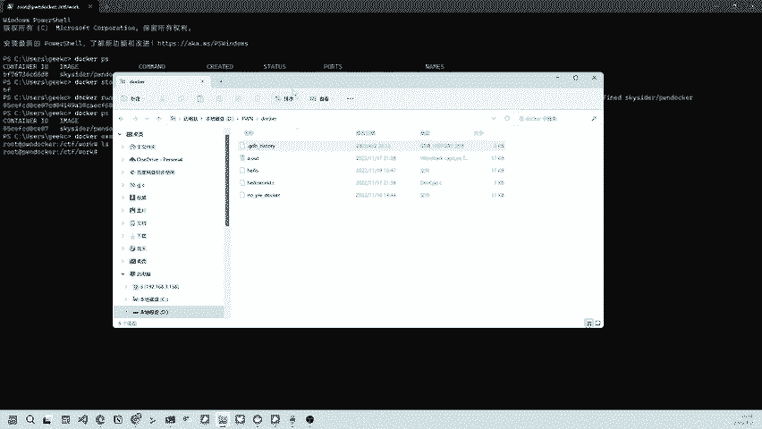
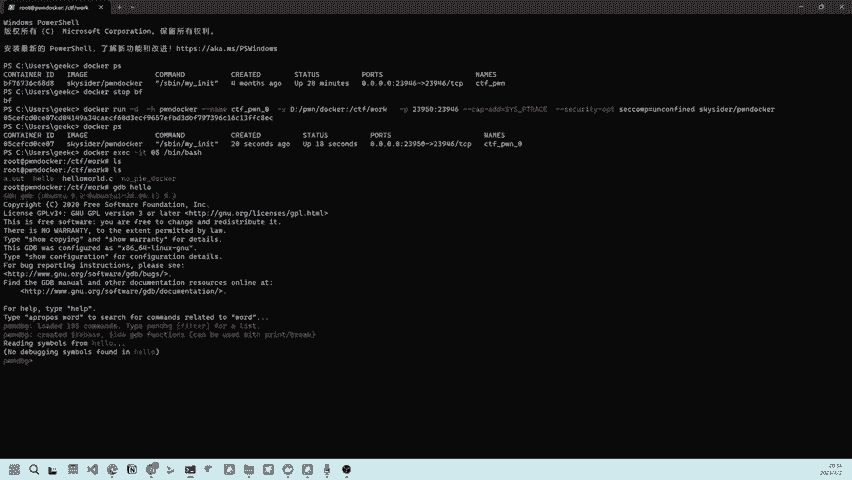
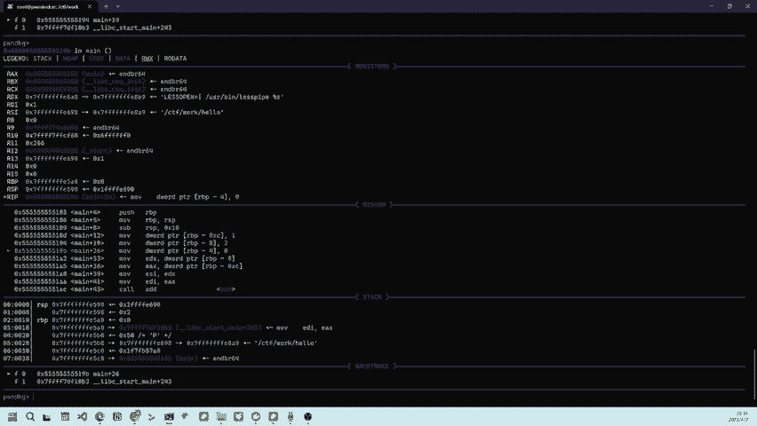

# CTF Pwn环境搭建：P1：使用Docker一键搭建环境 🐳

在本节课中，我们将学习如何在Windows系统下，使用Docker快速搭建一个CTF Pwn（二进制漏洞利用）的练习与调试环境。这种方法可以避免复杂的本地环境配置，实现开箱即用。

## 概述

搭建CTF Pwn环境通常需要配置特定的Linux工具链和库文件，过程繁琐。使用Docker可以将所有依赖打包在一个容器中，实现环境的快速部署和一致性。本节将演示如何通过一行命令启动并进入一个预配置好的Pwn环境容器。

## 运行Docker容器

运行Docker容器的核心命令非常简单。以下是启动Pwn环境容器的具体命令及其参数解释。

```bash
docker run -it --name ctf_pwn -v /d/pwn/docker:/ctfwork -p 23946:23946 --privileged --cap-add=SYS_PTRACE skysider/pwndocker
```

以下是上述命令中各个参数的含义：

*   **`docker run -it`**: 这是Docker的基础命令，用于创建并启动一个新容器。`-it`参数表示以交互模式运行容器，并分配一个伪终端。
*   **`--name ctf_pwn`**: 为容器指定一个名称，这里命名为`ctf_pwn`，方便后续管理。
*   **`-v /d/pwn/docker:/ctfwork`**: 这是目录映射（挂载）参数。它将Windows主机上的`D:\pwn\docker`目录映射到容器内部的`/ctfwork`目录。这样，在主机目录中放置的文件，在容器内可以立即访问。
*   **`-p 23946:23946`**: 这是端口映射参数。它将容器内部的23946端口映射到主机的23946端口。这对于后续可能进行的远程调试非常重要。
*   **`--privileged --cap-add=SYS_PTRACE`**: 这两个参数赋予容器更高的权限，使其能够使用Linux系统的全部功能，特别是`SYS_PTRACE`权限，这是使用`gdb`等调试工具所必需的。
*   **`skysider/pwndocker`**: 这是要运行的Docker镜像名称。这是一个预装了常用Pwn工具（如`pwntools`, `gdb`, `peda`等）的公开镜像。

在命令行中执行此命令后，Docker会自动下载（如果本地没有）并启动该镜像，创建一个可用的Pwn环境容器。



## 进入容器与验证环境

容器运行后，我们需要进入其内部进行操作。进入容器需要使用Docker的`exec`命令。

我们可以使用容器的ID或名称来进入。通常，只需输入ID的前几位字符即可。例如，如果容器ID是`05cef...`，可以执行：

```bash
docker exec -it 05 /bin/bash
```

执行此命令后，命令行提示符会发生变化，表示我们已经进入了容器的内部Linux环境。默认会位于之前映射的`/ctfwork`目录下。

## 开始调试程序


现在，我们可以在Windows主机的映射目录（`D:\pwn\docker`）中放置需要分析或攻击的二进制程序文件。



文件放入主机目录后，在Docker容器的`/ctfwork`目录下会立即看到相同的文件。这是因为两个目录通过`-v`参数实现了同步。


接下来，就可以使用容器内预装好的工具进行调试了。例如，使用`gdb`启动调试：

```bash
gdb ./your_pwn_challenge
```

容器环境已经集成了`pwntools`、`gdb`及其增强插件（如`peda`），可以直接使用，无需额外安装。






## 总结


本节课中，我们一起学习了使用Docker一键搭建CTF Pwn环境的方法。整个过程主要分为三步：
1.  使用一条整合了目录映射、端口映射和特权参数的`docker run`命令启动容器。
2.  使用`docker exec`命令进入容器内部的Linux环境。
3.  在主机与容器共享的目录中放置目标程序，并利用容器内预置的工具链开始调试。

这种方法极大简化了环境配置流程，让学习者可以专注于Pwn技术本身，快速开始练习。