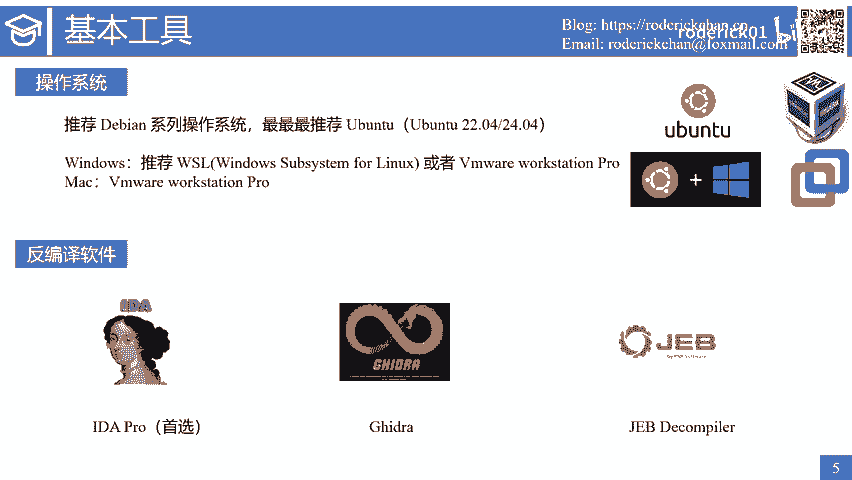
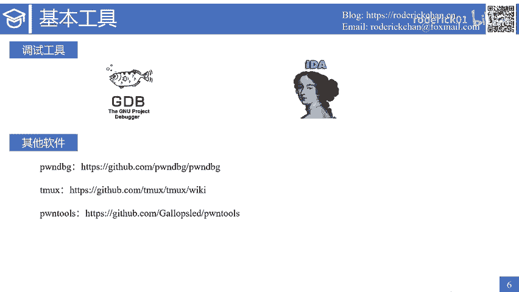
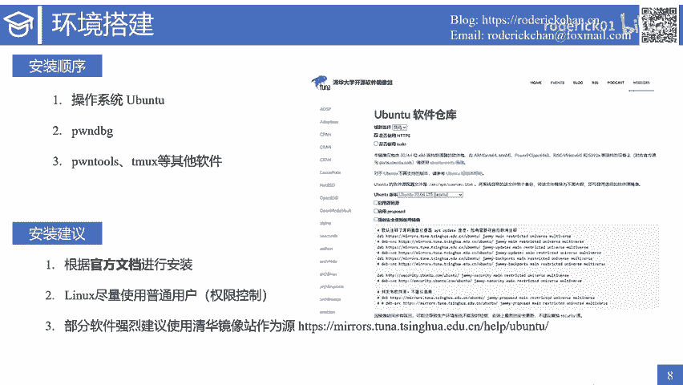
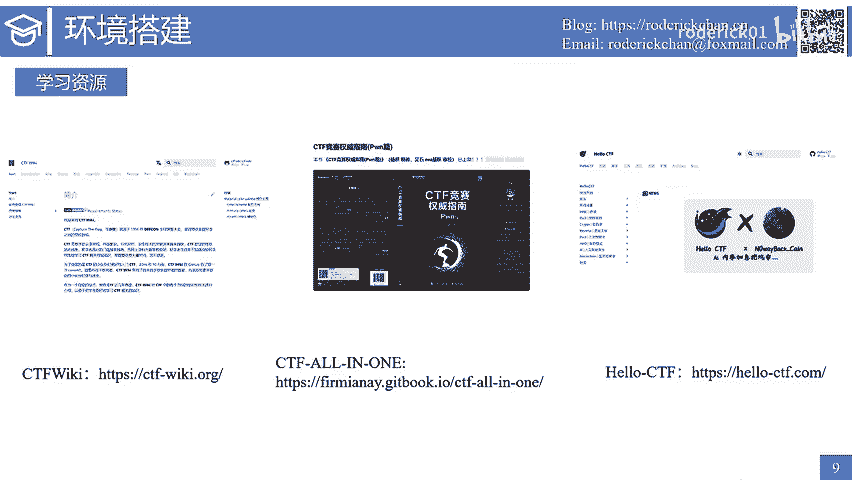
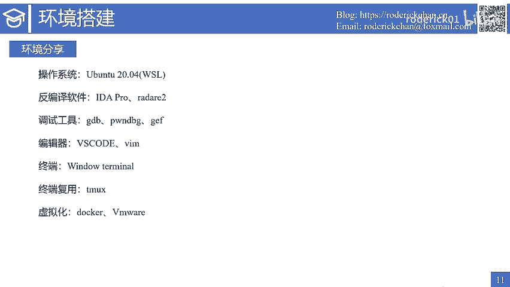

# 快来胖一胖：2：Pwn基本环境与工具 🛠️

在本节课中，我们将学习搭建Pwn学习所需的基本环境，并了解一系列核心工具。掌握这些是进行二进制安全研究的第一步。

## 操作系统选择 💻

上一节我们介绍了课程概况，本节中我们来看看学习Pwn时操作系统的选择。如果有条件，推荐直接使用Linux系统，并优先考虑Debian系列的操作系统。最适合学习Pwn的操作系统是Ubuntu。

根据目前的版本，推荐下载Ubuntu 20.04或22.04。选择开源操作系统时，尽量选择LTS版本，即长期支持版本。如果你的主力系统是Windows，推荐使用WSL，即Windows Subsystem for Linux。

在Windows平台下还有另一个选择，是安装虚拟机软件，例如开源的VirtualBox或更专业的VMware。如果你是Mac电脑，最佳选择是安装VMware软件。

## 核心工具介绍 🔧

以下是学习Pwn和逆向工程过程中最重要的几类工具。

### 反编译软件

这类软件将二进制码反编译为汇编语言，或直接反编译为人类可读的高级语言伪代码，主要是C代码。反编译软件中最推荐的是IDA Pro。其次有开源的Ghidra，这个软件对于反编译MIPS、ARM等架构的效果非常好。另一个软件JEB Decompiler也是一款非常强大的反编译软件，通常在解决安卓类题目时会用到。

### 调试工具

调试工具是另一类非常重要的工具。如果你习惯了图形化调试软件，需要慢慢学习并接受命令行式的调试工具。最常用的工具是GDB，这是Linux平台下最强大的调试工具。另外，radare2也是一个调试工具，并且支持多种调试模式。关于GDB和radare2的使用，会在后续课程中详细介绍。

### 其他必备软件

以下是其他一些必备的辅助软件：
*   **pwndbg**：一款著名的GDB调试插件，主要使用Python语言编写。注意拼写是`pwndbg`，而不是`pwngdb`。`pwngdb`是另一款GDB调试插件。
*   **Tmux**：一款非常有名的终端复用工具，常常与下面的`pwntools`结合使用。
*   **pwntools**：一款非常强大的二进制攻击框架，使用Python语言开发。这个Python库是入门Pwn的必学库之一。

以上介绍的就是与Pwn有关的基本环境与工具。

## 环境搭建建议 🚀

接下来介绍环境的搭建工作。建议的安装顺序是：先安装操作系统，然后安装pwndbg，接着安装pwntools、Tmux以及其他软件。使用这个顺序是因为在安装pwndbg的过程中，其安装脚本会帮助我们安装一些必备的软件和工具。

以下是三条安装建议：
1.  **遵循官方文档**：请尽量根据官方文档说明进行安装。博客可能会过时，而软件在不断更新，安装方式可能改变。从博客中应主要了解学习Pwn有哪些好用的工具。
2.  **合理使用权限**：在使用Linux用户时，尽量使用普通用户，结合`sudo`命令进行需要root权限的操作。这有助于理解Linux系统上的权限控制机制。
3.  **善用镜像源**：部分软件强烈建议使用清华镜像站作为镜像源。例如，在更新Ubuntu软件时，可以将源替换为清华源。清华镜像站是国内维护最好、文档最清晰的镜像站之一，关于所有软件的源替换方案都有详细文档说明。

## 学习资源推荐 📚

在学习Pwn的过程中，可以充分利用以下学习资源。首先推荐的是CTF Wiki，入门Pwn时可以跟着它一步一步学习。另外还有CTF-All-In-One以及其出版的《CTF竞赛权威指南（Pwn篇）》也非常值得参考。当然，还有碳基师傅维护的HelloCTF，也是一个非常不错的CTF入门手册项目。以上三个网站不仅包含Pwn相关的学习内容，还有CTF其他方向的知识点。

此外，以下是一些常用的Pwn学习与刷题网站：
*   `pwn.college`
*   `pwnable.tw`
*   `pwnable.kr`
*   Hack The Box (HTB)
*   国内还有一个很有名的BUUCTF刷题网站，有许多优质题目。

需要说明的是，在学习Pwn的过程中，一定要学会充分利用搜索引擎，搜索自己所需的学习资源，这些资源可能是一些文档、师傅们的博客或某个漏洞的POC等。平时多搜索、多积累、多学习，就能不断取得进步。

## 个人环境分享 🖥️

最后，分享一下我学习Pwn时使用的环境。在操作系统上，目前使用的是Ubuntu 20.04，并运行在WSL系统中。使用这个系统的好处是WSL里的Linux发行版会自动挂载宿主机里的硬盘，宿主机与虚拟机之间的文件互访操作非常流畅。此外，WSL的网络不需要额外配置，`localhost`域名可以解析到WSL虚拟机的IP地址，无需额外端口转发。还可以直接在WSL虚拟机中使用VS Code，VS Code提供了官方插件用于访问WSL发行版。

我使用的反编译软件是IDA Pro和radare2，一个在Windows上使用，一个在Linux上使用。使用的调试工具是GDB配合pwndbg插件和GEF插件。编辑器以VS Code为主，有时也用Vim。终端主要使用Windows Terminal，终端复用工具主要使用Tmux。此外，也安装了虚拟化工具，如Docker Desktop和VMware。

## 总结

本节课中，我们一起学习了Pwn学习所需的基本环境与核心工具。我们了解了操作系统的选择、反编译与调试工具、其他必备软件，并获得了环境搭建的建议和宝贵的学习资源。掌握这些是开启二进制安全研究之旅的坚实基础。如果你对课程有任何疑问，欢迎在评论区留言。下节课我将讲述逆向软件radare2的使用方法。最后祝愿大家学习顺利。