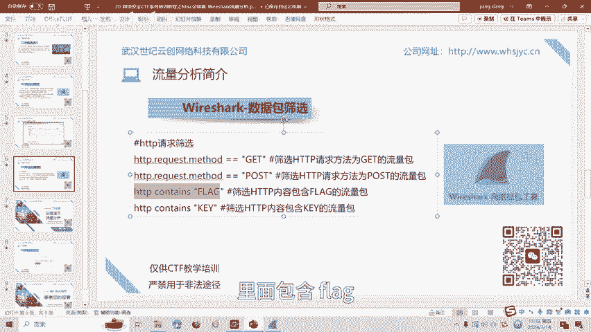
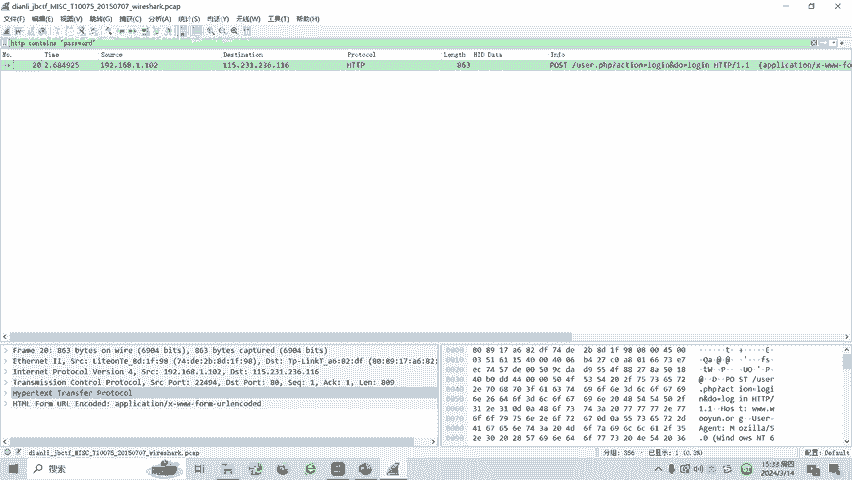
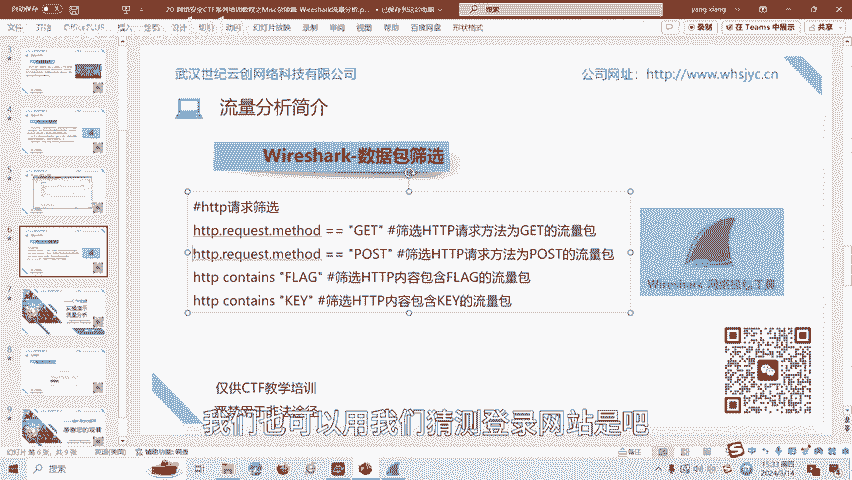
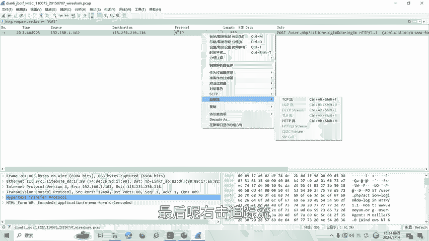
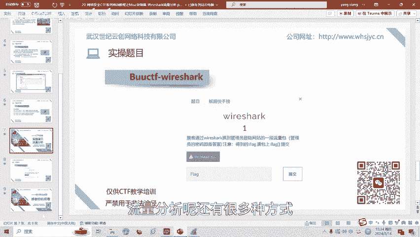

# CTF网络安全培训：Misc杂项篇：Wireshark流量分析入门

在本节课中，我们将要学习CTF比赛中Misc杂项类别的一个重要部分——流量分析。我们将了解什么是流量分析，认识核心工具Wireshark，学习基本的过滤表达式，并通过一个实战案例来掌握解题思路。

## 什么是流量分析？🔍

在CTF比赛中，流量分析通常指对网络数据包文件进行分析。这类文件常以 `.pcapng` 或 `.pcap` 为后缀。数据包中包含各种网络协议通信的记录，例如HTTP协议、TCP协议等。参赛者需要从这些文件中分析数据，提取关键信息，最终找到隐藏的答案，即flag。

## 流量分析工具：Wireshark 🛠️

Wireshark是一款功能强大的网络封包分析软件。它的主要功能是捕获网络封包，并尽可能详细地展示封包内的数据资料。Wireshark使用WinPCAP作为接口，直接与网卡进行数据包交换。

在CTF中，数据分析类题目一直是一个热点。解答这类题目需要参赛者熟悉各种网络协议和常见的网络攻击手法。Wireshark的官方下载地址可在其官网找到。

Wireshark的图形界面包含菜单栏、工具栏等多个区域。在CTF解题中，最常用的功能是过滤表达式，它可以帮助我们快速筛选出感兴趣的流量包。

## 常用过滤表达式 📝

以下是CTF中最常见的几种HTTP协议过滤表达式，用于快速定位关键流量。

*   **筛选HTTP GET请求**：`http.request.method == GET`
*   **筛选HTTP POST请求**：`http.request.method == POST`
*   **筛选HTTP内容包含特定字符串（如“flag”）**：`http contains “flag”`
*   **筛选HTTP内容包含特定字符串（如“key”）**：`http contains “key”`

上一节我们介绍了Wireshark的基本功能和过滤表达式，本节中我们来看看如何将这些知识应用到实际解题中。

## 实战演练：从流量包中寻找密码 🎯

我们通过一道例题来实践。题目名为“黑客”，描述为：通过Wireshark抓到了管理员登录网站的一段数据包，管理员的密码即是答案（flag）。

解题思路很明确：我们需要在提供的 `.pcap` 文件中找到管理员的登录密码。

**操作步骤如下：**

1.  使用Wireshark打开题目提供的 `.pcap` 数据包文件。
2.  根据常识，网站登录通常使用POST请求提交账号和密码。因此，我们可以在过滤栏输入 `http.request.method == POST` 并回车，筛选出所有POST请求的流量包。
3.  在筛选出的数据包中，查找包含登录表单数据的包。通常可以追踪HTTP流来查看完整的请求内容。
4.  在HTTP流中，我们可以找到类似 `password=xxxxxx` 的字段，其中的 `xxxxxx` 就是我们要找的密码（flag）。

**另一种方法是直接搜索关键词。** 由于目标是密码，我们可以在过滤栏尝试搜索包含“password”字符串的流量包，使用过滤表达式：`http contains “password”`。同样可以定位到关键的POST请求包，并在其中找到密码。

本节课中我们一起学习了CTF流量分析的基础知识。我们了解了流量分析的概念，认识了核心工具Wireshark及其过滤表达式，并通过一个实战案例掌握了从数据包中提取登录密码的基本方法。流量分析还有很多高级技巧和协议知识，后续课程将会针对更多类型进行深入讲解。