# CTF取证：1：使用John破解ZIP与PDF密码 🔓

在本教程中，我们将学习如何使用John the Ripper（简称John）这一强大的密码破解工具，来破解一个CTF挑战中受密码保护的ZIP文件和PDF文件。我们将从获取工具开始，逐步完成编译、转换文件格式和最终破解密码的全过程。

---

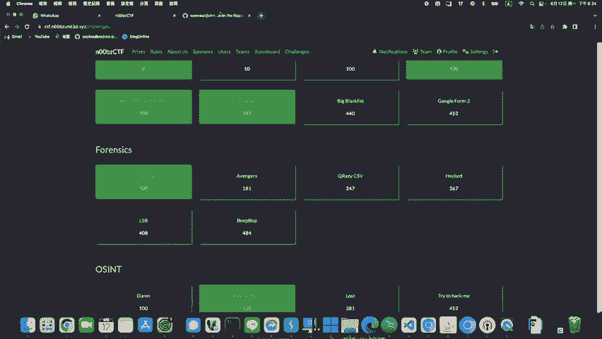

## 概述 📋

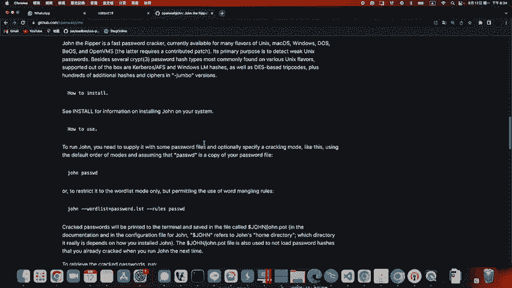

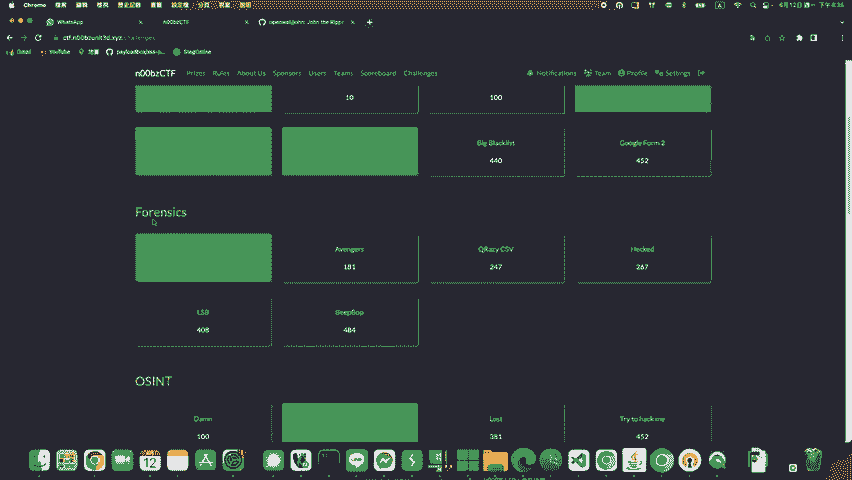

John the Ripper是一个流行的密码安全测试和破解工具。与Hashcat相比，John在某些场景下使用起来更为方便和灵活。本次教程将基于2023年n00bz CTF的一个取证挑战，演示如何破解一个ZIP文件的密码，进而解锁其中的PDF文件，并最终破解该PDF文件的密码。

---

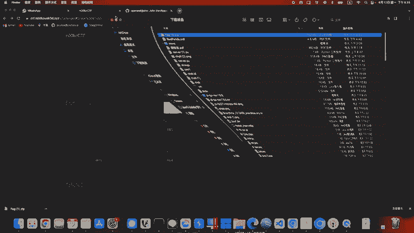

## 准备工作与环境设置 ⚙️

首先，我们需要获取John the Ripper工具并准备破解环境。由于在某些操作系统（如macOS）上直接使用John可能遇到问题，建议在Linux环境（例如Ubuntu）中进行操作。

以下是准备工作的步骤：

1.  **下载John the Ripper**：访问John的官方GitHub仓库，将源代码克隆到本地。
    ```bash
    git clone https://github.com/openwall/john.git
    ```

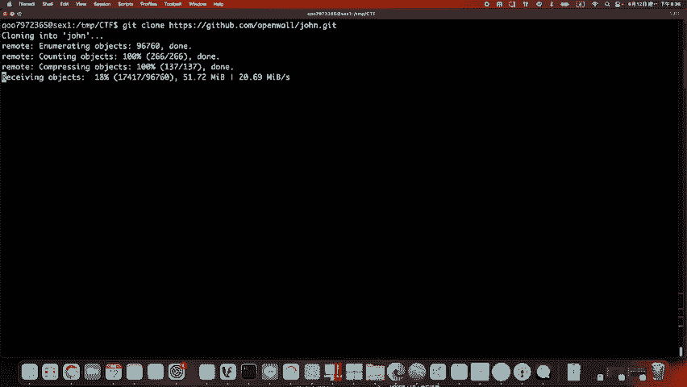

2.  **进入源码目录**：克隆完成后，你会看到`john`目录，其中包含`src`和`run`两个子目录。我们主要的工作将在`src`目录中进行编译。
    ```bash
    cd john/src
    ```

---

## 破解ZIP文件密码 🔐

上一节我们设置了基础环境，本节中我们来看看如何破解ZIP文件的密码。

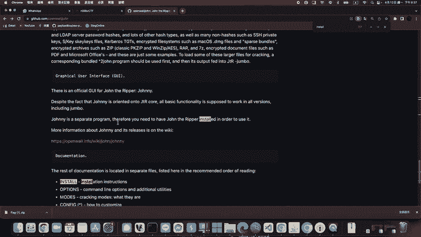

### 编译ZIP破解模块

John本身不能直接处理ZIP文件，需要先将ZIP文件转换为John能识别的哈希格式。这需要使用`zip2john`工具，我们需要先编译它。

进入`src`目录，执行以下命令进行编译和安装：

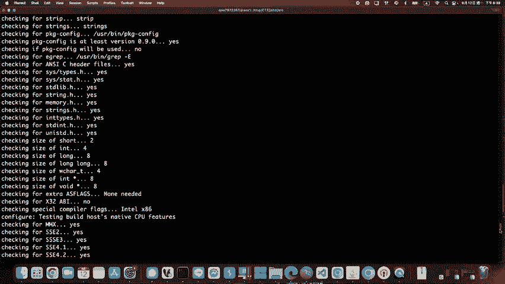

```bash
./configure
make clean
make -j4
sudo make install zip2john
```

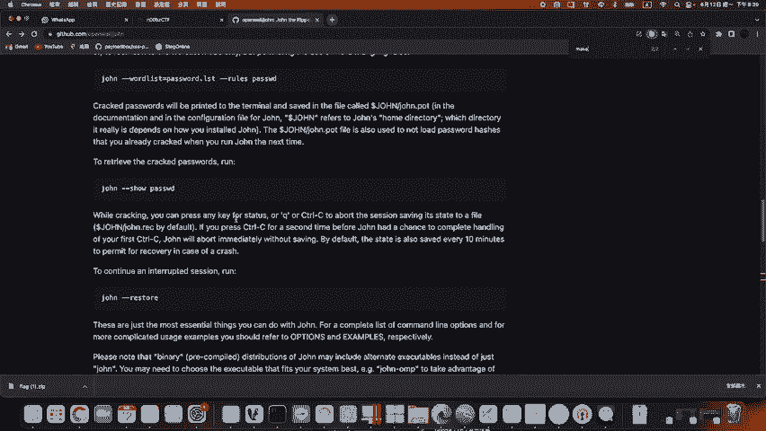

编译过程可能需要一些时间，期间出现的警告（warning）信息通常可以忽略。

### 转换ZIP文件为哈希格式

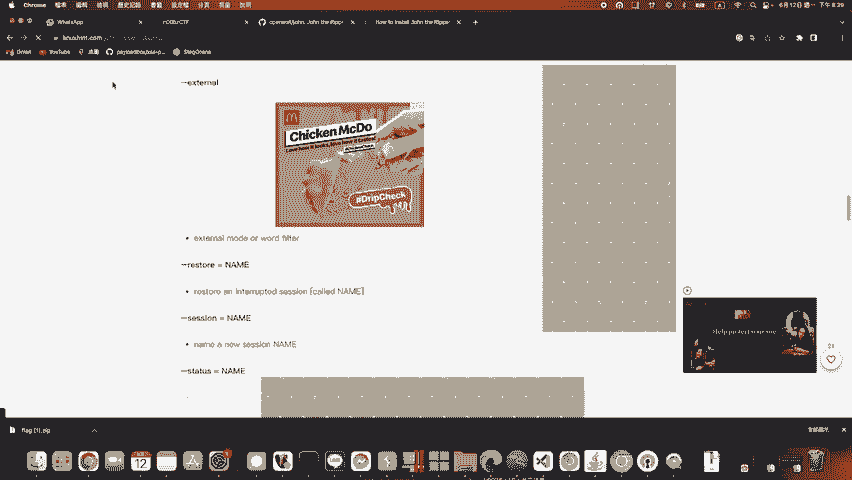

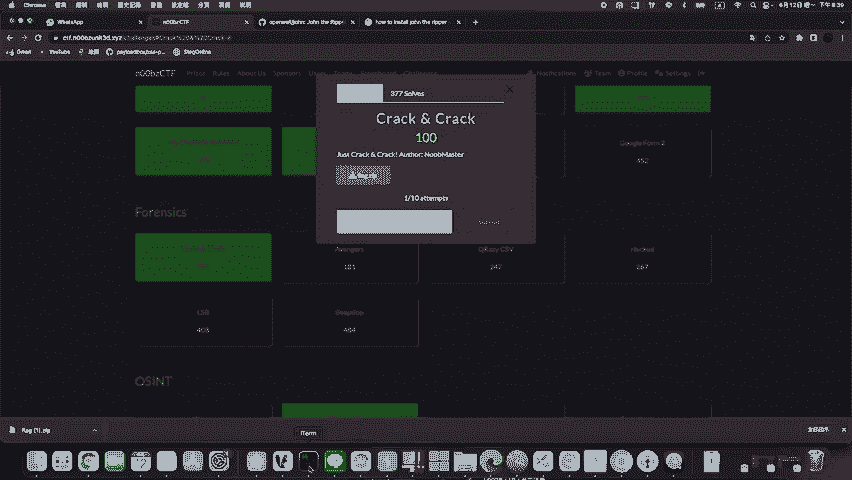

编译完成后，返回`run`目录，你会发现可执行的`zip2john`程序。

假设你的ZIP文件名为`flag.zip`，并已上传到服务器的`/tmp/ctf/`目录下。使用以下命令将其转换为哈希文件：

```bash
./zip2john /tmp/ctf/flag.zip > /tmp/ctf/flag.zip.hash
```

这条命令会将`flag.zip`的密码哈希提取出来，并保存到`flag.zip.hash`文件中。

### 使用John破解密码

现在，我们可以使用John来破解这个哈希文件。在`run`目录下执行：

```bash
./john /tmp/ctf/flag.zip.hash
```

John会快速尝试破解，并在成功时在终端显示密码。例如，破解出的密码可能是`n00bz`。

### 解锁ZIP文件

获得密码后，你就可以用其解压ZIP文件了：

```bash
unzip -P n00bz /tmp/ctf/flag.zip
```

解压后，你会得到一个新的文件，例如`flag2.pdf`，但它同样受密码保护。

---

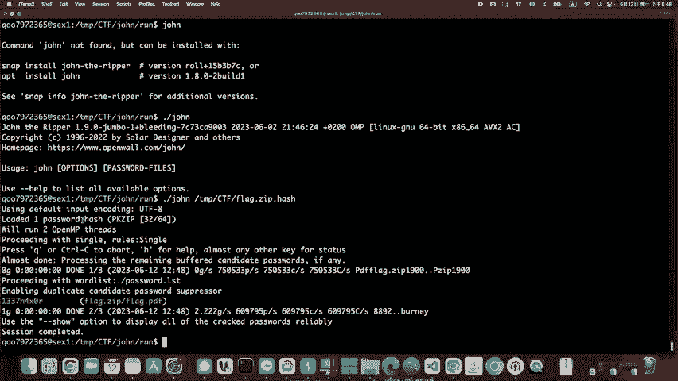

## 破解PDF文件密码 📄

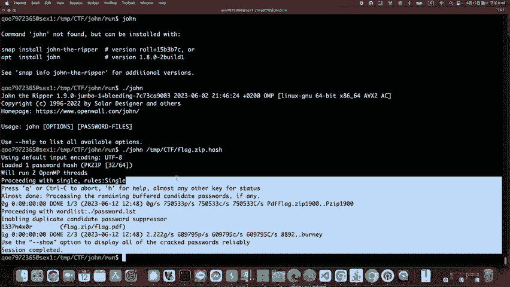

成功破解ZIP后，我们得到了一个受密码保护的PDF文件。接下来，我们将使用类似的方法破解PDF密码。

### 编译PDF破解模块

与破解ZIP类似，我们需要编译`pdf2john`工具。在`src`目录下执行：

```bash
sudo make install pdf2john
```

### 转换PDF文件为哈希格式

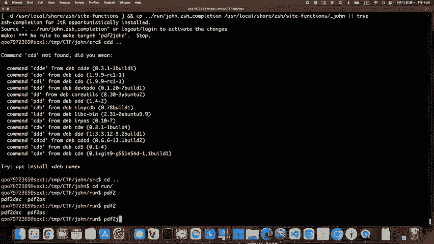

编译完成后，在`run`目录下使用`pdf2john`转换PDF文件：

```bash
./pdf2john /tmp/ctf/flag2.pdf > /tmp/ctf/flag2.pdf.hash
```

### 使用John破解PDF密码

现在，使用John破解生成的哈希文件：

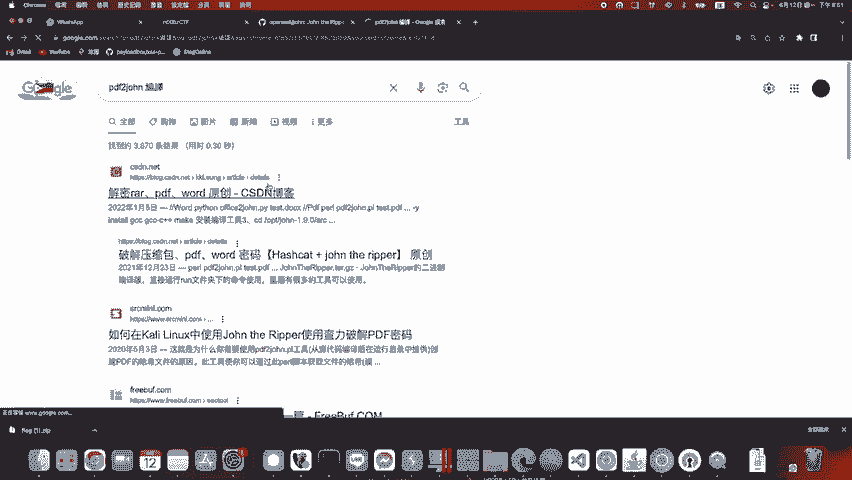

```bash
./john /tmp/ctf/flag2.pdf.hash
```

John会开始破解，并输出密码，例如`noobmaster`。

### 解锁PDF文件

最后，使用破解出的密码打开PDF文件，即可获得CTF挑战的最终flag。

---

## 总结 🎉

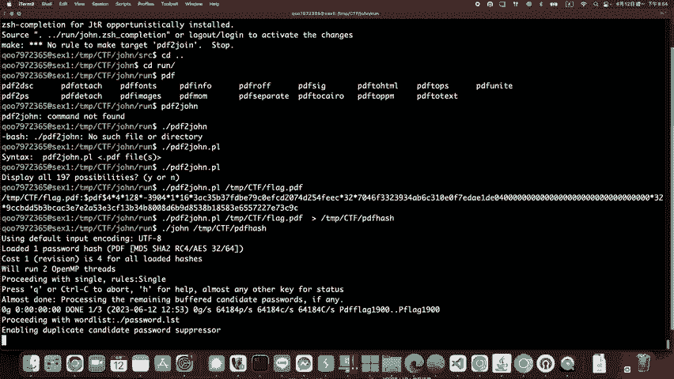

在本教程中，我们一起学习了使用John the Ripper破解密码的基本流程：

1.  **环境准备**：克隆John源码并编译所需工具（如`zip2john`, `pdf2john`）。
2.  **文件转换**：将加密文件（ZIP/PDF）转换为John可识别的哈希格式。
3.  **密码破解**：运行John对哈希文件进行破解，获取明文密码。
4.  **文件解锁**：使用获得的密码解压或打开目标文件。

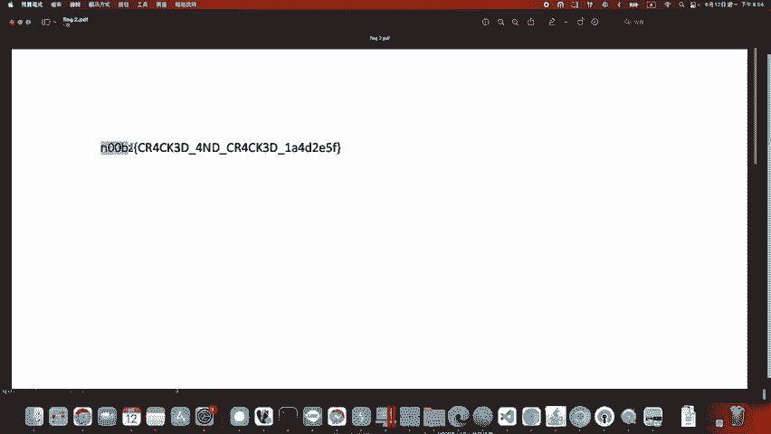

这个过程清晰地展示了John在CTF取证挑战中破解常见文件密码的强大能力。掌握这个工具，将为解决更多安全挑战打下坚实基础。