# 2023 hackergame 部分题目讲解：P1：入门题目解析 🎯

在本节课中，我们将学习2023年hackergame中几道入门题目的解题思路。这些题目涵盖了音频处理、Web请求修改、JavaScript逆向、游戏逻辑篡改、漏洞利用和信号分析等多个方面。我们将逐一拆解，使用简单直白的语言和示例，帮助初学者理解核心概念。

---

## 第一题：音频相似度挑战 🔊

题目要求我们录制一段音频，使其与目标音频的相似度达到99%以上才能获得答案。初始尝试的相似度仅为76%。

上一节我们介绍了题目的基本要求，本节中我们来看看如何绕过这个限制。

实际上，这道题与去年的题目类似，核心在于修改提交的相似度数值，而非真正提升音频相似度。我们可以在提交数据时，将相似度值改为一个大于99%的数字。

以下是具体步骤：
1.  使用浏览器开发者工具（如F12）或抓包工具（如Burp Suite）拦截提交相似度的请求。
2.  在请求数据中找到表示相似度的参数（例如 `similarity=76`）。
3.  将该参数值修改为大于99的数字，例如 `similarity=999`。
4.  转发修改后的请求，即可获得答案。

**核心操作**：修改HTTP请求中的参数值。
```http
POST /submit_similarity HTTP/1.1
...
similarity=999  # 将此处修改为大数值
```

本节课中我们一起学习了如何通过修改请求参数来绕过客户端的验证逻辑。

---

## 第二题：猫咪小测与请求爆破 🐱

这道题是一个在线答题页面，需要回答几个问题。其中一些问题（如“图书馆有几层”）的答案是**非负整数**。

上一节我们介绍了直接搜索答案的方法，本节中我们来看看如何利用工具进行自动化尝试（即“爆破”）。

当答案可能是一个较小范围的整数时，我们可以使用Burp Suite的Intruder模块进行爆破。Intruder可以自动替换请求中的变量，并发送大量请求，通过分析响应来找出正确答案。

以下是具体步骤：
1.  使用Burp Suite拦截提交答案的HTTP请求。
2.  将请求发送到Intruder模块。
3.  在Positions标签页，将问题答案对应的参数值（如 `Q1=1` 中的 `1`）标记为变量。
4.  在Payloads标签页，设置Payload类型为`Numbers`，并设定一个合理的数字范围（例如从1到30，步长为1）。
5.  开始攻击。Intruder会使用设定的数字依次替换变量并发送请求。
6.  观察响应结果。通常，正确答案的响应长度（Length）或内容会与其他请求不同。找到这个特殊的响应，其中的内容就是该题的答案。

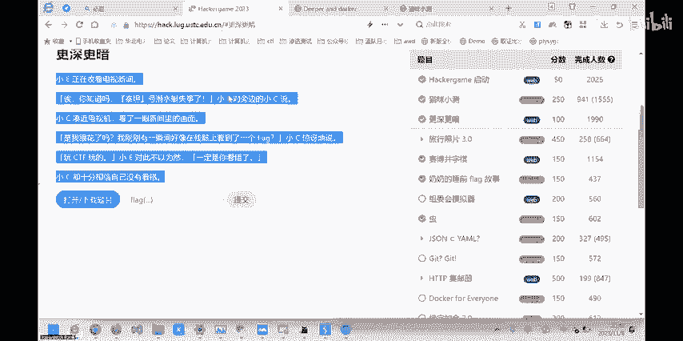

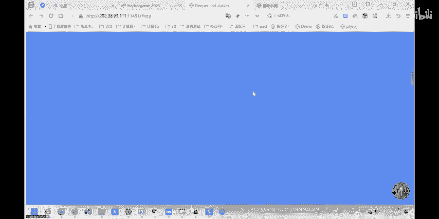

**核心概念**：使用Burp Suite Intruder模块对数字型参数进行爆破。
```http
POST /submit_quiz HTTP/1.1
...
Q1=§1§  # § § 之间的内容被标记为变量，将被Payload替换
```

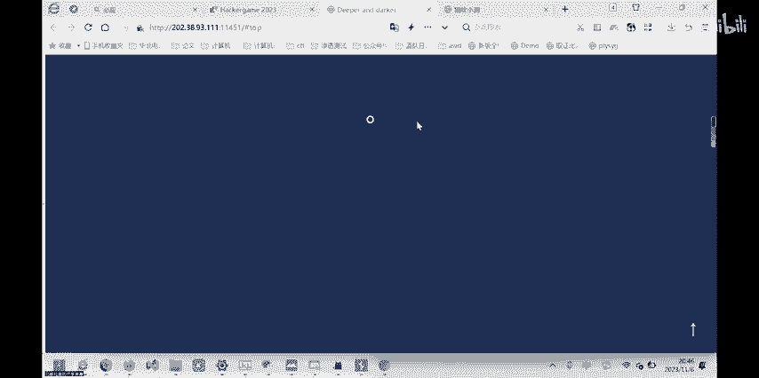

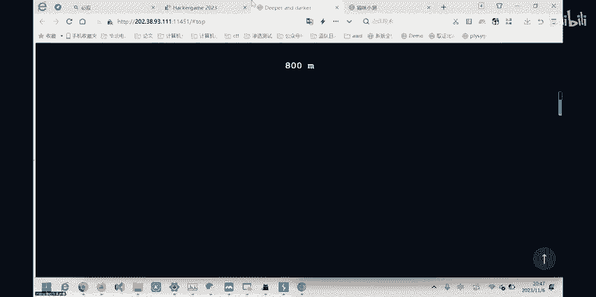

对于其他技术性问题，可以直接使用搜索引擎或询问AI（如ChatGPT）来获取答案。

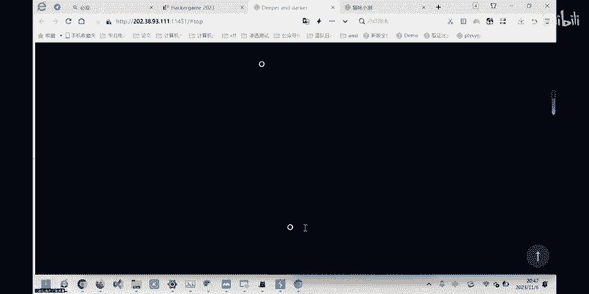

本节课中我们一起学习了如何使用Burp Suite的Intruder模块对Web请求进行参数爆破，以快速找到特定格式的答案。

---

## 第三题：更深更暗与JavaScript分析 🌑

题目是一个无限滚动的网页，提示一直向下翻找答案，但实际无法找到尽头。我们需要通过分析网页代码来找到获取答案的逻辑。

上一节我们尝试了手动寻找，本节中我们来看看如何通过分析前端JavaScript代码来解题。

网页的功能逻辑主要由JavaScript文件控制。我们需要检查关键的JS文件。

以下是分析过程：
1.  在浏览器中打开网页，按F12打开开发者工具，切换到`Sources`或`网络(Network)`标签页，查看加载的JS文件。
2.  找到看起来像主逻辑的文件（如 `main.js`）。
3.  分析代码，寻找与生成`flag`或答案相关的函数。题目中，存在一个函数，它基于用户的`token`生成`flag`。
4.  该函数的核心操作是：将 `token` 与一个固定字符串拼接，然后进行 **SHA256** 哈希计算，最后从哈希结果中截取特定部分作为`flag`的一部分。
5.  用户的`token`通常可以在页面HTML、Cookie或LocalStorage中找到。
6.  复制`token`，按照代码逻辑进行相同的拼接、哈希和截取操作，即可得到`flag`。

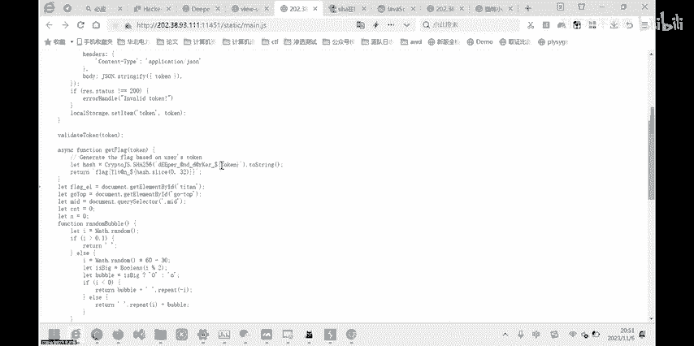

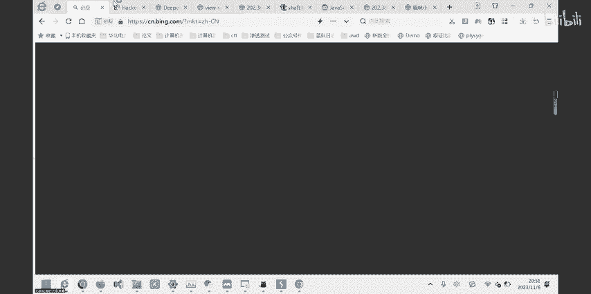

**核心公式**：
```
flag_part = SHA256(“固定前缀” + user_token).substring(开始位置, 结束位置)
final_flag = “flag{” + flag_part + “}”
```

我们可以使用在线的SHA256计算工具来执行这个操作。

本节课中我们一起学习了如何通过静态分析JavaScript代码，理解其生成`flag`的逻辑，并手动复现计算过程来获得答案。

---

## 第四题：井字棋与游戏状态篡改 ⭕❌

这是一个井字棋游戏，玩家需要对战AI。题目要求赢下AI才能获得`flag`，但正常游玩几乎不可能获胜。

上一节我们体验了游戏的难度，本节中我们来看看如何通过修改网络请求来作弊。

游戏的核心是客户端与服务器交换棋盘状态。每一步棋都会通过一个HTTP请求发送到服务器，服务器返回AI的落子和更新后的棋盘。

以下是作弊步骤：
1.  使用Burp Suite拦截玩家下棋的请求。请求中可能包含落子坐标（如 `x=1, y=1`）和一个会话标识（如 `session=abc123`）。
2.  分析响应，理解数据格式。通常，棋盘状态可能用数组表示，例如 `[0,0,0,1,-1,0,0,0,0]`，其中`0`代表空，`1`代表AI棋子，`-1`代表玩家棋子。
3.  关键点在于，我们可以修改请求，**不仅放置自己的棋子，还可以覆盖AI刚刚落下的棋子**。例如，在AI落子后，我们在发送下一步请求时，将代表AI棋子的`1`改为代表自己棋子的`-1`。
4.  同时，需要确保每次请求都携带正确的、更新后的`session`值，以维持游戏状态的一致性。
5.  通过这种方式，可以逐步控制整个棋盘，形成三连，从而获胜并获得`flag`。

**核心操作**：拦截并修改HTTP请求体，篡改棋盘数组中的特定值。
```json
// 修改前，AI在(0,0)落子
"board": [1, 0, 0, 0, 0, 0, 0, 0, 0]
// 修改后，将AI的棋子“偷”为己有
"board": [-1, 0, 0, 0, 0, 0, 0, 0, 0]
```

本节课中我们一起学习了如何通过拦截和篡改游戏客户端与服务器的通信数据，来改变游戏逻辑和状态，从而达到作弊的目的。

---

## 第五题：奶奶的睡前故事与漏洞利用 📱

题目描述了一段关于手机漏洞的故事，并附有一张被裁剪的截图。提示信息暗示旧版本系统存在截图相关的安全漏洞。

上一节我们分析了题目描述中的线索，本节中我们来看看如何根据线索寻找并利用特定漏洞。

根据“谷歌亲儿子”（Pixel手机）、“旧版本”、“截图漏洞”等关键词进行搜索，可以找到一个名为“aCropalypse”的漏洞（CVE编号：CVE-2023-28303）。该漏洞影响Pixel手机的标记（Markup）截图工具，可能导致被裁剪的原始图像数据残留在保存后的图片文件中。

以下是解题步骤：
1.  搜索“CVE-2023-28303”或“aCropalypse漏洞利用工具”。
2.  找到在线的漏洞利用网站或开源工具。
3.  将题目提供的截图文件上传到该工具。
4.  工具会尝试从文件残留数据中恢复被裁剪掉的部分，从而显示出完整的`flag`信息。

**核心概念**：利用特定软件（如Pixel标记工具）的漏洞（aCropalypse），从看似裁剪后的图片文件中恢复原始数据。

本节课中我们一起学习了如何根据题目描述中的技术线索，定位到具体的软件漏洞（CVE），并利用公开的漏洞利用工具来恢复隐藏信息。

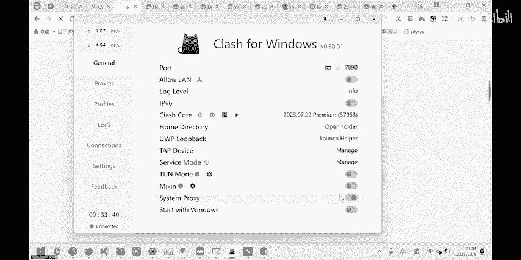

---

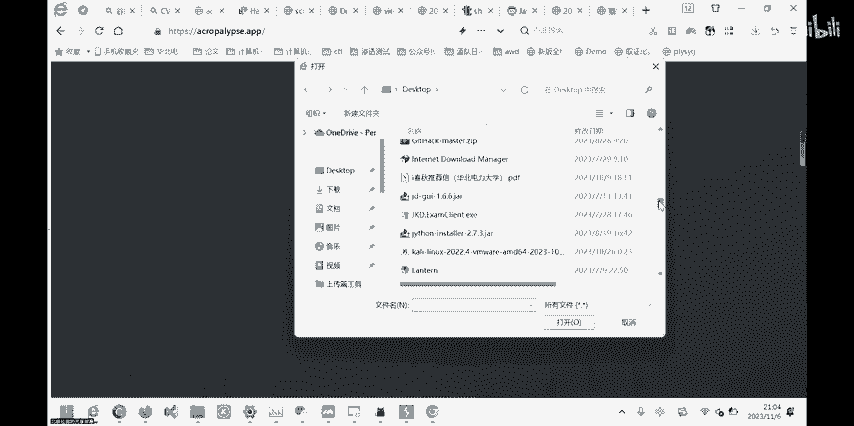

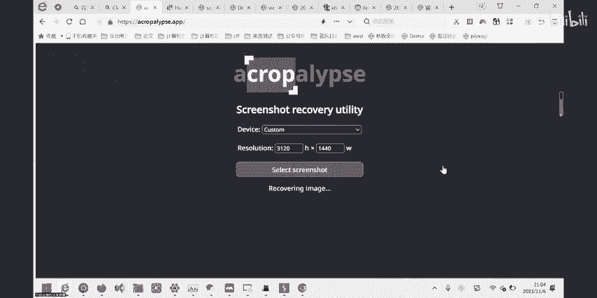

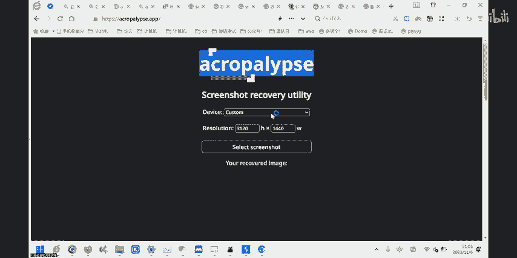

## 第六题：虫与无线电传图 📻

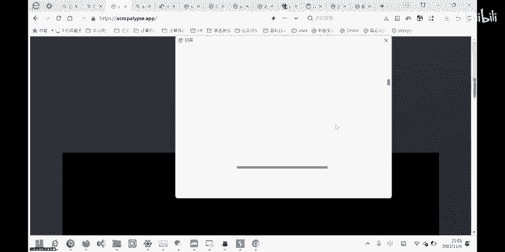

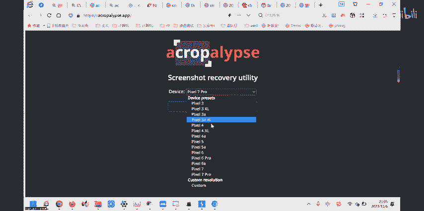

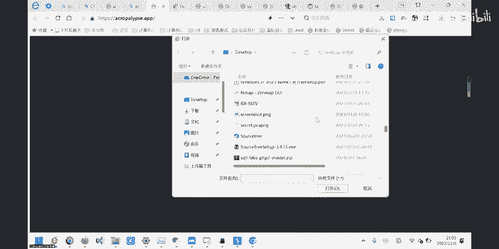

题目附件是一个WAV音频文件，描述中提到“通过无线电信号传输图片”。播放该音频只有嘈杂的噪音。

上一节我们听到了奇怪的音频，本节中我们来看看如何从这种特殊音频中解码出图像。

这是一种称为**SSTV（慢扫描电视）**的技术，常用于业余无线电爱好者传输图像。它将图像信息编码到声音的频率变化中。

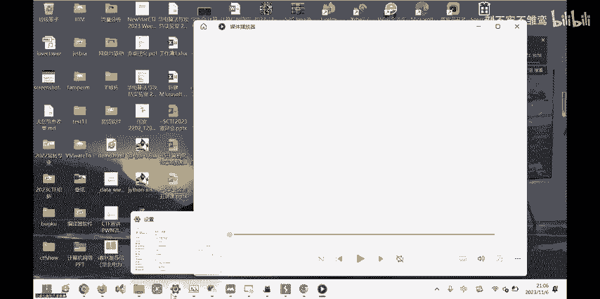

以下是解码步骤：
1.  搜索并下载SSTV解码软件，例如 `QSSTV`、`Robot36` 或在线解码工具。
2.  用该软件打开题目提供的WAV音频文件。
3.  软件会自动分析音频中的频率信号，并将其解码还原成一张图片。
4.  图片中通常就包含了本题的`flag`文字。

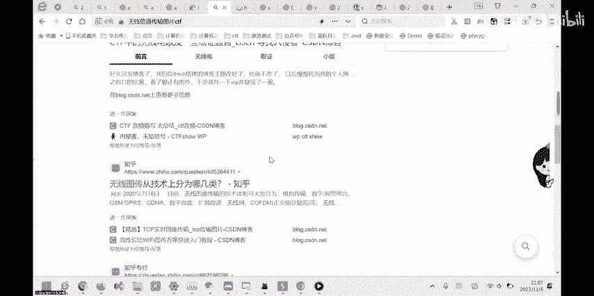

**核心概念**：使用SSTV解码软件，将编码在音频频率中的图像信息还原出来。

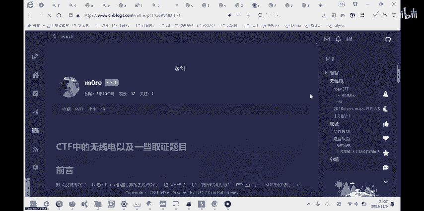

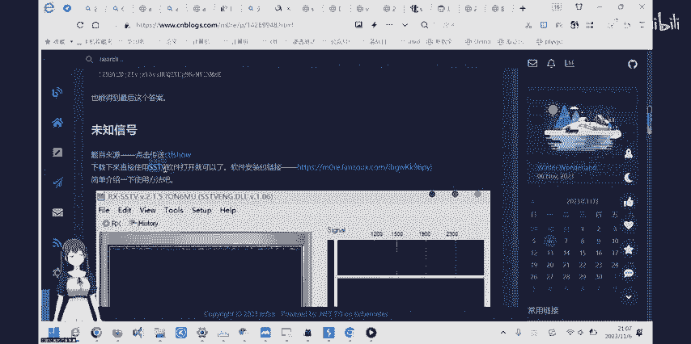

本节课中我们一起学习了SSTV的基本概念，并掌握了使用专用软件从特定格式的音频中解码出图像信息的方法。

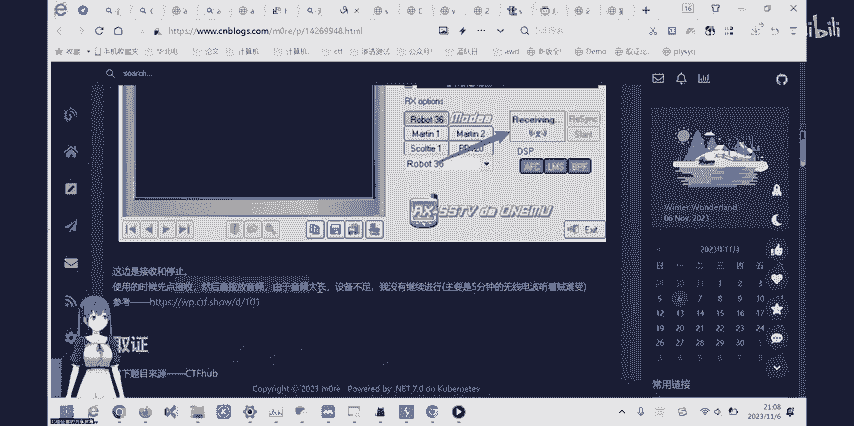

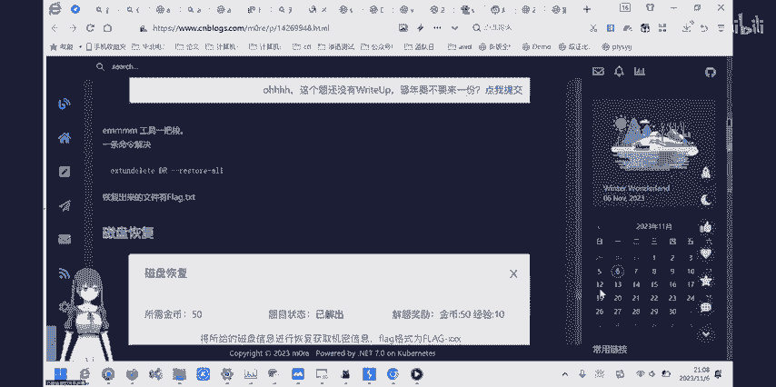

---

## 第七题：HTTP集邮与状态码收集 🌐

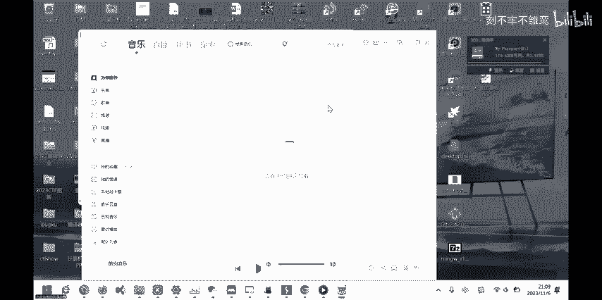

题目要求我们向一个特定的HTTP服务器发送请求，并收集返回的不同状态码，收集一定数量后即可获得`flag`。

上一节我们了解了题目的基本要求，本节中我们来看看如何触发各种HTTP状态码。

我们需要构造不同的HTTP请求来“触发”服务器返回不同的状态码。以下是一些常见状态码的触发方法：

以下是部分状态码的触发方法：
*   **200 OK**：发送一个正常的`GET /`请求。
*   **400 Bad Request**：发送一个格式错误的HTTP请求，例如在请求行中删除必要的部分。
*   **403 Forbidden**：尝试访问一个服务器存在但禁止访问的路径，如 `GET /flag`。
*   **404 Not Found**：访问一个不存在的路径，如 `GET /nothinghere`。
*   **405 Method Not Allowed**：对一个路径使用不允许的HTTP方法，例如对 `/` 使用 `POST` 请求。
*   **500 Internal Server Error**：有时通过构造特殊请求触发服务器端异常。
*   **505 HTTP Version Not Supported**：使用一个服务器不支持的HTTP协议版本，如 `HTTP/3.0`。

在题目环境中，需要尝试多种组合，并注意观察服务器返回的响应头。有时需要利用服务器特性（如缓存验证`If-Modified-Since`触发304）来获取特定状态码。

本节课中我们一起学习了HTTP协议中各种状态码的含义，并实践了通过构造特殊请求来触发这些状态码的方法，从而完成收集任务。

---

## 总结 📝


本节课中我们一起学习了2023年hackergame中多道题目的解题思路。我们从简单的参数修改入手，逐步深入到Web请求爆破、JavaScript逆向分析、游戏数据篡改、特定漏洞利用以及信号处理等领域。这些题目虽然形式各异，但核心都围绕着**对输入、输出或通信过程的分析、拦截与修改**。希望通过本教程，你能对CTF竞赛中的常见题型和解题技巧有一个初步的了解。