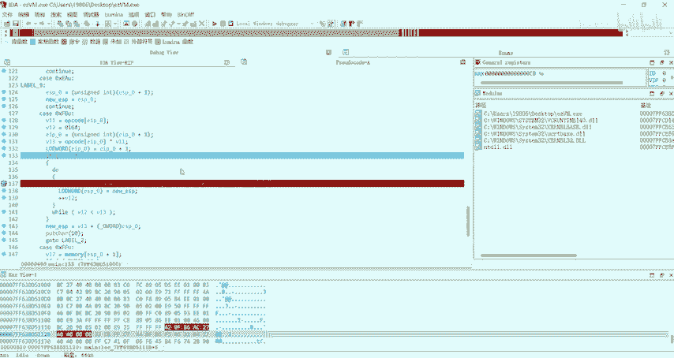
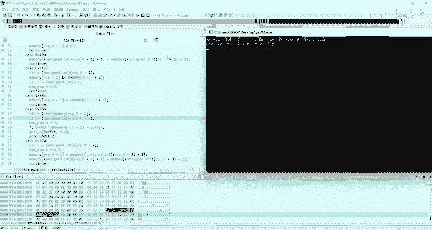
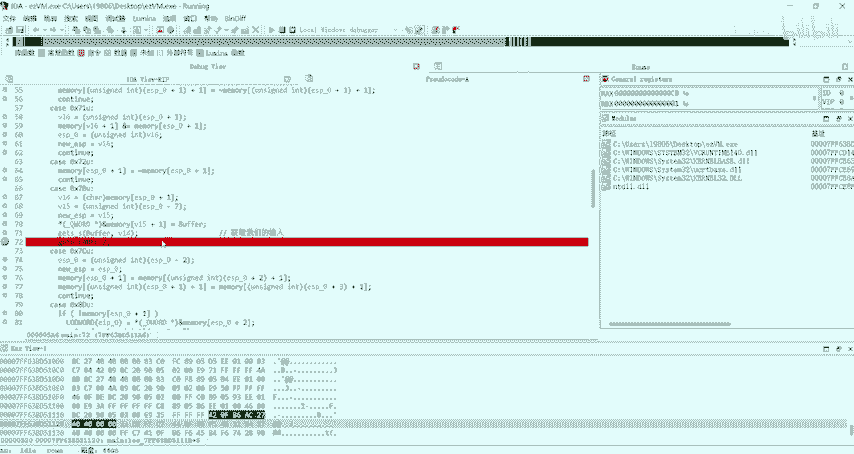
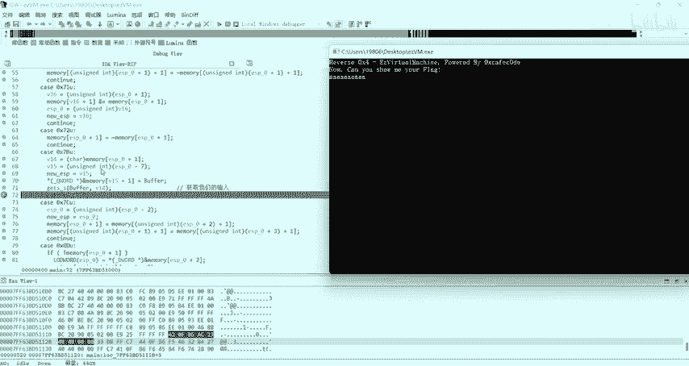
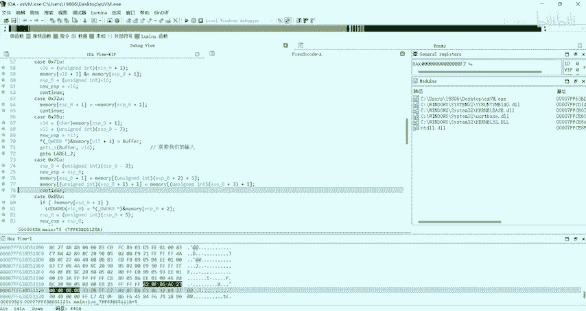
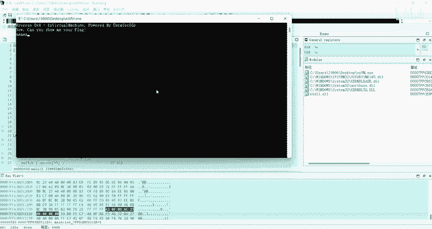
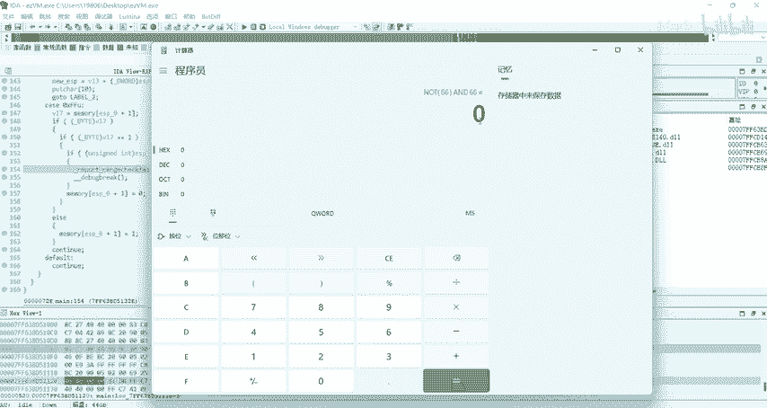
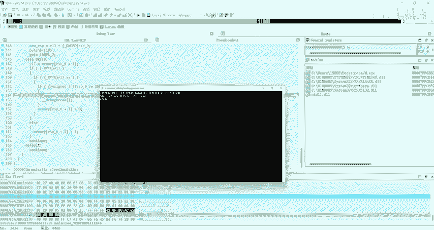
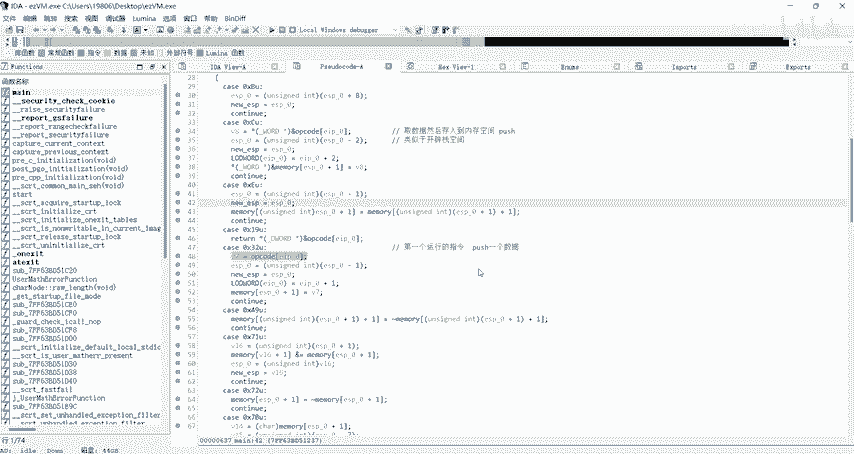

# NCTF逆向工程：P1：EZVM虚拟机初步分析 🧩

在本节课中，我们将学习如何分析一道来自2023年NCTF网络安全比赛的逆向工程题目，名为“EZVM”。这是一道虚拟机（VM）保护类型的题目，我们将从程序的基本结构入手，理解其工作原理，并找到验证逻辑的关键点。

## 程序结构与初步分析

首先，我们使用工具检查程序，发现它是一个64位的Windows控制台程序。运行程序后，它会等待用户输入。

在IDA Pro中打开程序，定位到主函数。我们发现程序的核心是一个典型的虚拟机结构，其特征是一个大的`switch`语句，用于根据不同的操作码（Opcode）执行不同的模拟指令。

```c
while ( 1 )
{
  v6 = eip;
  opcode = *eip;
  ++eip;
  switch ( opcode )
  {
    // ... 各个case分支，模拟不同的指令
  }
}
```
在上面的代码中，`eip`指针类似于CPU中的指令指针，指向当前要执行的操作码。`opcode`变量存储了取出的操作码值，然后`eip`自增，指向下一条指令。`switch`语句的每个`case`分支模拟了一条汇编指令的功能。

## 虚拟机内存模型





接下来，我们分析虚拟机的内存模型。程序中定义了一个数组，我们将其重命名为`mem`，它充当了虚拟机的内存空间。





```c
char mem[256]; // 虚拟机内存空间
```
此外，还有一个关键变量（我们称之为`esp`），它初始化为`0x100`（即十进制256），指向`mem`数组的末尾。通过分析代码发现，该变量的作用类似于栈指针（ESP），用于在`mem`数组中定位数据存储的位置。

例如，当执行`push`操作时，程序会先将`esp`递减，然后将数据存入`mem[esp]`指向的位置。这模拟了栈的“后进先出”特性。

## 动态调试与指令分析



静态分析复杂的虚拟机代码有时很困难，因此我们转向动态调试。我们在主循环处设置断点，开始单步执行程序。



我们观察到程序首先执行了一系列`push`指令，将一些数据存入内存。这些数据实际上是程序要输出的提示信息字符串。随后，程序会调用一个函数将这些信息打印出来。

关键点在于程序如何验证用户输入的Flag。输入函数将用户输入的字符串存储在一个缓冲区中，该缓冲区紧邻着虚拟机的`mem`内存空间。

## 核心验证逻辑剖析

程序开始对输入进行验证。通过动态跟踪，我们发现验证过程涉及两个从内存中取出的数据（例如`0xB8`和`0xDE`），并对它们进行一系列位运算。

尽管代码中充满了许多赋值、取反和相与操作，看起来非常复杂，但其核心运算可以简化为一个异或（XOR）操作。经过一系列操作后，程序会得到一个结果值（例如`0x66`）。

然后，程序会取用户输入的一个字节（例如`0x61`，即字母‘a’的ASCII码），与上述结果进行特定的位运算比较。如果运算结果不为0，则设置错误标志。

**核心验证公式**可以抽象为：
```
( (input_byte) & (~result) ) | ( (~input_byte) & (result) ) != 0
```
这本质上就是在判断 `input_byte ^ result != 0`，即判断输入字节是否与预期的结果值相等。

在本例中，`0xB8 ^ 0xDE = 0x66`，而`0x66`恰好是字母‘F’的ASCII码。这意味着程序正在将用户输入的第一个字符与‘F’进行比较。

## 解题思路总结

本节课中我们一起学习了EZVM题目的初步分析。我们了解到：





1.  程序实现了一个自定义的虚拟机，使用`switch-case`结构模拟指令执行。
2.  虚拟机使用一个数组作为内存，并用一个指针模拟栈的行为。
3.  程序的验证逻辑虽然代码冗长，但核心是逐字节比较用户输入与预期值是否相等。
4.  预期的值是通过对两组固定数据（`0xB8`和`0xDE`）进行异或运算得到的。
5.  因此，解题的关键在于提取出程序中所有用于异或的固定数据对，然后计算它们的异或值，拼接起来即可得到完整的Flag。



在下一部分，我们将具体讲解如何编写脚本自动化提取数据并计算出最终的Flag。