# CTF夺旗赛：P10：SQL注入攻击实战

在本节课中，我们将学习CTF（Capture The Flag）竞赛中一个至关重要的知识点——SQL注入漏洞。我们将从漏洞原理讲起，通过一个完整的实战演练，学习如何利用工具发现并利用SQL注入漏洞，最终获取目标系统的后台访问权限。

## SQL注入漏洞原理

上一节我们介绍了CTF的基本概念，本节中我们来看看SQL注入漏洞的核心原理。

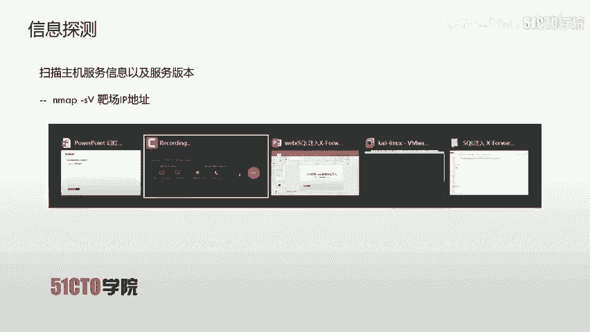

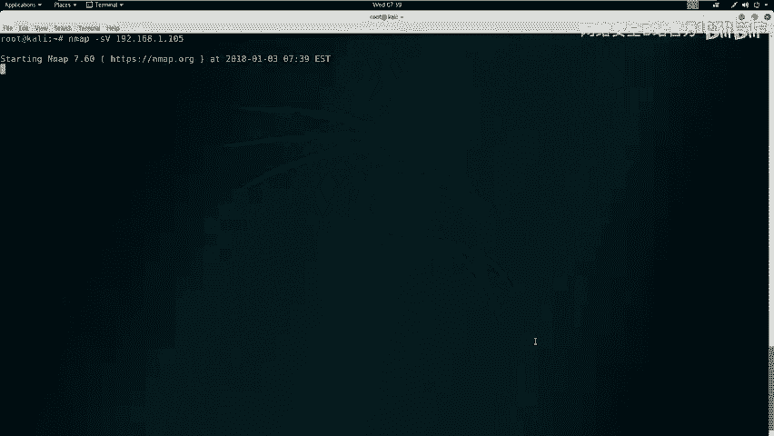

SQL注入漏洞是指攻击者通过构建特殊的输入作为参数传入Web应用程序中。当Web应用程序执行这些被恶意构造的参数时，会执行原本未设定的SQL语句，从而导致非法数据侵入系统。

**核心概念**：在Web应用中，任何允许用户输入的位置都可能存在SQL注入点。攻击者可以在这些位置构造恶意的SQL语句，提交给应用程序执行。

以下是可能存在注入点的常见位置：
*   **URL参数**：例如，网址中类似 `?id=1` 的参数。
*   **HTTP报文头部**：例如 `X-Forwarded-For`、`User-Agent`、`Cookie` 等字段。

## 实验环境搭建

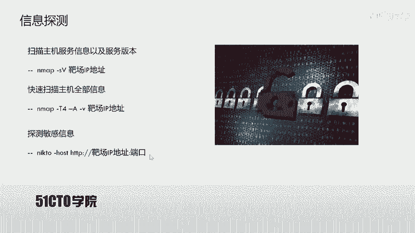

理解了原理后，我们需要一个环境来实践。本节我们将搭建本次实战的实验环境。

本次实验涉及两台虚拟机：
*   **攻击机 (Kali Linux)**：IP地址为 `192.168.1.104`，用于发起攻击。
*   **靶场机器**：IP地址为 `192.168.1.105`，运行着存在漏洞的Web应用。

我们的目标是：挖掘该Web应用的漏洞，最终登录系统后台。

## 第一步：信息探测

在开始攻击前，我们首先需要了解目标。本节我们将使用工具探测靶场系统开放的服务和敏感信息。

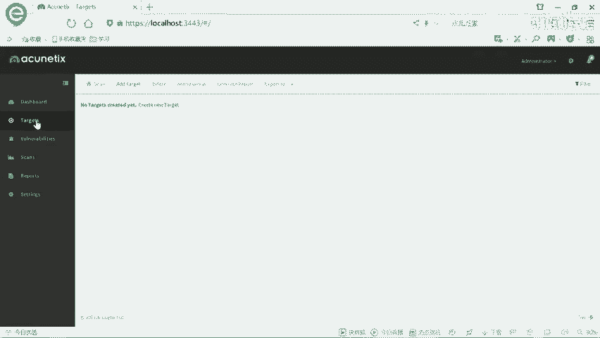

首先，我们使用 `Nmap` 工具扫描靶场机器，获取其开放端口、服务类型及版本信息。

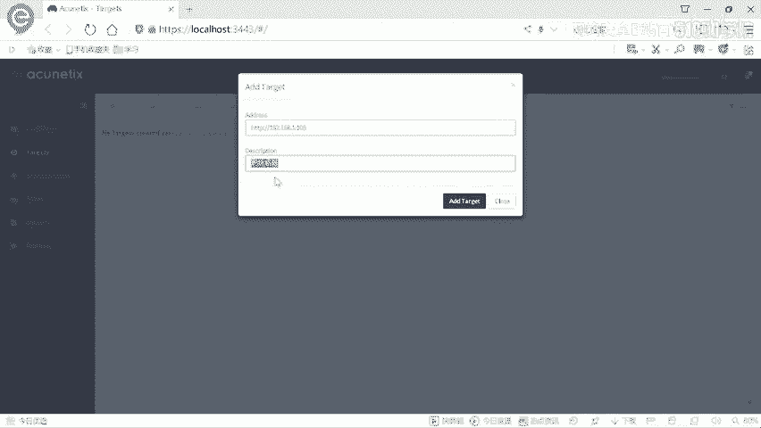

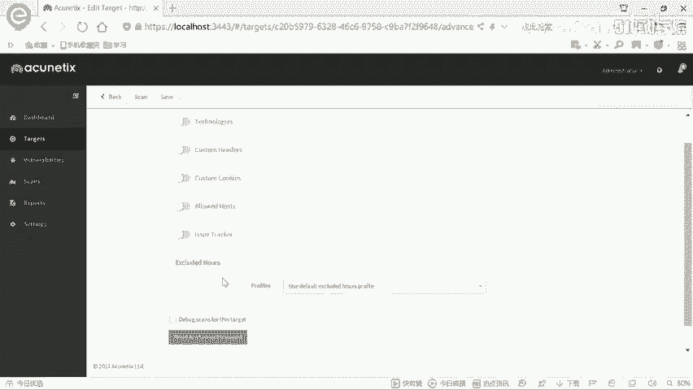

在Kali终端中执行以下命令进行快速扫描：
```bash
nmap -sS -sV 192.168.1.105
```

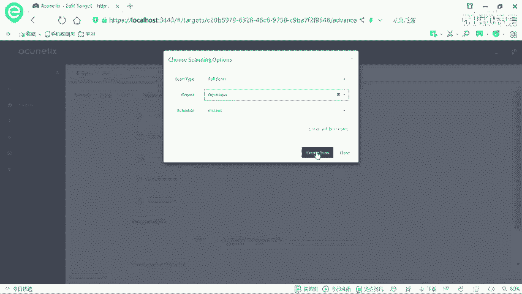

为了获取更全面的信息（如操作系统类型），我们可以使用更强大的扫描选项：
```bash
nmap -T4 -A -v 192.168.1.105
```
**参数解释**：
*   `-T4`：设置扫描速度为高速。
*   `-A`：启用操作系统检测、版本检测、脚本扫描和路由跟踪。
*   `-v`：显示详细输出。

扫描结果显示，靶场只开放了80端口的HTTP服务，服务器为Nginx。

接下来，我们使用 `nikto` 工具扫描Web应用的敏感目录和文件。
```bash
nikto -host http://192.168.1.105
```
扫描发现了一个管理员登录页面 (`/admin/login.php`)。我们通过浏览器访问该页面，尝试常用弱口令（如 `admin/admin`, `admin/123456`）均告失败，因此需要寻找其他漏洞入口。

## 第二步：漏洞扫描

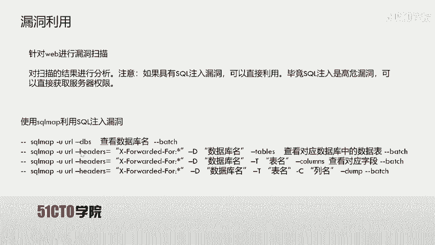

既然弱口令无效，我们需要系统性地查找Web应用漏洞。本节我们将使用专业的漏洞扫描器来完成这项工作。

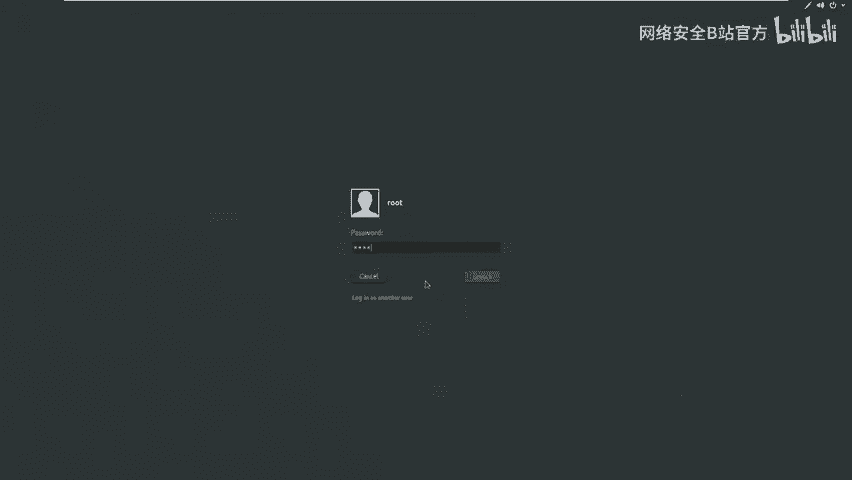

我们选择 `AWVS` (Acunetix) 作为漏洞扫描器。它功能强大，更新迅速，能有效发现各类Web安全漏洞。

操作流程如下：
1.  打开AWVS并登录。
2.  点击 `Targets` -> `Add Target`，添加目标地址 `http://192.168.1.105`。
3.  选择 `Full Scan`（完全扫描）模式并开始扫描。

扫描过程中，AWVS提示发现一个**高危漏洞——盲注 (Blind SQL Injection)**，位置在HTTP头部的 `X-Forwarded-For` 字段。这证实了我们的目标存在SQL注入点。

## 第三步：漏洞利用

发现了SQL注入点，接下来就是利用它获取数据。本节我们将使用自动化工具 `sqlmap` 来利用该漏洞。

根据AWVS的扫描结果，注入点在 `X-Forwarded-For` 请求头。我们使用以下 `sqlmap` 命令进行自动化注入攻击，并尝试获取数据库名称。
```bash
sqlmap -u "http://192.168.1.105" --headers="X-Forwarded-For: *" --dbs --batch
```
**参数解释**：
*   `-u`：指定目标URL。
*   `--headers`：指定存在注入点的HTTP头，`*` 号标记注入位置。
*   `--dbs`：枚举数据库。
*   `--batch`：以非交互模式运行，自动选择默认选项。

命令执行后，`sqlmap` 成功识别出注入类型（基于时间的盲注），并开始逐个字符地枚举数据库。最终发现了两个数据库：`information_schema`（系统库）和 `photoblog`（用户库）。

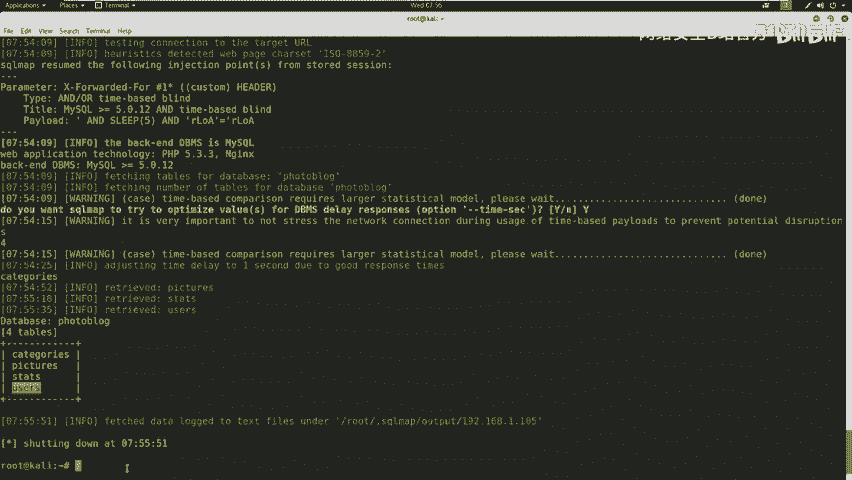

我们的目标是 `photoblog` 库。接下来，我们枚举该库中的所有表。
```bash
sqlmap -u "http://192.168.1.105" --headers="X-Forwarded-For: *" -D photoblog --tables --batch
```
发现其中包含 `users` 表，这很可能存放着后台登录凭证。我们继续枚举该表的字段。
```bash
sqlmap -u "http://192.168.1.105" --headers="X-Forwarded-For: *" -D photoblog -T users --columns --batch
```
字段枚举结果显示有 `login` 和 `password` 字段。最后，我们导出这两个字段的数据。
```bash
sqlmap -u "http://192.168.1.105" --headers="X-Forwarded-For: *" -D photoblog -T users -C "login,password" --dump --batch
```
`sqlmap` 成功获取到一条用户记录：用户名为 `admin`，密码的MD5哈希值为 `c7e...`。`sqlmap` 自动调用内置字典破解了该MD5哈希，得到明文密码为 `P4SSW0RD`。

## 第四步：获取权限

成功获取凭证后，最后一步就是登录系统。本节我们将使用破解到的账号密码进入后台。

在之前发现的管理员登录页面 (`/admin/login.php`) 中，输入用户名 `admin` 和密码 `P4SSW0RD`，点击登录。

登录成功！我们进入了Web应用的后台管理界面，至此，通过SQL注入漏洞获取系统权限的目标圆满完成。

## 总结

本节课中我们一起学习了SQL注入攻击的完整流程。我们从漏洞原理出发，通过 `Nmap` 和 `nikto` 进行信息收集，利用 `AWVS` 发现漏洞，最后借助强大的 `sqlmap` 工具自动化地利用注入点，一步步获取数据库信息、破解用户密码，最终成功登录目标系统后台。

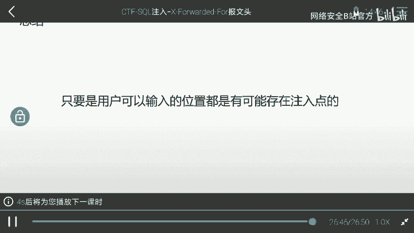

关键要点在于：**SQL注入点可能存在于任何用户可控的输入位置**，包括URL参数和HTTP头部。在实战或CTF比赛中，合理利用自动化工具可以极大提高效率，帮助我们快速定位和利用漏洞。