# CTF学习：P17：命令注入1

在本节课中，我们将学习命令注入漏洞。我们将了解如何通过Web应用程序从外部执行主机的Shell命令，最终获得主机的访问权限，提升root权限，并取得对应的flag值。

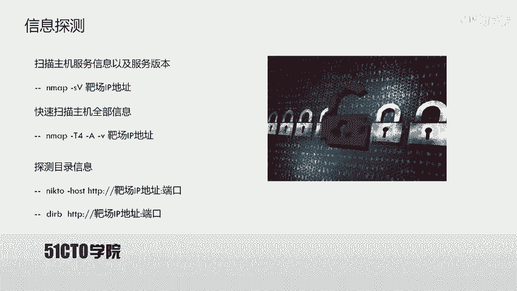

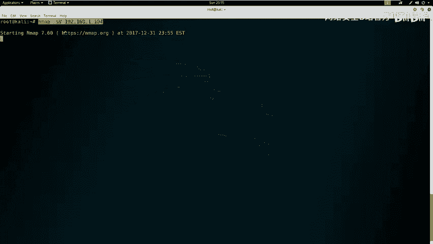

## 实验环境概述

攻击机是Kali Linux，其IP地址为 `192.168.1.106`。靶场机器的IP地址为 `192.168.1.104`。

在CTF比赛中，主要目标是获取靶场机器上的flag值。所有操作都应围绕获取flag值以及控制靶场机器这一目标展开。

## 第一步：信息探测

首先，我们使用Nmap对靶场机器进行服务信息及版本扫描。

以下是扫描命令：
```bash
nmap -sV 192.168.1.104
```

除了扫描版本信息，还可以使用以下命令扫描主机的全部信息：
```bash
nmap -A -v -T4 192.168.1.104
```
参数 `-T4` 表示Nmap以最大效率发送数据包，从而加快扫描速度。

探测到主机开放HTTP服务后，可以使用Nikto或Dirb扫描靶场HTTP服务的目录信息。

以下是Nikto扫描命令：
```bash
nikto -h http://192.168.1.104
```

以下是Dirb扫描命令：
```bash
dirb http://192.168.1.104
```

## 第二步：信息分析与利用

探测完信息后，需要从扫描结果中挖掘有用的信息，以帮助渗透靶场机器。

如果开放了HTTP服务，可以使用浏览器访问敏感页面，查看敏感信息。

访问扫描发现的目录，例如 `/robots.txt`，可能会发现被禁止爬取的目录。依次访问这些目录，可能会发现可利用的信息。

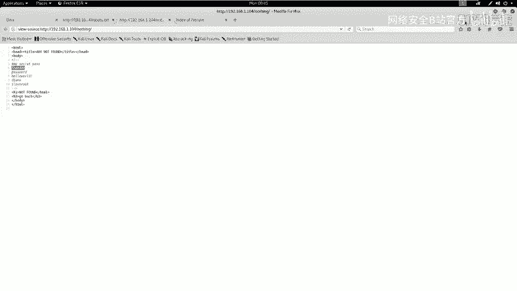

例如，访问 `/no` 目录时，页面显示为404，但与真正的404页面略有不同。查看该页面的HTML源代码，在注释中可能发现敏感信息，如密码。

以下是可能发现的密码示例：
```
my secret pass: freedom
password: hello world!
I love root
```

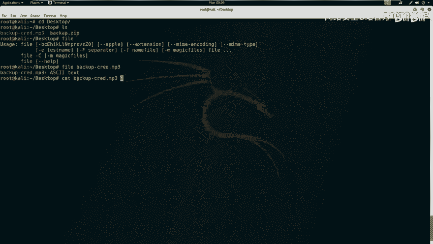

## 第三步：深入挖掘与文件分析

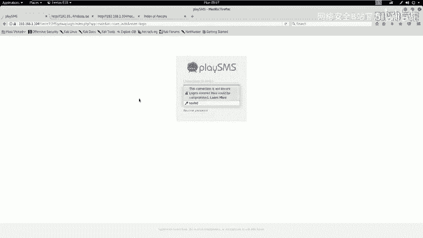

在扫描结果中，可能发现名为 `/secret` 的目录。访问该目录，可能会发现一个备份文件，例如 `backup.zip`。

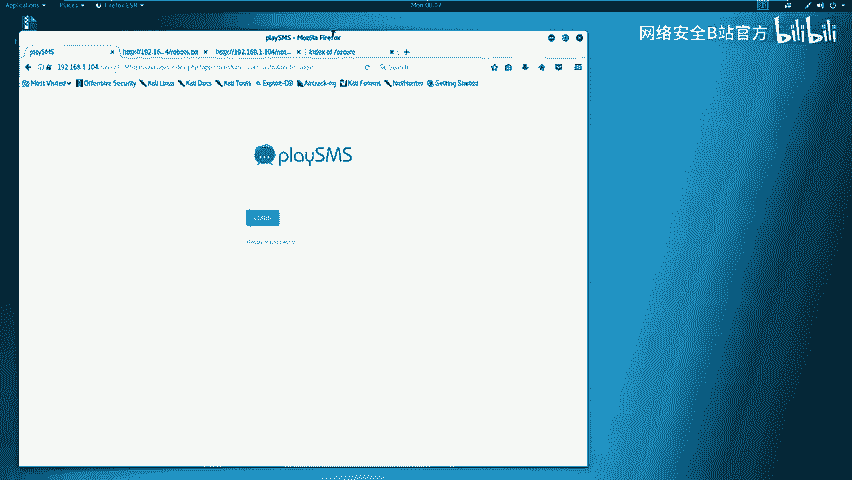

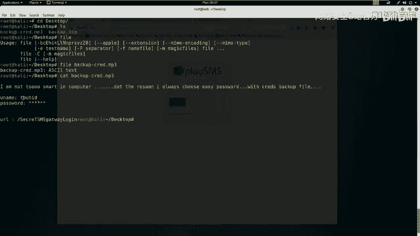

下载该备份文件后，尝试解压。解压时可能需要密码，此时可以尝试使用之前发现的密码。

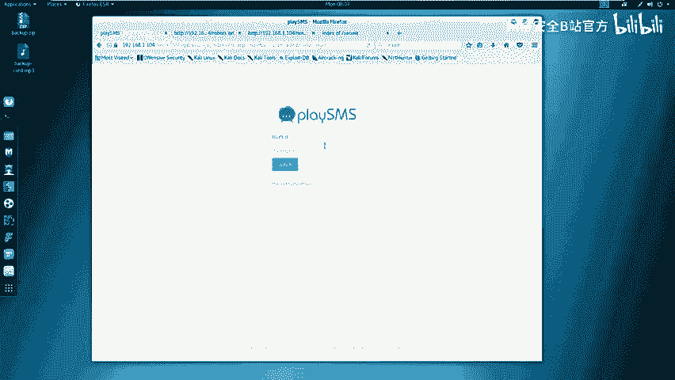

解压后得到一个文件，例如 `backup.mp3`。使用 `file` 命令检查其真实文件类型：
```bash
file backup.mp3
```
结果可能显示它实际上是一个ASCII文本文件。

使用 `cat` 命令查看文件内容：
```bash
cat backup.mp3
```
文件内容可能包含用户名、被星号隐藏的密码以及一个URL。

## 第四步：登录与漏洞发现

访问文件中发现的URL，可能是一个登录界面。使用文件中发现的用户名和之前找到的密码尝试登录。

成功登录后台后，需要检查该系统是否为已知系统，并查找其公开漏洞。

可以使用 `searchsploit` 工具搜索已知漏洞：
```bash
searchsploit playsms
```
搜索结果会显示相关漏洞的详细信息及利用代码路径。

## 第五步：漏洞验证与利用

根据漏洞描述，可能涉及不严格的文件上传功能。任何注册用户都可以上传任意文件，因为缺乏合适的文件验证。

漏洞可能存在于 `sendfromfile.php` 文件中。该PHP文件接受任何扩展名，并且只读取文件内容而不存储到服务器。

但是，如果用户修改了上传文件的文件名，服务器可能会执行其中的代码，从而导致代码执行。

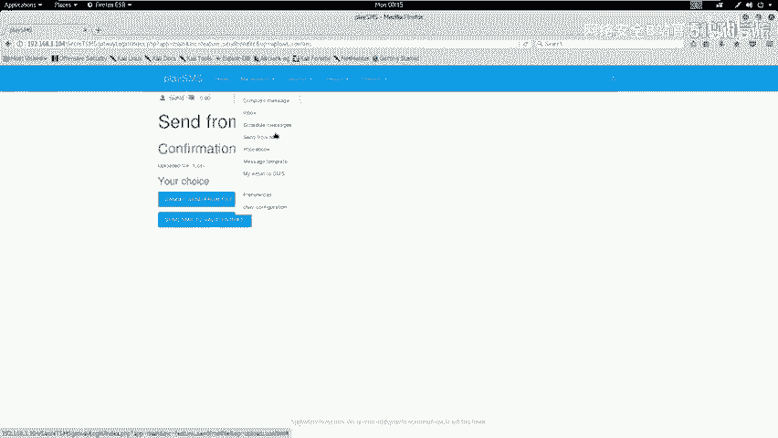

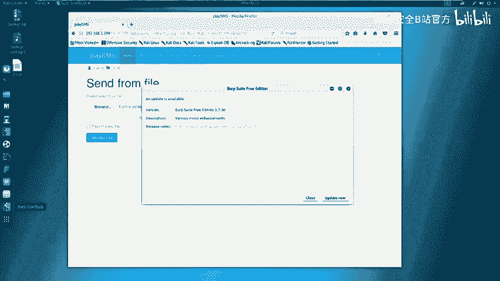

以下是验证漏洞的步骤：

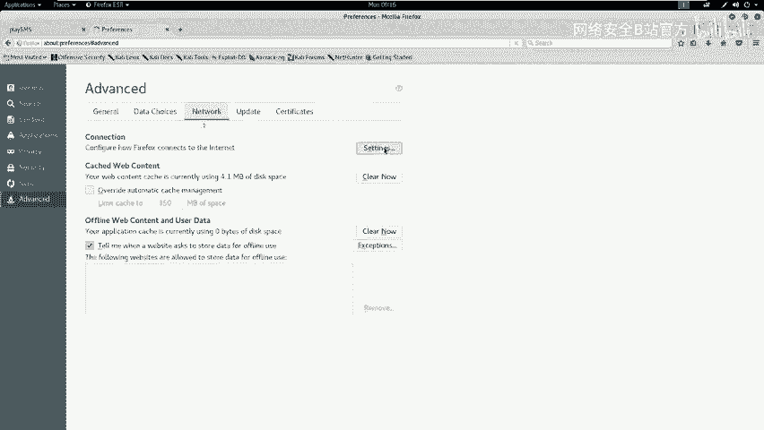

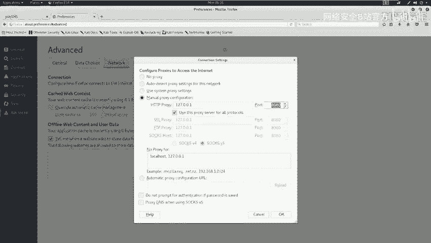

1.  访问漏洞文件路径，例如 `/sendfromfile.php`。
2.  上传一个任意文件，例如 `1.csv`。
3.  使用Burp Suite拦截上传请求。
4.  将拦截到的数据包发送到Repeater模块。
5.  修改 `filename` 参数，将其值改为包含PHP代码的字符串。

例如，将 `filename` 修改为：
```
<?php system("uname -a"); ?>
```
发送修改后的请求，如果服务器返回了系统命令 `uname -a` 的执行结果，则证明存在代码执行漏洞。

可以进一步尝试执行其他命令，如 `id`，来查看当前用户权限。

## 总结

本节课我们一起学习了命令注入漏洞的初步利用流程。

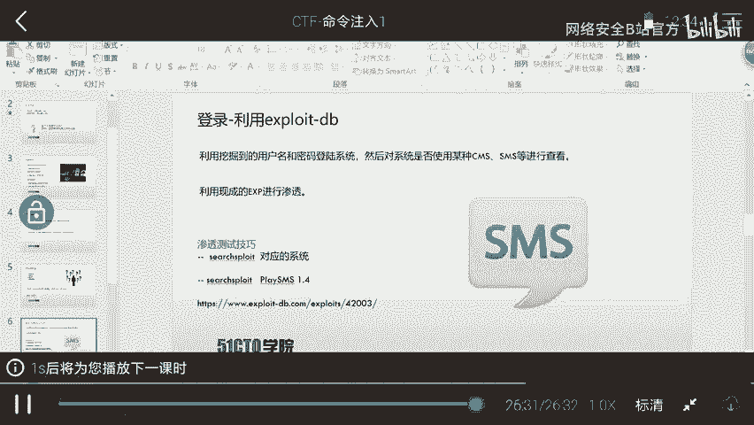

我们首先对靶场进行信息探测，然后分析扫描结果，挖掘出敏感信息和文件。接着，我们利用发现的密码登录后台系统，并通过搜索发现已知漏洞。最后，我们验证并利用了文件上传功能中的代码执行漏洞，成功在服务器上执行了系统命令。

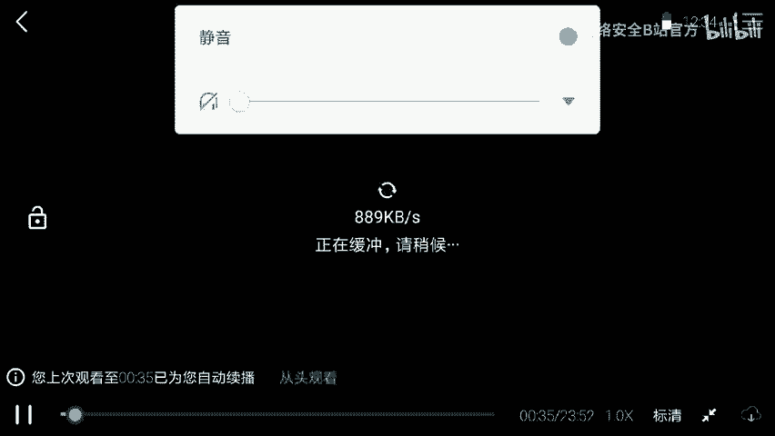

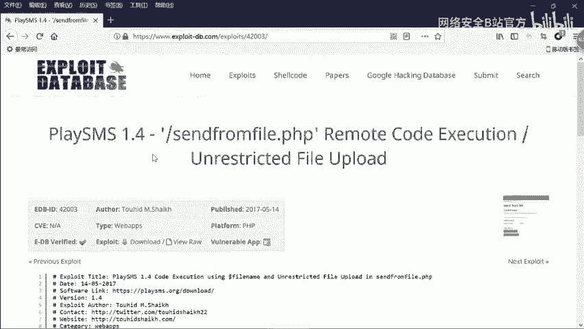

整个过程强调了在CTF比赛中信息收集的重要性，任何细微的线索都可能成为突破的关键。下一节课，我们将讲解如何利用此漏洞获得远程Shell，从而完全控制服务器。