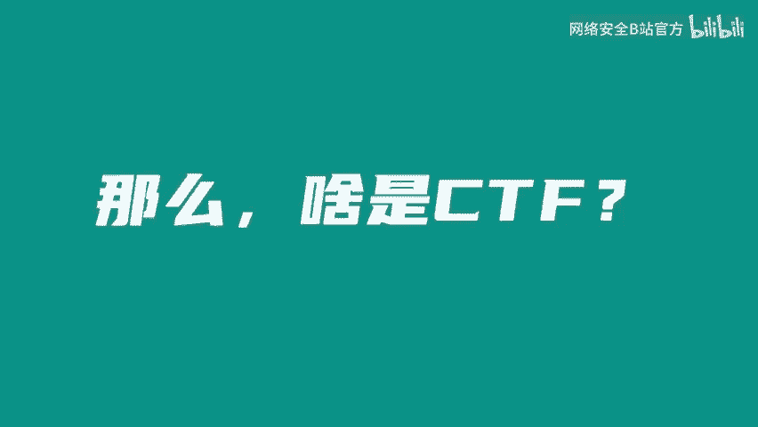
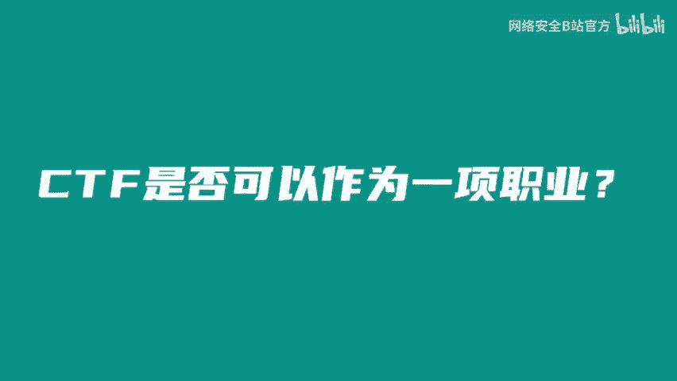
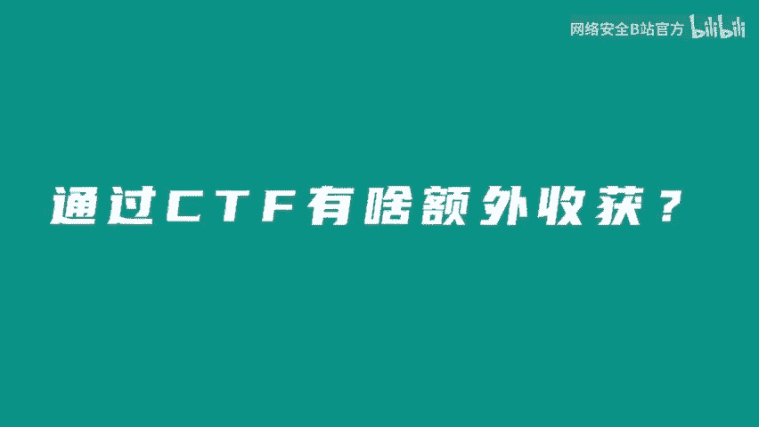

# CTF入门指南：P1：关于CTF大佬那些事 🏴‍☠️

在本节课中，我们将通过几位资深CTF选手的分享，了解CTF（夺旗赛）竞赛的真实面貌、它能带来的收获，以及它如何影响职业发展。

---

我本科时期实现了经济独立，很早就实现了“干饭自由”。可以说，别人的大学生活是在校园里上课，而我的大学生活则是在各地旅游。我认识了研究生导师朱葛建伟老师，后来成功考研到了清华大学网络研究院。

很多人对网络安全有误解。有人问：“是不是可以帮我盗QQ币？”“是不是能定位我女朋友的手机？”“是不是能让网站瞬间变黑的那帮人？”也有人担心：“网络安全，是不是想窃听我的手机？”“别老看我的购买记录了，我的购物车里没东西了。”

对于CTF，有人问：“哦，是让人互相攻击的那个吗？是不是动不动就让人电脑蓝屏的那个？”让我们听听CTF选手们怎么说。

大家好，我叫大雄，现在在无痕实验室。之前待过一些战队，比如RCE、Red Bar、TD和蓝莲花。作为一名CTF老赛棍，CTF给我带来了不少收获。无论是在保研还是求职方面，丰富的大赛经验总能给你加分，让你不至于倒在第一轮简历筛选上。

大家好，我是来自北京邮电大学天枢战队的队长贝尔，现在在字节跳动无痕实验室实习，主要负责逆向工程方向。对我来说，CTF让我收获了很多朋友，包括我自己队伍的队友、各大高校的师傅以及国内外各大公司的安全研究人员。能够得到他们的认可和信任，对我也是一种鼓励。

大家好，我是来自字节跳动无痕实验室的恩尼，也是“京麒杯”CTF的出题负责人。这是我第一次从幕后走到前台来分享。欢迎大家来找我线下PK。首先收获的还是快乐，比如和队友一起解题，或者比赛获奖时的成就感。

---

上一节我们了解了CTF选手们的背景，本节中我们来看看一个核心问题：CTF能否作为一项职业？

CTF确实可以作为职业方向之一，毕竟现在已经催生了一系列相关产业链，养活了不少人。学生阶段，我也借助CTF培训的机会赚了一些零花钱。但就我个人而言，我更多是将CTF当作一个兴趣爱好。我更享受的是和朋友一起解题的乐趣。

对我来说，CTF是入门安全行业的一个好起点。它可以让你认识更多志同道合的朋友，同时学习到前沿有用的知识。我理解CTF本身不能直接作为一个职业，因为一旦成为职业，可能会失去CTF本身的一些乐趣。我更希望大家能享受比赛本身的乐趣。

---

通过CTF有什么额外收获？首屈一指的肯定是公费旅游。借着CTF的机会，我在读书期间去了不少地方，体验了国内外不同的风土人情，去过几次日本和迪拜。另一个潜在的福利是，你的零花钱会相对宽裕。比赛奖金加上培训收入，读研期间我自己玩得还是比较嗨的。

我觉得额外的福利是安全行业对你本人的认可。特别是现在，越来越多的公司在招聘安全研究人员时，会十分看重你的CTF经历，这提高了我们在求职道路上的竞争力。而且在找工作时，越来越多的地方会直接联系你，避免了很多繁琐的步骤，简直就像招聘的直通车。

---

本节课中，我们一起学习了CTF竞赛的多元价值。我们了解到，CTF不仅是技术竞技，还能带来经济独立、公费旅游、广阔人脉和行业认可等实际收获。同时，资深选手们也提醒我们，保持对技术的热爱和享受比赛的乐趣至关重要。对于初学者而言，CTF是一个进入网络安全领域的绝佳起点。