# CTF综合测试(高难度)WEB安全初级入侵：P20：20.22. 信息探测与登录绕过 🎯

在本节课中，我们将学习如何对一个Web应用程序进行安全漏洞测试，目标是入侵系统，最终获取主机的最高权限（root权限）或找到CTF比赛中的flag值。我们将从信息探测开始，逐步分析并尝试绕过登录认证机制。

## 概述

随着Web 2.0、社交网络、微博等新型互联网产品的诞生，基于Web环境的互联网应用越来越广泛。在企业信息化过程中，各种应用都架设在Web平台之上。Web业务的迅速发展也引来了黑客的强烈关注，随之而来的是Web安全威胁的凸显。黑客利用网站操作系统的漏洞和Web应用程序的SQL注入漏洞等，获取Web服务器的控制权限。轻则篡改网页内容，重则窃取企业内部重要数据，甚至在网页中植入恶意代码（如挖矿脚本），使访问者受到侵害。

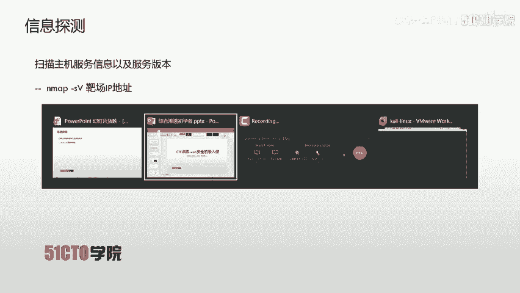

## 实验环境介绍

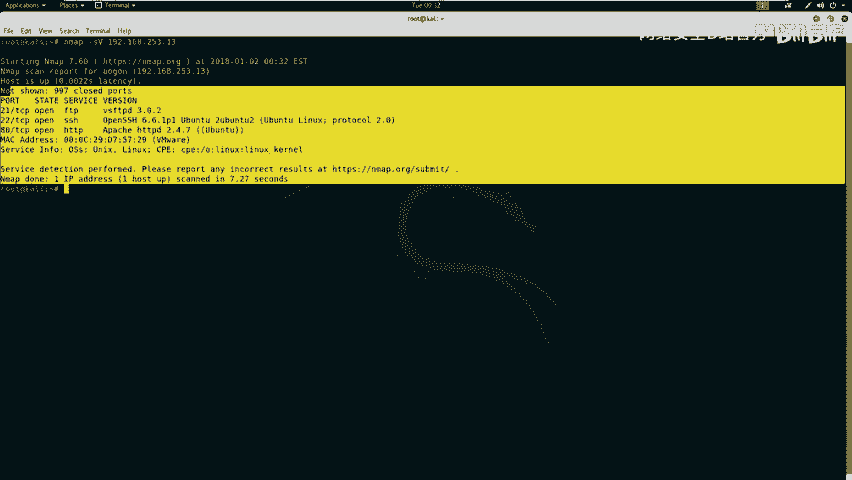

*   **攻击机IP地址**：`192.168.253.12`
*   **靶机IP地址**：`192.168.253.13`


我们的目标是获取靶机的root权限。在CTF比赛中，目标则是找到靶机上的flag值。

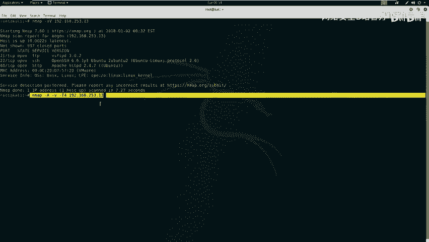

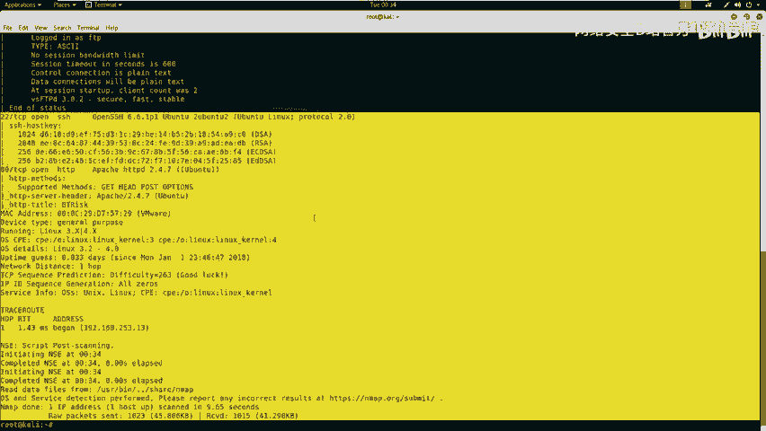

## 第一步：信息探测

在开始渗透测试前，首先需要对靶机进行信息探测，深入了解其开放的服务和版本信息。

以下是信息探测的常用工具和方法：

### 使用Nmap扫描服务

Nmap是一款强大的网络扫描工具，可以探测主机开放的服务及版本。

**扫描服务版本信息**：
```bash
nmap -sV 192.168.253.13
```
执行此命令后，Nmap会向靶机发送数据包，并将处理后的服务信息显示在标准输出中。

**使用Nmap全部功能扫描**：
为了获取更全面的信息，可以使用`-A`参数启用全部功能扫描，`-T4`指定快速扫描，`-v`显示详细过程。
```bash
nmap -A -v -T4 192.168.253.13
```
命令参数的顺序可以调整。扫描完成后，结果会返回到标准输出。

### 使用其他工具扫描Web目录

除了Nmap，我们还可以使用专门针对HTTP服务的工具来扫描网站的目录和敏感文件。

**使用Nikto扫描**：
Nikto是一款Web服务器扫描器，用于发现潜在的危险文件和配置。
```bash
nikto -h http://192.168.253.13
```
如果Web服务运行在默认的80端口，端口号可以省略。


**使用Dirb扫描**：
Dirb是一个Web内容扫描器，通过字典攻击来寻找隐藏的目录和文件。
```bash
dirb http://192.168.253.13
```
Dirb会探测靶机上可能存在的目录和文件信息。

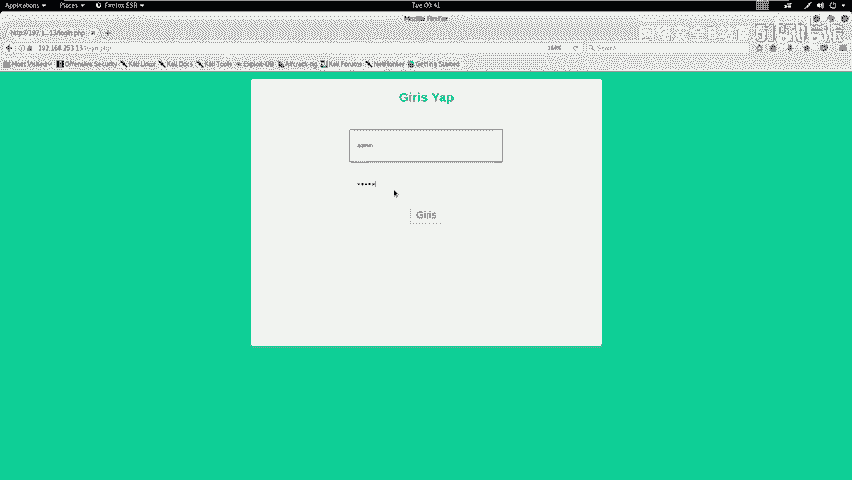

## 第二步：信息分析与挖掘

在完成信息探测后，我们需要对扫描结果进行深入分析，挖掘可利用的信息。

上一节我们介绍了信息收集的工具，本节中我们来看看如何从这些结果中找到突破口。

分析Nmap、Nikto、Dirb等工具的扫描结果，重点关注以下几点：
1.  **敏感页面**：如登录界面(`login.php`)、配置文件(`config.php`)。
2.  **服务版本**：关注Web服务器（如Apache）、数据库、CMS等软件的版本，寻找已知漏洞。
3.  **开放端口**：如21(FTP)、22(SSH)、80(HTTP)，分析对应服务的安全性。
4.  **目录结构**：注意上传目录(`upload`)、备份目录、管理后台等。

在我们的扫描结果中，发现了以下关键信息：
*   `config.php`：可能是包含数据库认证信息的配置文件。
*   `login.php`：用户登录界面。
*   一个上传目录(`upload`)。

首先，我们访问登录界面`http://192.168.253.13/login.php`。这是一个标准的登录表单，尝试使用弱口令（如admin/admin）登录失败。

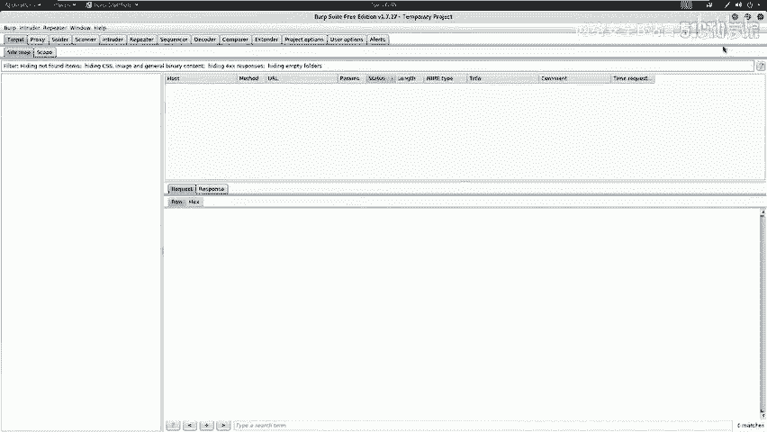

## 第三步：绕过登录认证机制

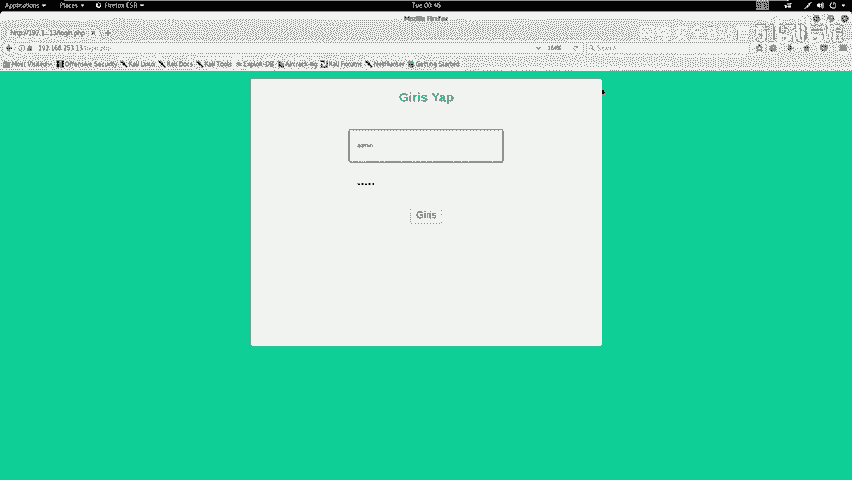

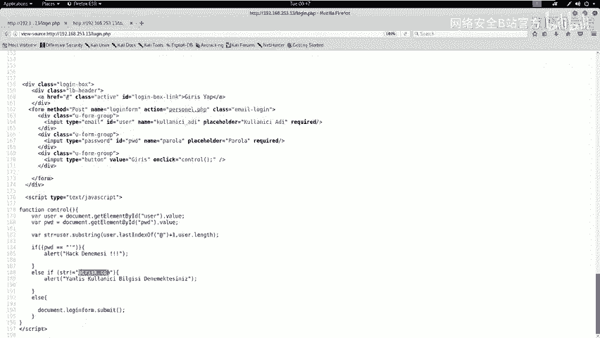

面对登录界面，我们需要思考如何绕过其认证机制。

首先，查看页面源代码，寻找隐藏信息。右键点击页面，选择“查看页面源代码”。在源代码底部，我们发现了一段JavaScript代码：
```javascript
// 示例代码，分析逻辑
var user = document.getElementById(‘user’).value;
var pwd = document.getElementById(‘pwd’).value;
var str = user.substring(user.lastIndexOf(‘@’)+1);
if(pwd == ‘\’’){
    alert(‘黑客攻击！’);
} else if(pwd != ‘\’’ && str != ‘btrisk.com’){
    alert(‘用户名需以@btrisk.com结尾’);
} else {
    // 执行登录
}
```
**代码逻辑分析**：
1.  获取用户名(`user`)和密码(`pwd`)。
2.  提取用户名中最后一个`@`符号之后的部分，赋值给`str`。
3.  进行判断：
    *   如果密码等于**单引号(`‘`)**，则弹出“黑客攻击！”警告。
    *   如果密码不是单引号，且`str`不等于`"btrisk.com"`，则提示“用户名需以@btrisk.com结尾”。
    *   否则，执行登录操作。

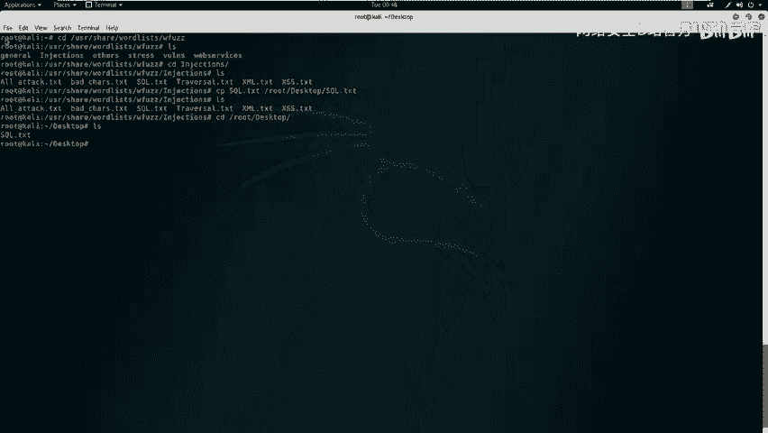

这段代码暗示了两个重要信息：
1.  密码字段可能存在**SQL注入漏洞**，因为对单引号有特殊检测。
2.  用户名必须符合`xxx@btrisk.com`的格式。

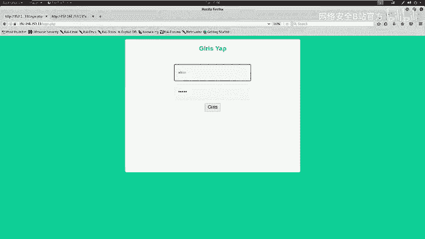

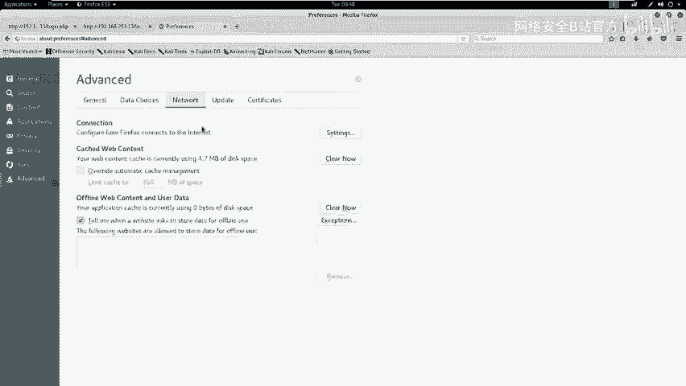

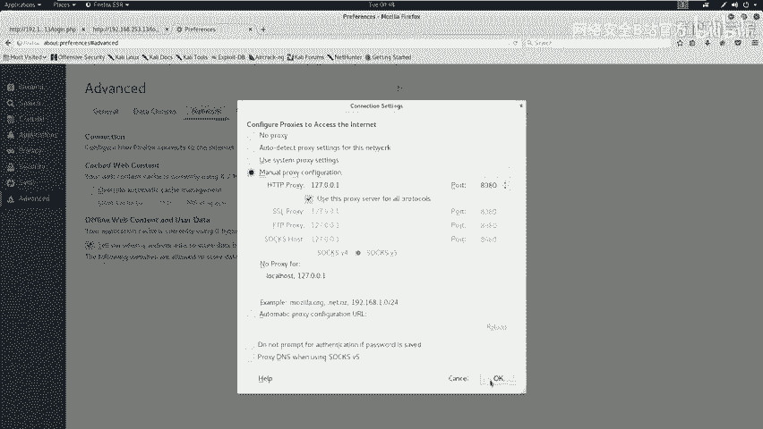

### 进行模糊测试(Fuzzing)

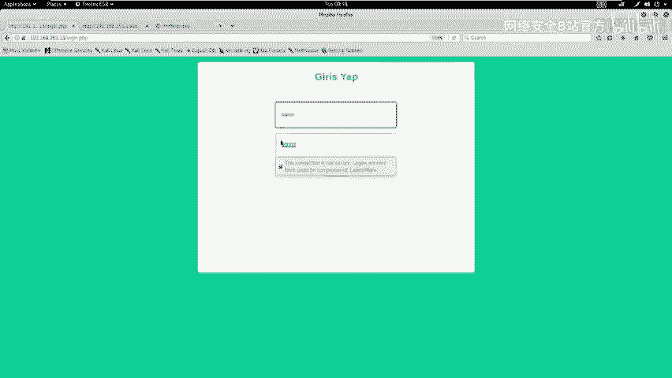

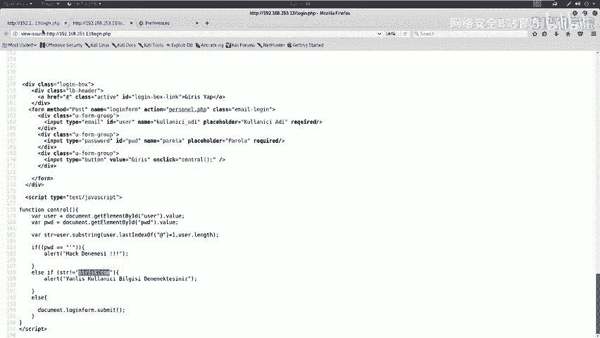

基于以上发现，我们可以对密码字段进行模糊测试，尝试找到可用的注入Payload，从而绕过登录。

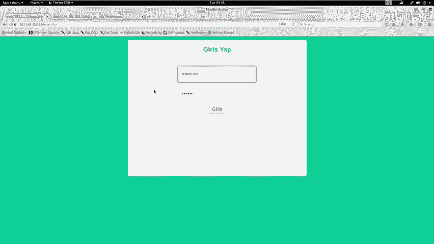

模糊测试是通过自动化工具，向目标输入大量测试数据，根据响应差异（如返回内容长度、状态码）来判断输入是否有效的方法。

以下是使用Burp Suite进行模糊测试的步骤：

1.  配置浏览器代理，使流量经过Burp Suite。
2.  在登录页面输入用户名`test@btrisk.com`和任意密码（如`123456`），点击登录。
3.  在Burp Suite的`Proxy` -> `HTTP history`中捕获到这个登录请求。
4.  右键点击该请求，选择`Send to Intruder`。
5.  在`Intruder`标签页的`Positions`子页中，清除所有自动标记的变量，只选中密码参数的值，点击`Add`将其设为攻击变量。
6.  在`Payloads`子页中，选择`Payload type`为`Runtime file`，并加载一个SQL注入测试字典（例如Kali Linux中的`/usr/share/wordlists/fuzzdb/attack/sql-injection/detect/GenericBlind.txt`）。
7.  点击`Start attack`开始攻击。

攻击过程中，观察`Length`（返回长度）列。通常，登录失败和成功的页面长度会不同。我们发现，大多数请求返回长度为2044或2203，但有一个特殊的Payload返回长度为2900。

在浏览器中访问这个返回长度为2900的请求对应的响应，我们成功进入了一个后台页面，该页面包含一个文件上传功能。

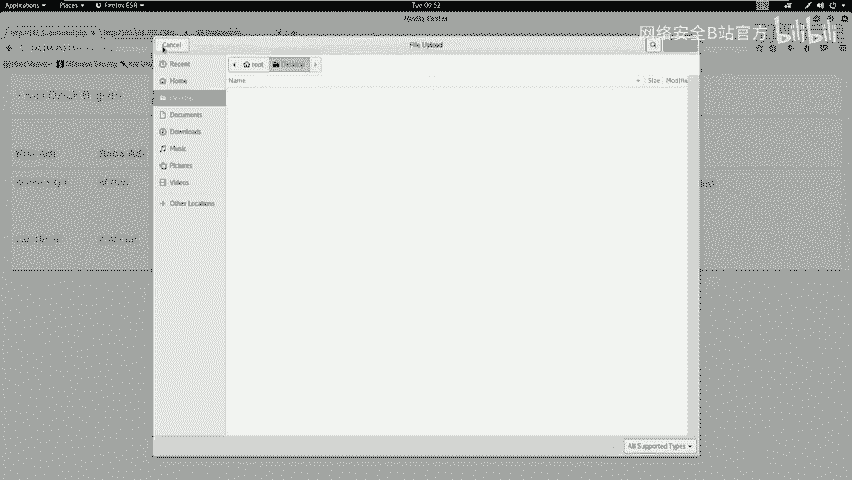

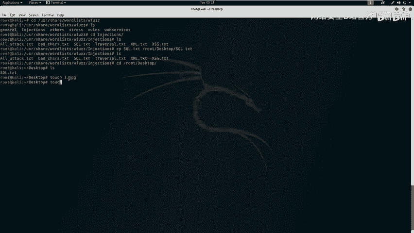

## 总结

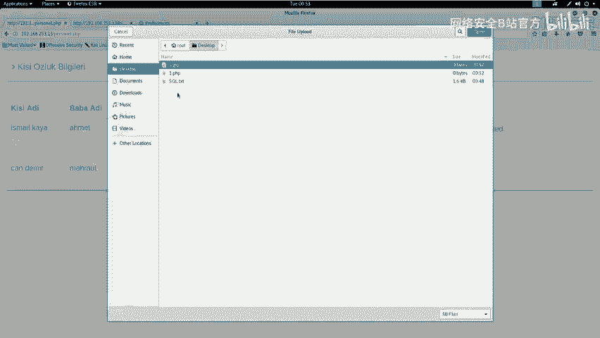

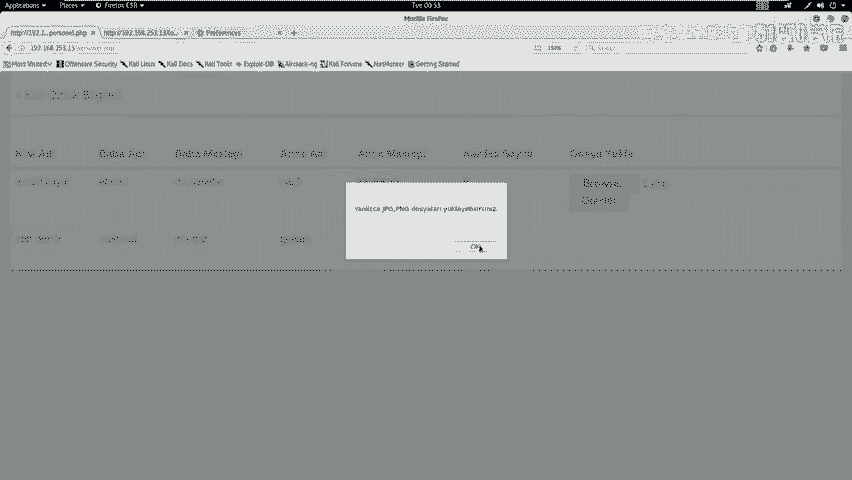

本节课中我们一起学习了Web安全初级入侵的前几个关键步骤：
1.  **信息探测**：使用Nmap、Nikto、Dirb等工具收集靶机的服务、版本、目录信息。
2.  **信息分析**：从扫描结果中挖掘敏感文件、登录界面等潜在入口。
3.  **代码审计与逻辑分析**：通过查看前端JavaScript代码，发现了用户名格式限制和密码字段存在SQL注入的蛛丝马迹。
4.  **模糊测试绕过登录**：利用Burp Suite的Intruder模块对密码字段进行模糊测试，通过响应长度差异成功找到了可绕过登录的注入Payload，进入了后台。

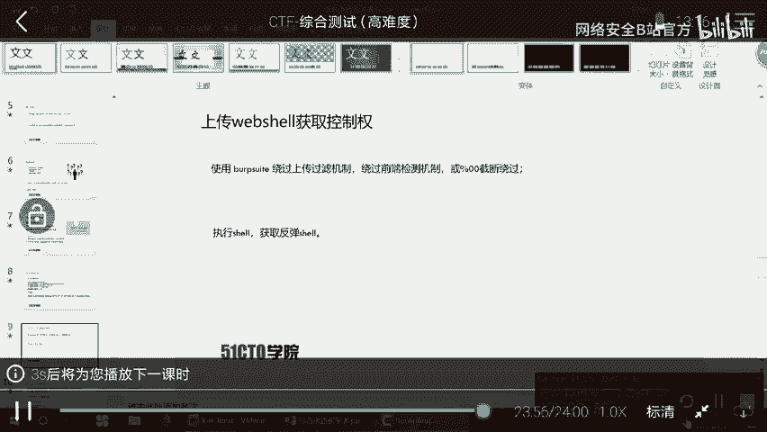

我们成功绕过了登录认证，并发现了一个文件上传功能。然而，直接上传PHP文件被阻止。在下一节课中，我们将重点探讨如何绕过文件上传检测机制，从而进一步获取系统权限。