# CTF培训：P21：杂项的基本解题思路上半部分 🧩

在本节课中，我们将学习CTF比赛中杂项（Misc）题型的基本解题思路。杂项题目内容庞杂，但掌握核心工具和方法后，是拿分的关键点。本节课将重点讲解文件操作与隐写的基础知识。

---

## 概述

CTF解题通常分为五大题型：Web、杂项（Misc）、密码学（Crypto）、逆向工程（Reverse）和破解（Pwn）。其中，Web、杂项和密码学是短期内可以通过培训掌握并拿分的关键部分。杂项题目虽然知识点繁多，但核心在于熟练使用各种工具。


杂项与密码学常常结合出题。一道难题可能综合考察文件分析、隐写、密码学等多个知识点，要求选手具备快速学习和应用新知识的能力。

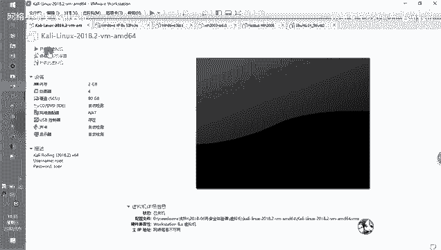

本节课将分为四个部分，从易到难进行讲解。今天我们先学习前两部分：**文件操作与隐写**和**图片隐写术**。

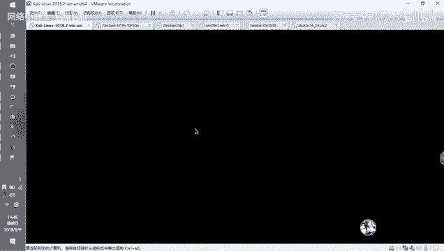

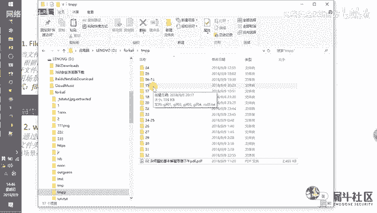

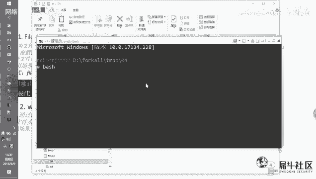

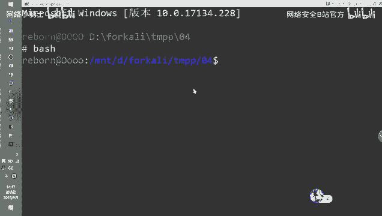

---

## 第一部分：文件操作与隐写

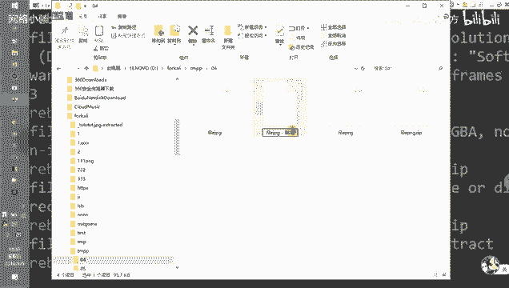

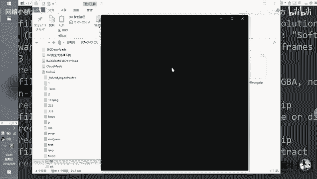

当我们拿到一个杂项题目文件时，第一步是识别其类型，因为后续所有操作都基于此。

### 文件类型识别

很多时候，出题人会故意删除文件的后缀名（如 `.jpg`, `.zip`），让你无法直接打开。这时，我们需要使用工具来识别文件的真实类型。

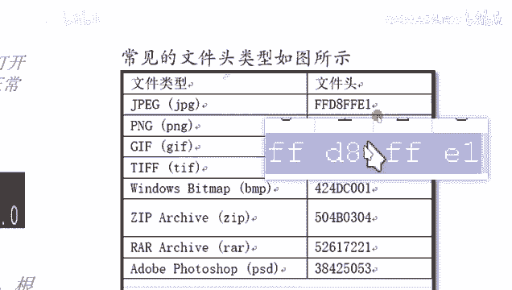

**Linux下的 `file` 命令** 是一个基础且强大的识别工具。它通过分析文件的**文件头（Magic Number）**来判断类型。

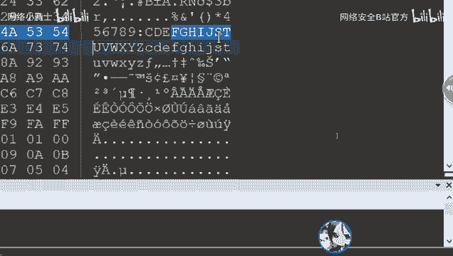

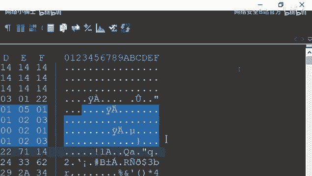

**公式/代码示例：**
```bash
file 文件名
```
例如，识别一个无后缀文件：
```bash
file unknown_file
```
输出可能为：`JPEG image data, JFIF standard 1.01`，表明这是一个JPEG图片。

常见的文件头示例：
*   **JPEG**: `FF D8 FF E0`
*   **PNG**: `89 50 4E 47`
*   **ZIP**: `50 4B 03 04`

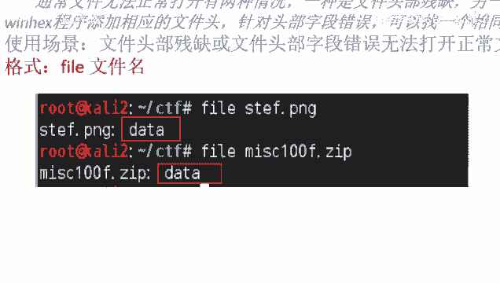

如果 `file` 命令识别结果为 `data`，则可能意味着文件头被破坏或缺失，需要进行修复。

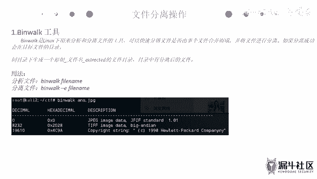

### 十六进制编辑器

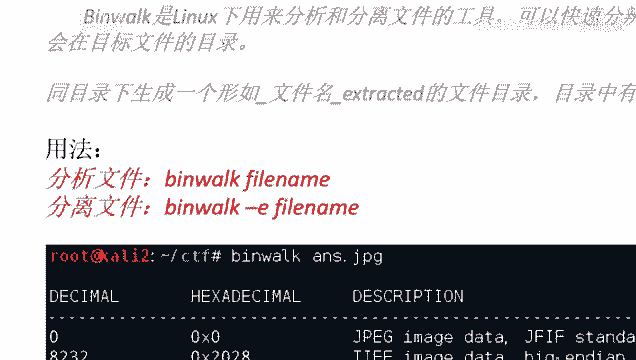

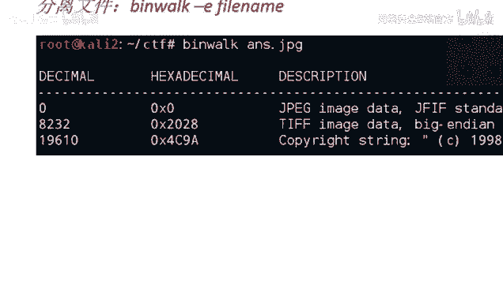

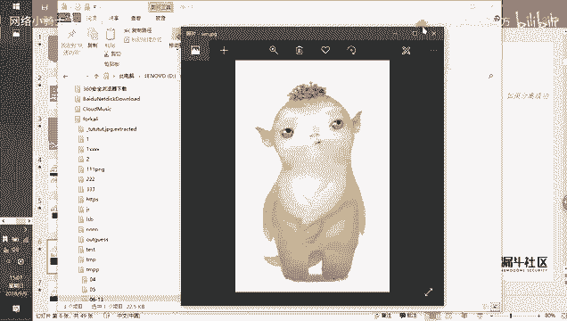

要查看或修复文件头，我们需要使用十六进制编辑器。这类工具可以让我们直接查看和编辑文件的二进制（十六进制）数据。

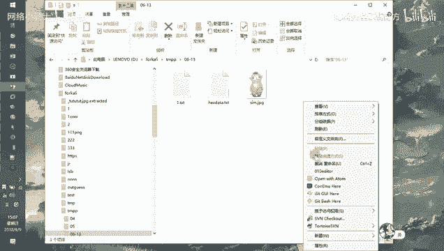

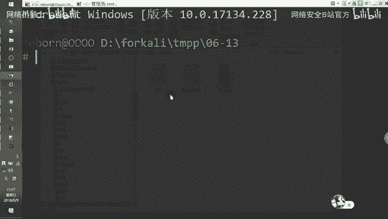

推荐工具：
1.  **010 Editor** (功能强大，推荐)
2.  **WinHex**
3.  **Notepad++** (配合 `Hex Editor` 插件)

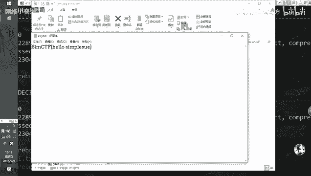

使用十六进制编辑器，我们可以：
*   **直接查看隐藏信息**：Flag有时会直接以可读文本形式藏在文件头部或尾部。
*   **修复文件头**：如果文件头错误或缺失，可以手动补上正确的文件头字节。
*   **分析文件结构**：查看文件是否由多个部分拼接而成。

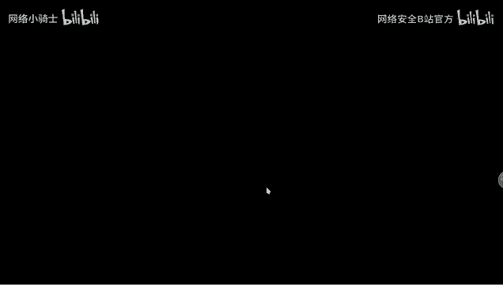

### 文件分离

一个文件（如图片）中可能隐藏了其他文件（如压缩包、文本）。我们需要将其分离出来。以下是几种常用的分离方法：

#### 1. 使用 `binwalk` 工具

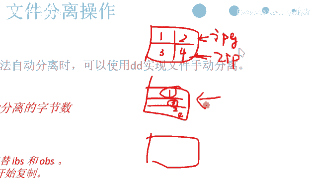

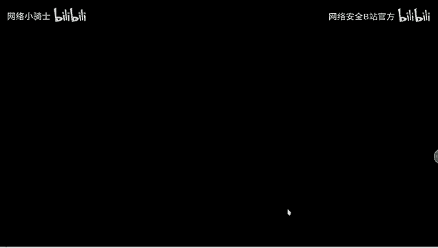

`binwalk` 可以自动分析文件内嵌的其他文件，并进行分离。

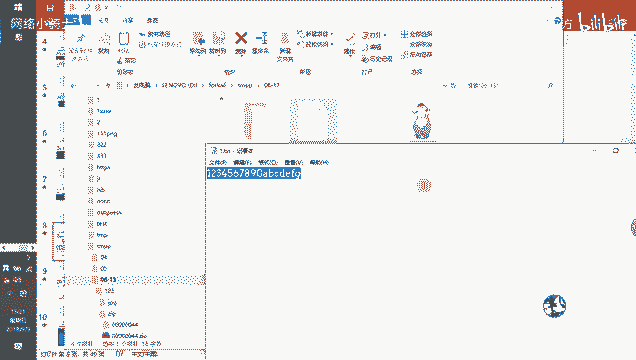

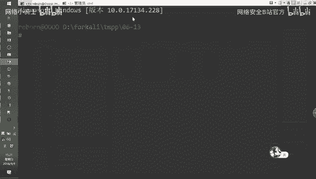

**代码示例：**
```bash
# 分析文件结构
binwalk image.jpg

# 自动分离所有嵌入的文件
binwalk -e image.jpg
```
分离后的文件会保存在 `_image.jpg.extracted` 目录中。

#### 2. 使用 `foremost` 工具

`foremost` 是另一个文件分离工具，有时在 `binwalk` 失效时可以尝试。

**代码示例：**
```bash
foremost -i image.jpg -o output_folder
```
分离后的文件会按类型分类保存在 `output_folder` 中。

#### 3. 使用 `dd` 工具进行手动分离

当自动工具无法准确分离时，需要使用 `dd` 命令进行手动精确分离。这需要我们知道目标数据在文件中的起始位置和大小（通常通过 `binwalk` 分析获得）。

**代码示例：**
假设 `binwalk` 分析显示从偏移量 `0x596F` 开始是一个ZIP文件。
```bash
# 跳过原文件前 0x596F (22895) 字节，将后面的数据提取为 new.zip
dd if=image.jpg of=new.zip bs=1 skip=22895
```
参数说明：
*   `if=`：输入文件
*   `of=`：输出文件
*   `bs=`：块大小（这里设为1字节）
*   `skip=`：跳过的输入块数

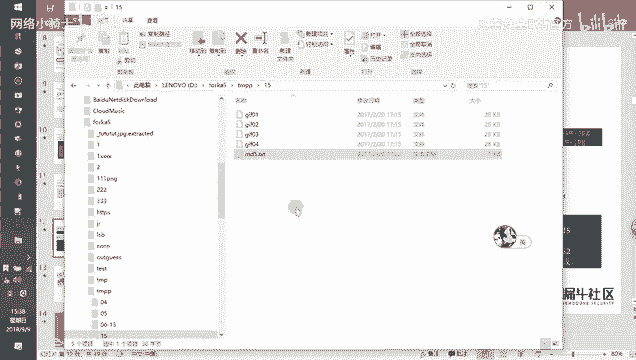

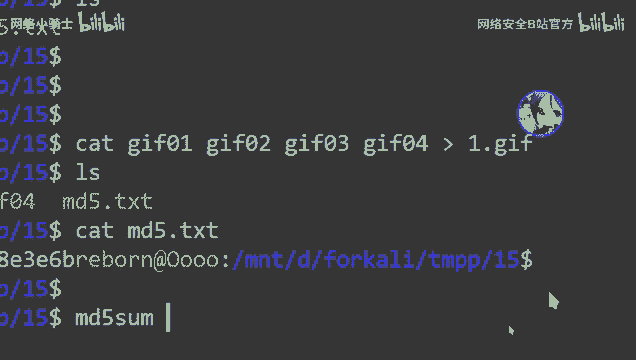

#### 4. 使用十六进制编辑器手动分离

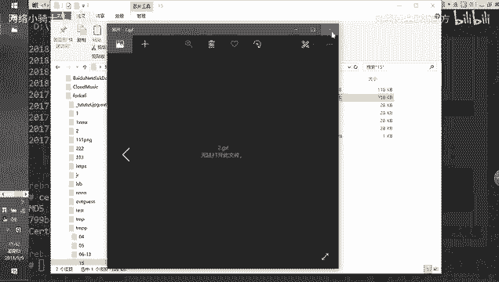

在010 Editor中，可以直接选中目标数据的十六进制区域，右键选择 `Save Selection` 另存为新文件。这种方法最直观，但需要手动定位数据。

### 文件合并

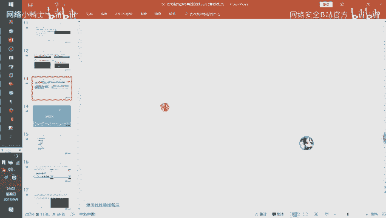


与文件分离相反，有时题目会将一个文件（如图片）分割成多个碎片，要求你将其合并。

**在Linux下使用 `cat` 命令：**
```bash
cat part1 part2 part3 > merged_file
```

**在Windows下使用 `copy` 命令：**
```cmd
copy /B part1 + part2 + part3 merged_file
```
合并后，可能需要校验文件的MD5值是否与题目给出的一致，以确认合并正确。

### 字符串与十六进制搜索

在文件分析中，一个基本的步骤是搜索可能存在的Flag字符串。

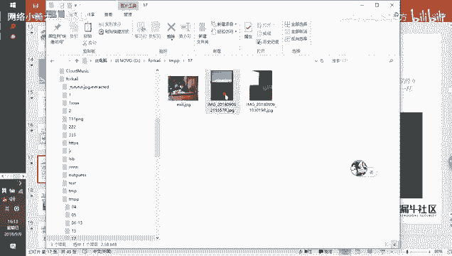

1.  **搜索明文**：用文本编辑器（如Notepad++）或命令行工具（`grep`, `strings`）搜索 `flag`, `key`, `CTF` 等关键词。
2.  **搜索十六进制**：在十六进制编辑器中搜索对应字符串的十六进制编码。

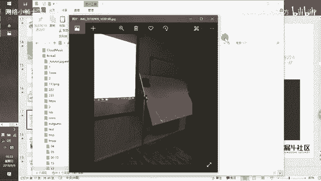

---

上一节我们介绍了文件操作与隐写的各种基础技术，本节中我们来看看专门针对图片文件的隐写术。

## 第二部分：图片隐写术

图片是杂项题中最常见的载体之一，隐藏信息的方式多种多样。

### 1. 细微颜色差别与像素操作

有时，Flag信息隐藏在肉眼难以察觉的像素颜色细微变化中。我们需要用工具进行对比或提取。

**工具推荐：Stegsolve**
这是一个Java编写的工具，用于分析图片的各个颜色通道、帧，并能对两张图片进行对比操作（如XOR, ADD, SUB等）。

**常见考点**：给出两张看似相同的图片，通过对它们进行**异或(XOR)、相加(ADD)、相减(SUB)** 等操作，得到隐藏的二维码或图像。

### 2. LSB（最低有效位）隐写

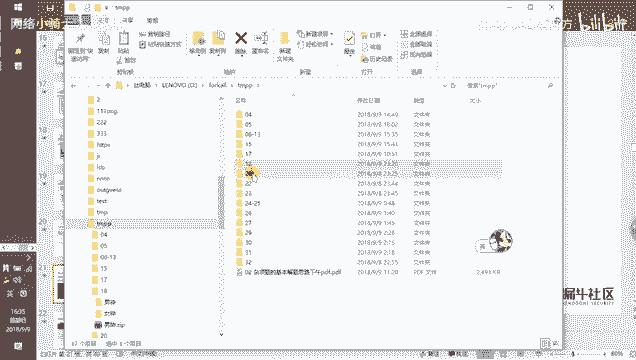

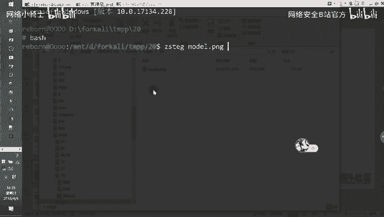

这是最常见的图片隐写方式之一。原理是修改像素RGB值每个字节的**最低位**，将其替换为要隐藏的信息位。由于修改幅度极小，人眼无法察觉。

**工具推荐：**
*   **Stegsolve**：在 `Analyse` -> `Data Extract` 功能中，可以尝试提取不同通道和位平面的LSB信息。
*   **zsteg**：一个命令行工具，能自动尝试多种LSB隐写方案，并输出可能隐藏的数据。
    ```bash
    zsteg image.png
    ```
*   **LSBSteg**：针对BMP格式的LSB隐写工具。
*   **Python脚本**：当现成工具因出题人微调而失效时，需要自己编写或修改脚本进行提取。

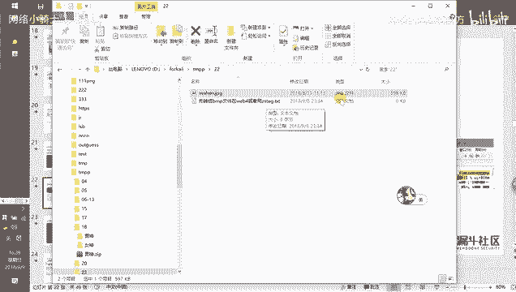

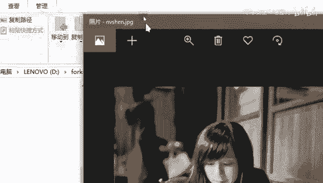

### 3. EXIF信息隐藏

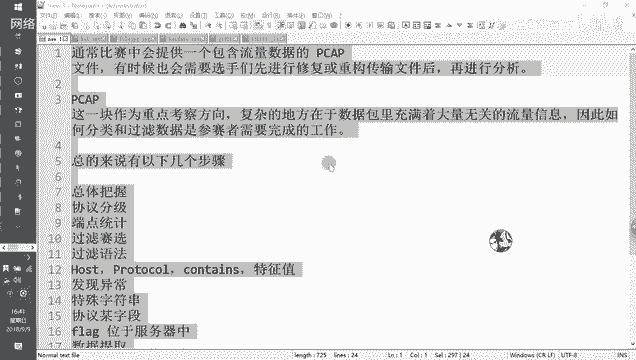

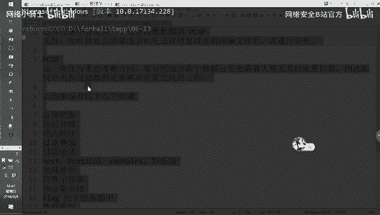

EXIF是嵌入在图片文件中的元数据，记录了拍摄设备、时间、GPS坐标等信息。出题人可能将提示或Flag直接写在EXIF信息里。

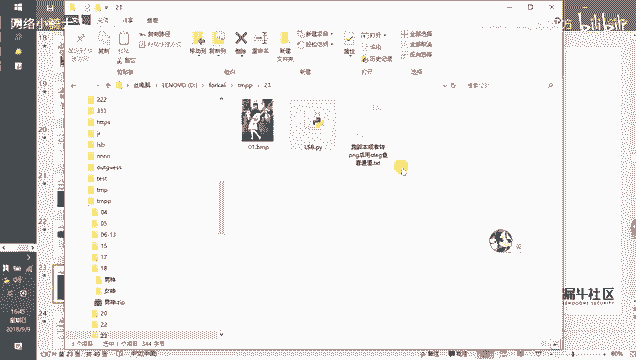

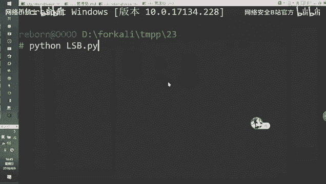

**查看方式：**
*   **Windows**：右键图片 -> `属性` -> `详细信息`。
*   **Linux命令行**：使用 `exiftool` 工具。
    ```bash
    exiftool image.jpg
    ```

### 4. 图片修复

出题人可能破坏图片文件，使其无法正常打开，常见于PNG格式。

**常见修复点：**
*   **CRC校验错误**：PNG文件的`IHDR`块有一个CRC校验值。如果图片的高度/宽度被修改，CRC值就会不匹配。可以使用 `TweakPNG` 这类工具检查并修复CRC，或者用十六进制编辑器手动修正。
*   **高度/宽度错误**：直接修改图片文件中的高度/宽度字段，可能导致只显示图片的一部分。我们需要计算正确的宽度和高度值（通常需要编写脚本根据CRC反推），然后用十六进制编辑器修改。

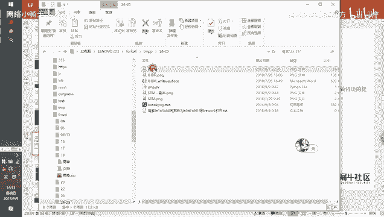

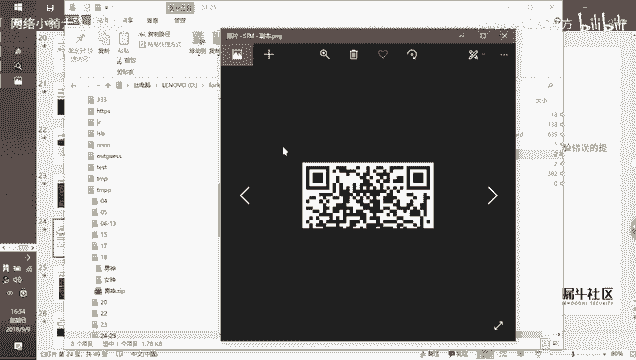

### 5. 图片加密

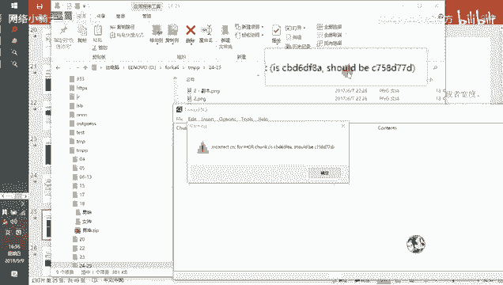

有些题目会对图片本身进行加密。我们需要识别加密算法，然后找到对应的解密工具。

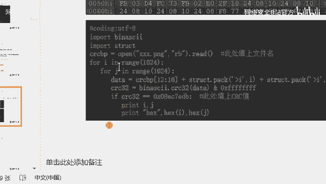

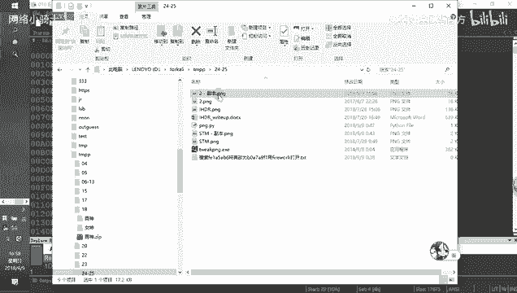

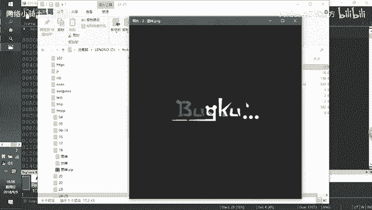

**常见加密工具/算法：**
*   **BlindWaterMark**：一个数字水印工具，也可用于简单的隐写。
*   **F5**：一种JPEG图像隐写算法。
*   **outguess**：另一种隐写工具。
*   **jphide**：JPEG图像的隐藏工具。

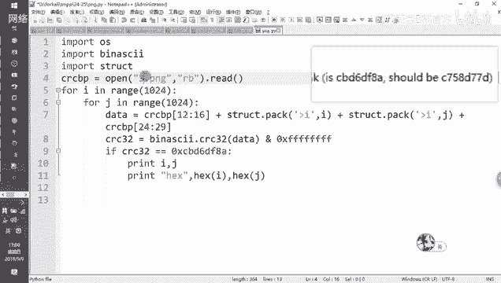

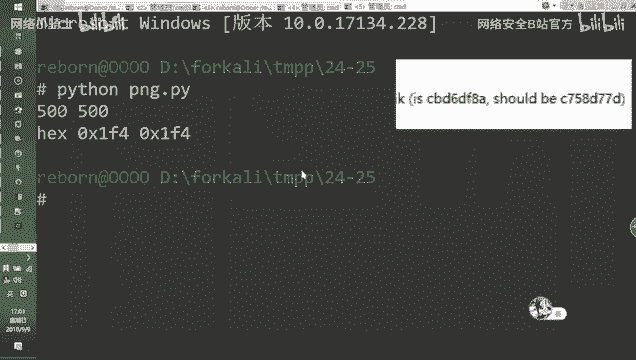


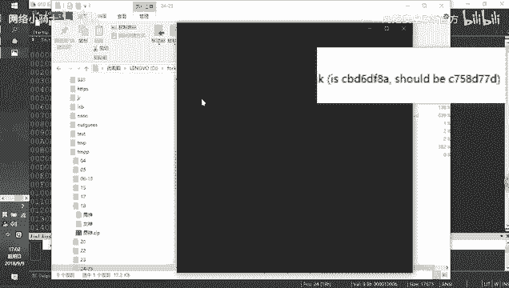

**步骤：**
1.  使用检测工具（如 `stegdetect`）尝试识别图片使用了哪种加密/隐写。
    ```bash
    stegdetect -s 敏感度 image.jpg
    ```
2.  根据识别结果，使用对应的解密工具（如 `outguess`, `F5` 的解密程序）进行解密。

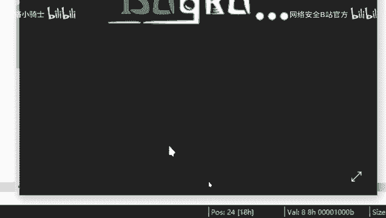

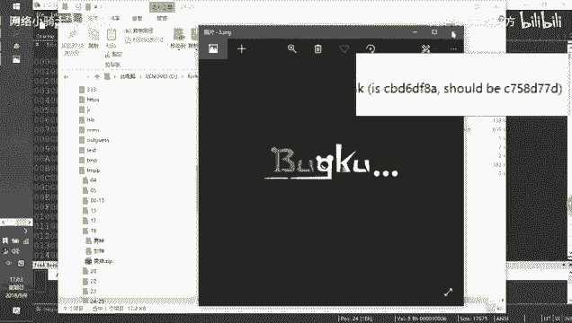

### 6. 二维码处理

费尽周折得到的二维码可能无法直接扫描，需要进一步处理。

**常见操作：**
*   **取反（反色）**：黑白颜色反转。可以用画图工具选择区域后右键“反色”，或用Stegsolve的`Filter`功能。
*   **补全定位点**：二维码的三个“回”字形定位点可能被破坏，需要手动用黑色块补全。
*   **纠错**：利用二维码自身的纠错能力，有时即使部分损坏也能扫描出信息。

---

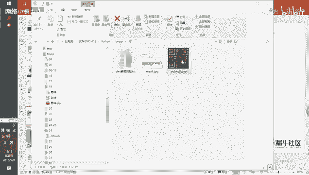

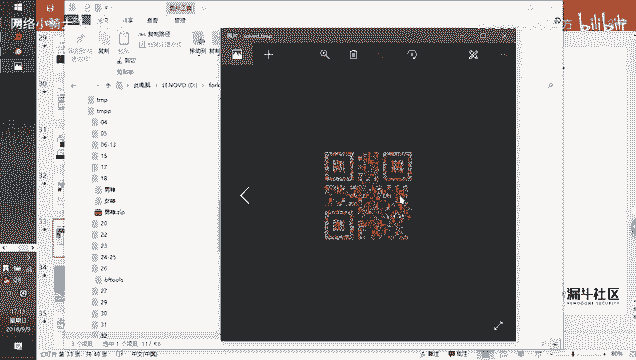

## 总结

本节课我们一起学习了CTF杂项题型上半部分的核心内容：
1.  **文件操作与隐写**：从识别文件类型开始，学习了使用 `file`、十六进制编辑器、`binwalk`、`foremost`、`dd` 等工具进行文件分析、分离、合并和修复。
2.  **图片隐写术**：深入探讨了LSB隐写、EXIF信息、图片修复、加密图片识别与解密，以及二维码处理等多种图片相关的隐写与解题技巧。

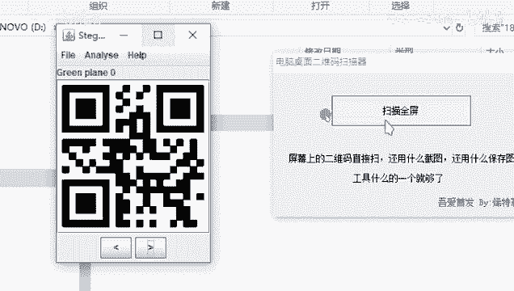

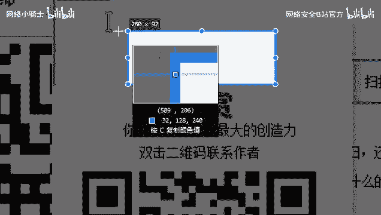

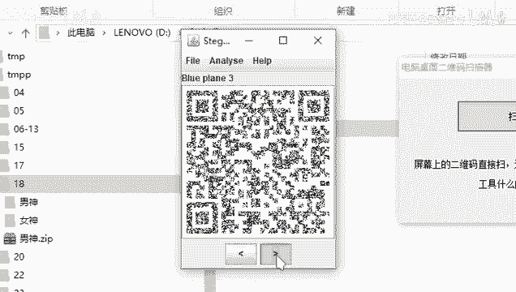

杂项题目的关键在于**工具熟练度**和**知识广度**。虽然工具繁多，但核心思路是相通的：分析文件结构、寻找隐藏数据、修复损坏部分、应用合适工具解密。课后请结合提供的题目进行练习，加深对每个工具和方法的理解。

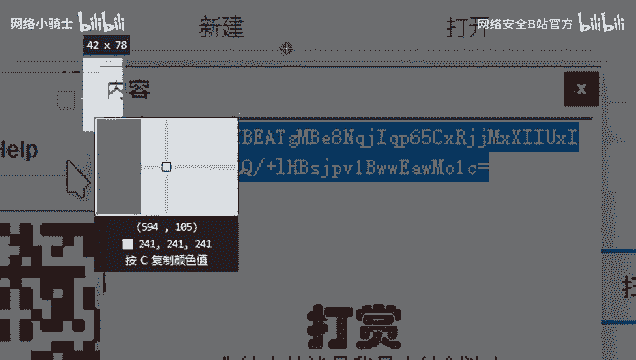

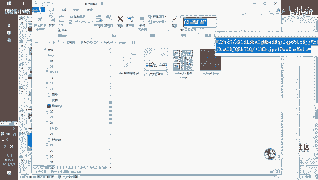

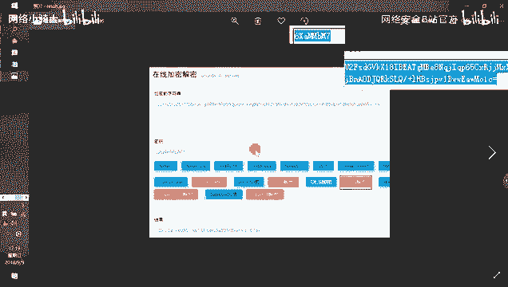

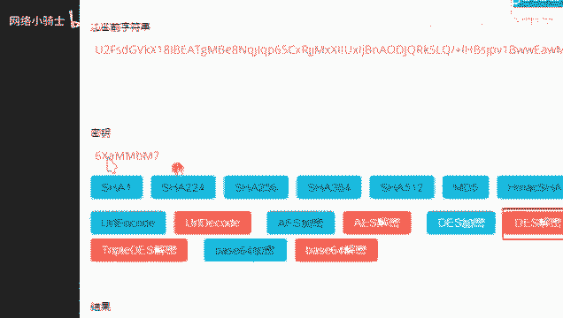

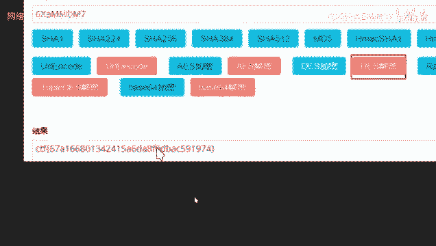

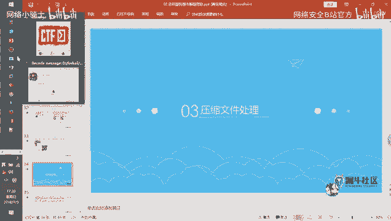

下节课我们将继续学习杂项题型下半部分的内容：**音频/视频隐写**、**压缩包处理**和**流量取证**。