# CTF培训：P22：杂项的基本解题思路（下半部分）📚

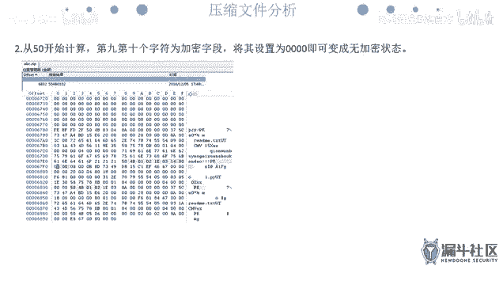

在本节课中，我们将继续学习CTF杂项题目的解题思路，重点聚焦于压缩文件处理和流量分析取证两大核心部分。我们将学习如何识别和修复伪加密的压缩包、使用工具进行密码破解，以及使用Wireshark等工具分析网络流量包，从中提取关键信息或文件。

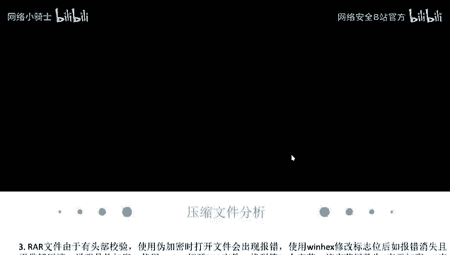

## 压缩文件处理 📦

上一节我们介绍了文件和图片隐写，本节中我们来看看如何处理压缩文件。压缩文件在CTF中常作为题目的载体，考察点包括伪加密识别、密码破解和文件修复。

### 伪加密识别与修复

压缩文件（如ZIP、RAR）有时会使用“伪加密”技术。它并非真正用密码加密，而是通过修改文件头部的特定标志位，让解压软件误以为文件已加密。

**核心原理**：使用十六进制编辑器（如WinHex、010Editor）打开压缩包，找到并修改标识加密状态的字段。

*   **ZIP文件**：搜索十六进制值 `504B0102`，从该位置开始，第9到第10个字节（一个字节占两位）为加密标志位。正常情况下应为 `0000`，若为 `0900` 等值则可能是伪加密，将其改为 `0000` 即可。
    *   **公式/代码描述**：定位 `504B0102` -> 偏移量+8至+9字节 -> 修改为 `00 00`。
*   **RAR文件**：文件起始位置的第24个字节（即0x18偏移处）的尾数（最低位）表示加密状态。`0x80` 表示加密，`0x00` 表示未加密。将其改为 `0x00` 即可修复。

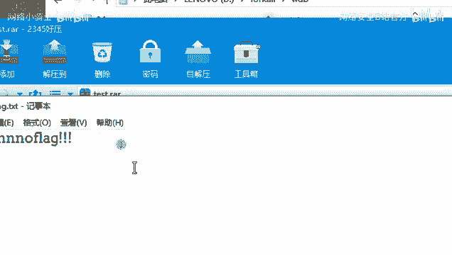

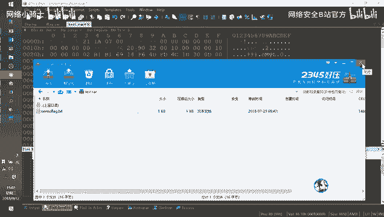

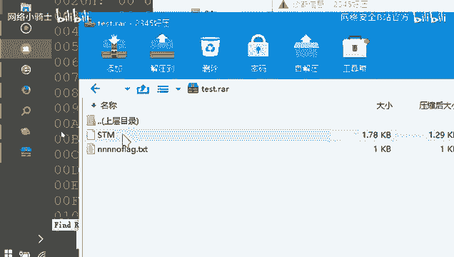

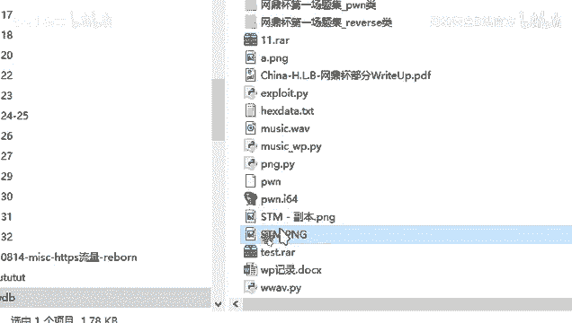

**操作流程**：
1.  用十六进制编辑器打开压缩包。
2.  搜索或定位到上述关键字段。
3.  修改对应的加密标志位。
4.  保存文件后，即可正常解压。

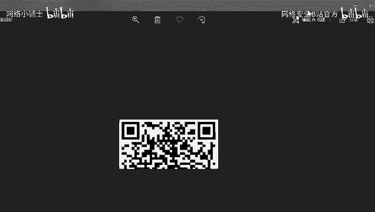

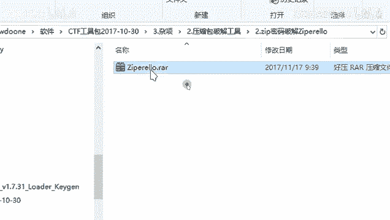

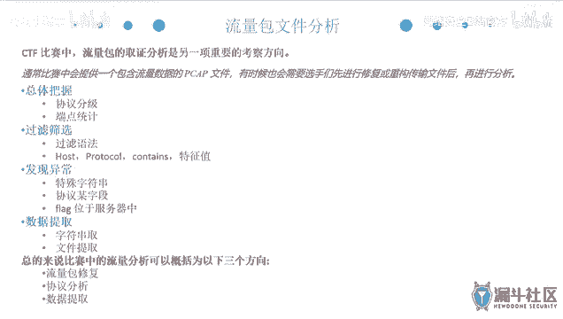

> **注意**：现代压缩软件（如360压缩、2345好压）可能自动识别并修复伪加密，但在CTF比赛中，仍需掌握手动修复的方法。

### 密码破解

当压缩包被真正加密时，我们需要尝试破解密码。通常题目不会设置过于复杂的密码，可能会给出部分提示。

以下是常用工具和方法：

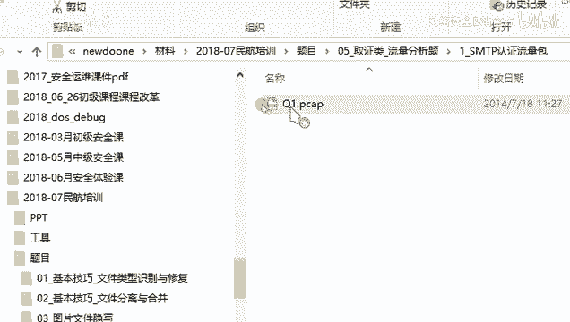

*   **ARCHPR**：用于破解RAR压缩包密码的强大工具。支持暴力破解、字典攻击、掩码攻击和明文攻击。
    *   **暴力破解**：尝试所有可能的字符组合。
    *   **字典攻击**：使用预置的或自定义的密码字典进行尝试。
    *   **掩码攻击**：当已知密码部分字符（如前三位是`ABC`）时，可以指定掩码（如`ABC???`）来大幅提高破解效率。
    *   **明文攻击**：如果你拥有压缩包内某个未加密文件的原始内容，可以利用此文件进行攻击，成功率较高。
        *   **关键点**：用于明文攻击的文件，其压缩算法必须与原压缩包内对应文件一致。通常默认算法为 `Store`。
*   **ZIP密码破解工具**：工具包中提供的专门针对ZIP格式的破解软件，使用方法类似。

> **小技巧**：有时跑出的“加密密钥”本身可能就是Flag，不一定非要解压出文件。

### 压缩包修复

更难的考点是压缩包结构损坏，需要手动修复。这要求对压缩文件格式有深入了解。

**核心思路**：一个压缩包由多个“块”组成，每个文件对应一个文件头。如果文件头类型标识错误或损坏，解压软件就无法识别该文件。

*   **关键字段**：在RAR格式中，文件头的“块类型”字段标识了数据的性质。`0x74` 代表这是一个文件头。
*   **修复方法**：
    1.  用十六进制编辑器打开损坏的压缩包。
    2.  分析已知文件的结束位置。
    3.  在下一个文件应该开始的位置，检查其“块类型”字段是否正确（应为 `0x74`）。
    4.  如果该字段值错误（如 `0x7A`），则将其修改为 `0x74`。
    5.  保存后重新解压，隐藏的文件即可被正确提取。

**示例流程**：
1.  解压后只有一个 `readme.txt`，提示flag不在此文件。
2.  用十六进制编辑器查看，发现 `readme.txt` 内容结束后，后面还有数据，但其块类型字段错误。
3.  将该字段从错误值（如 `0x7A`）改为正确的文件头标识 `0x74`。
4.  保存后再次解压，即可得到隐藏的图片文件（如 `flag.png`），进而进行下一步的图片隐写分析。

---

## 流量分析取证 🌐

流量分析是CTF杂项题中的高频考点，通常会给一个网络数据包捕获文件（`.pcap` 或 `.pcapng`），要求从中找到Flag或提取出隐藏的文件。

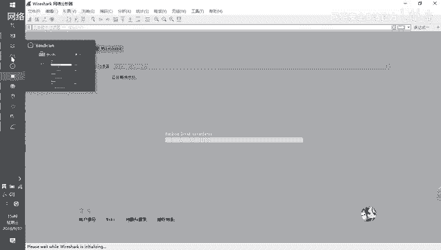

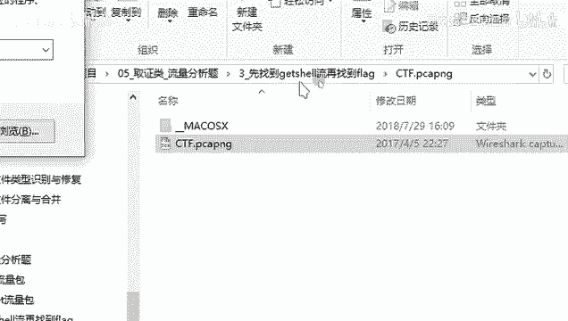

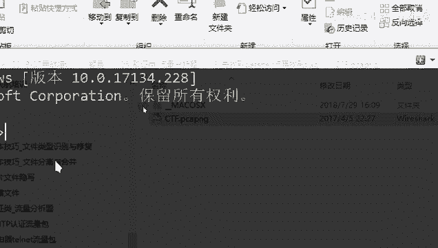

### 核心工具：Wireshark

Wireshark是进行流量分析必不可少的工具。你需要熟悉其基本界面、过滤语法和常用功能。

#### 协议分析与过滤

打开一个流量包，首先需要了解其中包含哪些协议，并过滤出关键流量。

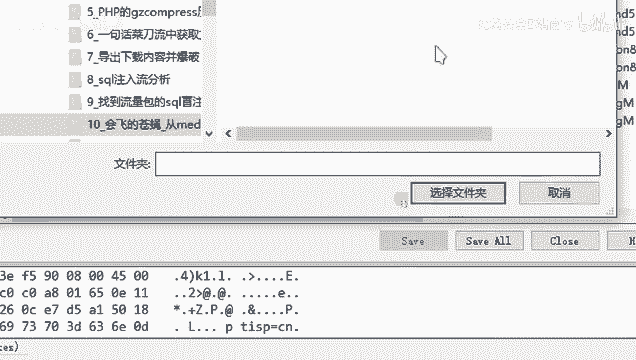

**常用过滤语法**：

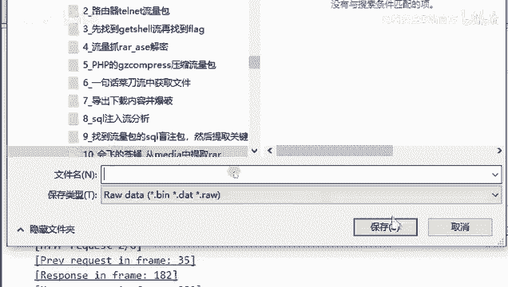

*   **按协议过滤**：直接输入协议名，如 `http`, `tcp`, `dns`, `udp`。
*   **按IP地址过滤**：
    *   `ip.src == 192.168.1.1` （源IP）
    *   `ip.dst == 10.0.0.1` （目的IP）
*   **按端口过滤**：
    *   `tcp.port == 80` （TCP 80端口，通常是HTTP）
    *   `udp.port == 53` （UDP 53端口，通常是DNS）
*   **按包内容过滤（最实用）**：
    *   `http contains “flag”` （在HTTP协议中搜索包含“flag”字符串的包）
    *   `tcp contains “key”` （在TCP负载中搜索“key”）
    *   `frame contains “admin”` （在整个帧中搜索“admin”）

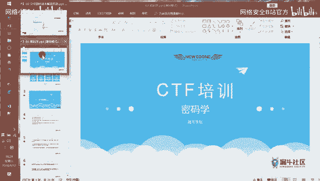

**协议分级统计**：
在菜单栏点击 **统计 (Statistics) -> 协议分级 (Protocol Hierarchy)**。这个功能可以直观地展示流量包中各种协议的占比，帮助你快速定位主要流量类型（例如，发现HTTP流量占绝大部分），从而明确分析方向。

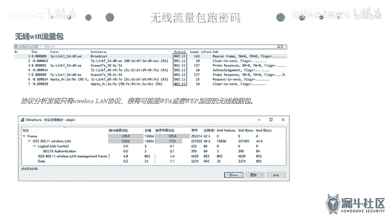

#### 数据提取技巧

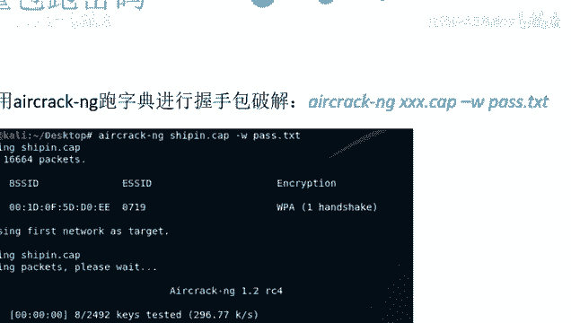

找到可疑流量后，需要从中提取数据。

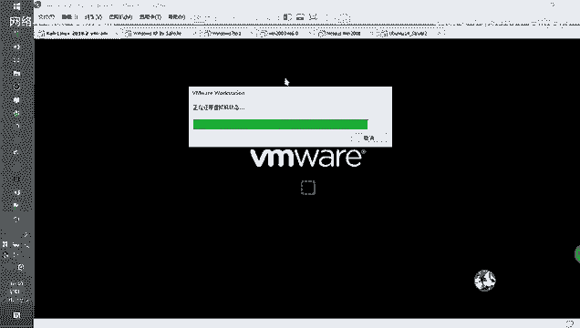

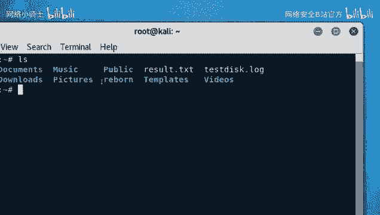

1.  **追踪流 (Follow Stream)**：
    *   在感兴趣的数据包上右键，选择 **追踪流 -> TCP流/HTTP流/SSL流**。
    *   这将重组该会话的所有数据，并以ASCII、十六进制等形式展示，Flag或关键信息可能直接显示在其中。
    *   可以点击 **查找** 按钮搜索关键字，或点击 **另存为** 保存整个会话数据。

2.  **导出对象 (Export Objects)**：
    *   点击 **文件 (File) -> 导出对象 (Export Objects) -> HTTP…**。
    *   此功能可以提取出通过HTTP协议传输的所有文件（如HTML、图片、压缩包等）。导出后，在文件列表中查找可疑或较大的文件进行分析。

3.  **手动导出分组字节流**：
    *   对于非HTTP协议传输的文件，或文件被分片传输的情况，需要手动提取。
    *   选中包含文件数据部分的报文，右键选择 **导出分组字节流 (Export Packet Bytes)**。
    *   将多个分片的数据分别导出后，可能需要使用 `dd` 命令去除协议头，再合并成一个完整的文件。
    *   **示例**：一个被分片的ZIP文件可能藏在多个 `media-type` 或 `data` 字段中，需要逐一导出并合并。

#### 特殊流量分析

某些题目会考察特定类型的流量。

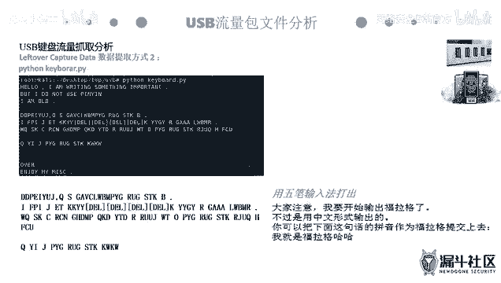

*   **无线流量 (Wireshark中显示为802.11)**：
    *   常考破解WIFI握手包密码。
    *   使用 `aircrack-ng` 工具。
    *   **基本命令**：`aircrack-ng -w 字典文件.txt 捕获的握手包.cap`
    *   工具会尝试用字典中的密码去匹配握手包中的加密密钥，若成功则显示密码。

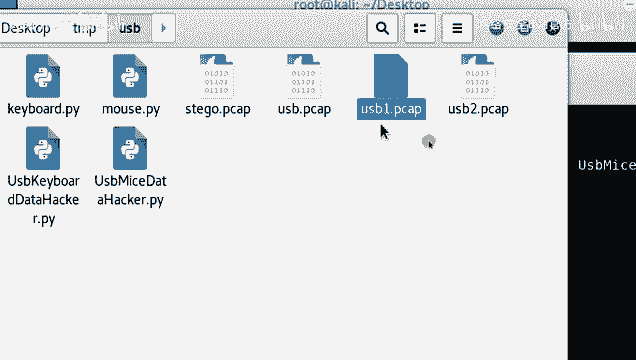

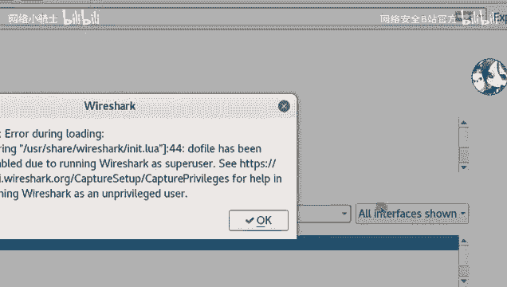

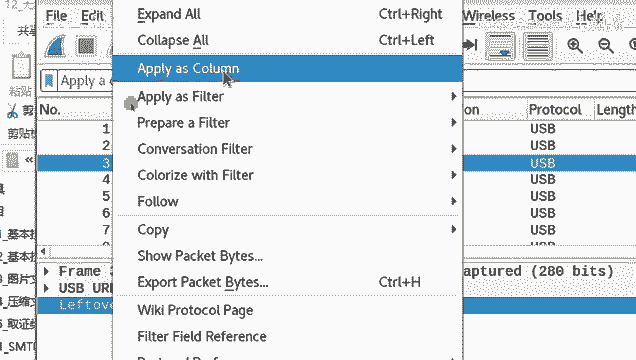

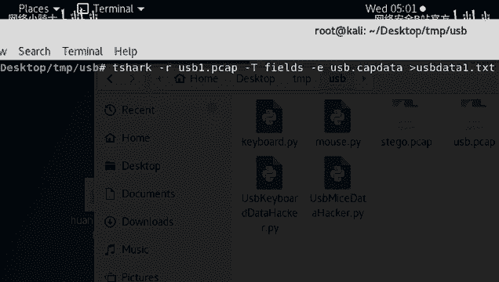

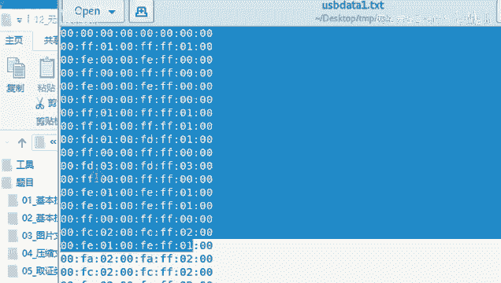

*   **USB流量**：
    *   考察键盘击键记录或鼠标移动轨迹还原。
    *   **键盘流量**：数据通常为8个字节，击键信息在第3个字节。需要根据USB HID规范将十六进制值映射为按键字符。
        *   **步骤**：导出 `Leftover Capture Data` 字段 -> 编写或使用脚本（如 `keyboard.py`）将数据转换为按键序列 -> 得到输入的字符串（可能是Flag）。
    *   **鼠标流量**：数据通常为4个字节，包含按键状态和X/Y轴偏移量。
        *   **步骤**：导出数据 -> 使用脚本解析出坐标序列 -> 利用绘图工具（如 `gnuplot`）或脚本将坐标画成轨迹图 -> 从图中识别出Flag。

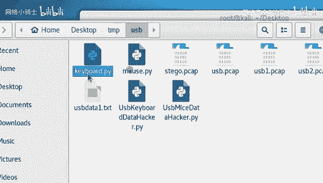

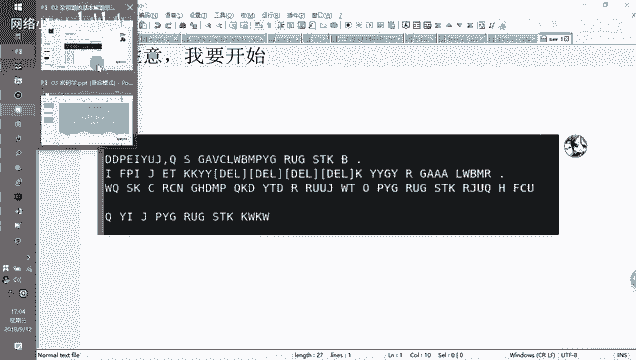

*   **HTTPS流量**：
    *   HTTPS是加密的HTTP，直接查看是乱码。
    *   如果题目提供了服务器的私钥（`.key`文件），可以在Wireshark中导入以解密流量。
    *   **导入方法**：**编辑 (Edit) -> 首选项 (Preferences) -> 协议 (Protocols) -> TLS/SSL** -> 点击 **(Pre)-Master-Secret log filename** 旁的 **浏览**，选择密钥文件。
    *   导入后，原先的TLS流量会被解密，并可以像分析HTTP流量一样进行分析。

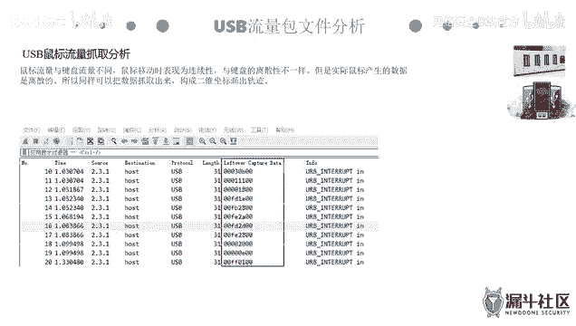

---

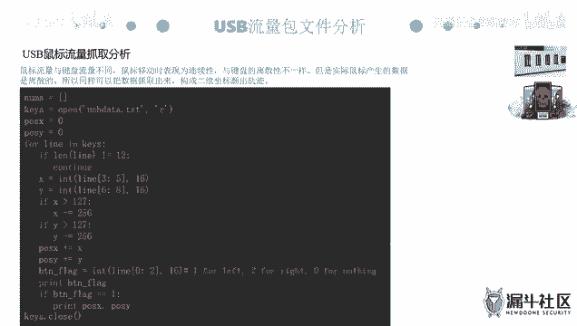

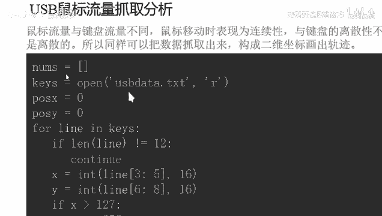

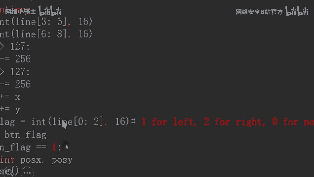

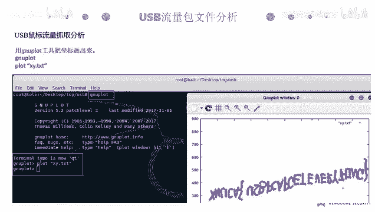

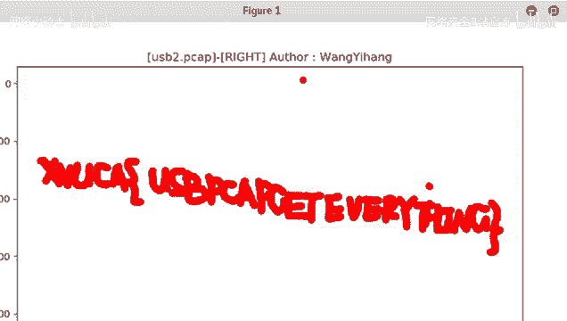

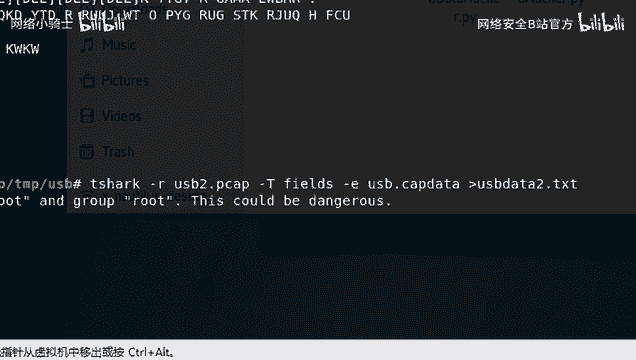

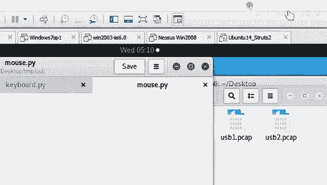

## 总结与回顾 🎯

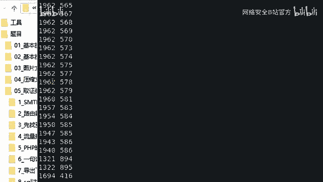

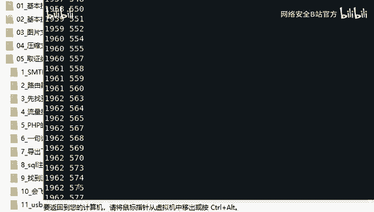

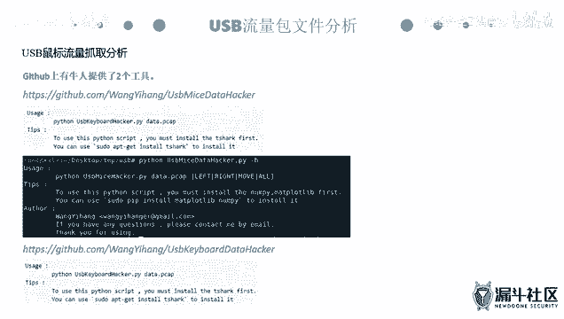

本节课我们一起学习了CTF杂项中压缩文件处理和流量分析取证的核心思路。

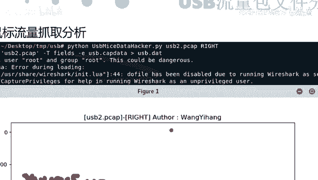

*   **压缩文件**：我们掌握了识别和修复伪加密的方法，学习了使用ARCHPR等工具进行密码破解（暴力、字典、掩码、明文攻击），并了解了修复损坏压缩包结构的基本原理。
*   **流量分析**：我们熟悉了Wireshark这一核心工具，包括协议过滤、流追踪、文件导出等基本操作。此外，我们还探讨了无线握手包破解、USB键盘鼠标流量还原以及HTTPS流量解密等特殊题型的解题方法。

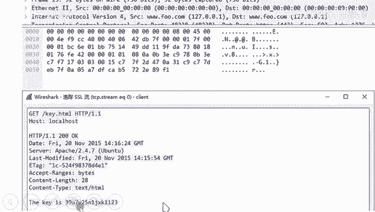

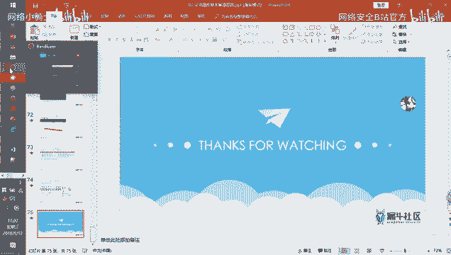

处理这类题目的关键在于**耐心**和**细心**。需要仔细查看每一个可疑的数据包，尝试不同的过滤条件，并熟练运用各种导出和解析技巧。课后请结合提供的练习题进行巩固，实践是掌握这些技能的最佳途径。晚上我们将进入密码学部分的学习。