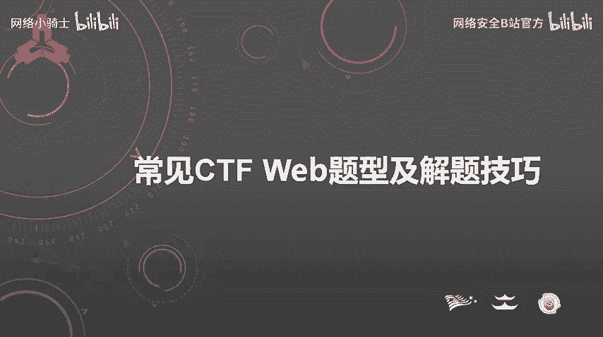
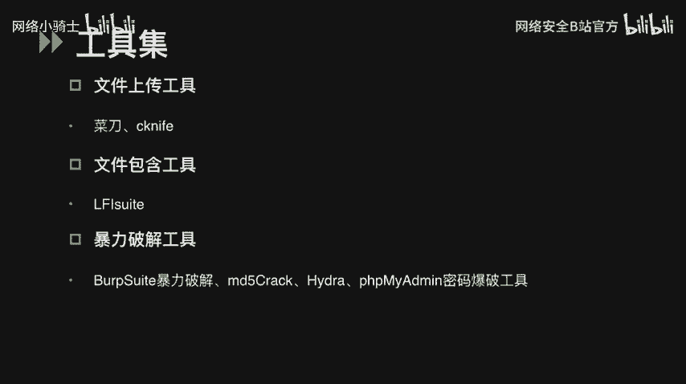
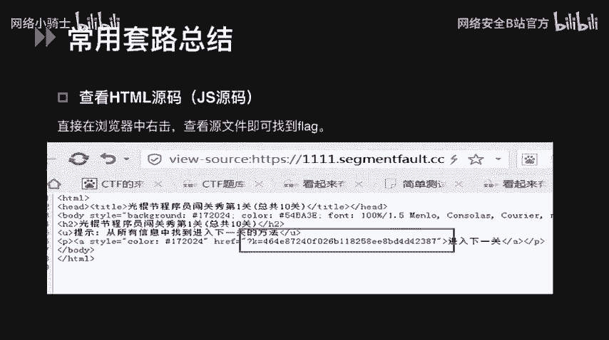
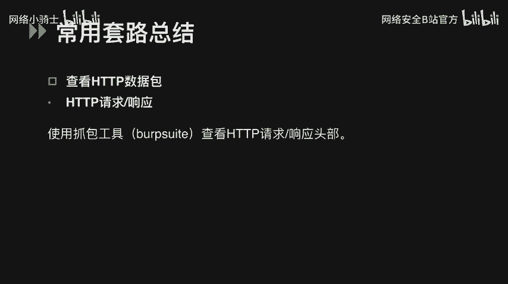
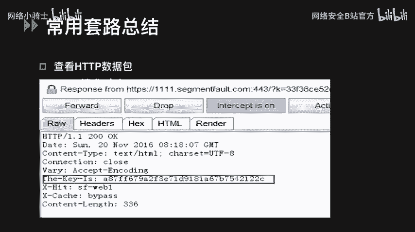
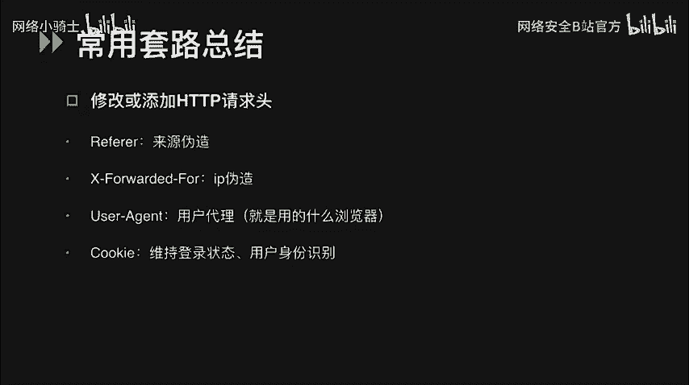
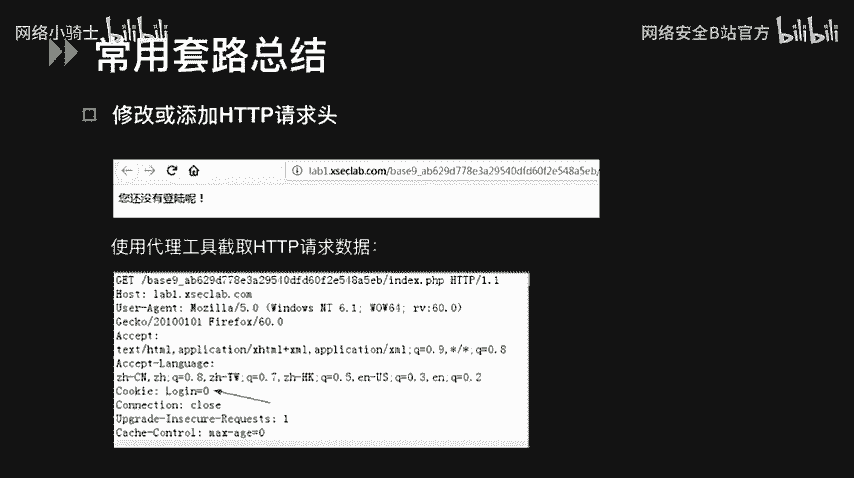
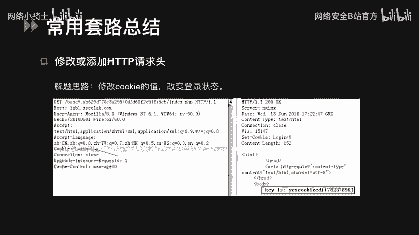
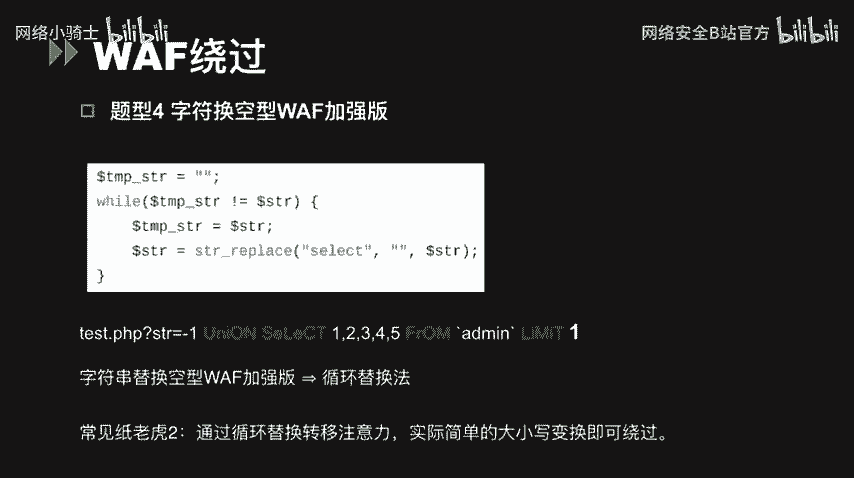
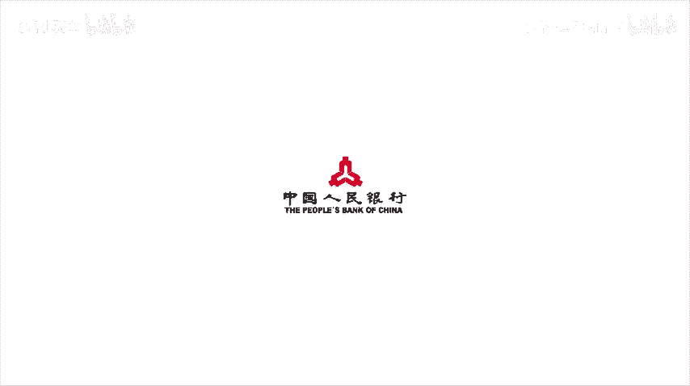

# CTF入门教程：P23：常见CTF WEB题型及解题技巧 🚩



在本节课中，我们将要学习CTF比赛中常见的WEB题型及其解题技巧。课程内容将分为三个主要部分：常用工具集介绍、常见解题套路总结以及针对特定题型的技巧分析。通过学习，你将能够掌握识别和解决各类WEB题目的基本方法。

## 常用工具集介绍 🛠️

在CTF的WEB类题目中，熟练使用各种工具是解题的基础。以下是解题过程中常用的一些工具。

*   **代理与集成平台**：Burp Suite是一个功能强大的代理工具和Web应用程序攻击集成平台，包含多种实用工具。Firefox浏览器中的HackBar插件可以方便地修改POST请求参数，并提供SQL注入和XSS工具功能，还能快速进行各种字符串编码。
*   **扫描工具**：DirBuster可用于扫描网站后台目录。Nmap用于扫描开放端口和服务探测。AWVS是一个Web漏洞扫描工具，能扫描常规的Web漏洞。**注意**：在CTF比赛中需慎用扫描工具，部分比赛禁止大规模扫描操作。
*   **注入工具**：最常用的SQL注入工具是`sqlmap`。XSS平台则用于通过注入XSS代码获取他人浏览器中的信息（如LocalStorage、Cookie等），可以自行搭建，例如GitHub上的`xss-platform`项目。
*   **文件上传与包含**：中国菜刀/CKnife等工具可在上传木马文件后，连接并控制网站目录。`LFI Suite`是本地文件包含漏洞利用神器，提供多种攻击模块且使用简单。
*   **暴力破解**：Burp Suite的Intruder模块可用于认证破解。对于MD5加密的密码，可使用MD5Crack等软件。`Hydra`是一款开源的暴力破解工具，支持SSH、FTP、MSSQL等多种服务。`PHPMyAdmin`密码爆破工具可对MySQL数据库进行登录尝试。



除了以上列举的工具，网上还有许多其他资源可供探索和下载使用。



## 常见解题套路总结 🧩



在CTF比赛中，Pwn、Reverse、Crypto等题型通常需要扎实的基础，而WEB题则更侧重于技巧和套路。掌握一些常见模式能有效提升解题效率。



### 1. 页面源代码与HTTP头信息





最简单的一种情况是Flag直接隐藏在页面源代码中。只需在浏览器中右键点击页面并选择“查看页面源代码”，即可找到Flag。



除了源代码，Flag有时也会藏在HTTP请求或响应包的头部信息中。这时，我们可以使用之前提到的代理工具（如Burp Suite）进行抓包查看。例如，在HTTP响应包的`X-Key`头部中可能就包含所需的Flag值。

我们还可以通过修改或添加HTTP请求头来伪造客户端信息，以达到解题目的。例如：
*   修改`Referer`头可以伪造请求来源。
*   修改`X-Forwarded-For`头可以伪造客户端IP地址。
*   修改`User-Agent`头可以伪造浏览器标识。
*   修改`Cookie`可以改变用户的登录状态。

**例题**：题目提示当前为“未登录状态”。解题思路是可能需要我们处于登录状态。通过代理工具查看Cookie，发现其值为`login=0`。尝试将其修改为`login=1`，再次请求即可获得Flag。

### 2. 源码泄露

线上CTF比赛中，源码泄露是常见题型。以下是几种典型情况：
*   **VIM源码泄露**：如果页面提示与VIM相关，可能存在`.swp`备份文件泄露。可尝试访问`/.index.php.swp`或`/index.php~`来获取源码。若文件有乱码，可在Linux下执行`vim -r index.php`恢复。
*   **备份文件泄露**：尝试访问`index.php.bak`、`www.zip`等常见备份文件后缀。
*   **Git源码泄露**：运行`git init`会在目录下生成`.git`隐藏文件夹。可访问`/.git/config`获取信息，或使用`GitHack`等工具进行利用。
*   **SVN源码泄露**：可访问`/.svn/entries`获取源码。工具有`svnExploit`和`dvcs-ripper`等。

### 3. 编码与加密

WEB题中常出现编码与加密类题目，识别加密方式是关键。

*   **Base64**：末尾常有`=`填充。若一次解密无效，可能是多次Base64加密，可编写Python脚本循环解密。
    ```python
    import base64
    # 示例：循环解密Base64
    encoded_string = "..." # 你的密文
    while True:
        try:
            encoded_string = base64.b64decode(encoded_string).decode('utf-8')
        except:
            break
    print(encoded_string)
    ```
*   **摩尔斯电码**：由点（`.`）、划（`-`）和间隔组成。可使用在线工具快速解密。
*   **培根密码**：使用`A`和`B`组合表示字母，5个为一组。同样可利用在线网站解密。
*   **栅栏密码**：将明文分成若干组，按一定规则重新排列。通常明文长度不会太长。
*   **凯撒密码**：通过将字母按字母表顺序偏移固定位数实现加解密。偏移量`k`的加密公式为：`C = (P + k) mod 26`，其中`C`为密文字母，`P`为明文字母。
*   **JSFuck**：仅用`[`、`]`、`(`、`)`、`!`、`+`六个字符编写JavaScript代码。遇到此类字符串可判断为JSFuck编码，使用在线解码器即可。

解决编码类题目主要依靠平时积累的经验，快速识别加密类型。

### 4. Windows特性利用

*   **短文件名**：Windows为长文件名生成8.3格式的短文件名（如`backup~1.cl`）。可利用波浪号（`~`）猜测暴露的短文件名。
*   **IIS解析漏洞**：可用于绕过文件上传时的白/黑名单检测，具体方法可参考文件上传专题课程。

## 特定题型技巧分析 🔍

有些题型因其独特的技巧性而颇具挑战，例如PHP弱类型和WAF绕过。

### PHP弱类型

PHP是一种弱类型语言，其比较操作有时会产生非直觉的结果。

**PHP类型比较**：`==`（松散比较）会进行类型转换。例如：
*   字符串与数字比较时，字符串会被转为数值。`"abc" == 0` 为真，`"123a" == 123` 为真。
*   空字符串、`NULL`、布尔值`FALSE`在松散比较时均等于`0`。
*   `"0e123456" == "0e987654"` 为真，因为`0e`开头会被视为科学计数法（0的任意次方均为0）。

**题型1：字符串比较绕过**
`strcmp()`函数用于比较两个字符串。若传入一个数组而非字符串，函数会出错返回`NULL`，在松散比较中`NULL == 0`为真，从而可能绕过检查。
```php
if (strcmp($_GET['flag'], $secret_flag) == 0) {
    echo $flag;
}
// 传入 ?flag[]=a 即可绕过
```

**题型2：MD5绕过**
题目要求输入两个不同的值，使其MD5值在松散比较下相等（`==`）。
*   **解法1：科学计数法绕过**：寻找两个MD5哈希以`0e`开头的不同字符串，如`240610708`和`QNKCDZO`，它们的MD5值分别是`0e462097431906509019562988736854`和`0e830400451993494058024219903391`，在`==`比较下均等于0。
*   **解法2：数组绕过**：`md5()`函数无法处理数组，传入数组会返回`NULL`，使得`md5($a) == md5($b)`为真（`NULL == NULL`）。
    ```php
    // 传入 ?a[]=1&b[]=2
    ```

### WAF绕过技巧

WAF（Web应用防火墙）旨在过滤恶意输入，但存在多种绕过方法。

以下是几种常见的绕过方式：
*   **大小写混合**：如`SeLeCt`代替`select`。但若正则表达式使用`/i`修饰符（不区分大小写），则此方法无效。
*   **编码**：对关键字进行URL编码（如单引号`%27`，斜杠`%2F`）或十六进制编码（如`0x7461626c65`表示`table`）。
*   **使用注释**：注释符（`#`、`-- `、`/**/`）可替代空格或拆分关键字。例如：
    *   `UNI/**/ON SEL/**/ECT`
    *   `SEL%0bECT` （使用空字节或空白符）
*   **嵌套剥离**：若过滤函数只执行一次替换（如将`select`替换为空），则可使用`selselectect`，被剥离中间的`select`后，剩下的字符正好组成新的`select`。
*   **避开自定义过滤器**：分析过滤规则，使用非常规语法。例如，若过滤`and`和`or`，可尝试`&&`和`||`。

**例题：字符替换过滤**
题目使用`str_replace`函数将`select`等关键词替换为空。由于只替换一次，使用`selselectect`即可绕过（剥离中间的`select`后得到`select`）。若题目使用`while`循环进行多次替换，则简单的大小写混合可能就能绕过。

## 总结 📝





本节课我们一起学习了CTF WEB题型的核心解题思路。我们从**工具集**开始，了解了抓包、扫描、注入等必备工具。接着，总结了查看源码、HTTP头操作、源码泄露、编码识别等**常见套路**。最后，深入分析了**PHP弱类型比较**和**WAF绕过**这两类需要特定技巧的题型。记住，解决WEB题的关键在于细心观察、大胆尝试并灵活运用各种工具与知识。希望本教程能帮助你在CTF道路上更进一步！