# 金融业网络安全攻防案例剖析：P24：58.58. 金融业网络安全攻防案例剖析 🔐


在本节课中，我们将学习金融业网络安全攻防中的实际案例。课程将围绕网络攻击中常见的四类漏洞展开，通过具体实例剖析其原理、利用方式及危害，帮助初学者理解金融安全领域的核心风险。

## 概述：网络攻击中的四类漏洞

在所有的网络攻击过程中，主要包含以下四类漏洞。

以下是这四类漏洞的简要介绍：
*   **应用层漏洞**：主要指在应用程序代码层面存在的安全缺陷。
*   **业务逻辑层漏洞**：由于业务流程设计缺陷导致的安全问题。
*   **安全运维层漏洞**：由于安全运维人员操作不当或意识不足导致的问题。
*   **安全意识层漏洞**：由于人员安全意识薄弱引发的安全隐患。

本章内容将根据这四部分进行详细描述。

## 第一部分：应用层漏洞 🛠️

上一节我们概述了网络攻击的四大类漏洞，本节中我们来看看第一类——应用层漏洞。应用层漏洞主要包括OWASP Top 10中介绍的漏洞，例如SQL注入、XSS跨站脚本、CSRF跨站请求伪造、SSRF服务器端请求伪造，以及文件操作、命令执行等系列漏洞。

针对应用层漏洞，我们主要介绍以下四种类型，并分别举例说明。

以下是四种类型的应用层漏洞案例：
1.  **SQL注入**
2.  **数据伪造**
3.  **沙盒逃逸**
4.  **文件上传**

### 案例一：SQL注入漏洞

在案例一中，是某个系统的SQL Server注入。这个注入的后果除了能获取敏感数据外，还能通过向操作系统写入文件达到获取Shell（控制权）的目的。

大家可以先观察这个数据包。在POST的数据包中，我们可以看到在`UID=1`后面加入了一个单引号，程序就会报错。我们初步判断这个地方可能存在注入。

经过一系列尝试，我们使用了一个类型转换函数`CONVERT`，将数据库里的`user`参数转化为`int`类型。`user`参数本身是`char`类型，当转化为`int`时会报错。当把这个字符串组合在数据包中发给后端处理时，从下图可以看到程序报错，提示将`char`转化为`int`时失败。由此我们可以断定此处存在SQL注入。

经过测试，我们发现当前MySQL的权限是`SA`权限（最高数据库权限），同时支持`UNION`查询，操作系统的用户权限是`system`权限。而且当前数据库开启了`xp_cmdshell`这个SQL Server特性。开启此函数后，我们就可以通过注入点执行系统命令。

观察这个数据包，我们将刚才`user`转化为`int`的操作逻辑，改为用`xp_cmdshell`执行一个`whoami`的操作，并将执行结果输出到web目录下的一个`.txt`文件里。发包之后发现成功将结果写入了该文件。访问这个文件，发现已成功写入当前操作系统的一个权限用户。

回顾这个漏洞，通过这个SQL注入，我们不仅可以获取数据，还可以直接获取操作系统的权限。

**核心概念：SQL注入**
SQL注入是指通过构造特殊的输入作为参数传给后端的Web程序，进而执行攻击者所要操作的逻辑。在用户输入没有进行过滤的情况下，就会发生这种注入类型的攻击，导致应用程序的终端用户对数据库上的语句实施操作。

根据注入类型不同，SQL注入可分为字符型注入、数字型注入等。SQL注入的危害主要表现在对数据库的信息窃取。在某些条件下，还可以被攻击者写入恶意文件，造成操作系统权限丢失，正如本案例所示。

SQL注入形成的原因主要是开发人员在开发过程中没有严格审核客户端传给服务器的参数类型，同时该参数被当做逻辑语句执行。当采用字符串拼接的方式执行语句时，攻击者就有机会在参数中插入恶意SQL查询语句，达到攻击目的。SQL注入漏洞也是发生频率非常高的一类漏洞。

### 案例二：数据伪造与加密算法泄露

接下来一个案例我们讲一下数据伪造。除了常见的身份伪造，现在很多企业还存在一类漏洞，即加密算法被窃取。除了加密算法，加密所用的密钥也可能被轻易拿到。

大家可以观察这个数据包。这是一个普通的数据包，包括`Host`、`User-Agent`等。唯一不同的是，在链接里有一个`getToken`方法。这个方法将`req`参数的值传给`getToken`方法后，经过一系列处理，返回生成当前用户的`token`。

在测试过程中发现`req`这个加密密文后，我们猜测有两种可能：一种是Base64编码，另一种可能是DES加密算法。

**核心概念：DES加密**
DES加密是一种密钥加密算法，于1977年被美国联邦政府国家标准局确定为联邦资料处理标准，并授权在非密集政府通信中使用，随后在国际上广泛流传。
DES设计过程中使用了分组密码设计的两个原则：混淆和扩散。其目的是抗击敌手对密码系统的统计分析。
*   **混淆**：使密文的统计特征与密钥的取值之间的关系尽可能复杂化，使得密钥、明文及密文之间的依赖性对密码分析者无法利用。
*   **扩散**：将每一位明文的影响尽可能迅速地作用到较多的输出密文中，以便在大量的密文中消除明文的统计结构，并使每一位密钥的影响尽可能迅速地扩散到较多的密文位中，以防止密钥被逐段破译。

在观察到`req`参数的特征后，我们逆向分析了当前应用的客户端。很幸运，在客户端里发现了下面这段代码：

```python
# 这是一个解密函数和加密函数的示例代码片段
# 上面是解密函数，下面是加密函数
secret_key = 'ThisIsASecretKey'  # 硬编码的密钥
```

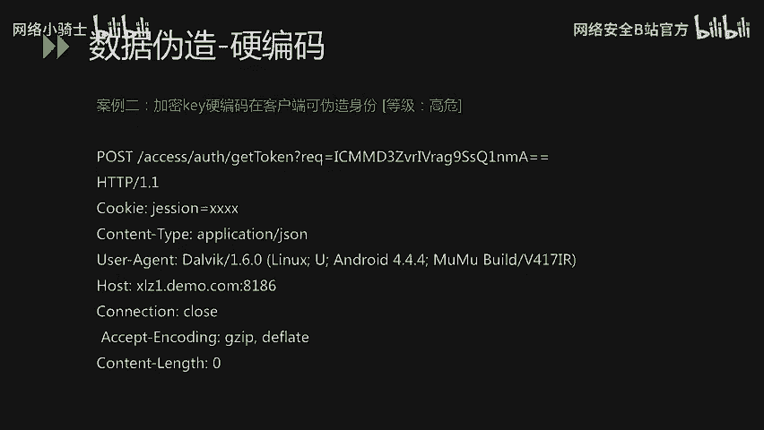

在函数里我们看到了`secret_key`这样的参数，这个参数其实就是DES加密和解密过程中使用到的密钥。拿到这个密钥后，就可以对刚才链接里的`req`参数进行加密或解密。

我们尝试将`givospddxsuwo-1`这样的一个参数，通过刚才发现的密钥进行DES加密后，粘贴到数据包中，然后重放数据包。发现重放后，它返回了`givospddxsuwo-1`这个用户的`token`，导致我们可以通过这个`token`获取该用户的身份信息。

像这样密钥硬编码在客户端里的现象，在当前的企业应用中还是非常多的。因为传统的加密方式可能已做完善处理，很难找到攻击入口。现在移动端普及过程中，移动端可能更多地成为了攻击入口。我们建议在客户端打包或上线前进行加壳或加固操作。

**核心概念：加壳**
加壳就是在二进制程序中植入一段代码，程序在运行时，会优先获取这段代码的控制权以做一些额外工作。大多数病毒也基于此原理。加壳是应用加固的一种手段，对二进制原始文件进行加密、混淆及隐藏。通过加壳可以有效阻止攻击者对程序的逆向分析，加大其获取敏感信息的难度。

### 案例三：沙盒逃逸

案例三我们讲一个在金融证券行业经常遇到的安全问题：沙盒逃逸。在讲沙盒逃逸前，先介绍金融、证券行业里一个常遇到的系统：量化交易系统。

**核心概念：量化交易系统**
量化交易系统是指以数学模型替代人为的主观判断，利用计算机技术从庞大的历史数据中海选出能带来超额收益的多种“大概率”事件策略，以减少投资者情绪对选股或走势判断的影响，避免在市场极度狂热或悲观时做出非理性的投资决策。此类量化交易系统被广泛应用于金融和证券行业。

这样的量化交易系统会给用户提供源码编辑功能，用户可根据需求编写代码来完成自动化的策略选型或构造。这其中存在隐患。编码后的运行过程其实是运行在系统的沙盒里。这个沙盒一旦被逃逸，恶意攻击者就可以直接把命令运行在操作系统层。

我们来看一个具体案例。在这个量化交易模型中，有一个用户编写源码的界面，用户可以定制化函数来设定要操作的股票或基金。可以看到里面可以调用一些常见的函数或模块。常见的这个沙盒是一个Python沙盒。

我们讲一下Python里的`subprocess`模块。

**核心概念：subprocess模块**
`subprocess`模块是Python从2.4版本开始引入的模块，主要用来取代一些旧的方法，如`os.system`、`os.spawn`、`os.popen`、`popen2`、`commands`等模块。
`subprocess`通过创建子进程来执行外部指令，并通过`input`、`output`或`error`管道获取子进程的返回信息。

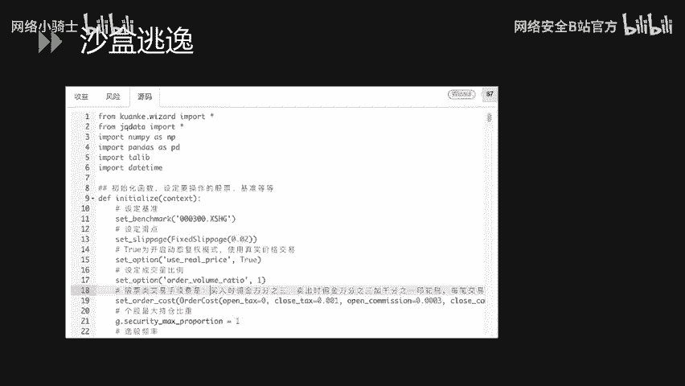

我们讲一下如何通过`subprocess`模块进行沙盒逃逸。

我们将构造的Payload写在源码里，通过编译运行过程达到沙盒逃逸。这是我们的Payload：

```python
import subprocess
import logging

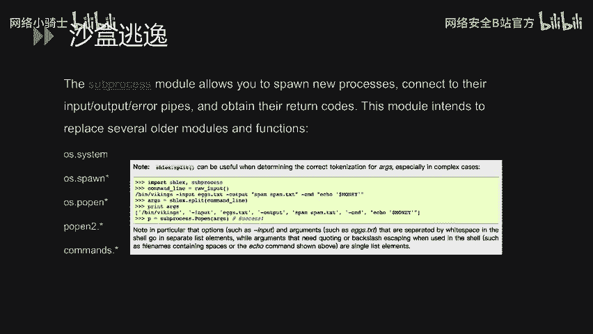

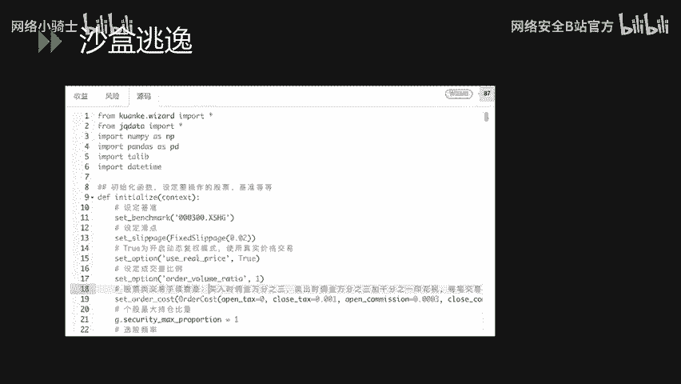

def handle_data():
    tt = "/bin/ps -ef"  # Linux系统命令，获取进程信息
    # 初始化subprocess.Popen方法，传入命令，shell=True表示直接传入命令字符串
    bb = subprocess.Popen(tt, shell=True)
    logging.error(bb)  # 打印执行结果
```

首先我们`import`相关模块，然后定义了一个`handle_data`方法。在方法里，定义变量`tt`，赋值为`/bin/ps -ef`，这是一个Linux操作系统里常用的命令，用于获取当前操作系统的进程相关信息。然后初始化`subprocess.Popen`方法，将`tt`变量传到方法里，同时设置`shell=True`。`shell=True`在`subprocess.Popen`方法中表示可以直接传入命令字符串执行。然后在`log_error`方法里打印出我们初始化的这个方法`bb`。

我们可以看一下结果。将刚才的Payload放在左边量化交易模型的沙盒里，点击编译运行。在右下角的日志里，可以看到已经输出了当前系统的一些进程信息，达到了执行操作系统命令的效果。这样就完成了一次沙盒逃逸，从沙箱逃逸到了当前主机上执行操作系统命令。

当然，除了执行`ps -ef`命令，我们还可以执行网络相关命令，例如`nc`，或直接下载恶意文件到服务器，然后反弹Shell，达到直接入侵内网的效果。

沙盒逃逸在当前很多证券、金融行业里，沙盒的安全性相对还比较低。一个原因是之前大家未关注此方面，另一个原因是Python等沙盒里的库或模块更新及特性更改，而沙盒没有及时迭代到最新版本，可能就存在一些特性会造成沙盒逃逸。在之后的运维及迭代更新过程中，需要特别注意基础模块的迭代更新，防止沙盒逃逸。

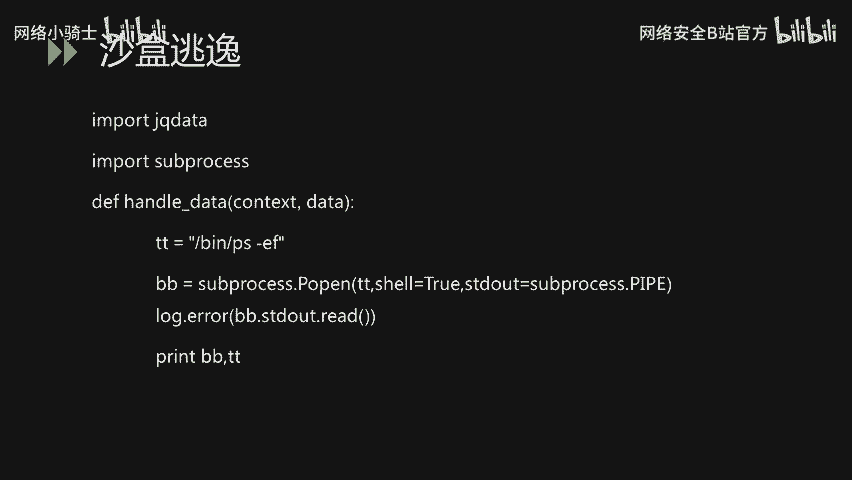

### 案例四：任意文件操作漏洞（文件上传与读取）

接下来介绍另一类漏洞：任意文件操作漏洞。这里我们举一个通过任意文件操作导致getshell的过程。这个案例不仅用到了文件上传，还用到了任意文件读取。

首先看下图。我们通过`curl`一个地址，获取到了一些`bash_history`的内容。首先这个地方存在一个任意文件读取漏洞。通过在URL里拼接相关文件路径，达到读取文件的操作。

在往下介绍前，先介绍一下什么是任意文件操作漏洞。

**核心概念：任意文件操作漏洞**
任意文件操作漏洞包括文件上传、文件读取、任意文件删除、任意文件下载以及任意文件包含等系列文件操作。其中，任意文件上传是渗透测试中经常遇到的安全问题。在大多数业务系统里，都有上传文件的功能，例如上传头像或资料。当系统没有对上传的文件进行校验或过滤时，就可能导致攻击者直接上传Webshell，进而控制服务器权限。

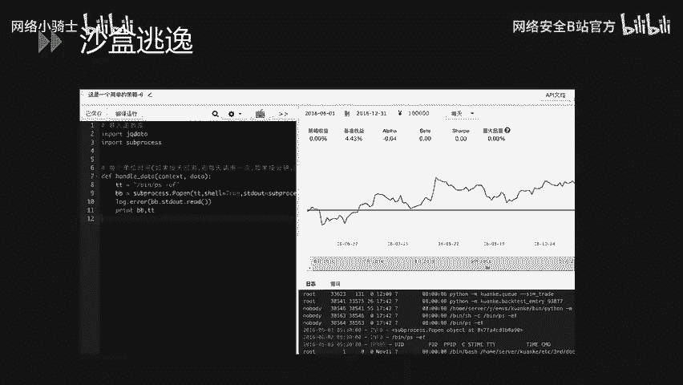

在这个案例里，我们通过任意文件读取，首先获取了当前Web系统的一些框架代码。然后对代码进行审计，发现代码里有一些接口没有在网站上体现出来，但是可以访问。例如下图中这个接口，它是一个个人资料设置功能。在这个功能里可以上传头像。在上传头像的方法里，它没有对文件类型进行判断，没有限制只能上传`JPG`或`PNG`等图片格式。我们直接上传一个`.jsp`的动态文件上去，就可以直接执行了。

我们上传一个`cmd.jsp`上去之后，发现文件成功解析。我们传入一些参数，然后直接获得了操作系统执行命令的权限。这里我们展示了获取当前操作系统IP地址的一个命令。

## 第二部分：业务逻辑层漏洞 ⚙️

讲完应用层的漏洞，我们再来介绍一下业务逻辑层的一些漏洞。相对于应用层漏洞，业务逻辑层的漏洞在自动化检测方面比较难做到，因为它伴随着业务，需要加入逻辑分析。

以下是业务逻辑层漏洞的两个案例：
1.  **越权漏洞**
2.  **密码重置漏洞**

### 案例五：越权漏洞

下面这个案例是关于越权漏洞，是一个系统个人信息查询功能的越权。

先来看一下这个数据包。首先这是一个非常普通的数据包，POST里有一些`Host`、`URL`路径和方法名。再看`body`里有一个`number`参数，它的值是`223`。

在测试过程中，我们发现这个`number`的值其实代表了当前用户的UID，后端通过获取`number`值去数据库查询当前用户的身份信息。在测试中，通过修改这个`number`值，比如把`223`改成`220`，就可以获取到其他用户的信息。

这样的漏洞一旦被攻击者检测到，他就可以进行自动化批量操作，来达到获取大量用户信息的目的。例如在下图里，通过遍历`number`参数，可以大批量获取对应账户里的姓名、身份证、账户余额以及工作单位等一系列信息。这对企业和用户本身都造成非常严重的影响。

越权漏洞在金融、证券领域出现频率相对较高。因为在金融和证券领域，业务之间非常复杂，有时因为接口调用不当或身份没有健全，就很有可能出现这种比较容易发现的越权漏洞。

### 案例六：密码重置漏洞

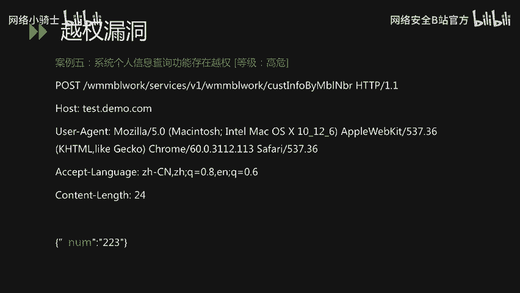

接下来我们讲一下密码重置漏洞。密码重置漏洞是业务逻辑漏洞的一种形式。在这个案例里，我们将介绍如何通过在注册账号的过程中重置别人的密码。

首先看下图，它是一个比较标准、常规的开户或注册账号过程：创建账户 -> 设置密码 -> 设置登录个人信息 -> 后续审核。

这个案例里，我们首先注册一个A用户（如`001`用户）作为受害者，设置一个密码（如`1234`），假设他是一个正常用户。同时，我们注册一个`002`用户，把他的密码设置为`5678`。

在提交密码的这一步里，我们对数据包进行拦截，把数据包里关键的`account`参数（即账号信息，如`002`）改为受害者的账户`001`。我们提交这个数据包，发现后端成功执行并返回结果。后续登录时，发现`001`的密码已经被设置成了`5678`。

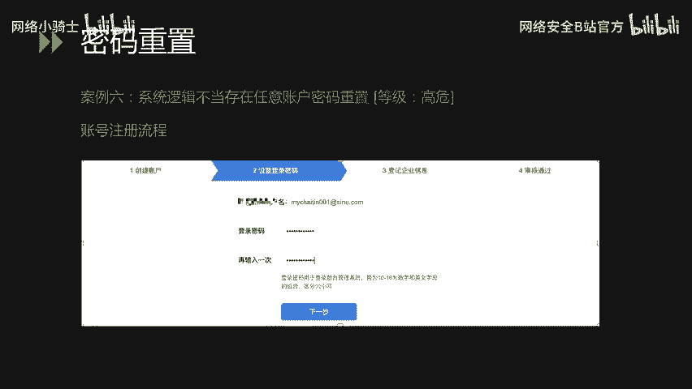

从下图可以看到，把`account`参数改为任意一个想要攻击的账户，就可以将其密码设置为我们可以控制的密码。密码重置漏洞相对来说少一点，但所带来的危害非常严重。

## 第三部分：安全运维层漏洞 🖥️

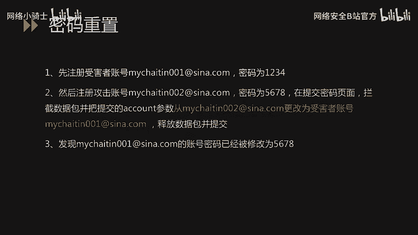

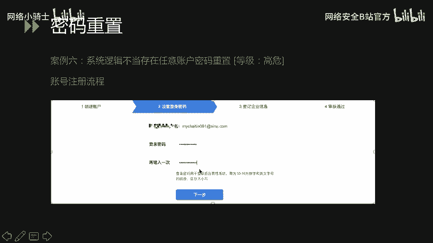

接下来第三部分讲一下运维漏洞。运维漏洞里我们主要讲两类：一类是N-day漏洞，一类是配置不当漏洞。

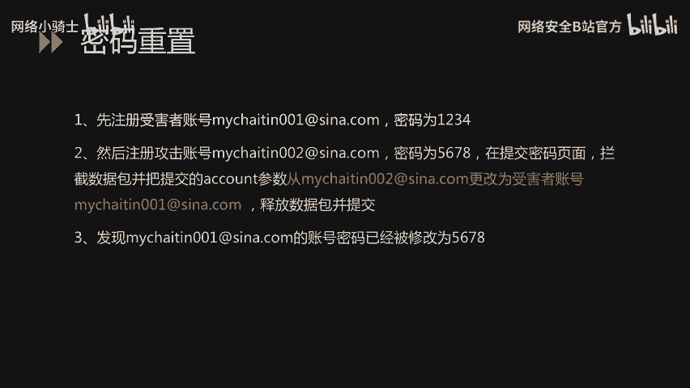

以下是两类运维漏洞的案例：
1.  **N-day漏洞**
2.  **配置不当漏洞**

### 案例七：N-day漏洞（WebLogic反序列化）

所谓N-day漏洞，区别于0-day漏洞。0-day漏洞可能是刚爆发的最新安全漏洞，官方可能还未发布补丁。N-day漏洞可能是官方已发布补丁，或漏洞已爆出较长时间，已有有效防御措施，但依然能通过此漏洞对业务系统造成损害。这就是运维过程中没有及时打补丁、更新系统版本导致的安全问题。

案例七介绍一个在金融、证券行业里常遇到的WebLogic、Struts2、Tomcat等中间件或框架的案例。在测试某金融行业网站时，我们在`8009`端口发现了一些WebLogic的报错信息。尝试通过一些已写好的漏洞利用代码对这个WebLogic版本进行测试。发现当输入一些操作系统命令时，当前WebLogic所在的服务器成功执行并返回了结果。这也是一个N-day漏洞的典型案例，在WebLogic、Struts2、Tomcat、ZooKeeper里常会遇到。

这需要企业的运维人员及时对这些系统的中间件、框架进行信息梳理，建立系统与当前版本的映射关系，以便在此类框架爆发新漏洞时，能够及时对业务系统的版本有详细了解。

### 案例八：配置不当漏洞（备份文件泄露）

另外一部分，在运维过程中介绍一个因运维不当导致的安全问题。案例八介绍一个因为备份文件没有删除导致的比较严重的安全问题。

首先，这个漏洞始于一个备份文件没有删除。我们通过`curl`这个文件发现可以下载下来。下载解压后，发现这个文件夹里包含了整个网站的所有代码、配置信息以及日志等。在翻阅备份文件的过程中，我们发现了一个配置信息。从图里可以发现它有数据库的端口、用户名、数据库名`DBname`以及密码`DBpwd`。

首先它是在内网，我们可能无法直接连接。但是可以通过这样的一些密码找到一些规律，利用这些信息在渗透测试过程中对攻击者有很大帮助。

## 第四部分：安全意识层漏洞 👥

最后一部分我们介绍一下安全意识。安全意识相对于前面三个技术环节，是最难管理也最难杜绝的一部分。

在安全意识里，我们主要介绍两部分：
1.  **口令相关**
2.  **代码安全相关**

### 案例九：弱口令导致getshell

口令相关我们举一个非常典型的案例：弱口令导致的getshell。

在这幅图里大家肯定很熟悉，这是一个Tomcat的管理界面。案例九中，我们首先获取到了一个弱口令，然后登录到系统后台。大家知道Tomcat是一个Web容器，可以部署Web应用。登录后台后，我们部署了一个带有恶意文件的Web应用上去，就直接getshell，获取了当前Web网站的权限。

这边是上传成功后执行的结果。我们可以看到能获取当前目录下的所有文件，还可以在当前目录下新建文件夹、新建文件、上传文件以及直接执行操作系统命令。

### 案例十：GitHub配置文件泄露

案例十介绍GitHub的配置文件泄露。其实不光配置文件，GitHub上可能还泄露了业务代码。这部分漏洞也是在金融、互联网公司里常遇到的状况。可能有开发人员在项目结束后，为了管理代码，会把代码上传到GitHub等开放平台。这些代码如果被恶意攻击者获取，他能对代码进行白盒审计，或直接从代码里获取配置文件，直接对业务系统造成危害。

通过白盒审计的方式，可以获取一些黑盒审计很难发现的漏洞。再通过白盒审计，可以审计出一些危害较高的漏洞。

在下图里，我们任意搜了一个`mysql`连接数据库的关键字。可以看到大概有`47000`多条数据，这里面肯定有很多可以直接连接上。这也是希望我们在开发过程中尽量避免将代码上传到互联网的不良习惯。

在这个案例里，我们通过一些关键字直接获取到了运维人员的运维手册。在这个手册里，可以比较清楚地看到它记录了不同操作系统、不同数据库以及不同业务系统内外网的地址，包括数据库的用户名密码、操作系统的用户名密码等，都介绍得非常详细。如果这份文件被恶意攻击者拿到，他就可以直接获取操作系统的权限，进而威胁到企业安全。

### 案例十一：SVN泄露

除了安全意识导致的代码安全隐患，在技术环节也会泄露代码，对业务代码构成威胁。例如案例十一介绍SVN泄露这类漏洞。

**核心概念：SVN泄露**
SVN泄露是在SVN管理本地代码的过程中，会生成一个`.svn`隐藏文件夹，其中包含重要的源代码信息。但一些网站管理员在发布代码时，不愿使用导出功能，而是直接复制文件夹到外网服务器，这就使`.svn`隐藏文件夹暴露在外网。黑客可以借助`.svn`文件夹里的文件索引还原出线上代码，进而对代码进行白盒审计或从代码里直接搜索配置文件信息，威胁企业内网安全。

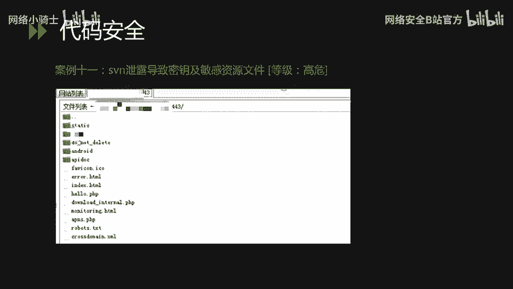

在这个案例里，我们通过一个SVN泄露，成功获取到了线上服务器的代码。然后在代码里找到了一个配置文件。这个配置文件是静态文件储存的一个OSS服务器的密钥，即`AccessKey`和`AccessSecret`。我们通过这个账号直接获取到了企业里的一些敏感数据，包括数据库文件等。这一系列安全问题都会对企业造成非常致命的影响。

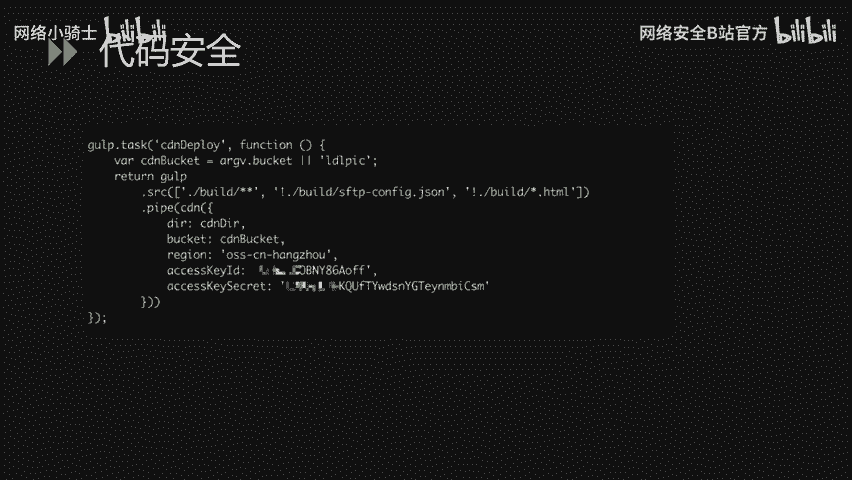

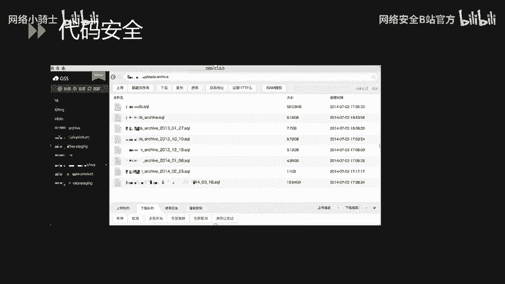

## 总结 📝


本节课中我们一起学习了金融业网络安全攻防中的四类核心漏洞：应用层漏洞、业务逻辑层漏洞、安全运维层漏洞和安全意识层漏洞。通过十一个具体案例，我们剖析了SQL注入、数据伪造、沙盒逃逸、文件上传、越权、密码重置、N-day漏洞、配置不当、弱口令、代码泄露等常见安全问题的原理、利用方式及巨大危害。理解这些案例有助于我们建立基本的安全风险意识，并在开发、运维及日常工作中采取相应措施进行防范。