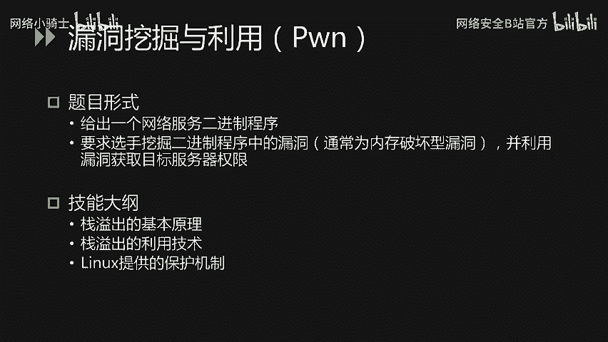

# CTF入门指南：P25：命题思路与赛题类型 📚

在本节课中，我们将梳理CTF比赛的命题思路与主要赛题类型，帮助初学者了解比赛的整体框架和需要准备的核心技能。

## 命题思路 🎯

上一节我们介绍了课程背景，本节中我们来看看比赛的命题思路。为了最大化参赛选手的收获，命题遵循以下核心要求：

*   **考点设置合理**：题目应有明确目标，解题思路清晰。避免套路题和依赖大量猜测的“脑洞题”。
*   **技能实用性强**：题目考点应对金融业网络安全工作有实际帮助，不考察用不到的技能。
*   **技术多样性丰富**：题目应覆盖攻击者可能使用的多种技术，以帮助防守方构建全面的技能树。同时，知识点比重会尽量贴合金融业安全工作的实际需求。

所有赛题将以金融业相关业务为背景，并融合真实的攻防案例，例如：
*   网站入侵
*   恶意软件/勒索软件的清理
*   移动应用破解
*   日志与流量的分析和取证
*   密码保护方式
*   企业信息泄露

## 赛题类型详解 🧩

以下是本次比赛涉及的六种主要题目类型及其比重。其中，**Web安全**和**移动安全**是重点。

### 1. Web安全 🌐

Web安全题目通常会给出一个网站，要求选手通过信息收集、挖掘并利用漏洞来获取目标权限或数据。

需要准备的技能包括：
*   掌握OWASP Top 10漏洞的原理与利用技巧，特别是**SQL注入**、**XSS**、**文件上传**等。
    *   示例：`SELECT * FROM users WHERE username = ‘admin’ AND password = ‘ ‘ OR ‘1’=’1 ‘`
*   了解常见的信息泄露方式。
*   具备代码审计能力，了解PHP和Java语言（Java可能需使用反编译工具）。
*   理解业务逻辑漏洞。
*   关注近年来出现的著名漏洞。

### 2. 移动安全 📱

移动安全题目通常提供一个安卓应用（APK），要求选手通过逆向分析来破解算法或分析通信协议。

主要考察技能：
*   安卓应用流量抓取与分析（如使用Burp Suite、Frida）。
*   安卓应用逆向与调试（使用工具如Jadx、IDA Pro）。
*   安卓应用的修改与重打包。

### 3. 取证分析 🔍

取证类题目会提供一段日志或网络流量数据包（如`.pcap`文件），要求选手分析并提取关键信息。

需要掌握的技能：
*   常见的日志分析能力（如Linux系统日志、Web访问日志）。
*   网络流量抓取与分析（使用Wireshark等工具）。

### 4. 隐写术 🖼️

隐写术题目会给出一个多媒体文件（如图像、音频、视频、文档），要求找出其中隐藏的信息。

核心要求是了解常见文件格式的结构，并能使用相应工具（如binwalk、steghide、Audacity）进行分析。

### 5. 逆向工程 ⚙️

逆向工程题目会给出一个二进制程序（如Windows的`.exe`或Linux的ELF文件），要求分析其算法或修改其行为。

考察技能包括：
*   Windows/Linux软件的逆向分析与调试（使用IDA Pro、GDB、OllyDbg）。
*   二进制程序的修改（如使用十六进制编辑器或打补丁工具）。

### 6. 密码学 🔐

密码学题目会提供密文和相关信息（如加密代码、算法描述），要求破解出明文。

需要掌握的技能包括：
*   常见哈希算法（如MD5, SHA-1）。
*   分组密码与加密模式（如AES-ECB, AES-CBC）。
*   非对称加密算法（如RSA）的原理及相关攻击方式。

### 7. 漏洞挖掘与利用（Pwn） 💥

Pwn类题目通常提供一个网络服务或二进制程序，要求选手挖掘其中的内存破坏型漏洞（如栈溢出、堆溢出），并编写利用代码（Exploit）来获取权限。

要求选手掌握：
*   栈溢出等漏洞的基本原理。
*   利用技术，如构造ROP链。
*   Linux系统保护机制（如ASLR, NX）及其绕过方法。

---

本节课中我们一起学习了CTF比赛的命题思路与七大核心赛题类型：Web安全、移动安全、取证分析、隐写术、逆向工程、密码学和漏洞挖掘与利用（Pwn）。理解这些类型及其考察重点，是备赛的第一步。预祝大家取得好成绩！

