# CTF逆向工程：P26：60.60.二进制_1 🧩


在本节课中，我们将学习CTF逆向工程（Reversing）与软件漏洞利用（Pwning）的基础知识。课程将分为两部分，第一部分聚焦于逆向工程，涵盖汇编语言基础、工具使用、C语言逆向及安全逆向等核心内容。

## 逆向工程概述 🔍

逆向工程（Reversing）涉及对Windows、Linux、安卓等多个平台的二进制文件进行分析，旨在理解其算法逻辑，并最终获取Flag。其难点主要在于：
*   **汇编语言复杂**：相比高级语言更难以阅读。
*   **加密算法复杂**：可能涉及Base64、XOR、AES、RSA等多种算法。
*   **反调试与代码混淆**：增加了分析和调试的难度。
*   **耐心与专注力**：面对复杂代码需要保持耐心。

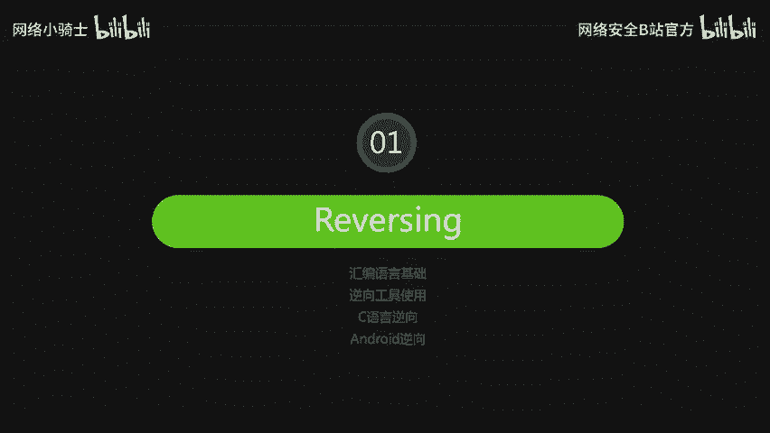

上一节我们概述了逆向工程的挑战，本节中我们来看看其技术基础。

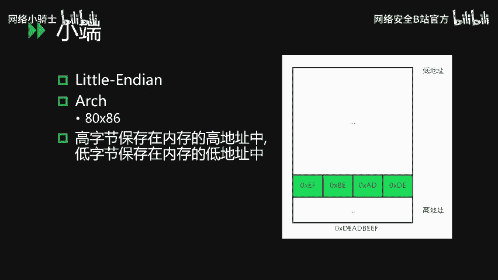

## 汇编语言基础 ⚙️

### 字节序
现代计算机通常采用**小端序**。其特点是高字节保存在内存的高地址，低字节保存在内存的低地址。

例如，数据 `0xDEADBEEF` 在内存中的存储顺序（从低地址到高地址）为：`EF` `BE` `AD` `DE`。

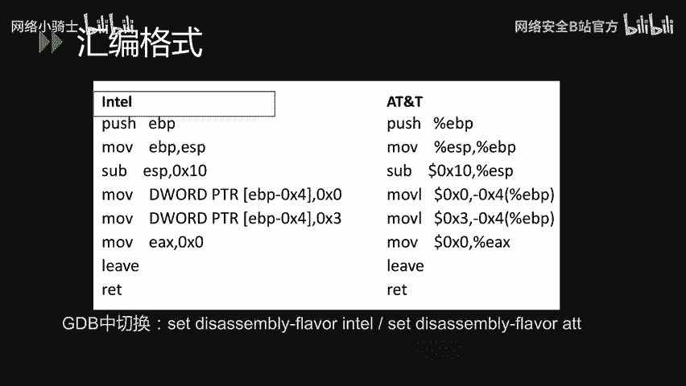

### 汇编格式
主流的汇编格式有两种：**Intel** 和 **AT&T**。

以下是两种格式的主要区别：
*   **AT&T格式**：操作数前带 `%` 符号，立即数前带 `$` 符号，源操作数与目标操作数顺序与Intel相反。
*   **Intel格式**：操作数不带符号，目标操作数在前，源操作数在后。

代码示例对比：
```assembly
; Intel 格式
mov ebp, esp

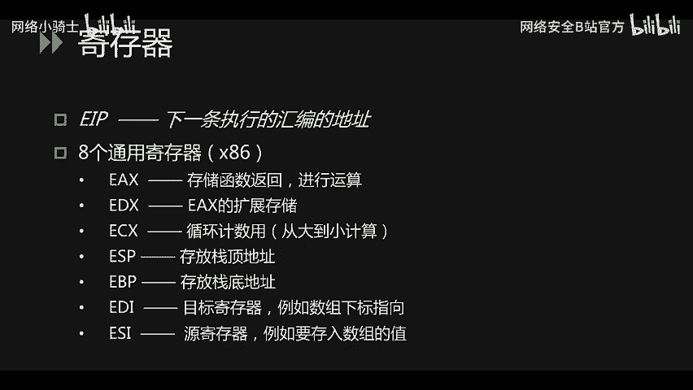

; AT&T 格式
mov %esp, %ebp
```
*   在Linux的GDB调试器中，可使用 `set disassembly-flavor intel` 切换为Intel格式查看。
*   在Windows平台更常见Intel格式。本教程后续将使用Intel格式进行讲解。

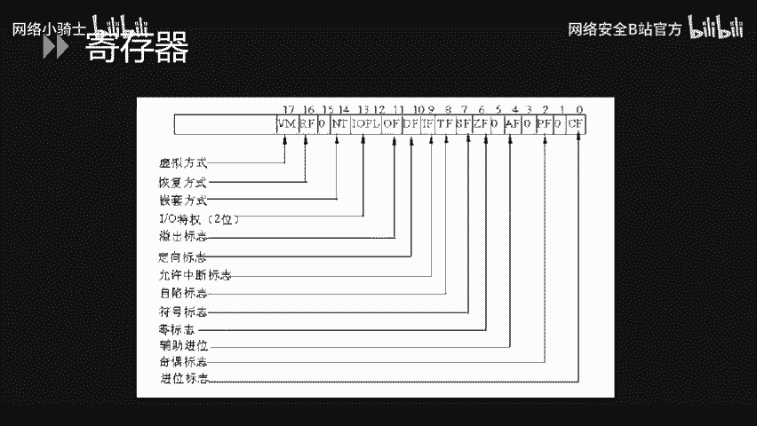

### 寄存器
寄存器是CPU内部的高速存储单元。以下是x86架构（32位）中常见的寄存器：

**指令指针寄存器**
*   **EIP**：存储下一条将要执行的指令地址。

**通用寄存器**
*   **EAX/EDX**：常用于存储函数返回值或进行算术运算。
*   **ECX**：常用作循环计数器。
*   **ESP**：存储**栈顶**位置。
*   **EBP**：存储**栈底**（当前栈帧基址）位置。
*   **EBX**：可作为基址指针，用于数组索引。
*   **ESI/EDI**：常用于字符串或内存块操作，ESI为源指针，EDI为目标指针。

**标志寄存器**
*   **EFLAGS**：其各个位代表不同的CPU状态标志，如：
    *   **ZF（零标志）**：运算结果为零时置1。
    *   **CF（进位标志）**：运算产生进位或借位时置1。
    *   **OF（溢出标志）**：有符号数运算溢出时置1。

### 常用指令
以下是汇编中几类核心指令。

**数据传输指令**
*   **MOV**：将数据从源操作数复制到目标操作数。
    ```assembly
    mov eax, DWORD PTR [ebp+8] ; 将内存地址[ebp+8]处的4字节数据存入eax
    ```
    *   `BYTE PTR` (1字节), `WORD PTR` (2字节), `DWORD PTR` (4字节), `QWORD PTR` (8字节)。
*   **PUSH/POP**：压栈与出栈操作。
*   **PUSHAD/POPAD**：将所有通用寄存器的值压栈/出栈。
*   **TEST/CMP**：比较指令，会设置标志寄存器（如ZF）。
    ```assembly
    cmp eax, 10   ; 比较eax与10
    test ebx, ebx ; 测试ebx是否为零
    ```
*   **LEA**：加载有效地址，计算地址而非该地址处的值。
    ```assembly
    lea eax, [0xABCD] ; 将地址0xABCD存入eax，而非该地址的内容
    ```

**程序跳转指令**
*   **无条件跳转**：`JMP`, `CALL`, `RET`。
    *   `RET` 指令相当于 `pop eip`，从栈顶弹出返回地址并跳转。
    *   函数结束时常见的 `leave` 指令等价于 `mov esp, ebp` 后接 `pop ebp`，用于恢复调用者的栈帧。
*   **条件跳转**：根据标志寄存器的状态决定是否跳转。
    *   `JG` (大于跳转), `JGE` (大于等于跳转), `JL` (小于跳转), `JLE` (小于等于跳转), `JE` (等于跳转), `JNE` (不等于跳转)。

**算术与逻辑运算指令**
*   **算术运算**：`ADD`, `SUB`, `MUL`, `DIV`。
    *   `INC` 与 `DEC` 分别是加1和减1的快捷指令。
*   **逻辑运算**：`AND`, `OR`, `XOR`, `NOT`, `SHL` (逻辑左移), `SHR` (逻辑右移)。

了解了基本指令后，我们来看看高级语言中的逻辑结构在汇编中是如何实现的。

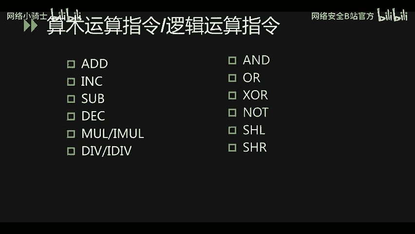

### 程序逻辑的汇编表示
**if 条件判断**
C代码：
```c
if (c > 0 && c < 10) {
    printf("c > 0");
}
```
对应汇编逻辑：
1.  比较 `c` 与 `0`，若 `c <= 0`，则跳转到条件不满足的代码块（Label1）。
2.  比较 `c` 与 `10`，若 `c >= 10`，则跳转到条件不满足的代码块（Label1）。
3.  若以上两个跳转均未发生，则执行 `printf` 语句。
4.  执行完毕后，通过 `add esp, 4` 平衡栈空间（清理参数）。

**for 循环**
C代码：
```c
for (int i = 0; i < 50; i++) {
    c = c + i;
}
```
对应汇编逻辑：
1.  `mov i, 0`：初始化计数器。
2.  `jmp COND_CHECK`：跳转到条件检查部分。
3.  `LOOP_BODY:`：循环体标签，执行 `c = c + i`。
4.  `inc i`：计数器自增。
5.  `COND_CHECK:`：条件检查标签，比较 `i` 与 `50`。
6.  若 `i < 50`，跳转回 `LOOP_BODY`；否则，顺序执行循环后的代码。

**do-while 循环**
C代码：
```c
do {
    // 循环体
} while (c < 100);
```
对应汇编逻辑：
1.  `LOOP_BODY:`：执行循环体。
2.  比较 `c` 与 `100`。
3.  若 `c < 100`，跳转回 `LOOP_BODY`。

**while 循环**
C代码：
```c
while (c < 100) {
    // 循环体
}
```
对应汇编逻辑：
1.  `COND_CHECK:`：比较 `c` 与 `100`。
2.  若 `c >= 100`，跳转到循环结束（`JGE END_LOOP`）。
3.  执行循环体。
4.  无条件跳转回 `COND_CHECK`。
5.  `END_LOOP:`：循环结束标签。

掌握了程序逻辑的底层表示，接下来我们需要理解一个至关重要的内存结构——栈。

## 栈结构与函数调用 🏗️

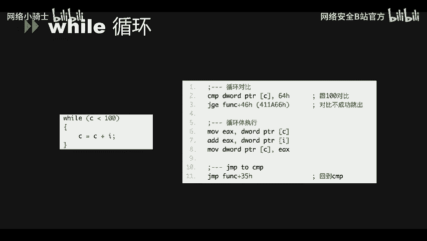

### 栈的基本概念
栈是一种后进先出（LIFO）的数据结构，用于存储局部变量、函数调用信息等。在内存中，栈从高地址向低地址方向增长。

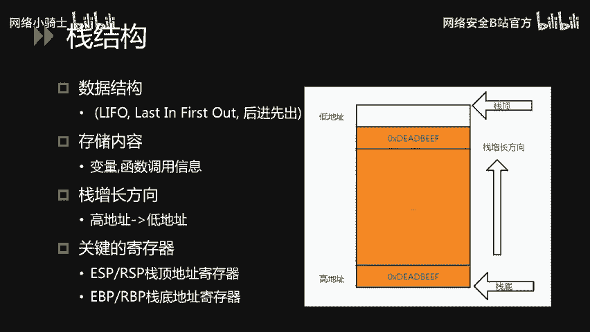

关键寄存器：
*   **ESP/RSP**：栈顶指针（32位/64位）。
*   **EBP/RBP**：栈底指针（当前栈帧基址，32位/64位）。

**栈操作指令详解**
*   `pop eax` 等价于两条指令：
    ```assembly
    mov eax, DWORD PTR [esp] ; 1. 将栈顶值读入eax
    add esp, 4               ; 2. 栈顶上移4字节（释放空间）
    ```
*   `push eax` 等价于两条指令：
    ```assembly
    sub esp, 4               ; 1. 栈顶下移4字节（分配空间）
    mov DWORD PTR [esp], eax ; 2. 将eax值存入新的栈顶位置
    ```

### 栈帧与函数调用过程
栈帧记录了单次函数调用的上下文信息，同样遵循后进先出原则。

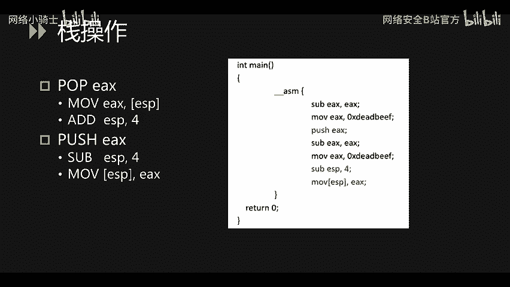

**调用约定**
*   **x86 (32位)**：参数全部通过栈传递，从右向左压栈。返回值存放在 `EAX` 寄存器中。
*   **x86-64 (64位)**：前6个整数/指针参数依次存入 `RDI`, `RSI`, `RDX`, `RCX`, `R8`, `R9` 寄存器，多余参数通过栈传递。返回值存放在 `RAX` 寄存器中。

一个栈帧通常包含以下内容（从高地址到低地址）：
1.  调用者栈帧的 `EBP`（保存的上一栈帧基址）。
2.  返回地址（调用结束后应跳转的指令地址）。
3.  函数参数。
4.  局部变量与临时数据。

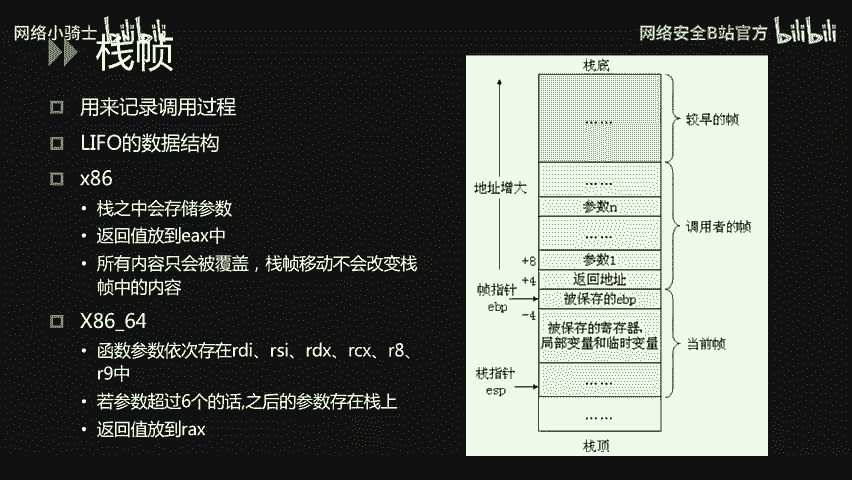

**函数调用实例分析**
以调用 `add(1, 2)` 为例，其汇编层面的步骤如下：

**步骤1：参数入栈与函数调用**
```assembly
push 2      ; 参数从右向左压栈
push 1
call add    ; 1. 将下一条指令地址（返回地址）压栈； 2. 跳转到add函数
```
此时栈布局（高地址在上）：
```
... 调用者栈帧 ...
参数 2
参数 1
返回地址  <-- ESP (栈顶)
```

**步骤2：进入被调用函数（函数序言）**
```assembly
push ebp          ; 保存调用者的ebp
mov ebp, esp      ; 设置当前函数的栈帧基址
sub esp, 0x20     ; 为局部变量分配栈空间
```
此时栈布局：
```
... 调用者栈帧 ...
参数 2
参数 1
返回地址
保存的ebp  <-- EBP (当前栈帧基址)， ESP也指向附近
局部变量区 <-- ESP (栈顶，已下移0x20字节)
```

**步骤3：函数执行与返回（函数尾声）**
函数执行完毕后，执行以下指令清理栈帧并返回：
```assembly
mov esp, ebp      ; 释放局部变量空间，ESP指向保存的ebp
pop ebp           ; 恢复调用者的ebp
ret               ; 从栈顶弹出返回地址到EIP，实现跳转
```
`ret` 执行后，栈恢复到调用前的状态，程序从 `call add` 的下一条指令继续执行。

## 总结 📚

本节课中我们一起学习了CTF逆向工程的基础核心知识：
1.  **逆向工程概念**：明确了逆向的目标、应用平台及主要难点。
2.  **汇编语言基础**：理解了小端序、Intel/AT&T格式、核心寄存器（EIP, EAX, ESP, EBP等）以及数据传输、跳转、运算等关键指令。
3.  **高级逻辑的底层表示**：分析了`if`、`for`、`while`等控制结构在汇编层面的实现方式。
4.  **栈结构与函数调用**：深入探讨了栈的操作（PUSH/POP）、栈帧的构成，并通过 `add(1, 2)` 的实例完整剖析了函数调用、执行与返回的详细过程。

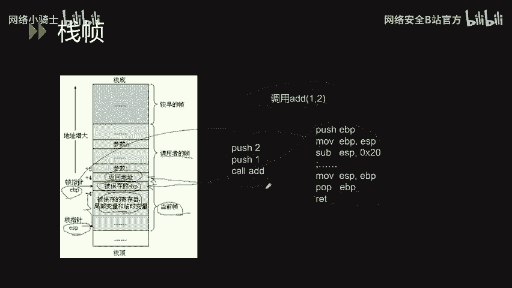

这些知识是分析二进制程序、理解其运行逻辑的基石。下一节我们将学习逆向工程工具的使用，将理论应用于实践。