# CTF逆向工程：P28：移动安全_1

## 概述 📚

在本节课中，我们将要学习CTF比赛中逆向工程的一个重要方向——安卓逆向。安卓逆向技术在实际应用中非常广泛，例如VIP功能破解、协议分析、广告去除等功能的实现都基于此技术。因此，CTF比赛也将其作为逆向工程的核心考点之一。


课程将从三个方面展开：首先介绍安卓开发的基础知识，这是理解逆向文件结构的前提；然后讲解安卓逆向中常用的工具和CTF常见考点；最后通过两道实战题目，演示静态分析Java层和C语言层代码以获取Flag的过程。

---

## 安卓开发基础 🛠️

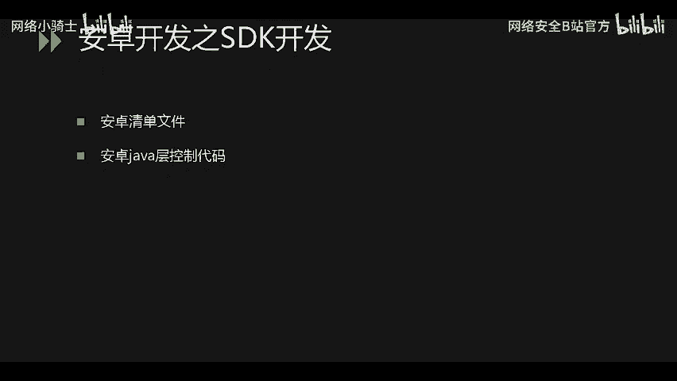

上一节我们概述了课程内容，本节中我们来看看安卓开发的基础知识。理解安卓开发是进行逆向分析的前提，因为反编译APK后，你会看到各种文件，包括资源文件、清单文件和代码文件。你需要知道这些文件的来源和作用，才能找到分析的重点。

安卓开发主要分为两种：SDK开发和NDK开发。

### SDK开发（Java开发）

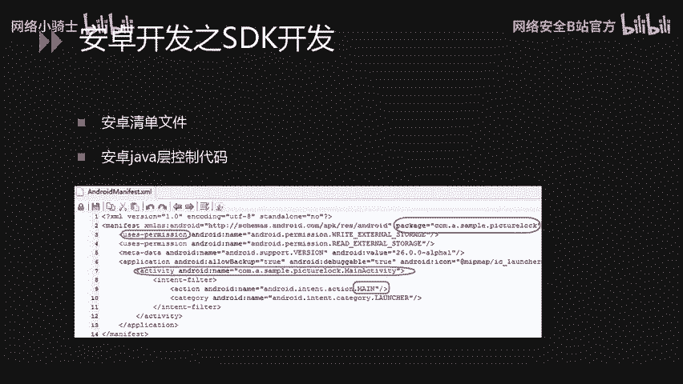

SDK开发，即常说的Java开发，是安卓应用开发的主要方式。逆向时需要重点关注两个核心文件：`AndroidManifest.xml`（清单文件）和Java代码编译后生成的`.dex`文件。

**AndroidManifest.xml** 是安卓应用的重要配置文件。


从图中可以看出，它包含了应用的包名信息、权限声明（安装时申请的权限即来源于此）、以及程序入口（如主Activity）等信息。在开发时，此文件位于项目根目录，是明文可读的。编译打包成APK后，该文件会被编译成二进制格式。逆向时，工具会将其解析回近似开发时的可读格式。

**Java代码** 经过编译后，会生成 `classes.dex` 可执行文件。逆向工具会解析此DEX文件，生成 `smali` 文件夹，里面存放的是逆向出来的、类似汇编的中间代码（smali语法）。可以使用工具进一步将其转换为更易读的Java伪代码进行查看。

### APK文件结构

APK文件本质上是一种压缩包（ZIP格式）。使用解压软件打开，可以看到内部包含以下文件和文件夹：

以下是APK包内的主要文件/目录及其作用：

*   **assets/**：存放资源文件（如图片、数据库文件），不参与编译，原样打包。
*   **lib/**：存放NDK开发中，使用C/C++语言编写的核心代码编译生成的 `.so`（共享对象）文件。同样不参与Java编译过程。
*   **META-INF/**：存放APK的签名文件，包含应用的签名信息，用于验证APK的完整性和发布者。
*   **res/** 和 **resources.arsc**：都是资源文件，包含字符串、图片、布局等资源的定义和索引。`resources.arsc` 是编译后的资源索引表，需要解析，不可直接阅读。
*   **AndroidManifest.xml**：经过编译的清单文件，包含应用的核心配置信息。
*   **classes.dex**：Java代码编译后生成的可执行文件，是逆向分析的主要目标。

### NDK开发（C/C++开发）

NDK开发主要用于保护核心代码逻辑。因为SDK的Java代码逆向相对容易，而C/C++代码逆向后得到的是汇编代码，理解难度更大，从而增加了逆向的难度。

在NDK开发中，核心逻辑用C或C++编写，并编译成 `.so` 文件。在Java层通过 `System.loadLibrary` 来加载这个 `.so` 文件。

示例代码：
```java
static {
    System.loadLibrary("native-lib"); // 加载名为 libnative-lib.so 的文件
}
public native String stringFromJNI(); // 声明一个本地（Native）方法
```
调用在Java层进行，但实际执行的是 `.so` 文件中的C/C++代码。

---

## 逆向工具与CTF考点分析 🔍

上一节我们介绍了安卓开发的基础，本节中我们来看看进行安卓逆向需要哪些工具，以及CTF比赛中常见的考点。

### 常用逆向工具

以下是安卓逆向中常用的几类工具：

*   **反编译工具**：用于将APK文件解包、反编译资源及代码。
    *   `Android Killer`
    *   `APKIDE`
    *   `JADX`：前两者功能集成度较高，支持反编译和重打包；JADX主要用于代码查看，界面简洁，阅读方便。
*   **逆向分析工具**：
    *   `IDA Pro`：强大的静态反汇编和动态调试工具，是分析 `.so` 文件（NDK代码）的利器。
*   **十六进制编辑器**：用于查看文件的原始二进制格式，帮助判断文件类型和分析方向。
    *   `010 Editor`
    *   `WinHex`
*   **Root权限的安卓手机/模拟器**：用于应用的动态调试，观察运行时的内存数据和函数调用。

### CTF安卓逆向常见考点

CTF比赛的安卓逆向题目通常遵循从易到难的规律，以下是常见的考点分类：

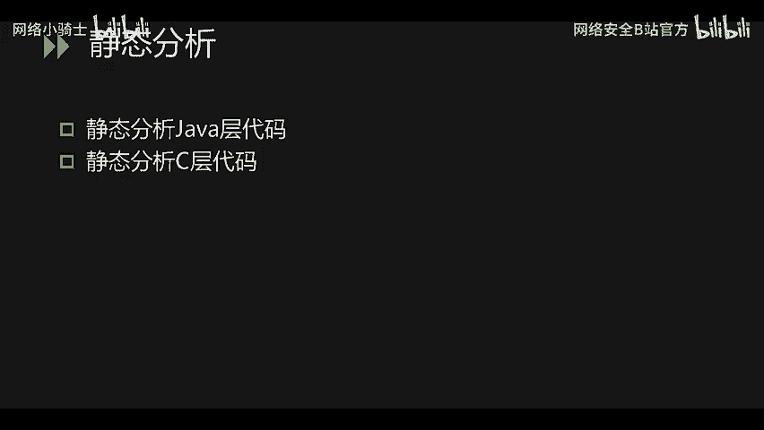

*   **初级**：Flag直接存放在资源文件或备份文件中。
*   **中级**：需要对Java层代码进行逆向分析。通常只需分析Java算法，编写解密程序即可获得Flag。
*   **高级**：涉及C/C++层（`.so`文件）的逆向分析。需要阅读汇编或反编译的C代码，理解算法并写出逆算法。
*   **动态调试**：Flag或关键数据在程序运行时才在内存中生成或解密，必须通过动态调试才能获取。
*   **加壳与脱壳**：应用使用了商业壳进行保护，直接反编译看不到有效代码。解题第一步是进行脱壳。
*   **虚拟机混淆/代码虚拟化**：即使成功脱壳，核心代码也经过了虚拟机保护技术混淆，极大地增加了静态分析和动态调试的难度。

---

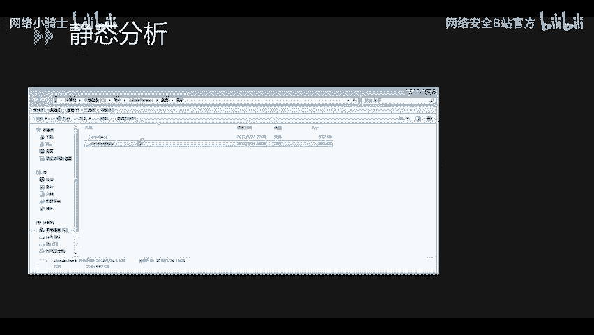

## 安卓逆向实战演示 🚀

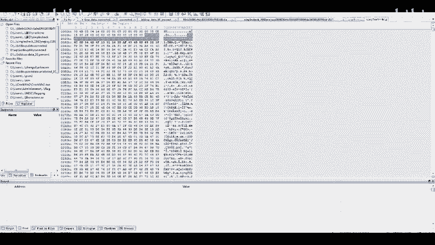

前面我们介绍了基础知识和工具考点，本节中我们将通过两道CTF题目进行实战演示。第一道题是纯Java层逆向，第二道题需要结合Java层和C语言层（Native层）进行分析。

### 实战一：纯Java层逆向分析

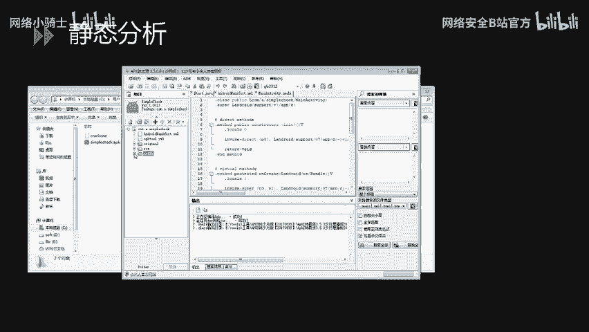

题目文件通常以 `题目名_哈希值.apk` 的形式下发。首先，我们使用十六进制编辑器查看文件类型。


文件以 `PK` 开头，这是ZIP/APK文件的标志，并且包含 `AndroidManifest` 字样，确认这是一个安卓APK文件。

将文件后缀改为 `.apk`，然后使用 `APKIDE` 工具打开。将APK文件拖入工具，它会自动进行反编译。

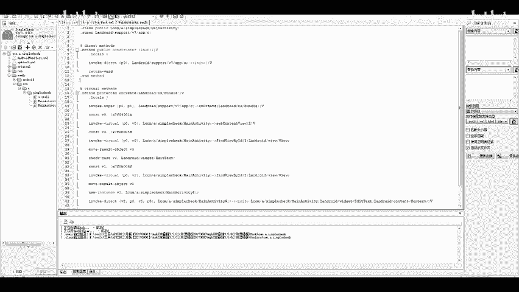

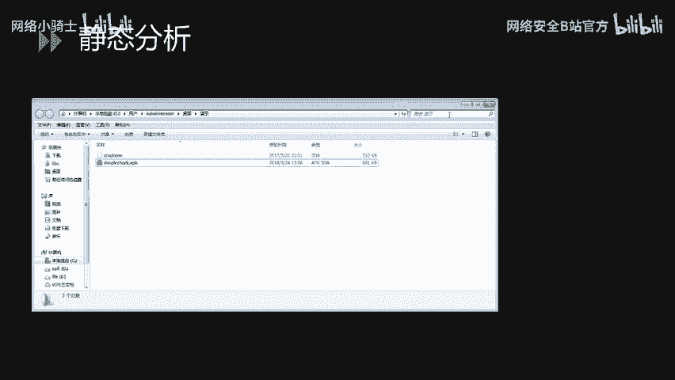


在工具中，我们可以看到反编译生成的 `smali` 文件夹和 `AndroidManifest.xml` 文件。首先分析清单文件，找到程序入口（包名和主Activity）。本例中，包名为 `com.a.simplecheck`，入口为 `MainActivity`。

接着，在 `smali` 目录下找到对应的包路径 `com/a/simplecheck`，里面是程序的smali代码。如果想查看更易读的Java代码，可以点击工具中的“咖啡杯”图标（Java反编译）。


打开 `MainActivity` 的Java代码后，发现核心逻辑在一个 `if` 判断中。


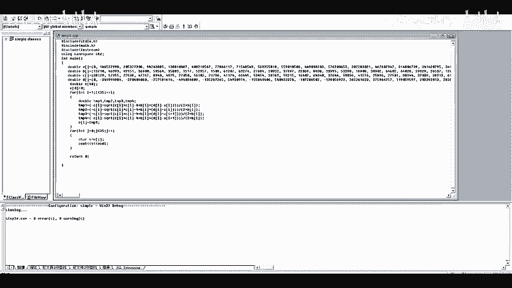


如果条件成立，则显示Flag，否则提示失败。关键函数是 `a()`，它的返回值决定了判断结果。我们需要逆向分析 `a()` 函数的算法。

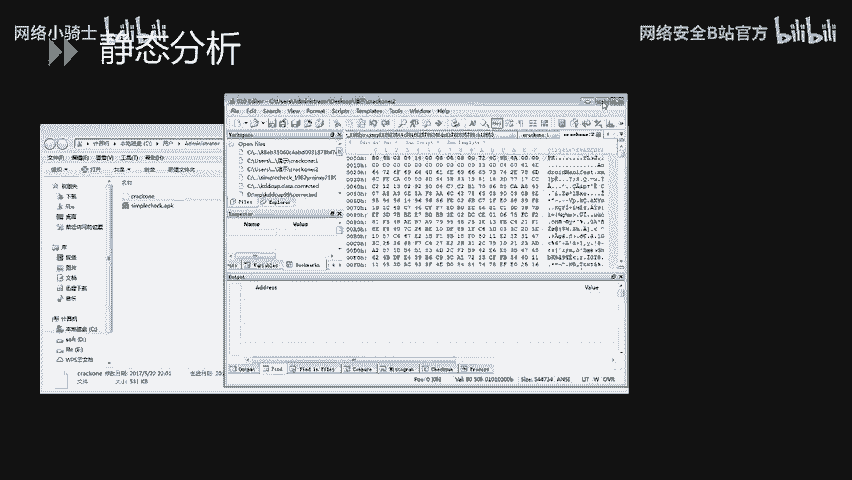

分析后发现，该函数的核心是求解一个一元二次方程。我们将代码中的数组数据复制出来，用C++编写解密程序。

**核心解密代码逻辑（示例）：**
```cpp
#include <iostream>
#include <cmath>
int main() {
    double a = 1.0; // 根据题目a()函数中的参数赋值
    double b = -5.0;
    double c = 6.0;
    double delta = b*b - 4*a*c;
    if(delta >= 0) {
        double x1 = (-b + sqrt(delta)) / (2*a);
        double x2 = (-b - sqrt(delta)) / (2*a);
        std::cout << "Flag: flag{" << x1 << "," << x2 << "}" << std::endl;
    }
    return 0;
}
```
运行此程序，即可得到本题的Flag，格式通常为 `flag{...}`。

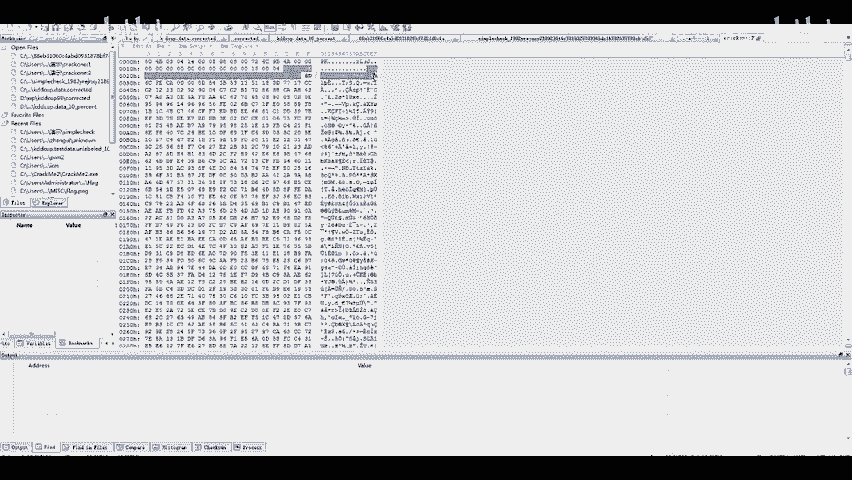

### 实战二：Java层与Native层结合分析

同样，先用十六进制编辑器确认文件为APK格式。

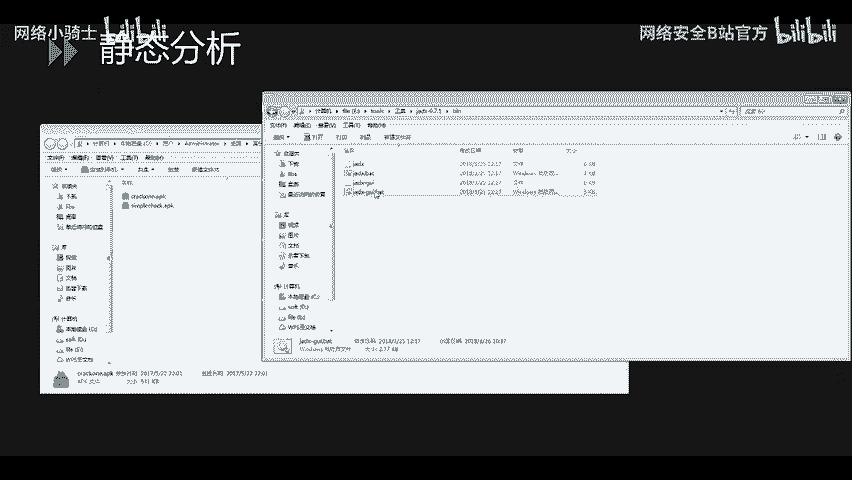


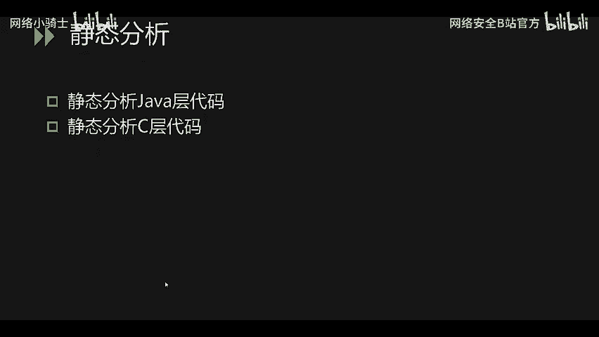

确认后，使用 `JADX` 工具打开APK文件查看Java源码。找到入口 `MainActivity`。


在 `onCreate` 方法中，发现程序加载了一个名为 `lssc` 的 `.so` 库（`System.loadLibrary("lssc")`），并且声明了 `native` 方法 `checkFlag`。

程序逻辑是：获取用户输入 -> 进行Base64编码 -> 调用 `checkFlag` 函数进行验证。因此，核心校验逻辑在Native层的 `checkFlag` 函数中。

接下来需要分析 `.so` 文件。可以从APK压缩包的 `lib/` 目录下提取对应的 `.so` 文件（例如 `lib/armeabi-v7a/liblssc.so`），然后用 `IDA Pro` 打开。

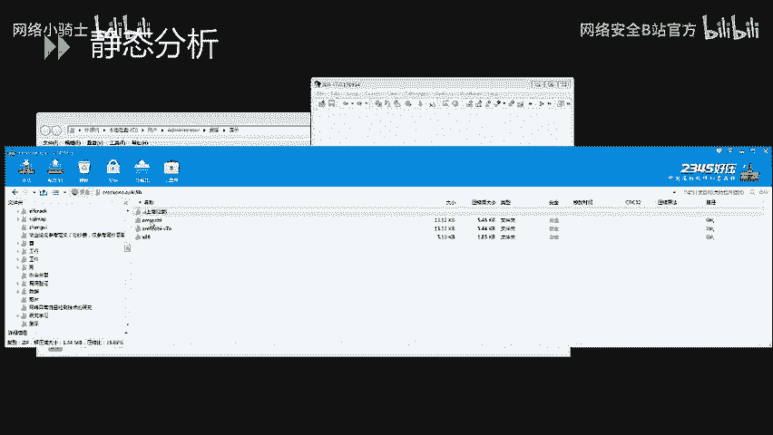

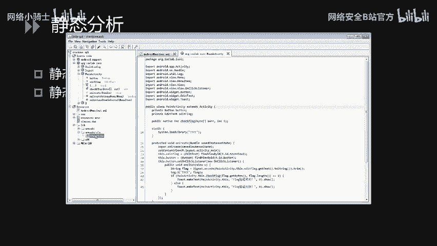

在IDA中，找到 `checkFlag` 函数，按 `F5` 键使用插件将其反编译成伪C代码。

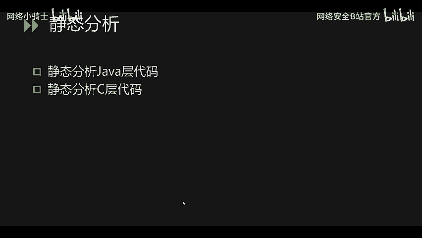

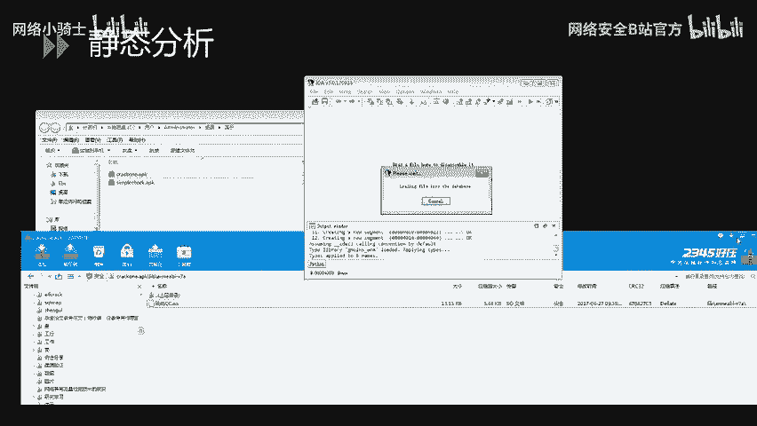


分析伪C代码。首先需要修复JNI函数指针的类型以方便阅读。关键逻辑是一个 `while` 循环：它将输入字符串的每个字符的ASCII值减5，然后进行前后位置调换（首尾交换），最后与一个内置的字符串进行比较。

分析出算法后，我们可以编写逆向程序：
1.  获取内置比较字符串。
2.  将其进行位置反交换（即再次交换，恢复原序）。
3.  将每个字符的ASCII值加5。
4.  对结果进行Base64解码。


**核心解密代码逻辑（示例）：**
```python
import base64

encoded_str = "从IDA中复制的比较字符串"
# 1. 字符串前后交换恢复
length = len(encoded_str)
char_list = list(encoded_str)
for i in range(length // 2):
    char_list[i], char_list[length - 1 - i] = char_list[length - 1 - i], char_list[i]
swapped_str = ''.join(char_list)

# 2. ASCII值加5
decoded_list = []
for c in swapped_str:
    decoded_list.append(chr(ord(c) + 5))
b64_str = ''.join(decoded_list)

# 3. Base64解码
try:
    flag = base64.b64decode(b64_str).decode('utf-8')
    print("Flag:", flag)
except:
    print("解密失败")
```
运行此脚本，即可得到第二道题的Flag。

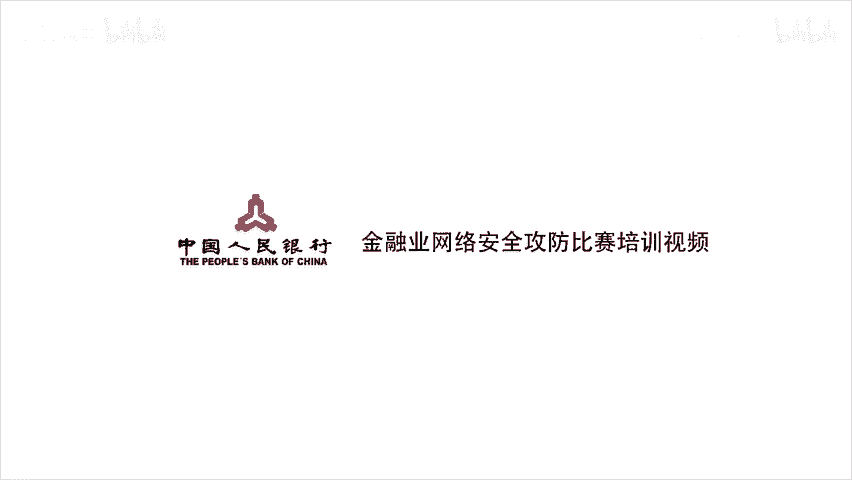

---

## 总结 🎯

本节课中我们一起学习了CTF安卓逆向的基础知识。我们从安卓开发（SDK/NDK）和APK文件结构讲起，这是理解逆向目标的基石。然后，介绍了逆向分析中必备的工具链和CTF比赛中从易到难的常见考点。最后，通过两道实战题目，完整演示了静态分析的全过程：从文件类型确认、反编译查看Java代码，到分析Native层 `.so` 文件，最终编写解密程序获取Flag。


关键点在于：**先确定逆向方向（Java or Native）** -> **使用合适工具查看关键代码** -> **静态分析理解算法逻辑** -> **编写逆向算法求解**。希望本教程能帮助你入门安卓逆向，在CTF赛场上攻克更多难题。