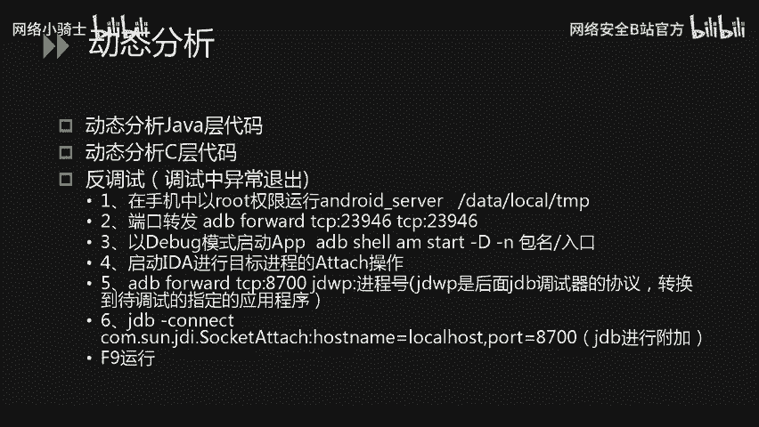
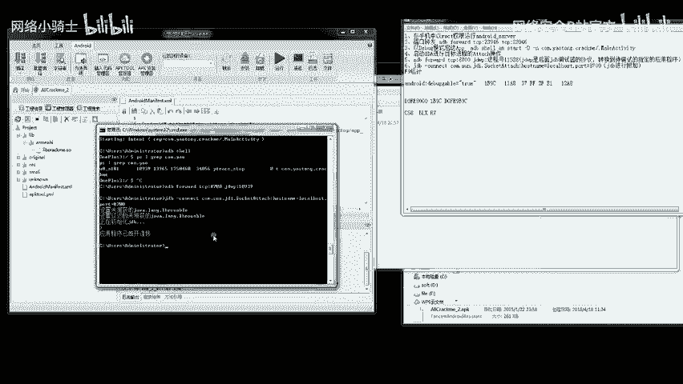
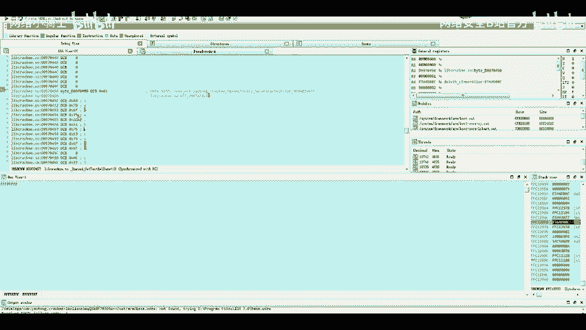
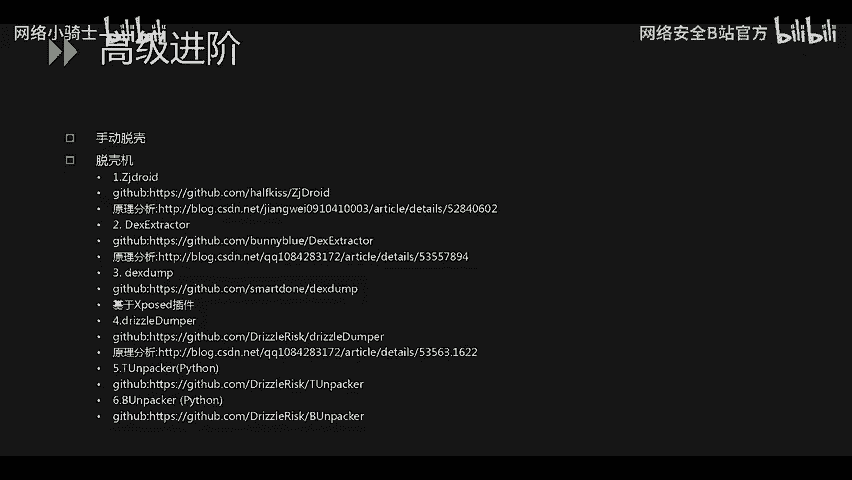
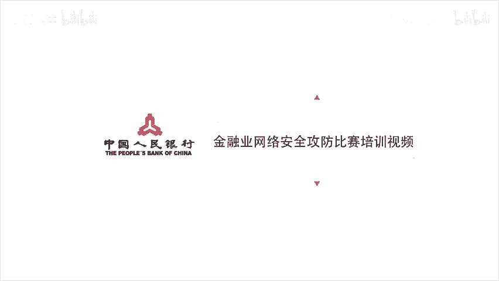

# CTF逆向工程：P29：移动安全_2 - 安卓逆向动态分析与脱壳思路


在本节课中，我们将学习CTF比赛中安卓逆向的动态分析技术，包括如何动态调试Java层和Native（C/C++）层代码，以及一些常见的脱壳思路。

上一节我们介绍了静态分析工具的使用，本节中我们来看看如何通过动态调试来获取程序运行时的关键信息。

## 动态分析概述



实际比赛中，题目算法可能涉及AES、DES等对称加密，此时需要获取密钥并编写解密算法。算法中间或最后可能还会进行其他操作，才能获得最终flag。动态分析可以帮助我们观察程序运行时的状态和数据。

## 动态调试步骤



以下是进行安卓应用动态调试的核心步骤，我们将逐一进行说明。

1.  **部署调试服务**
    将IDA安装目录下的`android_server`调试文件放入手机的某个目录（例如`/data/local/tmp/`），并赋予其可执行权限。
    ```bash
    adb push android_server /data/local/tmp/
    adb shell chmod 755 /data/local/tmp/android_server
    ```

2.  **建立端口转发**
    启动手机端的`android_server`，它会在23946端口监听。需要将此端口的数据转发到电脑端，以便IDA连接。
    ```bash
    adb forward tcp:23946 tcp:23946
    ```

3.  **以调试模式启动APP**
    使用ADB命令以调试模式启动目标应用。
    ```bash
    adb shell am start -D -n 包名/入口Activity名
    ```

4.  **附加进程**
    启动IDA，选择`Debugger` -> `Attach` -> `Remote ARM Linux/Android debugger`，附加到目标进程。

5.  **配置与附加调试**
    附加进程后，在调试器选项中，通常需要勾选“Suspend on library load/unload”等选项，以便在关键库（如so文件）加载前暂停。第一次附加可能会失败，这是IDA的常见问题，需要重新设置选项并再次附加。

6.  **定位与下断点**
    程序暂停后，点击运行（F9），直到链接器（linker）开始加载so文件。此时，使用`Ctrl+S`调出模块列表，找到目标so库的基地址。结合静态分析得到的函数偏移量，计算函数在内存中的实际地址：**内存地址 = so库基地址 + 函数偏移量**。在该地址处下断点（F2）。

7.  **运行与数据提取**
    继续运行程序（F9），程序会在断点处暂停。此时可以单步（F7/F8）跟踪，使用F5插件将汇编代码转换为伪C代码以便分析。在关键逻辑（如循环比对、数据解密）处，观察寄存器和内存中的值，这些值很可能就是flag或密钥。

## 实战演示：动态获取Flag

在演示中，我们使用AndroidKiller工具为APK添加可调试权限（在`AndroidManifest.xml`中添加`android:debuggable="true"`），然后重新打包并签名，安装到已root的手机。

通过上述动态调试步骤，我们成功在内存中定位到一个关键函数。该函数的核心是一个`while`循环，用于逐位比对用户输入和内存中的值。通过单步调试，在寄存器`R3`指向的内存地址中，我们直接发现了flag字符串。

## 安卓脱壳思路简介



最后，我们提供一些安卓应用脱壳（去除代码保护）的思路。

以下是几种常见的脱壳方法：

*   **手动脱壳**：通过动态调试，绕过反调试机制，待原始程序在内存中完全解密后，直接从内存中 dump 出脱壳后的代码。
*   **脱壳机工具**：
    1.  **ZJDroid**：一种较老的基于内存Dump的脱壳工具。
    2.  **模拟器脱壳**：通过修改模拟器内核中加载so文件的逻辑来实现脱壳。
    3.  **基于Xposed的脱壳模块**：利用Xposed框架Hook关键函数来Dump内存。
    4.  **特定壳脱壳工具**：存在针对360加固、腾讯加固、梆梆加固等历史版本的保护壳的专用脱壳程序。比赛通常不会使用最新的商业壳。





本节课中我们一起学习了安卓逆向的动态调试方法，从环境配置、进程附加到内存断点设置与数据提取，并了解了常见的应用脱壳思路。动态分析是理解复杂程序逻辑、获取运行时数据的关键技能，需要结合静态分析灵活运用。