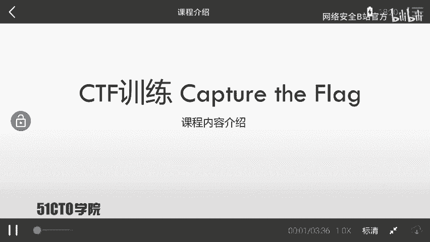
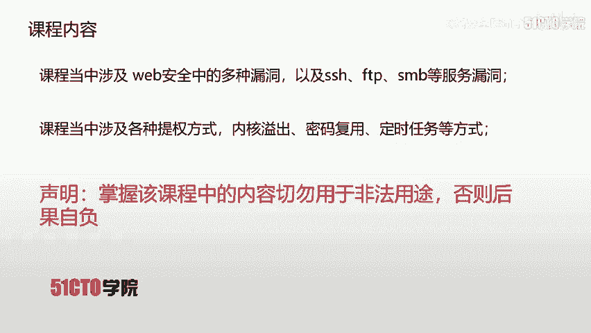
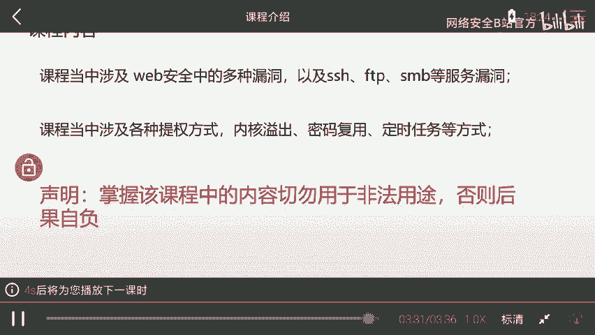
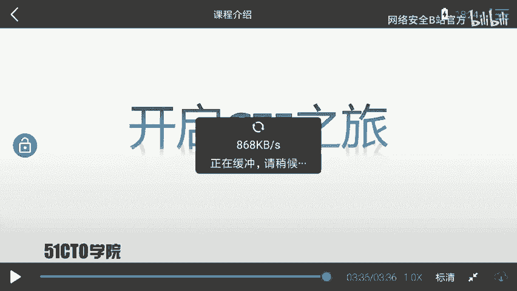
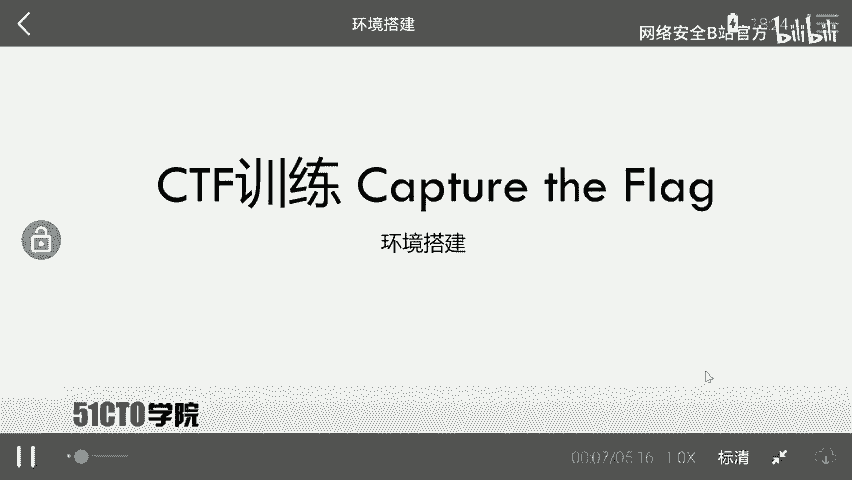
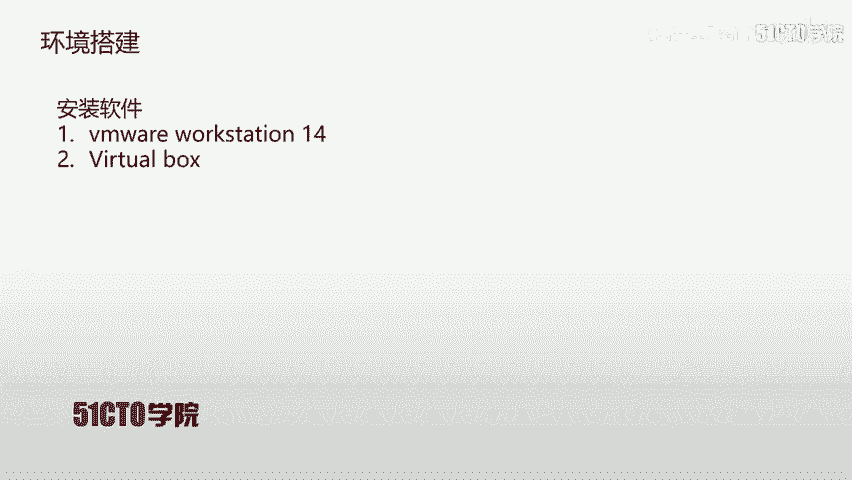
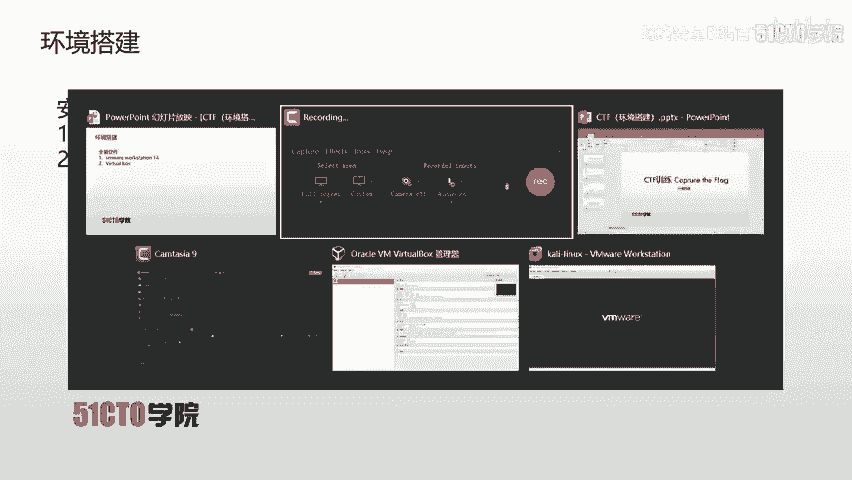

# CTF入门与实战：1.1.2：课程介绍 🚩

在本节课中，我们将要学习这门CTF实战课程的整体介绍，包括CTF的基本概念、课程所需的实验环境、面向的学员对象以及课程的核心内容。

---

## 什么是CTF？🏁

上一节我们介绍了课程的整体框架，本节中我们来看看CTF到底是什么。

CTF是一种流行的信息安全竞赛形式，英文全称为“Capture The Flag”，中文常译为“夺旗赛”。

其大致流程是：参赛团队之间通过攻防对抗、程序分析等形式，率先从主办方给出的比赛环境中找到一串具有特定格式的字符串或其他内容，并将其提交给主办方，从而获得分数。为了方便称呼，我们把这样的目标内容称为 **`flag`**。

在CTF比赛中，涉及内容繁杂，参赛者需要利用所有可用的方法来获取对应的 **`flag`**。

---

## 课程实验环境 💻

了解了CTF的基本形式后，接下来我们需要准备实践的工具和环境。

本课程每节课都会提供对应的攻击机（Kali Linux）和靶场机器（Linux）资源。学员在下载攻击机和靶场机器后，需要自行搭建测试环境，并对靶场机器进行渗透测试，以取得对应的 **`flag`** 值。

在搭建完成实验环境后，学员的核心目标就是获取靶场机器上的 **`flag`** 值。

---

## 课程面向对象 🧑‍🎓

本课程定位为中等难度，因此要求学员具备一定的基础知识。

以下是学习本课程前建议掌握的基础：
*   了解HTTP协议。
*   会使用一些基本的安全工具，例如 **`Burp Suite`**、 **`Nmap`** 以及 **`Metasploit`**。

无论你是想要入门的CTF新手，还是具备一定经验的选手，或是网络安全爱好者，本课程都是一份有价值的学习资料。

---

## 课程核心内容 📚

上一节我们明确了学习本课程所需的基础，本节中我们将深入了解一下课程具体涵盖哪些核心技能。

本课程内容主要涉及以下几个方面：

首先，课程涵盖了Web安全中的多种漏洞，以及SSH、FTP、SMB等服务的漏洞。利用这些漏洞，我们可以获取靶场机器的shell访问权限。

但通常初始获取的shell并非root权限。这时，我们就需要学习各种提权（Privilege Escalation）技术。

以下是课程中将讲解的几种提权方式：
*   内核漏洞提权
*   密码复用提权
*   定时任务提权

本课程完全以实战的方式，引导学员对靶场进行渗透测试并获取对应的 **`flag`** 值。

**重要提示**：学员在掌握课程内容后，切勿将其用于非法用途，否则需自行承担一切后果。

---

## 总结 🎯

本节课中我们一起学习了CTF竞赛的基本概念，了解了本课程所需的实验环境、适合的学习对象以及将要深入学习的核心实战内容，包括漏洞利用和权限提升技术。

接下来，就让我们正式开启CTF实战之旅吧。