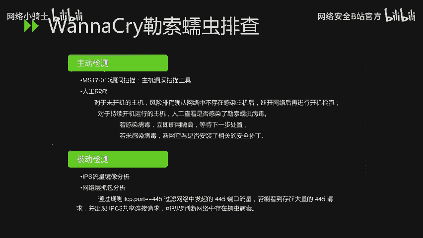
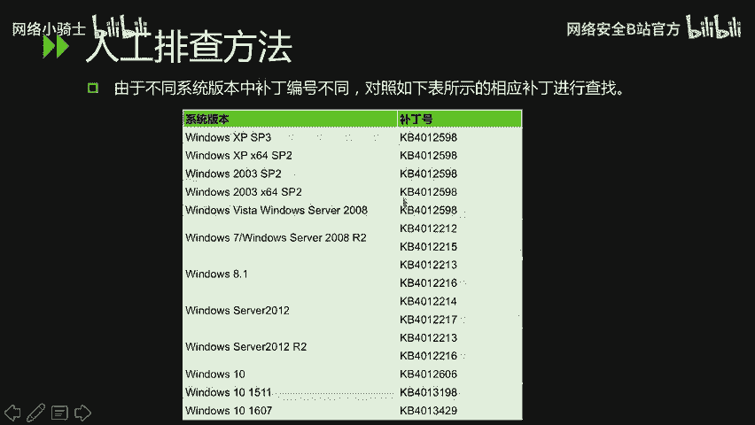
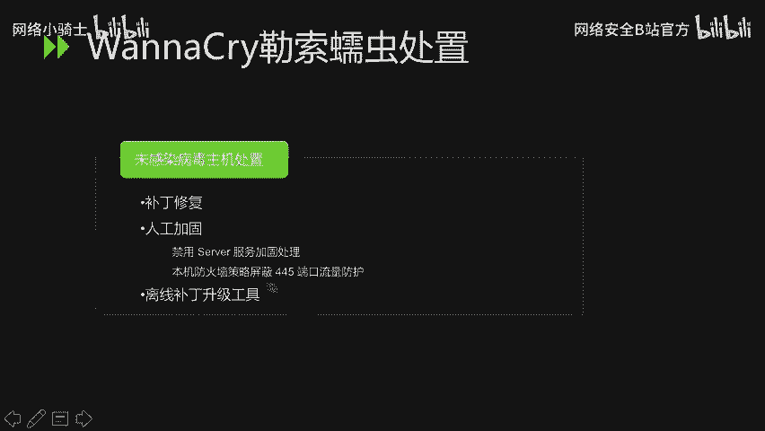

# 网络安全CTF：P31：65. 重点漏洞分析_2 🔐

在本节课中，我们将要学习两个历史上影响重大的安全漏洞：Shellshock（破壳漏洞）和 EternalBlue（永恒之蓝）。我们将分析它们的原理、影响范围以及相应的验证与修复方法。


---

## Shellshock（破壳漏洞）分析 🐚

上一节我们介绍了漏洞分析的基本概念，本节中我们来看看第一个重点漏洞——Shellshock。Shellshock，又称破壳漏洞，是Bash（Bourne-Again SHell）中的一个严重安全缺陷。Bash是大多数Linux系统和macOS的默认命令行解释器。

该漏洞主要涉及两个CVE编号：CVE-2014-6271和CVE-2014-7169。

### CVE-2014-6271漏洞原理

该漏洞源于Bash处理环境变量的方式。攻击者可以构造特殊的环境变量值，其中包含恶意代码。当Bash对这些环境变量进行求值时，恶意代码将被执行。某些服务和应用会接受未经身份验证的用户提供的环境变量，这使得攻击者能够利用此漏洞在目标系统上执行任意命令。

**核心概念**：漏洞利用的关键在于，Bash在处理以`()` { 开头的函数定义环境变量时，没有正确识别函数定义的结束边界（即`}`），导致其后的命令也被一并执行。

以下是验证该系统是否存在此漏洞的命令：

```bash
env x='() { :;}; echo vulnerable' bash -c "echo this is a test"
```

**验证结果说明**：
*   如果输出中包含 `vulnerable` 和 `this is a test`，则证明系统当前的Bash版本存在漏洞。
*   如果只输出 `this is a test`，则证明系统不受该漏洞影响。

### CVE-2014-7169漏洞原理

此漏洞是CVE-2014-6271漏洞补丁不完善导致的绕过情况。补丁后，Bash允许在环境变量的值中进行函数定义，但攻击者可以在函数定义后加入特定的字符串（如`>`），从而实现在远程服务器上写入文件或执行其他影响系统的操作。

以下是验证该漏洞的命令：

```bash
env X='() { (a)=>\' bash -c "echo date"; cat echo
```

**验证过程解析**：
1.  变量`X`的值`() { (a)=>\` 会使Bash的解释器解析出错。
2.  出错后，缓冲区中会留下 `>` 和 `\` 字符。
3.  Bash会将后续的命令（`echo date`）放入缓冲区并执行，其输出（`date`命令的结果）会被重定向到一个名为`echo`的文件中。
4.  最后执行`cat echo`命令来读取这个文件的内容。

**验证结果说明**：
*   如果输出显示了当前日期，则证明系统当前的Bash版本存在CVE-2014-7169漏洞。

### Shellshock漏洞修复方法

针对此漏洞，修复方法是更新系统中的Bash软件包。

以下是不同Linux发行版的更新命令：

*   **对于CentOS、RedHat等系统**：使用 `yum update bash` 命令进行更新。
*   **对于Ubuntu、Debian等系统**：使用 `apt-get update && apt-get install --only-upgrade bash` 命令进行更新。

**漏洞严重性**：Shellshock漏洞的CVSS评分被定义为最高的10级。作为对比，2014年爆发的“心脏滴血”（Heartbleed）漏洞定级为5级，由此可见Shellshock的严重性。

---

## EternalBlue（永恒之蓝）与WannaCry勒索蠕虫 💀

在了解了Shellshock漏洞后，我们来看另一个具有全球性影响的漏洞组合：EternalBlue漏洞及由其传播的WannaCry勒索蠕虫。

### 漏洞事件概述

EternalBlue是方程式组织泄露的SMB协议高危漏洞（MS17-010）。不法分子利用此漏洞，在2017年5月12日发起了WannaCry勒索蠕虫的全球性攻击。

WannaCry是一种蠕虫式勒索病毒，大小约3.3MB。它通过EternalBlue漏洞在网络中自动传播，感染了英国、俄罗斯、欧洲多国以及中国国内众多高校、企业和政府机构的网络。受感染主机上的文件被加密，用户被勒索支付高额比特币赎金以解密文件，但事实上支付赎金后文件也未必能恢复。

### 漏洞原理与影响范围

**漏洞原理**：微软服务器消息块（SMB）协议在处理某些特制请求时存在远程代码执行漏洞。成功利用此漏洞的攻击者可以在目标系统上执行任意代码。

**影响范围**：所有未及时安装MS17-010安全补丁的Windows操作系统均受影响，范围极其广泛。



### WannaCry勒索蠕虫排查方法

排查主要从主动和被动两个方向进行。

**以下是主动检测方法：**
1.  **使用工具扫描**：利用主机漏洞扫描工具检测MS17-010漏洞。
2.  **人工排查**：
    *   **对于未开机主机**：确认网络环境安全后，断网再开机进行检查。
    *   **对于已开机主机**：立即检查是否出现文件被加密、弹出勒索界面等感染迹象。若已感染，立即断网隔离；若未感染，则断网检查是否已安装对应安全补丁。

**以下是被动检测方法：**
1.  **IPS流量分析**：通过入侵防御系统分析网络流量异常。
2.  **网络抓包分析**：在网络上抓取数据包，并基于规则 `tcp.port == 445` 进行过滤。如果发现存在大量对445端口的连接请求并出现SMB共享连接，可初步判断网络中存在利用该漏洞的蠕虫病毒。

### 补丁检测方法（人工）



不同Windows系统版本对应的补丁编号不同。

**检测步骤**：
1.  打开系统的“已安装更新”列表。
2.  查找是否存在对应的KB补丁编号。

**以下是部分系统版本与补丁编号对应表示例：**
*   **Windows 7 / 2008 R2**：KB4012212
*   **Windows Server 2003**：KB4012596

（注：其他版本请参考官方文档或安全公告中的完整表格进行查找。）

### WannaCry勒索蠕虫处置方法

**对于已感染病毒的主机，处置步骤如下：**
1.  **立即断网隔离**，防止病毒在内网进一步扩散。
2.  评估被加密文件的重要性，决定是否支付赎金（不推荐）或直接格式化磁盘、重装系统。
3.  **进行病毒清除**，操作顺序如下：
    *   结束 `tasksche.exe` 进程。
    *   删除病毒创建的系统服务（服务名随机，需人工排查）。
    *   删除磁盘中的病毒程序文件（文件名随机，通常位于系统目录，需人工排查）。
    *   清理病毒添加的注册表项。

**对于未感染病毒的主机，加固防护步骤如下：**
1.  **补丁修复**：立即安装MS17-010漏洞补丁。对于无法连接外网的内网主机，可使用离线补丁包或内网WSUS服务器进行升级。
2.  **人工加固**：
    *   **禁用Server服务**：在服务管理器中停止并禁用“Server”服务。
    *   **防火墙封堵**：在本机或网络边界防火墙设置规则，屏蔽TCP 445端口的入站和出站流量。



---


本节课中我们一起学习了Shellshock和EternalBlue两个核心漏洞。我们分析了它们的产生原理、验证方式、巨大的危害性以及关键的修复与防护措施。理解这些经典漏洞有助于我们建立基本的安全意识，并掌握应对类似威胁的实战方法。